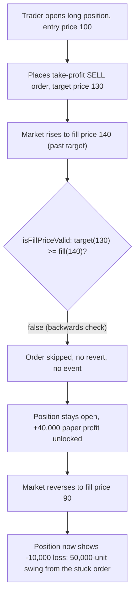
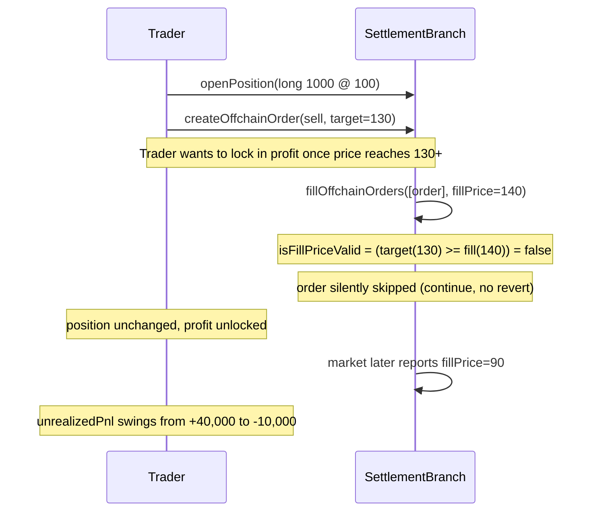

# Zaros — incorrect logic for checking isFillPriceValid

> **Vulnerability classes:** vuln/logic/wrong-condition · vuln/liveness/order-never-executes · vuln/loss-of-funds/missed-take-profit

> **Reproduction:** a self-contained Foundry PoC that compiles & runs in an
> isolated project with **only `forge-std`** — no fork, no RPC, no `anvil_state`.
> Full trace: [output.txt](output.txt). PoC:
> [test/37984-incorrect-logic-for-checking-isfillpricevalid-codehawks-zaro_exp.sol](test/37984-incorrect-logic-for-checking-isfillpricevalid-codehawks-zaro_exp.sol).

<!-- non-defihacklabs -->
<!-- source-auditvault: https://github.com/Auditware/AuditVault/blob/main/findings/37984-incorrect-logic-for-checking-isfillpricevalid-codehawks-zaro.md -->
<!-- date: 2024-07 -->

---

## Key info

| | |
|---|---|
| **Impact** | **HIGH** — `isFillPriceValid` uses backwards comparison operators for both buy and sell offchain orders, so any take-profit/stop-loss order set the way a trader would rationally set it is silently, permanently unfillable |
| **Protocol** | [Zaros](https://github.com/Cyfrin/2024-07-zaros) — perpetuals trading engine |
| **Vulnerable code** | `SettlementBranch.fillOffchainOrders` — the `isFillPriceValid` computation |
| **Bug class** | Wrong condition: comparison operators swapped in both branches of a boolean OR |
| **Finding** | Codehawks — Zaros, 2024-07 · #37984 · reporter **cryptedOji** |
| **Report** | Codehawks 2024-07-zaros contest |
| **Source** | [AuditVault](https://github.com/Auditware/AuditVault/blob/main/findings/37984-incorrect-logic-for-checking-isfillpricevalid-codehawks-zaro.md) |
| **Status** | Audit finding — caught in review (not exploited on-chain). Reproduced here as a standalone local PoC. |
| **Compiler** | `0.8.25` (PoC pragma matches the audited repo) |

This is an **audit finding**, not a historical on-chain incident. The real
`SettlementBranch` sits inside Zaros's full perpetuals margin/settlement
engine (Chainlink Data Streams verification, keeper access control, PRB-Math
fixed-point types); the PoC keeps the vulnerable `isFillPriceValid` boolean
expression verbatim and reduces position/order bookkeeping to the minimum
needed to show the order gets stuck and the resulting PnL harm.

---

## TL;DR

1. Offchain (take-profit / stop-loss) orders are gated by `isFillPriceValid`,
   which should let a **buy** order fill once `fillPrice <= targetPrice`
   (don't overpay) and a **sell** order fill once `fillPrice >= targetPrice`
   (don't undersell / lock in the target profit).
2. The deployed code has **both comparisons backwards**:
   `(isBuy && target <= fill) || (!isBuy && target >= fill)`.
3. Because the mismatch handler does `continue` (not `revert`, by design, so
   the rest of the batch keeps processing), a rejected order isn't delayed —
   it is **silently, permanently unfillable**.
4. A trader opens a long position and sets a take-profit sell order at a
   sensible target above their entry price. The market rises past the
   target — exactly the condition the trader wanted — but the order is
   skipped anyway.
5. **Harm:** when the market later reverses, the trader's +40,000-unit paper
   profit (that should have been locked in at the peak) becomes a
   -10,000-unit loss — a 50,000-unit swing directly caused by the take-profit
   order that could never execute.

---

## The vulnerable code

`SettlementBranch.sol::fillOffchainOrders` (verbatim):

```solidity
ctx.isFillPriceValid = (ctx.isBuyOrder && ctx.offchainOrder.targetPrice <= ctx.fillPriceX18.intoUint256())
        || (!ctx.isBuyOrder && ctx.offchainOrder.targetPrice >= ctx.fillPriceX18.intoUint256());

// we don't revert here because we want to continue filling other orders.
if (!ctx.isFillPriceValid) {
    continue;
}
```

The fix, per the finding:

```diff
-      ctx.isFillPriceValid = (ctx.isBuyOrder && ctx.offchainOrder.targetPrice <= ctx.fillPriceX18.intoUint256())
-           || (!ctx.isBuyOrder && ctx.offchainOrder.targetPrice >= ctx.fillPriceX18.intoUint256());
+      ctx.isFillPriceValid = (ctx.isBuyOrder && ctx.offchainOrder.targetPrice >= ctx.fillPriceX18.intoUint256())
+           || (!ctx.isBuyOrder && ctx.offchainOrder.targetPrice <= ctx.fillPriceX18.intoUint256());
```

---

## Root cause

`isFillPriceValid` is a single boolean expression that has to get the
direction of BOTH comparisons right to make economic sense. Both were
written backwards: a buy order requires `target <= fill` (should be
`target >= fill`) and a sell order requires `target >= fill` (should be
`target <= fill`). Any order a rational trader sets — buy up to a ceiling
price, or sell once a floor/target price is reached — fails the check.
Because the code intentionally `continue`s instead of reverting (so one bad
order doesn't block the rest of the keeper's batch), there is no error
signal either: the order just never fills, with no revert and no event
distinguishing "price not reached yet" from "this order can mathematically
never satisfy the condition."

## Preconditions

- None beyond ordinary usage. Any trader who places an offchain order with a
  target price on the "sensible" side (which is virtually all of them, since
  no rational trader intentionally sets a nonsensical target) is affected.

## Attack walkthrough

From [output.txt](output.txt):

1. **Control** — an order set on the "wrong" side of the (broken) condition
   does fill, showing the branch is live code, not dead — it is simply
   inverted, not disabled.
2. A trader opens a 1000-unit long position at entry price 100.
3. The trader places a take-profit **sell** order with target price 130
   (a 30% gain target).
4. The market rises to 140 — well past the target. Correct semantics:
   `fill(140) >= target(130)` → should fill.
5. **HARM:** `isFillPriceValid` evaluates `target(130) >= fill(140)` = false
   → the order is skipped. The position is completely unchanged; the
   trader's +40,000-unit unrealized profit remains unlocked.
6. The market later reverses to 90 (below entry). With the take-profit never
   having fired, the position now shows a **-10,000-unit loss** instead of
   the profit that should have been banked — a 50,000-unit swing caused
   entirely by the stuck order.

## Diagrams





## Impact

- Any offchain take-profit or stop-loss order a trader places can never
  execute — the trader has no working exit mechanism for that order type.
- The failure is silent: no revert, no distinguishing event; from the
  trader's perspective the order simply "never fills," which looks
  identical to "price hasn't reached the target yet" even when it never
  will.
- The financial consequence is open-ended: a trader relying on the
  (non-functional) take-profit/stop-loss mechanism remains exposed to full
  market risk for as long as they hold the position, and any gain visible at
  the intended trigger point can evaporate or reverse into a loss before the
  position is ever manually closed.

## Remediation

Swap the two comparison operators back to their intended direction:
`target >= fill` for buy orders, `target <= fill` for sell orders — exactly
as shown in the diff above.

## How to reproduce

```bash
cd ~/RustroverProjects/audits/evm-hack-registry/37984-incorrect-logic-for-checking-isfillpricevalid-codehawks-zaro_exp
forge test -vvv
# Fully local — no fork, no RPC, no anvil_state required.
# Expected: both tests PASS:
#   test_buyOrder_fillsUnderBrokenCondition_wrongDirection      (control: shows the branch is live, just inverted)
#   test_takeProfitOrder_neverFills_traderLosesLockedInProfit   (harm: stuck take-profit, 50,000-unit PnL swing)
```

PoC source: [test/37984-incorrect-logic-for-checking-isfillpricevalid-codehawks-zaro_exp.sol](test/37984-incorrect-logic-for-checking-isfillpricevalid-codehawks-zaro_exp.sol)
— the verbatim vulnerable `isFillPriceValid` boolean expression, plus a
minimal position/PnL model quantifying the harm of the stuck order.

---

## Sources

- AuditVault finding: [37984-incorrect-logic-for-checking-isfillpricevalid-codehawks-zaro.md](https://github.com/Auditware/AuditVault/blob/main/findings/37984-incorrect-logic-for-checking-isfillpricevalid-codehawks-zaro.md)
- Original contest: Codehawks 2024-07-zaros (Cyfrin), finding #37984
- Reduced source: quoted directly from the finding (`SettlementBranch::fillOffchainOrders`), repo [Cyfrin/2024-07-zaros](https://github.com/Cyfrin/2024-07-zaros)

## Taxonomy (AuditVault)

- `genome:` wrong-condition, permanent, cross-contract-state-consistency
- `sector:` perpetuals, stable
- `severity:` high

---

*Reference: finding **#37984** by **cryptedOji** in the Codehawks 2024-07-zaros contest (Cyfrin) · curated by [AuditVault](https://github.com/Auditware/AuditVault/blob/main/findings/37984-incorrect-logic-for-checking-isfillpricevalid-codehawks-zaro.md)*
