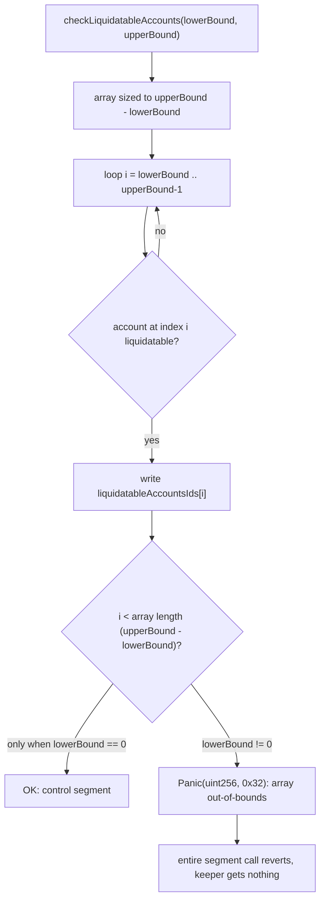
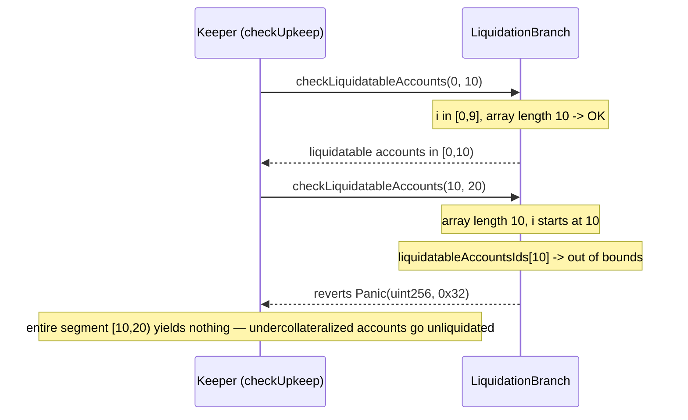

# Zaros — LiquidationBranch::checkLiquidatableAccounts() array out-of-bounds

> **Vulnerability classes:** vuln/logic/off-by-index · vuln/liveness/dos · vuln/integer-bounds/array-out-of-bounds

> **Reproduction:** a self-contained Foundry PoC that compiles & runs in an
> isolated project with **only `forge-std`** — no fork, no RPC, no `anvil_state`.
> Full trace: [output.txt](output.txt). PoC:
> [test/37994-liquidationbranchcheckliquidatableaccounts-executes-for-loop_exp.sol](test/37994-liquidationbranchcheckliquidatableaccounts-executes-for-loop_exp.sol).

<!-- non-defihacklabs -->
<!-- source-auditvault: https://github.com/Auditware/AuditVault/blob/main/findings/37994-liquidationbranchcheckliquidatableaccounts-executes-for-loop.md -->
<!-- date: 2024-07 -->

---

## Key info

| | |
|---|---|
| **Impact** | **HIGH** — `checkLiquidatableAccounts` sizes its output array by segment width but indexes it with the absolute loop variable, so any paginated call with `lowerBound != 0` reverts with an array out-of-bounds Panic the instant it finds a liquidatable account |
| **Protocol** | [Zaros](https://github.com/Cyfrin/2024-07-zaros) — perpetuals trading engine |
| **Vulnerable code** | `LiquidationBranch.checkLiquidatableAccounts` |
| **Bug class** | Off-by-index: absolute loop variable used where a segment-relative offset was required |
| **Finding** | Codehawks — Zaros, 2024-07 · #37994 · reporter **cryptedOji** |
| **Report** | Codehawks 2024-07-zaros contest |
| **Source** | [AuditVault](https://github.com/Auditware/AuditVault/blob/main/findings/37994-liquidationbranchcheckliquidatableaccounts-executes-for-loop.md) |
| **Status** | Audit finding — caught in review (not exploited on-chain). Reproduced here as a standalone local PoC. |
| **Compiler** | `0.8.25` (PoC pragma matches the audited repo) |

This is an **audit finding**, not a historical on-chain incident. The real
`checkLiquidatableAccounts` reads live margin/PnL data for each active
trading account; the PoC keeps the vulnerable array-sizing/indexing logic
verbatim and replaces the margin computation with a simple per-index
liquidatable flag, reduced to the minimum needed to trigger the exact
out-of-bounds condition.

---

## TL;DR

1. `checkLiquidatableAccounts(lowerBound, upperBound)` is explicitly designed
   for **segmented/paginated** scanning of active trading accounts (per its
   own NatSpec `@param` docs) — the output array is sized to the segment
   width, `upperBound - lowerBound`.
2. The scan loop walks the **absolute** range `for (i = lowerBound; i < upperBound; i++)`
   and writes results at `liquidatableAccountsIds[i]` — using the absolute
   `i`, not the segment-relative offset `i - lowerBound`.
3. The moment `lowerBound != 0` and the loop reaches a liquidatable account,
   `i` is already `>=` the array's length (`upperBound - lowerBound`), and
   the write reverts with an array out-of-bounds `Panic(uint256, 0x32)`.
4. **Harm:** every segment except the very first (`lowerBound == 0`) is
   completely non-functional — the entire call reverts, returning nothing,
   not even the accounts before the first liquidatable one in the segment.
   This is consumed by `LiquidationKeeper.checkUpkeep` (Chainlink
   Automation), so paginated liquidation monitoring silently breaks for any
   segment beyond the first, risking undercollateralized positions going
   unliquidated.

---

## The vulnerable code

`LiquidationBranch.sol::checkLiquidatableAccounts` (verbatim):

```solidity
/// @param lowerBound The lower bound of the accounts to check
/// @param upperBound The upper bound of the accounts to check
function checkLiquidatableAccounts(
    uint256 lowerBound,
    uint256 upperBound
)
    external
    view
    returns (uint128[] memory liquidatableAccountsIds)
{
    // prepare output array size
    liquidatableAccountsIds = new uint128[](upperBound - lowerBound);
    ...
    for (uint256 i = lowerBound; i < upperBound; i++) {
        if (i >= cachedAccountsIdsWithActivePositionsLength) break;
        uint128 tradingAccountId = uint128(globalConfiguration.accountsIdsWithActivePositions.at(i));
        ...
        if (TradingAccount.isLiquidatable(requiredMaintenanceMarginUsdX18, marginBalanceUsdX18)) {
            liquidatableAccountsIds[i] = tradingAccountId;
        }
    }
}
```

The fix, per the finding (indexing with a running `count` instead of the
absolute `i`, then resizing to drop trailing zeroes):

```diff
+       uint256 count = 0;
        for (uint256 i = lowerBound; i < upperBound; i++) {
            ...
            if (TradingAccount.isLiquidatable(requiredMaintenanceMarginUsdX18, marginBalanceUsdX18)) {
-               liquidatableAccountsIds[i] = tradingAccountId;
+               cacheLiquidatableAccountsIds[count] = tradingAccountId;
+               count++;
            }
        }
+       liquidatableAccountsIds = new uint128[](count);
+       for (uint256 j = 0; j < count; j++) { liquidatableAccountsIds[j] = cacheLiquidatableAccountsIds[j]; }
```

---

## Root cause

The output array's **length** is derived from the segment width
(`upperBound - lowerBound`), but the loop's **write index** is derived from
the absolute scan position (`i`). These two quantities only coincide when
`lowerBound == 0`. For any other segment, `i` starts already at or beyond the
array's length, so the first liquidatable account found in that segment
triggers an out-of-bounds write.

## Preconditions

- The caller (typically a keeper contract, e.g. Chainlink Automation via
  `LiquidationKeeper.checkUpkeep`) calls `checkLiquidatableAccounts` with a
  non-zero `lowerBound` — exactly the intended usage pattern for segmenting a
  large active-account set into gas-bounded chunks.
- At least one account within `[lowerBound, upperBound)` is liquidatable.

## Attack walkthrough

From [output.txt](output.txt), mirroring the finding's own PoC scenario (30
active accounts, indices 10..19 liquidatable, `lowerBound=10, upperBound=20`):

1. **Control** — `checkLiquidatableAccounts(0, 10)` returns a correctly-sized
   10-element array. `lowerBound == 0`, so the absolute index and the
   relative offset coincide — no bug visible.
2. **HARM** — `checkLiquidatableAccounts(10, 20)` is called (via a raw
   `staticcall` in the PoC so the revert can be observed without aborting the
   whole PoC, exactly as a keeper's `checkUpkeep` would observe it).
3. At `i = 10` — the very first index checked in this segment, which is
   marked liquidatable — the write to `liquidatableAccountsIds[10]` overflows
   the 10-slot array.
4. The call reverts with `Panic(uint256)`, code `0x32` (array out-of-bounds
   access) — the exact failure the finding's own PoC reproduces
   (`vm.expectRevert(abi.encodeWithSignature("Panic(uint256)", 0x32))`).
5. The ENTIRE segment call fails — not just the one liquidatable account, but
   every account in `[10, 20)`, liquidatable or not, produces nothing.

## Diagrams





## Impact

- Every paginated liquidation-scan segment except the first
  (`lowerBound == 0`) is entirely non-functional whenever it contains a
  liquidatable account — it reverts instead of returning results.
- `LiquidationKeeper.checkUpkeep` consumes this function's output to decide
  which accounts to liquidate; a reverting segment means Chainlink Automation
  either fails the upkeep check entirely for that segment or (depending on
  how the revert propagates through the keeper) silently sees no liquidatable
  accounts there.
- The practical consequence is that undercollateralized positions in any
  segment beyond the first can go unliquidated, exposing the protocol to
  accumulating bad debt exactly during the periods (many active accounts,
  segmentation actually needed) where liquidation monitoring matters most.

## Remediation

Track a separate running counter for the number of liquidatable accounts
found, write into the output array at that counter (not at the absolute loop
index `i`), and resize the array to the counter's final value before
returning — exactly as shown in the finding's diff above.

## How to reproduce

```bash
cd ~/RustroverProjects/audits/evm-hack-registry/37994-liquidationbranchcheckliquidatableaccounts-executes-for-loop_exp
forge test -vvv
# Fully local — no fork, no RPC, no anvil_state required.
# Expected: all three tests PASS:
#   test_lowerBoundZero_worksCorrectly         (control: first segment works)
#   test_lowerBoundNonZero_revertsOutOfBounds  (harm, via vm.expectRevert: Panic(0x32))
#   test_exploit_demonstratesOutOfBoundsRevert (harm, via the cheatcode-free Exploit + staticcall)
```

PoC source: [test/37994-liquidationbranchcheckliquidatableaccounts-executes-for-loop_exp.sol](test/37994-liquidationbranchcheckliquidatableaccounts-executes-for-loop_exp.sol)
— the verbatim vulnerable array-sizing and absolute-indexing lines, reduced
to a minimal active-account list with a per-index liquidatable flag.

---

## Sources

- AuditVault finding: [37994-liquidationbranchcheckliquidatableaccounts-executes-for-loop.md](https://github.com/Auditware/AuditVault/blob/main/findings/37994-liquidationbranchcheckliquidatableaccounts-executes-for-loop.md)
- Original contest: Codehawks 2024-07-zaros (Cyfrin), finding #37994
- Reduced source: quoted directly from the finding (`LiquidationBranch::checkLiquidatableAccounts`), repo [Cyfrin/2024-07-zaros@d687fe9](https://github.com/Cyfrin/2024-07-zaros/blob/d687fe96bb7ace8652778797052a38763fbcbb1b/src/perpetuals/branches/LiquidationBranch.sol#L40-L86)

## Taxonomy (AuditVault)

- `genome:` liquidation-logic, permanent, chainlink-round-completeness, integer-bounds, liquidation-underwater
- `sector:` lending, oracle, perpetuals
- `severity:` high

---

*Reference: finding **#37994** by **cryptedOji** in the Codehawks 2024-07-zaros contest (Cyfrin) · curated by [AuditVault](https://github.com/Auditware/AuditVault/blob/main/findings/37994-liquidationbranchcheckliquidatableaccounts-executes-for-loop.md)*
