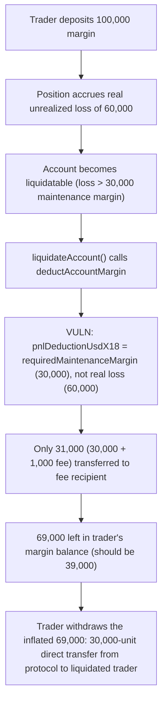
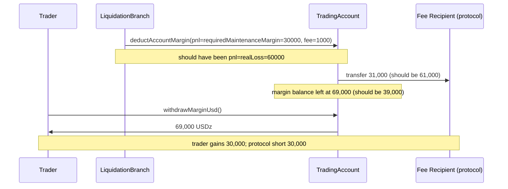

# Zaros — wrong parameter passed in TradingAccount::deductAccountMargin

> **Vulnerability classes:** vuln/logic/liquidation-logic · vuln/loss-of-funds/direct-drain · vuln/logic/wrong-argument

> **Reproduction:** a self-contained Foundry PoC that compiles & runs in an
> isolated project with **only `forge-std`** — no fork, no RPC, no `anvil_state`.
> Full trace: [output.txt](output.txt). PoC:
> [test/37995-wrong-parameter-passed-in-tradingaccountdeductaccountmargin_exp.sol](test/37995-wrong-parameter-passed-in-tradingaccountdeductaccountmargin_exp.sol).

<!-- non-defihacklabs -->
<!-- source-auditvault: https://github.com/Auditware/AuditVault/blob/main/findings/37995-wrong-parameter-passed-in-tradingaccountdeductaccountmargin.md -->
<!-- date: 2024-07 -->

---

## Key info

| | |
|---|---|
| **Impact** | **HIGH** — `LiquidationBranch.liquidateAccounts` passes the account's `requiredMaintenanceMarginUsdX18` where its real unrealized loss (`accountTotalUnrealizedPnlUsdX18`) was intended, under-deducting the liquidated account's margin balance and leaving the shortfall withdrawable by the just-liquidated trader |
| **Protocol** | [Zaros](https://github.com/Cyfrin/2024-07-zaros) — perpetuals trading engine |
| **Vulnerable code** | `LiquidationBranch.liquidateAccounts` → `TradingAccount.deductAccountMargin` call site |
| **Bug class** | Wrong argument passed to a function — a semantically unrelated value substituted for the intended one |
| **Finding** | Codehawks — Zaros, 2024-07 · #37995 · reporter **0xStalin** |
| **Report** | Codehawks 2024-07-zaros contest |
| **Source** | [AuditVault](https://github.com/Auditware/AuditVault/blob/main/findings/37995-wrong-parameter-passed-in-tradingaccountdeductaccountmargin.md) |
| **Status** | Audit finding — caught in review (not exploited on-chain). Reproduced here as a standalone local PoC. |
| **Compiler** | `0.8.25` (PoC pragma matches the audited repo) |

This is an **audit finding**, not a historical on-chain incident. The real
`deductAccountMargin` computes margin balances with PRB-Math `SD59x18`/`UD60x18`
fixed-point types across funding fees, PnL, and settlement fees; the PoC keeps
the vulnerable call-site argument-substitution verbatim and reduces the margin
accounting to the minimum arithmetic needed to show the exact fund shortfall.

---

## TL;DR

1. On liquidation, `deductAccountMargin` should realize the account's ACTUAL
   unrealized loss plus the liquidation fee out of its margin balance,
   transferring that amount to the protocol's fee recipient.
2. `LiquidationBranch.liquidateAccounts` instead passes
   `requiredMaintenanceMarginUsdX18` — the account's required maintenance
   margin, an unrelated number — as the pnl-deduction argument, instead of
   `accountTotalUnrealizedPnlUsdX18` (the real loss).
3. Maintenance margin is typically smaller than the loss that actually
   triggered the liquidation (that's precisely why the account became
   liquidatable), so the wrong value under-deducts the account.
4. **Harm:** the shortfall between the real loss and the substituted value
   stays in the trader's margin balance after "liquidation" and is fully
   withdrawable. In this reduction (deposit 100,000, real loss 60,000,
   required maintenance margin 30,000, fee 1,000): the protocol's fee
   recipient receives only 31,000 instead of the correct 61,000, and the
   liquidated trader withdraws **69,000 instead of the correct 39,000** — a
   **30,000-unit** direct transfer from the protocol to the trader it just
   liquidated.

---

## The vulnerable code

`LiquidationBranch.sol::liquidateAccounts` (verbatim):

```solidity
function liquidateAccounts(uint128[] calldata accountsIds) external {
    ....
    ctx.liquidatedCollateralUsdX18 = tradingAccount.deductAccountMargin({
        feeRecipients: FeeRecipients.Data({
            marginCollateralRecipient: globalConfiguration.marginCollateralRecipient,
            orderFeeRecipient: address(0),
            settlementFeeRecipient: globalConfiguration.liquidationFeeRecipient
        }),
        pnlUsdX18: requiredMaintenanceMarginUsdX18,
        orderFeeUsdX18: UD60x18_ZERO,
        settlementFeeUsdX18: ctx.liquidationFeeUsdX18
    });
    ....
}
```

The fix, per the finding:

```diff
    ctx.liquidatedCollateralUsdX18 = tradingAccount.deductAccountMargin({
        ...
--      pnlUsdX18: requiredMaintenanceMarginUsdX18,
++      pnlUsdX18: accountTotalUnrealizedPnlUsdX18.abs().intoUD60x18()
        orderFeeUsdX18: UD60x18_ZERO,
        settlementFeeUsdX18: ctx.liquidationFeeUsdX18
    });
```

---

## Root cause

`requiredMaintenanceMarginUsdX18` and `accountTotalUnrealizedPnlUsdX18` are
two semantically unrelated values that happen to share the same numeric
type. One is a margin REQUIREMENT (roughly proportional to position size);
the other is the account's actual realized-on-liquidation LOSS. Passing the
wrong one into a deduction parameter compiles cleanly (both are numeric,
fixed-point values) and produces no revert — the bug is purely semantic,
invisible without tracing what each value represents and comparing it to
what `deductAccountMargin`'s parameter name (`pnlUsdX18`) actually needs.

## Preconditions

- Any account gets liquidated where its actual unrealized loss exceeds its
  required maintenance margin — the ordinary case, since a position only
  becomes liquidatable once its margin balance (net of unrealized loss)
  falls below the maintenance margin requirement in the first place.

## Attack walkthrough

From [output.txt](output.txt):

1. **Control** — calling the reduced `deductAccountMargin` directly with the
   CORRECT loss value (as if the bug were fixed) deducts the full 61,000
   (60,000 loss + 1,000 fee), leaving the trader with exactly the intended
   39,000 remainder.
2. A trader deposits 100,000 units of margin and their position accrues a
   real unrealized loss of 60,000 — comfortably past their 30,000 required
   maintenance margin, making the account liquidatable.
3. `liquidateAccount` is called with the account's real loss (60,000), its
   maintenance margin (30,000), and a 1,000 liquidation fee.
4. **VULN:** the call into `deductAccountMargin` passes the maintenance
   margin (30,000) as the pnl-deduction argument instead of the real loss
   (60,000).
5. **HARM:** only 31,000 (30,000 + 1,000 fee) is transferred to the
   protocol's fee recipient — instead of the correct 61,000 — and the
   trader's margin balance is left inflated at 69,000.
6. The liquidated trader withdraws the full 69,000 — a **30,000-unit
   excess**, exactly the shortfall taken from the protocol's fee recipient.

## Diagrams





## Impact

- Every liquidation where the real unrealized loss exceeds the required
  maintenance margin (the ordinary case that made the account liquidatable
  in the first place) under-collects from the liquidated account.
- The shortfall is a direct, silent fund transfer from the protocol's
  liquidation fee / insurance mechanism to the trader who was just
  liquidated — the opposite of the intended economic effect of liquidation.
- Repeated across many liquidations, this systematically drains the
  protocol's fee recipient / insurance fund of exactly the difference
  between each account's real loss and its maintenance margin.

## Remediation

Pass `accountTotalUnrealizedPnlUsdX18.abs().intoUD60x18()` (the account's
real unrealized loss magnitude) as the `pnlUsdX18` argument, not
`requiredMaintenanceMarginUsdX18`, exactly as shown in the diff above.

## How to reproduce

```bash
cd ~/RustroverProjects/audits/evm-hack-registry/37995-wrong-parameter-passed-in-tradingaccountdeductaccountmargin_exp
forge test -vvv
# Fully local — no fork, no RPC, no anvil_state required.
# Expected: both tests PASS:
#   test_correctPnlValue_deductsFullLoss           (control: correct value deducts the full loss + fee)
#   test_wrongParameterPassed_traderKeepsExcessMargin (harm: 30,000-unit excess kept by the liquidated trader)
```

PoC source: [test/37995-wrong-parameter-passed-in-tradingaccountdeductaccountmargin_exp.sol](test/37995-wrong-parameter-passed-in-tradingaccountdeductaccountmargin_exp.sol)
— the verbatim vulnerable named-argument call (`pnlDeductionUsdX18:
requiredMaintenanceMarginUsdX18`), with a minimal margin-accounting model
quantifying the shortfall.

---

## Sources

- AuditVault finding: [37995-wrong-parameter-passed-in-tradingaccountdeductaccountmargin.md](https://github.com/Auditware/AuditVault/blob/main/findings/37995-wrong-parameter-passed-in-tradingaccountdeductaccountmargin.md)
- Original contest: Codehawks 2024-07-zaros (Cyfrin), finding #37995
- Reduced source: quoted directly from the finding (`LiquidationBranch::liquidateAccounts` L158, `TradingAccount::deductAccountMargin`), repo [Cyfrin/2024-07-zaros@d687fe9](https://github.com/Cyfrin/2024-07-zaros/blob/d687fe96bb7ace8652778797052a38763fbcbb1b/src/perpetuals/branches/LiquidationBranch.sol#L158)

## Taxonomy (AuditVault)

- `genome:` liquidation-logic, direct-drain, variant, account-ownership, liquidation-underwater, timestamp-dependence
- `sector:` lending, perpetuals, token
- `severity:` high

---

*Reference: finding **#37995** by **0xStalin** in the Codehawks 2024-07-zaros contest (Cyfrin) · curated by [AuditVault](https://github.com/Auditware/AuditVault/blob/main/findings/37995-wrong-parameter-passed-in-tradingaccountdeductaccountmargin.md)*
