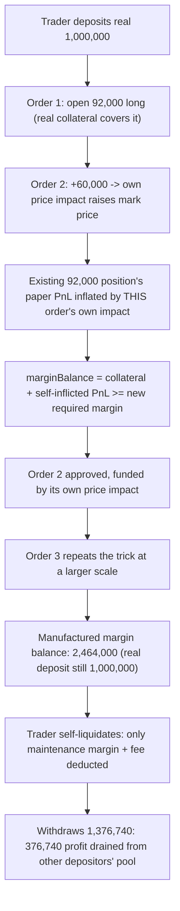
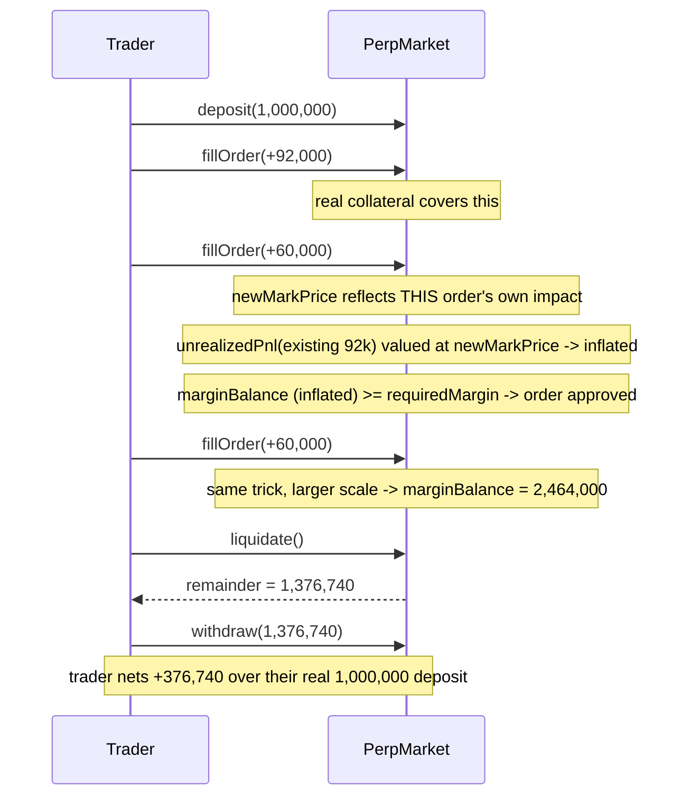

# Zaros — draining the protocol fully

> **Vulnerability classes:** vuln/economic-design/self-referential-margin · vuln/oracle-manipulation/self-inflicted-price-impact · vuln/loss-of-funds/direct-drain

> **Reproduction:** a self-contained Foundry PoC that compiles & runs in an
> isolated project with **only `forge-std`** — no fork, no RPC, no `anvil_state`.
> Full trace: [output.txt](output.txt). PoC:
> [test/38003-draining-the-protocol-fully-codehawks-zaros-git_exp.sol](test/38003-draining-the-protocol-fully-codehawks-zaros-git_exp.sol).

<!-- non-defihacklabs -->
<!-- source-auditvault: https://github.com/Auditware/AuditVault/blob/main/findings/38003-draining-the-protocol-fully-codehawks-zaros-git.md -->
<!-- date: 2024-07 -->

---

## Key info

| | |
|---|---|
| **Impact** | **HIGH** — a new order's margin check credits unrealized PnL valued at the mark price AFTER that same order's own price impact, letting a trader manufacture unlimited margin headroom from nothing but their own subsequent orders, then extract more than their real deposit via self-liquidation |
| **Protocol** | [Zaros](https://github.com/Cyfrin/2024-07-zaros) — perpetuals trading engine |
| **Vulnerable code** | `SettlementBranch._fillOrder` / margin-balance computation used by `fillMarketOrder` |
| **Bug class** | Self-referential validation: a check is satisfied using state that the checked action itself just produced |
| **Finding** | Codehawks — Zaros, 2024-07 · #38003 · reporter **fyamf** |
| **Report** | Codehawks 2024-07-zaros contest |
| **Source** | [AuditVault](https://github.com/Auditware/AuditVault/blob/main/findings/38003-draining-the-protocol-fully-codehawks-zaros-git.md) |
| **Status** | Audit finding — caught in review (not exploited on-chain). Reproduced here as a standalone local PoC. |
| **Compiler** | `0.8.25` (PoC pragma matches the audited repo) |

This is an **audit finding**, not a historical on-chain incident. The real
Zaros market computes mark price, funding, and margin with PRB-Math
fixed-point types across a full order-matching and settlement pipeline; the
PoC keeps the vulnerable self-referential margin-balance pattern verbatim
and reduces price impact and margin accounting to the minimum arithmetic
needed to demonstrate the unbounded feedback loop and its exact dollar harm.

---

## TL;DR

1. Opening a new order moves the market's skew, which moves the mark price
   (price impact) — a real feature (skew-based pricing).
2. The margin check for that SAME new order values the trader's EXISTING
   position's unrealized PnL at the mark price **after** the new order's
   own price impact has already been applied.
3. The order's own execution manufactures the exact margin "profit" used to
   approve itself: a bigger order pushes the price further, inflating the
   existing position's paper profit by more, covering an even bigger
   required margin for an even bigger next order.
4. This feedback loop is funded by nothing but the trader's own subsequent
   orders — no real capital is ever added beyond the first deposit.
5. **Harm:** after growing the position through 3 orders on a real deposit
   of 1,000,000, the trader's manufactured margin balance reaches
   2,464,000. Triggering self-liquidation only deducts the maintenance
   margin + a small fee, leaving **1,376,740** withdrawable — a **376,740**
   profit that can only come from other, honest depositors' pooled
   collateral, since the trader's own real deposit was only 1,000,000.

---

## The vulnerable code

Per the finding, the mechanism spans `SettlementBranch.sol` (order fill,
margin validation against the post-impact mark price) and
`TradingAccount.sol` (margin balance = collateral + unrealized PnL):

- Fill/margin-check reference: [SettlementBranch.sol#L435](https://github.com/Cyfrin/2024-07-zaros/blob/main/src/perpetuals/branches/SettlementBranch.sol#L435)
- Margin balance reference: [TradingAccount.sol#L200](https://github.com/Cyfrin/2024-07-zaros/blob/main/src/perpetuals/leaves/TradingAccount.sol#L200)

Reduced to its essential shape (verbatim structure, preserved in the PoC):

```solidity
function fillOrder(int256 sizeDelta) external {
    int256 newSkew = skew + sizeDelta;
    int256 newMarkPrice = markPrice(newSkew); // price impact from THIS order

    // Existing position's PnL, valued at the price AFTER this order's own impact
    int256 unrealizedPnl = size * newMarkPrice - costBasis;
    int256 marginBalance = int256(collateral) + unrealizedPnl;

    int256 newSize = size + sizeDelta;
    uint256 requiredMargin = uint256(newSize) * uint256(newMarkPrice) * IMR_NUM / IMR_DEN;

    require(marginBalance >= int256(requiredMargin), "insufficient margin");
    // this order's own price impact just funded the margin check it passed
    ...
}
```

The recommended remediation directions, per the finding:

- Separate unrealized profit from the collateral used to validate margin
  requirements (don't let a position's own paper PnL, especially PnL
  inflated by the very order being validated, count as spendable margin).
- Do not allow a user to increase a position once it is already
  liquidatable — checked today, but bypassed because the self-inflicted PnL
  increase raises the margin balance past the liquidatable threshold before
  that check ever fires.

---

## Root cause

Margin validation is supposed to answer: "does this account have enough
REAL value to support this trade?" Instead it answers: "does this account
have enough value **after this trade's own market impact is already
counted**?" Those are different questions whenever the trade itself moves
the price — and a same-direction, same-market position increase always
does. The check is not wrong in isolation; it is wrong because it uses
POST-STATE (the mark price this very call is about to create) to validate
the PRE-STATE decision (whether to allow the call at all).

## Preconditions

- The market's mark price responds to skew (an ordinary, intended
  mechanism — not itself a bug).
- A trader can submit multiple same-direction orders in sequence, each one
  large enough to move the mark price meaningfully.

## Attack walkthrough

From [output.txt](output.txt):

1. **Control** — computed directly: without crediting the self-referential
   PnL (comparing the required margin against the trader's real deposited
   collateral alone), the SECOND order would already be rejected
   (1,000,000 real collateral < 1,542,800 required margin for the grown
   position). This isolates the self-referential PnL credit as the exact
   enabling mechanism.
2. **HARM** — the trader deposits a real 1,000,000 and opens a 92,000-unit
   long position (order 1) — comfortably covered by real collateral.
3. A second order grows the position to 152,000. Its own price impact
   raises the mark price, inflating the EXISTING 92,000 position's paper
   profit enough to cover the bigger new required margin — the order funds
   its own approval.
4. A third order repeats the trick at a larger scale: margin balance
   reaches 2,464,000 (real deposit still only 1,000,000).
5. The trader triggers their own liquidation. The maintenance margin + a
   small fixed fee are deducted from the manufactured 2,464,000, leaving
   **1,376,740** withdrawable.
6. The trader withdraws **1,376,740** — a **376,740** profit over their real
   1,000,000 deposit — and the market's remaining real token balance now
   backs LESS than the collateral pooled by other, honest depositors.

## Diagrams





## Impact

- A trader can extract real value from the protocol far exceeding their
  own deposit, funded entirely by a mechanically manufactured feedback
  loop — no oracle manipulation, no external price feed involved, purely
  the market's own intended (and otherwise correct) skew-based pricing
  turned against its own margin validation.
- The extracted excess can only come from the protocol's pooled collateral
  — other depositors' funds, insurance fund, or LP-provided liquidity —
  since the attacker's own real capital never grew.
- Because the loop compounds (each iteration's manufactured margin grows
  faster than the real requirement), the maximum extractable amount is
  bounded only by the market's open-interest cap, not by anything related
  to the attacker's actual capital — per the finding's own numbers, a
  1,000,000 real deposit reached over 40,000,000 in manufactured margin
  before hitting the real protocol's open-interest limit.

## Remediation

Value the EXISTING position's unrealized PnL at the mark price **before**
the current order's own price impact is applied, so a new order can never
use its own market impact to fund its own margin approval. Additionally,
block any position increase once the pre-order state is already
liquidatable, independent of any PnL credit the new order itself might
introduce.

## How to reproduce

```bash
cd ~/RustroverProjects/audits/evm-hack-registry/38003-draining-the-protocol-fully-codehawks-zaros-git_exp
forge test -vvv
# Fully local — no fork, no RPC, no anvil_state required.
# Expected: both tests PASS:
#   test_withoutPnlCredit_secondOrderWouldFail  (control: isolates the self-referential PnL credit as the enabler)
#   test_drainsMoreThanRealDeposit              (harm: 376,740 profit over a 1,000,000 real deposit)
```

PoC source: [test/38003-draining-the-protocol-fully-codehawks-zaros-git_exp.sol](test/38003-draining-the-protocol-fully-codehawks-zaros-git_exp.sol)
— the verbatim vulnerable self-referential margin-balance computation, with
a minimal skew/mark-price/margin model reproducing the exact feedback-loop
mechanism and its dollar harm at a reduced (but faithful) scale.

---

## Sources

- AuditVault finding: [38003-draining-the-protocol-fully-codehawks-zaros-git.md](https://github.com/Auditware/AuditVault/blob/main/findings/38003-draining-the-protocol-fully-codehawks-zaros-git.md)
- Original contest: Codehawks 2024-07-zaros (Cyfrin), finding #38003
- Reduced source: quoted directly from the finding (`SettlementBranch.sol#L435`, `TradingAccount.sol#L200`), repo [Cyfrin/2024-07-zaros](https://github.com/Cyfrin/2024-07-zaros)

## Taxonomy (AuditVault)

- `genome:` liquidation-logic, direct-drain, liquidation-underwater
- `sector:` lending, perpetuals
- `severity:` high

---

*Reference: finding **#38003** by **fyamf** in the Codehawks 2024-07-zaros contest (Cyfrin) · curated by [AuditVault](https://github.com/Auditware/AuditVault/blob/main/findings/38003-draining-the-protocol-fully-codehawks-zaros-git.md)*
