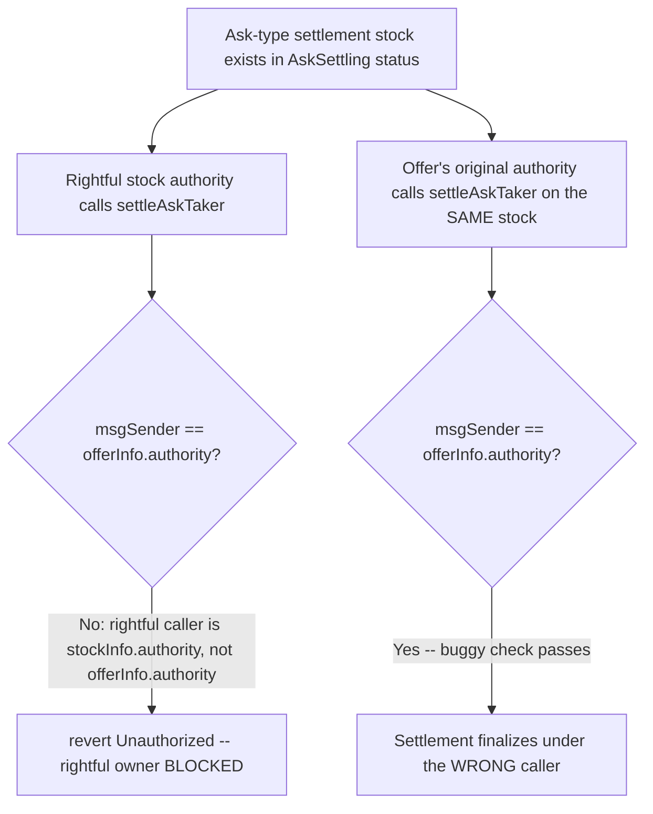
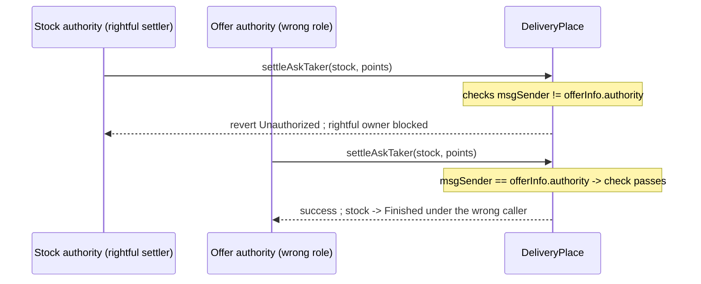

# Tadle — `DeliveryPlace::settleAskTaker` has incorrect access control

> **Vulnerability classes:** vuln/access-control/wrong-condition · vuln/access-control/role-bypass · vuln/liveness/denial-of-service

> **Reproduction:** a self-contained Foundry PoC that compiles & runs in an
> isolated project with **only `forge-std`** — no fork, no RPC, no `anvil_state`.
> Full trace: [output.txt](output.txt). PoC:
> [test/38066-deliveryplacesettleasktaker-has-incorrect-access-control-cod_exp.sol](test/38066-deliveryplacesettleasktaker-has-incorrect-access-control-cod_exp.sol).

<!-- non-defihacklabs -->
<!-- source-auditvault: https://github.com/Auditware/AuditVault/blob/main/findings/38066-deliveryplacesettleasktaker-has-incorrect-access-control-cod.md -->
<!-- date: 2024-08 -->

---

## Key info

| | |
|---|---|
| **Impact** | **HIGH** — the rightful stock authority is permanently denied settlement while an unrelated address (the offer's original authority) is wrongly authorized to settle in their place |
| **Protocol** | [Tadle](https://tadle.com) — pre-market OTC points-trading protocol |
| **Vulnerable code** | `DeliveryPlace.settleAskTaker` — the `AskSettling` branch's authority check |
| **Bug class** | Wrong-condition access control: checks the wrong principal against `msg.sender` |
| **Finding** | Codehawks — Tadle, 2024-08 · #38066 (H-05) · reporter **p0wd3r** |
| **Report** | [Cyfrin 2024-08-tadle](https://github.com/Cyfrin/2024-08-tadle) |
| **Source** | [AuditVault](https://github.com/Auditware/AuditVault/blob/main/findings/38066-deliveryplacesettleasktaker-has-incorrect-access-control-cod.md) |
| **Status** | Audit finding — caught in review (not exploited on-chain). Reproduced here as a standalone local PoC. |
| **Compiler** | `^0.8.24` (PoC) |

This is an **audit finding**, not a historical on-chain incident. The PoC keeps
`settleAskTaker`'s vulnerable `AskSettling` branch verbatim (including its own devdoc,
`@dev caller must be stock authority`) and reduces the surrounding
PreMarkets/PerMarkets/SystemConfig wiring to a minimal `setup()` scaffold so the wrong
check can be exercised directly and deterministically.

---

## TL;DR

1. `settleAskTaker`'s own devdoc says the caller must be the **stock authority** — the
   party who actually holds the Ask-type settlement stock and is obligated to deliver
   points.
2. The code instead checks `_msgSender() != offerInfo.authority` — the offer's
   **original maker**, a different role entirely.
3. The rightful stock authority calls `settleAskTaker` on their own stock and is
   wrongly denied: `revert Errors.Unauthorized()`.
4. The offer's original authority — who has no legitimate claim on this specific
   settlement stock — calls the **same function on the same stock** and passes the
   buggy check instead, finalizing the trade in the rightful owner's place.
5. **Harm:** the correct party is permanently locked out of finalizing their own
   settlement (their pending point-token delivery can never go through this path),
   while a different, unauthorized role controls when and how it settles.

---

## The vulnerable code

Verbatim, `DeliveryPlace.settleAskTaker`'s `AskSettling` branch:

```solidity
/**
 * @notice Settle ask taker
 * @dev caller must be stock authority
 * @dev market place status must be AskSettling
 */
if (status == MarketPlaceStatus.AskSettling) {
@>  if (_msgSender() != offerInfo.authority) {   // checks the WRONG principal
        revert Errors.Unauthorized();
    }
} else {
    if (_msgSender() != owner()) {
        revert Errors.Unauthorized();
    }
    if (_settledPoints > 0) {
        revert InvalidPoints();
    }
}
```

The fix (per the original finding):

```diff
    if (status == MarketPlaceStatus.AskSettling) {
-       if (_msgSender() != offerInfo.authority) {
+       if (_msgSender() != stockInfo.authority) {
            revert Errors.Unauthorized();
        }
    }
```

---

## Root cause

`offerInfo.authority` and `stockInfo.authority` are attached to different roles in
Tadle's OTC model: the offer's authority is the party that originally created the
offer (maker), while the stock's authority is whoever currently holds the specific
settlement stock generated for that leg of the trade (and is the one actually
obligated to deliver points on settlement). The devdoc is explicit about which one is
supposed to gate `settleAskTaker` — the stock authority — but the code checks the
offer authority instead. Because the two addresses need not coincide, the check ends
up authorizing the wrong role.

## Preconditions

- A settlement stock exists in `AskSettling` status with a stock authority that
  differs from the originating offer's authority (the normal case once a bid offer
  has been taken by a different address than the maker).
- No other role separation prevents the offer authority from calling
  `settleAskTaker` on a stock it does not own.

## Attack walkthrough

From [output.txt](output.txt):

1. `DeliveryPlace` is wired up (via the PoC's `setup()` scaffold, mirroring
   `PreMarkets.createOffer` + `createTaker` + `SystemConfig.updateMarket`) with one
   Ask-type settlement stock whose `stockInfo.authority` is the rightful settler and
   whose originating offer's `offerInfo.authority` is a different address.
2. The rightful stock authority approves the point token and calls
   `settleAskTaker(stock, points)` — and the call **reverts** `Unauthorized`, even
   though this is exactly the caller the function's own devdoc names as correct.
3. The offer's original authority — who holds no legitimate claim on this settlement
   stock — calls `settleAskTaker` on the **same stock** and the buggy check lets it
   through.
4. **HARM:** the stock flips to `Finished` under the wrong caller's authorization. The
   rightful stock authority's settlement attempt can never succeed through this path;
   a different role entirely controls finalization.

## Diagrams





## Remediation

Check `_msgSender() != stockInfo.authority` instead of
`_msgSender() != offerInfo.authority`, matching the function's own devdoc.

## How to reproduce

```bash
cd ~/RustroverProjects/audits/evm-hack-registry/38066-deliveryplacesettleasktaker-has-incorrect-access-control-cod_exp
forge test -vvv
# Fully local — no fork, no RPC, no anvil_state required.
# Expected: all 3 tests PASS:
#   test_exploit_wrongAuthorityAuthorized_rightfulOwnerBlocked (full attack)
#   test_rightfulStockAuthority_isBlocked                       (isolates the revert)
#   test_control_sameAddressBothRoles_succeeds                  (control: no mismatch -> succeeds)
```

PoC source: [test/38066-deliveryplacesettleasktaker-has-incorrect-access-control-cod_exp.sol](test/38066-deliveryplacesettleasktaker-has-incorrect-access-control-cod_exp.sol)
— the verbatim vulnerable `AskSettling` branch plus a minimal `DeliveryPlace`/`TokenManager`
reduction, the role-bypass demonstration, and a control test.

> Note: `DeliveryPlace.setup()` is test scaffolding standing in for
> `PreMarkets.createOffer`/`createTaker`/`SystemConfig.updateMarket` — the real
> multi-contract wiring is out of scope for this reduction, but the vulnerable
> authorization check and the resulting role-bypass are faithful.

---

*Reference: finding **#38066 (H-05)** by **p0wd3r** in the [Codehawks Tadle contest (2024-08)](https://github.com/Cyfrin/2024-08-tadle) · curated by [AuditVault](https://github.com/Auditware/AuditVault/blob/main/findings/38066-deliveryplacesettleasktaker-has-incorrect-access-control-cod.md)*
