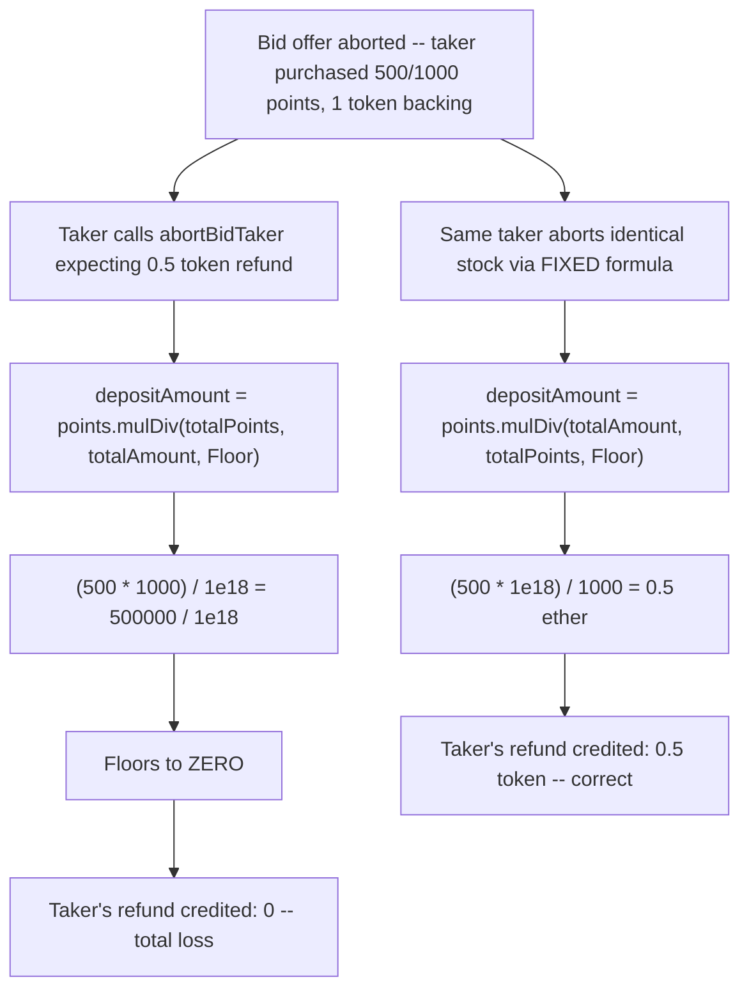
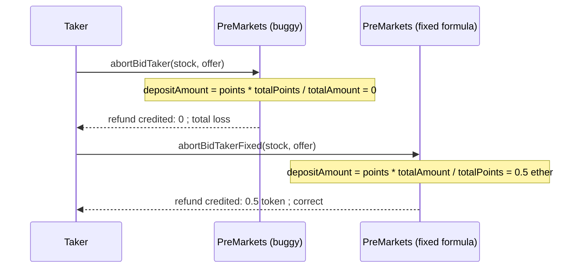

# Tadle — formulaic error rounds down, causing total loss of funds for bid takers during abort

> **Vulnerability classes:** vuln/math/rounding-direction · vuln/math/integer-bounds · vuln/loss-of-funds/direct-drain

> **Reproduction:** a self-contained Foundry PoC that compiles & runs in an
> isolated project with **only `forge-std`** — no fork, no RPC, no `anvil_state`.
> Full trace: [output.txt](output.txt). PoC:
> [test/38067-formulaic-error-rounds-down-causing-total-loss-of-funds-for_exp.sol](test/38067-formulaic-error-rounds-down-causing-total-loss-of-funds-for_exp.sol).

<!-- non-defihacklabs -->
<!-- source-auditvault: https://github.com/Auditware/AuditVault/blob/main/findings/38067-formulaic-error-rounds-down-causing-total-loss-of-funds-for.md -->
<!-- date: 2024-08 -->

---

## Key info

| | |
|---|---|
| **Impact** | **HIGH** — a bid taker's abort refund rounds down to zero instead of their correct proportional share, a total loss of the deposited amount |
| **Protocol** | [Tadle](https://tadle.com) — pre-market OTC points-trading protocol |
| **Vulnerable code** | `PreMarkets.abortBidTaker` — the `depositAmount` computation |
| **Bug class** | Rounding direction / swapped operands in a `mulDiv` call |
| **Finding** | Codehawks — Tadle, 2024-08 · #38067 · reporter **inzinko** |
| **Report** | [Cyfrin 2024-08-tadle](https://github.com/Cyfrin/2024-08-tadle) |
| **Source** | [AuditVault](https://github.com/Auditware/AuditVault/blob/main/findings/38067-formulaic-error-rounds-down-causing-total-loss-of-funds-for.md) |
| **Status** | Audit finding — caught in review (not exploited on-chain). Reproduced here as a standalone local PoC. |
| **Compiler** | `^0.8.24` (PoC) |

This is an **audit finding**, not a historical on-chain incident. The PoC keeps the
vulnerable `mulDiv` call verbatim (with its swapped operands) and reduces the
surrounding offer/stock bookkeeping to a minimal `setup()` scaffold, so the exact
rounding-to-zero behaviour can be exercised directly and deterministically.

---

## TL;DR

1. `abortBidTaker` refunds a taker's deposit after their bid offer is aborted, using
   `depositAmount = stockInfo.points.mulDiv(preOfferInfo.points, preOfferInfo.amount, Floor)`.
2. That computes `(purchasedPoints * totalPoints) / totalAmount` — the numerator and
   denominator are **swapped**. The correct formula is
   `(purchasedPoints * totalAmount) / totalPoints`.
3. `totalAmount` is a large, 18-decimal token amount (e.g. `1e18`), while
   `purchasedPoints` and `totalPoints` are small integers (e.g. `500`, `1000`).
4. The swapped formula's numerator (`500 * 1000 = 500,000`) is dwarfed by the huge
   denominator (`1e18`), and Solidity's floor division rounds the quotient to **zero**.
5. **Harm:** the taker's entire proportional refund (correctly `0.5` token) is lost —
   a direct, unrecoverable loss of funds for anyone who aborts a bid position.

---

## The vulnerable code

Verbatim, `PreMarkets.abortBidTaker`:

```solidity
uint256 depositAmount = stockInfo.points.mulDiv(
    preOfferInfo.points,
    preOfferInfo.amount,     // @> numerator/denominator swapped
    Math.Rounding.Floor
);
```

The fix (per the original finding):

```diff
    uint256 depositAmount = stockInfo.points.mulDiv(
-       preOfferInfo.points,
-       preOfferInfo.amount,
+       preOfferInfo.amount,
+       preOfferInfo.points,
        Math.Rounding.Floor
    );
```

---

## Root cause

`mulDiv(x, y, denominator)` computes `(x * y) / denominator`. The correct refund
formula is "the taker's share of the offer's total backing" —
`purchasedPoints * totalAmount / totalPoints` — which correctly scales a large token
amount by a small points ratio. The buggy call instead computes
`purchasedPoints * totalPoints / totalAmount`, which has the small point counts as
the numerator and the large token amount as the denominator. Because token amounts
are routinely 18-decimal-scaled while point counts are small plain integers, this
swap doesn't just introduce a rounding error — it drives the entire result to zero
for any realistic offer size.

## Preconditions

- A Bid offer has been aborted (`abortOfferStatus == Aborted`), which is the normal
  precondition for any bid taker to reclaim their deposit.
- The offer's token amount is large relative to its point count (true for any
  18-decimal token and a modest point count — the normal case).

## Attack walkthrough

From [output.txt](output.txt), with a taker who purchased 500 of 1000 points against
a Bid offer backed by 1 token:

1. The offer is aborted; the taker calls `abortBidTaker` expecting their proportional
   `500/1000 * 1 token = 0.5 token` refund.
2. `depositAmount = 500.mulDiv(1000, 1e18, Floor) = 500,000 / 1e18 = 0` (floors to zero).
3. `transferAmount` (derived from `depositAmount`) is credited to the taker's refund
   balance: **zero**.
4. **HARM:** the identical taker, aborting an economically-identical stock through the
   *fixed* formula, correctly receives `0.5 token`. The buggy path's zero refund is
   confirmed to be a pure formula bug, not an inherent property of these economics —
   a total, unrecoverable loss of the taker's deposit.

## Diagrams





## Remediation

Swap the `mulDiv` arguments so the large token amount is the numerator and the small
point count is the denominator:
`stockInfo.points.mulDiv(preOfferInfo.amount, preOfferInfo.points, Math.Rounding.Floor)`.

## How to reproduce

```bash
cd ~/RustroverProjects/audits/evm-hack-registry/38067-formulaic-error-rounds-down-causing-total-loss-of-funds-for_exp
forge test -vvv
# Fully local — no fork, no RPC, no anvil_state required.
# Expected: all 3 tests PASS:
#   test_exploit_refundRoundsToZero        (full attack: buggy vs fixed path)
#   test_buggyPath_refundsZero              (isolates the buggy formula: refund == 0)
#   test_control_fixedPath_refundsCorrectAmount (control: fixed formula refunds 0.5 token)
```

PoC source: [test/38067-formulaic-error-rounds-down-causing-total-loss-of-funds-for_exp.sol](test/38067-formulaic-error-rounds-down-causing-total-loss-of-funds-for_exp.sol)
— the verbatim vulnerable `mulDiv` call plus a minimal `PreMarkets`/`TokenManager`
reduction, the rounding-to-zero demonstration, and a control test.

> Note: `PreMarkets.setup()` is test scaffolding standing in for the real
> `createOffer`/`createTaker`/`abortAskOffer` wiring — the real multi-contract flow
> is out of scope for this reduction, but the vulnerable `mulDiv` call and its
> rounding-to-zero behaviour are faithful and use the finding's own example numbers
> (1000 total points, 500 purchased, 1 token backing).

---

*Reference: finding **#38067** by **inzinko** in the [Codehawks Tadle contest (2024-08)](https://github.com/Cyfrin/2024-08-tadle) · curated by [AuditVault](https://github.com/Auditware/AuditVault/blob/main/findings/38067-formulaic-error-rounds-down-causing-total-loss-of-funds-for.md)*
