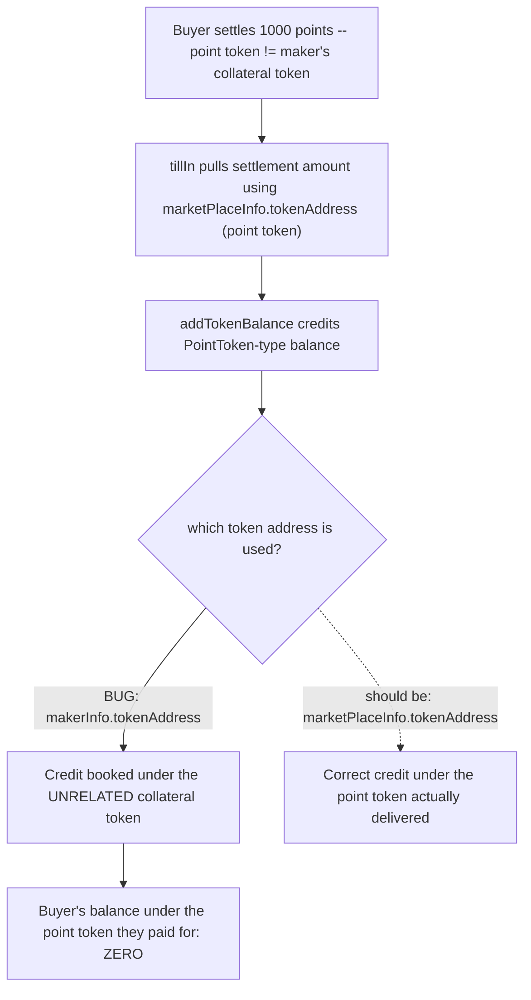
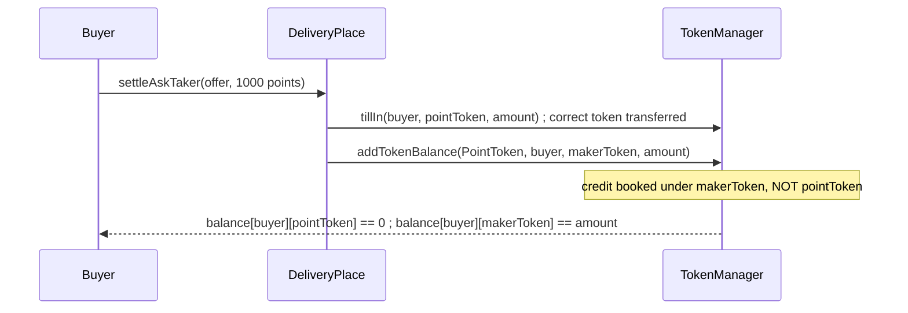

# Tadle — `DeliveryPlace::settleAskTaker()` mistakenly uses `makerInfo.tokenAddress`

> **Vulnerability classes:** vuln/accounting/wrong-token · vuln/accounting/direct-drain · vuln/logic/state-corruption

> **Reproduction:** a self-contained Foundry PoC that compiles & runs in an
> isolated project with **only `forge-std`** — no fork, no RPC, no `anvil_state`.
> Full trace: [output.txt](output.txt). PoC:
> [test/38070-the-deliveryplacesettleasktaker-function-mistakenly-uses-mak_exp.sol](test/38070-the-deliveryplacesettleasktaker-function-mistakenly-uses-mak_exp.sol).

<!-- non-defihacklabs -->
<!-- source-auditvault: https://github.com/Auditware/AuditVault/blob/main/findings/38070-the-deliveryplacesettleasktaker-function-mistakenly-uses-mak.md -->
<!-- date: 2024-08 -->

---

## Key info

| | |
|---|---|
| **Impact** | **HIGH** — the settling buyer's PointToken-type balance is credited against the maker's unrelated original collateral token instead of the actual point token delivered, so it can never be claimed under the correct token |
| **Protocol** | [Tadle](https://tadle.com) — pre-market OTC points-trading protocol |
| **Vulnerable code** | `DeliveryPlace.settleAskTaker` — the `addTokenBalance` call's token argument |
| **Bug class** | Wrong variable used as a function argument (accounting keyed on the wrong token) |
| **Finding** | Codehawks — Tadle, 2024-08 · #38070 · reporter **pontifex** |
| **Report** | [Cyfrin 2024-08-tadle](https://github.com/Cyfrin/2024-08-tadle) — `src/core/DeliveryPlace.sol#L335-L433` |
| **Source** | [AuditVault](https://github.com/Auditware/AuditVault/blob/main/findings/38070-the-deliveryplacesettleasktaker-function-mistakenly-uses-mak.md) |
| **Status** | Audit finding — caught in review (not exploited on-chain). Reproduced here as a standalone local PoC. |
| **Compiler** | `^0.8.24` (PoC) |

This is an **audit finding**, not a historical on-chain incident. The PoC keeps the
vulnerable `addTokenBalance` call verbatim (with its wrong token argument) and
reduces the surrounding offer/market wiring to a minimal `setup()` scaffold, using
two genuinely distinct tokens so the mix-up is unambiguous.

---

## TL;DR

1. When a buyer settles an ask taker position, `settleAskTaker` correctly pulls in
   the settlement amount using `marketPlaceInfo.tokenAddress` — the actual point
   token configured for this market.
2. It then credits the buyer's internal `PointToken`-type balance using
   `makerInfo.tokenAddress` instead — the **maker's original collateral token** from
   when the offer was first created (e.g. USDC), which is unrelated once the
   market's point token has been set.
3. **Harm:** the buyer's balance under the token they actually received a claim on
   stays at **zero**, while the full settlement amount is booked against a token
   that was never actually transferred for this purpose — the accounting is
   corrupted and the buyer's rightful claim is effectively lost.

---

## The vulnerable code

Verbatim, `DeliveryPlace.settleAskTaker`:

```javascript
uint256 settledPointTokenAmount = marketPlaceInfo.tokenPerPoint * _settledPoints;
ITokenManager tokenManager = tadleFactory.getTokenManager();
if (settledPointTokenAmount > 0) {
    tokenManager.tillIn(
        _msgSender(),
        marketPlaceInfo.tokenAddress,
        settledPointTokenAmount,
        true
    );

    tokenManager.addTokenBalance(
        TokenBalanceType.PointToken,
@>      offerInfo.authority,
@>      makerInfo.tokenAddress,     // wrong token
        settledPointTokenAmount
    );
}
```

The fix (per the original finding):

```diff
    tokenManager.addTokenBalance(
        TokenBalanceType.PointToken,
        offerInfo.authority,
-       makerInfo.tokenAddress,
+       marketPlaceInfo.tokenAddress,
        settledPointTokenAmount
    );
```

---

## Root cause

`makerInfo.tokenAddress` and `marketPlaceInfo.tokenAddress` are set at two different
points in an offer's lifecycle and can refer to two entirely different tokens:
`makerInfo.tokenAddress` is fixed when the maker first creates the offer (their
original collateral token), while `marketPlaceInfo.tokenAddress` is the market's
configured point token — the asset actually pulled in and delivered during
settlement. `tillIn` correctly uses the latter to move real tokens; `addTokenBalance`
incorrectly uses the former to update the internal ledger, so the transferred asset
and the credited accounting entry disagree.

## Preconditions

- The market's point token (`marketPlaceInfo.tokenAddress`) differs from the
  offer maker's original collateral token (`makerInfo.tokenAddress`) — the normal
  case, since these represent different assets in the OTC lifecycle.

## Attack walkthrough

From [output.txt](output.txt):

1. A buyer settles 1000 points at `0.01` token/point against an offer whose point
   token and maker collateral token are two distinct `MockToken` instances.
2. `tillIn` correctly transfers `10` units of the **point token** from the buyer into
   the contract.
3. `addTokenBalance` credits the buyer's `PointToken`-type balance under
   `makerInfo.tokenAddress` — the unrelated collateral token — not the point token
   just transferred.
4. **HARM:** the buyer's balance under the point token they actually paid for stays
   `0`; the full `10`-unit credit sits under a token that was never transferred for
   this settlement at all. A control test confirms that when the two token addresses
   happen to coincide, the credit lands correctly — isolating that the bug is
   specifically "wrong token argument", not "the credit is always broken".

## Diagrams





## Remediation

Use `marketPlaceInfo.tokenAddress` (the same token passed to `tillIn`) instead of
`makerInfo.tokenAddress` when crediting the `PointToken`-type balance.

## How to reproduce

```bash
cd ~/RustroverProjects/audits/evm-hack-registry/38070-the-deliveryplacesettleasktaker-function-mistakenly-uses-mak_exp
forge test -vvv
# Fully local — no fork, no RPC, no anvil_state required.
# Expected: both tests PASS:
#   test_exploit_creditBookedUnderWrongToken     (full attack: wrong-token credit)
#   test_control_sameTokenAddress_creditsCorrectly (control: same address -> correct credit)
```

PoC source: [test/38070-the-deliveryplacesettleasktaker-function-mistakenly-uses-mak_exp.sol](test/38070-the-deliveryplacesettleasktaker-function-mistakenly-uses-mak_exp.sol)
— the verbatim vulnerable `addTokenBalance` call plus a minimal `DeliveryPlace`/`TokenManager`
reduction, the wrong-token demonstration, and a control test.

> Note: `DeliveryPlace.setup()` is test scaffolding standing in for
> `PreMarkets.createOffer`/`createTaker`/`SystemConfig.updateMarket` — the real
> multi-contract wiring is out of scope for this reduction, but the vulnerable
> `addTokenBalance` argument mix-up is verbatim and faithful.

---

*Reference: finding **#38070** by **pontifex** in the [Codehawks Tadle contest (2024-08)](https://github.com/Cyfrin/2024-08-tadle) · curated by [AuditVault](https://github.com/Auditware/AuditVault/blob/main/findings/38070-the-deliveryplacesettleasktaker-function-mistakenly-uses-mak.md)*
