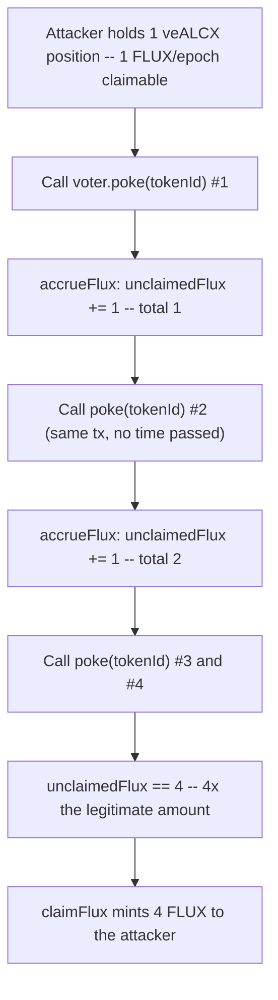
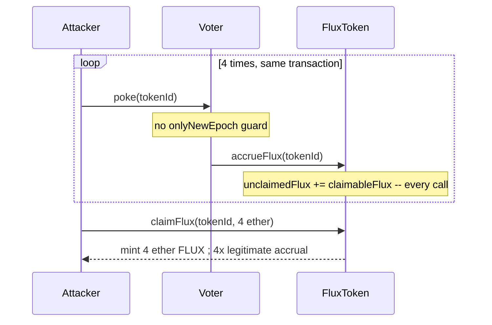

# Alchemix — unauthorized minting of unlimited FLUX in 1 transaction

> **Vulnerability classes:** vuln/access-control/missing-modifier · vuln/reward-calculation/unbounded-accrual · vuln/loss-of-funds/direct-drain

> **Reproduction:** a self-contained Foundry PoC that compiles & runs in an
> isolated project with **only `forge-std`** — no fork, no RPC, no `anvil_state`.
> Full trace: [output.txt](output.txt). PoC:
> [test/38109-unauthorized-minting-of-unlimited-flux-in-1-transaction-immu_exp.sol](test/38109-unauthorized-minting-of-unlimited-flux-in-1-transaction-immu_exp.sol).

<!-- non-defihacklabs -->
<!-- source-auditvault: https://github.com/Auditware/AuditVault/blob/main/findings/38109-unauthorized-minting-of-unlimited-flux-in-1-transaction-immu.md -->
<!-- date: 2023-11 -->

---

## Key info

| | |
|---|---|
| **Impact** | **HIGH** — a single veALCX position can mint any multiple of its legitimate one-time FLUX accrual within one transaction, at no cost and with no time passing |
| **Protocol** | [Alchemix](https://alchemix.fi) — `alchemix-v2-dao` (Voter / FluxToken / veALCX) |
| **Vulnerable code** | `Voter.poke(uint256 _tokenId)` — missing the `onlyNewEpoch(_tokenId)` modifier |
| **Bug class** | Missing per-epoch access guard on a reward-accruing entry point |
| **Finding** | Immunefi — Alchemix DAO · #38109 · reporter **infosec_us_team** |
| **Report** | [alchemix-finance/alchemix-v2-dao — Voter.sol](https://github.com/alchemix-finance/alchemix-v2-dao/blob/main/src/Voter.sol) |
| **Source** | [AuditVault](https://github.com/Auditware/AuditVault/blob/main/findings/38109-unauthorized-minting-of-unlimited-flux-in-1-transaction-immu.md) |
| **Status** | Bug bounty finding — reported responsibly (not exploited on-chain). Reproduced here as a standalone local PoC. |
| **Compiler** | `^0.8.24` (PoC) |

This is a **bug-bounty finding**, not a historical on-chain incident. The PoC keeps
`Voter.poke()`'s missing guard verbatim (the function body is exactly as deployed —
nothing is removed, because the guard was never there) and reduces `FluxToken` /
`VotingEscrow` to the minimal accrual/claim logic the bug actually depends on.

---

## TL;DR

1. A veALCX position accrues FLUX once per epoch by calling `voter.poke(tokenId)`,
   which internally calls `_vote()` → `FluxToken.accrueFlux(tokenId)`.
2. `poke()` is **missing** the `onlyNewEpoch(_tokenId)` modifier that is supposed to
   restrict this to once per epoch.
3. `accrueFlux` unconditionally does `unclaimedFlux[tokenId] += claimableFlux(tokenId)`
   on every call — it has no memory of "already accrued this epoch".
4. An attacker calls `poke(tokenId)` **4 times in a single transaction**: unclaimed
   FLUX becomes `4 ×` the legitimate one-time amount.
5. **Harm:** `claimFlux` mints the fully inflated balance as real, transferable FLUX
   — from a single position, in one transaction, with no time passing and no
   additional stake.

---

## The vulnerable code

Verbatim, `Voter.poke`:

```solidity
function poke(uint256 _tokenId) public {
    /...
    _vote(_tokenId, _poolVote, _weights, _boost);
}
```

```solidity
function _vote(uint256 _tokenId, address[] memory _poolVote, uint256[] memory _weights, uint256 _boost) internal {
    _reset(_tokenId);
    ...
    IFluxToken(FLUX).accrueFlux(_tokenId);
}
```

```solidity
function accrueFlux(uint256 _tokenId) external {
    require(msg.sender == voter, "not voter");
    uint256 amount = IVotingEscrow(veALCX).claimableFlux(_tokenId);
    unclaimedFlux[_tokenId] += amount;
}
```

`poke()` has no `onlyNewEpoch(_tokenId)` modifier (or equivalent), unlike other
epoch-gated entry points in the same contract — so nothing stops it being called any
number of times per transaction.

---

## Root cause

The protocol's reward model assumes each veALCX position accrues FLUX **at most once
per epoch**. That invariant is supposed to be enforced by an `onlyNewEpoch(_tokenId)`
guard on the public entry points that trigger accrual. `poke()` triggers accrual
(via `_vote` → `accrueFlux`) but was never given that guard, so `accrueFlux`'s
unconditional `+=` can be invoked repeatedly with no cooldown at all — not even a
single block, let alone an epoch.

## Preconditions

- A veALCX position exists with a nonzero per-epoch claimable FLUX amount (the
  normal state for any active locker).
- No other guard in the call path (`poke` → `_vote` → `accrueFlux`) checks whether
  this epoch's reward was already accrued.

## Attack walkthrough

From [output.txt](output.txt):

1. An attacker holds one veALCX position with a `1 ether` per-epoch claimable FLUX
   amount.
2. Within a **single transaction**, the attacker calls `voter.poke(tokenId)` four
   times back-to-back — no time warp, no new epoch.
3. Each call runs `accrueFlux` unconditionally: unclaimed FLUX goes
   `0 → 1 → 2 → 3 → 4 ether`.
4. **HARM:** the attacker calls `claimFlux(tokenId, 4 ether)` and mints `4 ether` of
   real FLUX — four times their legitimate one-time accrual, extracted in one
   transaction from a single position.

## Diagrams





## Remediation

Restore the `onlyNewEpoch(_tokenId)` modifier on `poke()`, matching the guard used by
the other reward-accruing entry points, so accrual is capped to once per epoch no
matter how many times `poke()` is called.

## How to reproduce

```bash
cd ~/RustroverProjects/audits/evm-hack-registry/38109-unauthorized-minting-of-unlimited-flux-in-1-transaction-immu_exp
forge test -vvv
# Fully local — no fork, no RPC, no anvil_state required.
# Expected: all 3 tests PASS:
#   test_exploit_repeatedPokeMintsInflatedFlux (full attack: 4x FLUX minted)
#   test_buggyVoter_accrualMultipliesPerCall   (isolates: N calls -> Nx accrual)
#   test_control_fixedVoter_blocksSecondPokeSameEpoch (control: guard blocks 2nd call)
```

PoC source: [test/38109-unauthorized-minting-of-unlimited-flux-in-1-transaction-immu_exp.sol](test/38109-unauthorized-minting-of-unlimited-flux-in-1-transaction-immu_exp.sol)
— the verbatim vulnerable (guardless) `poke()` plus a minimal `FluxToken`/`VotingEscrow`
reduction, the repeated-accrual demonstration, and a control test with the guard restored.

> Note: `VotingEscrow.claimableFlux` is reduced to a fixed per-token constant (the
> real veALCX derives it from locked balance/boost) — out of scope for this
> reduction, but the vulnerable missing-guard mechanism and its unbounded-accrual
> consequence are verbatim and faithful.

---

*Reference: finding **#38109** by **infosec_us_team** via [Immunefi](https://immunefi.com) against [alchemix-finance/alchemix-v2-dao](https://github.com/alchemix-finance/alchemix-v2-dao) · curated by [AuditVault](https://github.com/Auditware/AuditVault/blob/main/findings/38109-unauthorized-minting-of-unlimited-flux-in-1-transaction-immu.md)*
