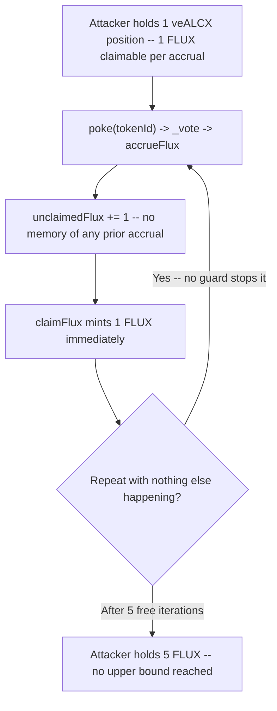
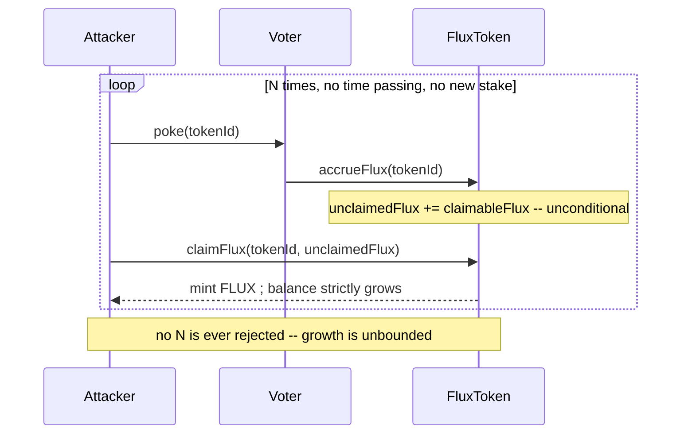

# Alchemix — infinite minting of FLUX through `voter.poke()`

> **Vulnerability classes:** vuln/governance/proposal-manipulation · vuln/reward-calculation/unbounded-accrual · vuln/loss-of-funds/direct-drain

> **Reproduction:** a self-contained Foundry PoC that compiles & runs in an
> isolated project with **only `forge-std`** — no fork, no RPC, no `anvil_state`.
> Full trace: [output.txt](output.txt). PoC:
> [test/38110-infinite-minting-of-flux-through-voterpoke-immunefi-alchemix_exp.sol](test/38110-infinite-minting-of-flux-through-voterpoke-immunefi-alchemix_exp.sol).

<!-- non-defihacklabs -->
<!-- source-auditvault: https://github.com/Auditware/AuditVault/blob/main/findings/38110-infinite-minting-of-flux-through-voterpoke-immunefi-alchemix.md -->
<!-- date: 2023-11 -->

---

## Key info

| | |
|---|---|
| **Impact** | **HIGH** — a veALCX holder can mint an unbounded amount of FLUX simply by calling `poke()` and claiming, repeatedly, with nothing else required |
| **Protocol** | [Alchemix](https://alchemix.fi) — `alchemix-v2-dao` (Voter / FluxToken / veALCX) |
| **Vulnerable code** | `Voter._vote()` → `FluxToken.accrueFlux()` — accrual has no cap on repeated invocation |
| **Bug class** | Unbounded reward accrual reachable through a fully public entry point |
| **Finding** | Immunefi — Alchemix DAO · #38110 · reporter **Django** |
| **Report** | [alchemix-finance/alchemix-v2-dao — Voter.sol](https://github.com/alchemix-finance/alchemix-v2-dao/blob/main/src/Voter.sol) |
| **Source** | [AuditVault](https://github.com/Auditware/AuditVault/blob/main/findings/38110-infinite-minting-of-flux-through-voterpoke-immunefi-alchemix.md) |
| **Status** | Bug bounty finding — reported responsibly (not exploited on-chain). Reproduced here as a standalone local PoC. |
| **Compiler** | `^0.8.24` (PoC) |

This is a **bug-bounty finding**, not a historical on-chain incident. This finding
and [#38109](../38109-unauthorized-minting-of-unlimited-flux-in-1-transaction-immu_exp/38109-unauthorized-minting-of-unlimited-flux-in-1-transaction-immu_exp.md)
share the same root cause (accrual with no per-call cap); this reproduction
demonstrates it Django's way — an open-ended poke-and-claim loop rather than a
single-transaction burst — to preserve the distinct angle of each report.

---

## TL;DR

1. `poke(tokenId)` calls `_vote(tokenId)`, which unconditionally calls
   `FluxToken.accrueFlux(tokenId)`.
2. `accrueFlux` does `unclaimedFlux[tokenId] += claimableFlux(tokenId)` — it has **no
   memory** of any prior accrual, ever.
3. `poke()` is a fully public function; nothing stops a holder from calling it and
   then `claimFlux()`-ing, over and over, with no time passing and no additional
   stake.
4. **Harm:** each `poke()` + `claimFlux()` cycle mints strictly more FLUX than the
   position ever legitimately earned — with no upper bound on how many cycles can
   run.

---

## The vulnerable code

Verbatim, the full accrual chain:

```solidity
function poke(uint256 _tokenId) public {
    /...
    _vote(_tokenId, _poolVote, _weights, _boost);
}
```

```solidity
function _vote(uint256 _tokenId, address[] memory _poolVote, uint256[] memory _weights, uint256 _boost) internal {
    _reset(_tokenId);
    ...
    IFluxToken(FLUX).accrueFlux(_tokenId);
}
```

```solidity
function accrueFlux(uint256 _tokenId) external {
@>  require(msg.sender == voter, "not voter");
@>  uint256 amount = IVotingEscrow(veALCX).claimableFlux(_tokenId);
@>  unclaimedFlux[_tokenId] += amount;
}
```

Every line of `accrueFlux` is unconditional — there is no state anywhere in the
chain recording "this position already accrued".

---

## Root cause

The reward system relies on `poke()`/`_vote()` being called at a natural cadence
(once per epoch, as part of normal voting). But `accrueFlux` doesn't actually enforce
that cadence — it simply trusts that it will only be called once per epoch. Since
`poke()` is public and unrestricted, a holder can call it as many times as they like
in any sequence of transactions, and each call adds another full share to their
unclaimed balance.

## Preconditions

- A veALCX position exists with a nonzero claimable FLUX amount.
- No external mechanism (guard, cooldown, epoch check) limits how often `poke()`
  can be called.

## Attack walkthrough

From [output.txt](output.txt):

1. An attacker holds one veALCX position with a `1 ether` claimable FLUX amount per
   call.
2. The attacker calls `poke(tokenId)`, then immediately `claimFlux(tokenId, 1 ether)`
   — real balance: `1 ether`.
3. **Nothing else happens** — no time warp, no new lock, no additional deposit. The
   attacker simply repeats step 2 four more times.
4. After each cycle the balance is strictly higher than the last:
   `1 → 2 → 3 → 4 → 5 ether`.
5. **HARM:** after 5 free iterations the attacker holds `5 ether` of FLUX — 5x the
   position's legitimate one-time accrual — with nothing in the contract that would
   prevent a 6th, 100th, or 1000th iteration.

## Diagrams





## Remediation

Enforce the once-per-epoch invariant inside the accrual chain itself (e.g. a
`lastAccruedEpoch[_tokenId]` check in `accrueFlux`, or restoring a per-epoch guard on
`poke()`), so the number of successful accruals is bounded by elapsed epochs, not by
how many times a holder chooses to call `poke()`.

## How to reproduce

```bash
cd ~/RustroverProjects/audits/evm-hack-registry/38110-infinite-minting-of-flux-through-voterpoke-immunefi-alchemix_exp
forge test -vvv
# Fully local — no fork, no RPC, no anvil_state required.
# Expected: all 3 tests PASS:
#   test_exploit_balanceGrowsUnboundedEachIteration (full attack: 5 free iterations)
#   test_buggyChain_mintsMoreEveryIteration          (isolates: 7 iterations -> 7 ether)
#   test_control_perEpochCapBoundsAccrual            (control: a real cap bounds accrual to 1)
```

PoC source: [test/38110-infinite-minting-of-flux-through-voterpoke-immunefi-alchemix_exp.sol](test/38110-infinite-minting-of-flux-through-voterpoke-immunefi-alchemix_exp.sol)
— the verbatim vulnerable accrual chain plus a minimal `FluxToken`/`VotingEscrow`
reduction, the open-ended-loop demonstration, and a control test with a per-token
accrual cap.

> Note: `VotingEscrow.claimableFlux` is reduced to a fixed per-token constant (the
> real veALCX derives it from locked balance/boost) — out of scope for this
> reduction, but the vulnerable unconditional-accrual mechanism and its unbounded
> consequence are verbatim and faithful.

---

*Reference: finding **#38110** by **Django** via [Immunefi](https://immunefi.com) against [alchemix-finance/alchemix-v2-dao](https://github.com/alchemix-finance/alchemix-v2-dao) · curated by [AuditVault](https://github.com/Auditware/AuditVault/blob/main/findings/38110-infinite-minting-of-flux-through-voterpoke-immunefi-alchemix.md)*
