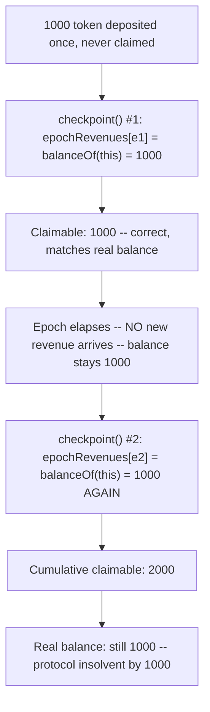
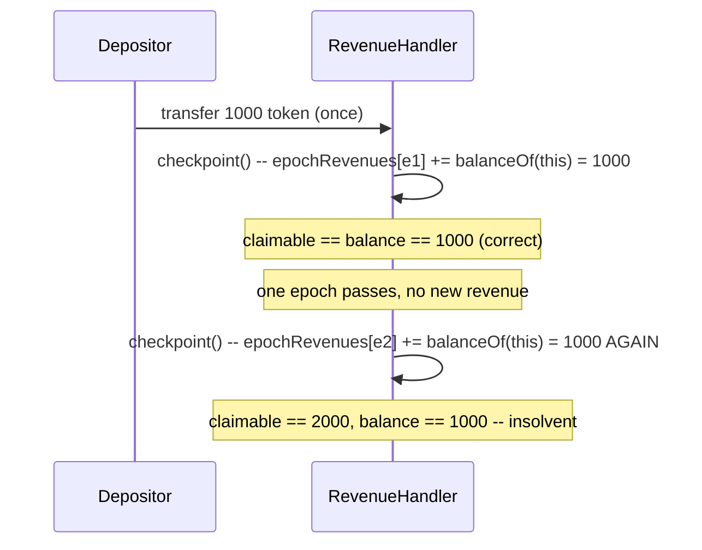

# Alchemix — insolvency in `RevenueHandler.sol` because unclaimed revenue is re-counted

> **Vulnerability classes:** vuln/accounting/double-counting · vuln/frozen-funds/insolvency · vuln/loss-of-funds/direct-drain

> **Reproduction:** a self-contained Foundry PoC that compiles & runs in an
> isolated project with **only `forge-std`** — no fork, no RPC, no `anvil_state`.
> Full trace: [output.txt](output.txt). PoC:
> [test/38111-insolvency-in-revenuehandlersol-because-unclaimed-revenue-is_exp.sol](test/38111-insolvency-in-revenuehandlersol-because-unclaimed-revenue-is_exp.sol).

<!-- non-defihacklabs -->
<!-- source-auditvault: https://github.com/Auditware/AuditVault/blob/main/findings/38111-insolvency-in-revenuehandlersol-because-unclaimed-revenue-is.md -->
<!-- date: 2023-11 -->

---

## Key info

| | |
|---|---|
| **Impact** | **HIGH** — the protocol becomes insolvent: recorded claimable revenue can exceed the contract's real token balance simply because nobody claimed it in time |
| **Protocol** | [Alchemix](https://alchemix.fi) — `alchemix-v2-dao` (`RevenueHandler.sol`) |
| **Vulnerable code** | `RevenueHandler.checkpoint()` — the non-alchemic-token revenue accounting branch |
| **Bug class** | Double-counting: a running balance is mistaken for newly-arrived revenue |
| **Finding** | Immunefi — Alchemix DAO · #38111 · reporter **Django** |
| **Report** | [alchemix-finance/alchemix-v2-dao — RevenueHandler.sol](https://github.com/alchemix-finance/alchemix-v2-dao/blob/main/src/RevenueHandler.sol) |
| **Source** | [AuditVault](https://github.com/Auditware/AuditVault/blob/main/findings/38111-insolvency-in-revenuehandlersol-because-unclaimed-revenue-is.md) |
| **Status** | Bug bounty finding — reported responsibly (not exploited on-chain). Reproduced here as a standalone local PoC. |
| **Compiler** | `^0.8.24` (PoC) |

This is a **bug-bounty finding**, not a historical on-chain incident. This finding
and [#38174](../38174-revenuehandlercheckpoint-isnt-correctly-immunefi-alchemix-gi_exp/38174-revenuehandlercheckpoint-isnt-correctly-immunefi-alchemix-gi_exp.md)
were reported independently against the exact same vulnerable line — this
reproduction demonstrates it Django's way (a two-checkpoint insolvency check).

---

## TL;DR

1. `RevenueHandler.checkpoint()` runs once per epoch, reads the contract's **current
   token balance**, and records it as this epoch's revenue.
2. For non-alchemic-tokens: `amountReceived = thisBalance;
   epochRevenues[currentEpoch][token] += amountReceived;` — the FULL current balance,
   unconditionally.
3. If a prior epoch's revenue was recorded but **never claimed**, it is still sitting
   in the contract's balance — and the next `checkpoint()` counts it **again**, as if
   it just arrived.
4. **Harm:** with `1000 token` deposited once and never claimed, two checkpoints
   (with no new revenue) push total claimable revenue to `2000 token` — the contract
   only holds `1000`. The protocol is insolvent by exactly the double-counted amount.

---

## The vulnerable code

Verbatim, `RevenueHandler.checkpoint`:

```solidity
function checkpoint() public {
    // only run checkpoint() once per epoch
    if (block.timestamp >= currentEpoch + WEEK /* && initializer == address(0) */) {
        currentEpoch = (block.timestamp / WEEK) * WEEK;
        ...
        uint256 thisBalance = IERC20(token).balanceOf(address(this));

        // If poolAdapter is set, the revenue token is an alchemic-token
        if (tokenConfig.poolAdapter != address(0)) {
            ...
        } else {
            // If the revenue token doesn't have a poolAdapter, it is not an alchemic-token
@>          amountReceived = thisBalance;
            // Update amount of non-alchemic-token revenue received for this epoch
@>          epochRevenues[currentEpoch][token] += amountReceived;
        }
    }
}
```

And `claimable()`, which sums these (already double-counted) per-epoch totals:

```solidity
uint256 epochRevenue = epochRevenues[epochTimestamp][token];
uint256 epochUserVeBalance = IVotingEscrow(veALCX).balanceOfTokenAt(tokenId, epochTimestamp);
totalClaimable += (epochRevenue * epochUserVeBalance) / epochTotalVeSupply;
```

---

## Root cause

`checkpoint()` is supposed to record only the revenue that **arrived** since the last
checkpoint. Instead, for tokens without a pool adapter, it treats the contract's
**entire current balance** as new revenue. Any revenue from a prior epoch that
hasn't been claimed yet is still part of that balance, so it gets attributed to the
new epoch as well — every unclaimed epoch's revenue keeps getting re-added on top of
itself, forever, until someone claims it.

## Preconditions

- At least one epoch's revenue has been checkpointed and left (even partially)
  unclaimed by the time the next `checkpoint()` runs — the normal case, since
  claiming is user-initiated and epochs advance automatically.

## Attack walkthrough

From [output.txt](output.txt):

1. `1000 token` of revenue is deposited into `RevenueHandler` once.
2. `checkpoint()` runs: `epochRevenues[epoch1][token] = 1000`. Claimable: `1000`
   (correct — matches the real balance).
3. An epoch elapses. **No new revenue arrives.** The contract's balance is still
   exactly `1000 token` (nothing was claimed, nothing new was deposited).
4. `checkpoint()` runs again: `thisBalance` is still `1000`, and it gets added AGAIN:
   `epochRevenues[epoch2][token] = 1000`. Cumulative claimable: `2000`.
5. **HARM:** claimable revenue (`2000`) now exceeds the contract's real balance
   (`1000`) — the protocol is insolvent by exactly the re-counted amount. The first
   users to claim get paid in full; the rest find nothing left.

## Diagrams





## Remediation

Track the balance already accounted for (`lastCheckpointedBalance[token]`) and only
record the **delta** — `thisBalance - lastCheckpointedBalance[token]` — as new
revenue, then update `lastCheckpointedBalance[token] = thisBalance` after each
checkpoint.

## How to reproduce

```bash
cd ~/RustroverProjects/audits/evm-hack-registry/38111-insolvency-in-revenuehandlersol-because-unclaimed-revenue-is_exp
forge test -vvv
# Fully local — no fork, no RPC, no anvil_state required.
# Expected: all 3 tests PASS:
#   test_exploit_claimableExceedsBalance          (full attack: claimable > balance)
#   test_buggyHandler_tripleCountsUnclaimedRevenue (isolates: 3 checkpoints -> 1000,2000,3000)
#   test_control_fixedHandler_doesNotDoubleCount   (control: delta-tracking fix holds steady)
```

PoC source: [test/38111-insolvency-in-revenuehandlersol-because-unclaimed-revenue-is_exp.sol](test/38111-insolvency-in-revenuehandlersol-because-unclaimed-revenue-is_exp.sol)
— the verbatim vulnerable accounting plus a minimal `RevenueHandler` reduction, the
insolvency demonstration, and a control test with delta-tracking restored.

> Note: `claimable()` is reduced to a single-holder-owns-100%-of-supply model (the
> real veALCX derives a proportional share per epoch) and the once-per-epoch guard
> is driven by an explicit scaffold flag rather than real `block.timestamp`/`WEEK`
> arithmetic (no time-warp cheatcodes) — out of scope for this reduction, but the
> vulnerable re-counting of `thisBalance` and its insolvency consequence are
> verbatim and faithful.

---

*Reference: finding **#38111** by **Django** via [Immunefi](https://immunefi.com) against [alchemix-finance/alchemix-v2-dao](https://github.com/alchemix-finance/alchemix-v2-dao) · curated by [AuditVault](https://github.com/Auditware/AuditVault/blob/main/findings/38111-insolvency-in-revenuehandlersol-because-unclaimed-revenue-is.md)*
