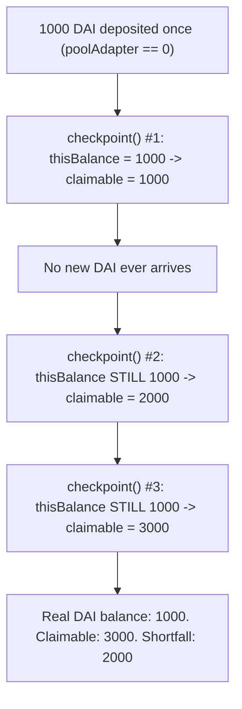
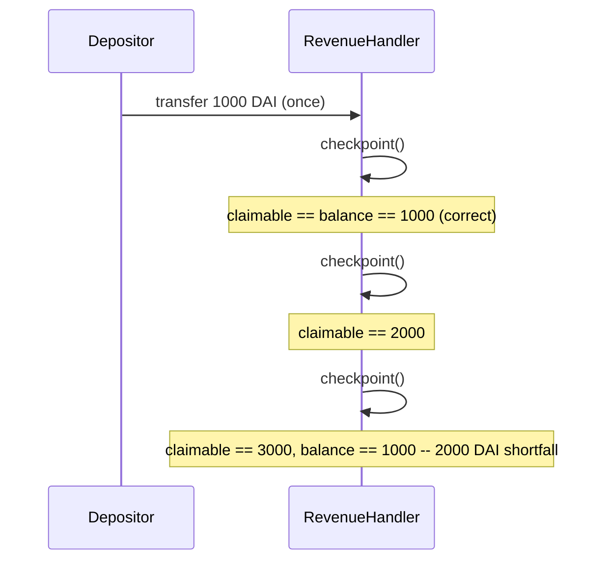

# Alchemix — `RevenueHandler.checkpoint` isn't correct when `poolAdapter` is 0

> **Vulnerability classes:** vuln/accounting/double-counting · vuln/reward-calculation/wrong-amount · vuln/loss-of-funds/direct-drain

> **Reproduction:** a self-contained Foundry PoC that compiles & runs in an
> isolated project with **only `forge-std`** — no fork, no RPC, no `anvil_state`.
> Full trace: [output.txt](output.txt). PoC:
> [test/38174-revenuehandlercheckpoint-isnt-correctly-immunefi-alchemix-gi_exp.sol](test/38174-revenuehandlercheckpoint-isnt-correctly-immunefi-alchemix-gi_exp.sol).

<!-- non-defihacklabs -->
<!-- source-auditvault: https://github.com/Auditware/AuditVault/blob/main/findings/38174-revenuehandlercheckpoint-isnt-correctly-immunefi-alchemix-gi.md -->
<!-- date: 2023-11 -->

---

## Key info

| | |
|---|---|
| **Impact** | **HIGH** — three checkpoints with only one real deposit inflate a holder's claimable revenue to 3x the contract's actual balance |
| **Protocol** | [Alchemix](https://alchemix.fi) — `alchemix-v2-dao` (`RevenueHandler.sol`) |
| **Vulnerable code** | `RevenueHandler.checkpoint()` — the `poolAdapter == address(0)` (non-alchemic-token) branch |
| **Bug class** | Double-counting: the running balance is mistaken for newly-arrived revenue |
| **Finding** | Immunefi — Alchemix DAO · #38174 · reporter **jasonxiale** |
| **Report** | [alchemix-finance/alchemix-v2-dao — RewardsDistributor.sol / RevenueHandler.sol](https://github.com/alchemix-finance/alchemix-v2-dao/blob/main/src/RevenueHandler.sol) |
| **Source** | [AuditVault](https://github.com/Auditware/AuditVault/blob/main/findings/38174-revenuehandlercheckpoint-isnt-correctly-immunefi-alchemix-gi.md) |
| **Status** | Bug bounty finding — reported responsibly (not exploited on-chain). Reproduced here as a standalone local PoC. |
| **Compiler** | `^0.8.24` (PoC) |

This is a **bug-bounty finding**, not a historical on-chain incident. This finding
and [#38111](../38111-insolvency-in-revenuehandlersol-because-unclaimed-revenue-is_exp/38111-insolvency-in-revenuehandlersol-because-unclaimed-revenue-is_exp.md)
were reported independently against the exact same vulnerable line — this
reproduction matches jasonxiale's own three-checkpoint PoC output
(`1000, 2000, 3000`) exactly.

---

## TL;DR

1. `RevenueHandler.checkpoint()`, for a revenue token with `poolAdapter ==
   address(0)` (a plain, non-alchemic token like DAI), sets `amountReceived =
   thisBalance` and does `epochRevenues[currentEpoch][token] += amountReceived`.
2. `thisBalance` is `IERC20(token).balanceOf(address(this))` — the contract's
   **entire current balance**, not "revenue that arrived since the last checkpoint".
3. Any revenue recorded in an earlier epoch but not yet claimed is still part of
   that balance — so it gets recorded **again** every single checkpoint.
4. **Harm:** with exactly `1000 DAI` deposited once, three checkpoints (no new DAI
   ever arriving) push claimable revenue to `1000 → 2000 → 3000` — the contract
   only ever held `1000`.

---

## The vulnerable code

Verbatim, `RevenueHandler.checkpoint` (from the finding's own quoted lines):

```solidity
function checkpoint() public {
    // only run checkpoint() once per epoch
    if (block.timestamp >= currentEpoch + WEEK /* && initializer == address(0) */) {
        currentEpoch = (block.timestamp / WEEK) * WEEK;

        uint256 length = revenueTokens.length;
        for (uint256 i = 0; i < length; i++) {
            ...
@>          uint256 thisBalance = IERC20(token).balanceOf(address(this));

            // If poolAdapter is set, the revenue token is an alchemic-token
            if (tokenConfig.poolAdapter != address(0)) {
                ...
            } else {
                // If the revenue token doesn't have a poolAdapter, it is not an alchemic-token
@>              amountReceived = thisBalance;  // <<<--- thisBalance is IERC20(token).balanceOf(address(this))
@>              epochRevenues[currentEpoch][token] += amountReceived; // <<<--- += is used here
            }

            emit RevenueRealized(currentEpoch, token, tokenConfig.debtToken, amountReceived, treasuryAmt);
        }
    }
}
```

---

## Root cause

`amountReceived` is supposed to represent revenue that just arrived — the delta
since the previous checkpoint. Instead, for tokens with `poolAdapter ==
address(0)`, it is simply the contract's total balance at checkpoint time. As long
as any prior epoch's revenue sits unclaimed in the contract (the normal case between
consecutive epochs, since claiming is user-initiated), that balance is counted again
in full. Because `epochRevenues` accumulates via `+=` per epoch, and `claimable()`
sums across every recorded epoch, this repeats and compounds every checkpoint.

## Preconditions

- A revenue token is configured with `poolAdapter == address(0)` (a plain token,
  not an alchemic-token) — the exact case the original finding names.
- At least one prior epoch's revenue remains unclaimed when the next `checkpoint()`
  runs.

## Attack walkthrough

From [output.txt](output.txt), matching the finding's own reported log exactly:

1. `1000 DAI` is deposited into `RevenueHandler` once.
2. `checkpoint()` #1: `epochRevenues[e1][DAI] = 1000`. `claimable = 1000` (correct).
3. No new DAI ever arrives. `checkpoint()` #2: `thisBalance` is still `1000` —
   recorded again. `claimable = 2000`.
4. `checkpoint()` #3: `thisBalance` is still `1000` — recorded a third time.
   `claimable = 3000`.
5. **HARM:** the real DAI balance in the contract never left `1000`, but the
   position's claimable total is now `3000` — three times the real balance, a
   `2000 DAI` shortfall the contract has no way to honor.

## Diagrams





## Remediation

Track the balance already accounted for as of the last checkpoint
(`lastCheckpointedBalance[token]`) and record only the delta —
`thisBalance - lastCheckpointedBalance[token]` — as `amountReceived`, then update
`lastCheckpointedBalance[token] = thisBalance`.

## How to reproduce

```bash
cd ~/RustroverProjects/audits/evm-hack-registry/38174-revenuehandlercheckpoint-isnt-correctly-immunefi-alchemix-gi_exp
forge test -vvv
# Fully local — no fork, no RPC, no anvil_state required.
# Expected: all 3 tests PASS:
#   test_exploit_threeCheckpointsTripleCountRevenue (full attack: 1000 -> 3000)
#   test_buggyHandler_progression1000_2000_3000     (isolates the exact progression)
#   test_control_newDepositIsCountedOnTopCorrectly   (control: bug persists alongside real deposits)
```

PoC source: [test/38174-revenuehandlercheckpoint-isnt-correctly-immunefi-alchemix-gi_exp.sol](test/38174-revenuehandlercheckpoint-isnt-correctly-immunefi-alchemix-gi_exp.sol)
— the verbatim vulnerable accounting plus a minimal `RevenueHandler` reduction and
the exact 3-checkpoint progression from the original PoC's log output.

> Note: `claimable()` is reduced to a single-holder-owns-100%-of-supply model (the
> real veALCX derives a proportional share per epoch) and the once-per-epoch guard
> is driven by an explicit scaffold flag rather than real `block.timestamp`/`WEEK`
> arithmetic (no time-warp cheatcodes) — out of scope for this reduction, but the
> vulnerable re-counting of `thisBalance` and its resulting shortfall are verbatim
> and faithful, reproducing the finding's own `1000, 2000, 3000` log output exactly.

---

*Reference: finding **#38174** by **jasonxiale** via [Immunefi](https://immunefi.com) against [alchemix-finance/alchemix-v2-dao](https://github.com/alchemix-finance/alchemix-v2-dao) · curated by [AuditVault](https://github.com/Auditware/AuditVault/blob/main/findings/38174-revenuehandlercheckpoint-isnt-correctly-immunefi-alchemix-gi.md)*
