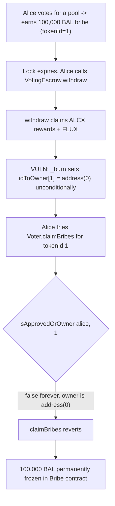
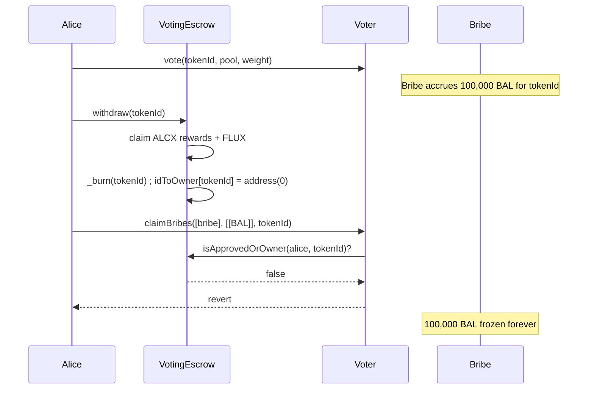

# Alchemix — loss of unclaimed bribes after burning a veALCX token

> **Vulnerability classes:** vuln/access-control/ownership-check-after-burn · vuln/logic/missing-forced-claim · vuln/dos/frozen-funds

> **Reproduction:** a self-contained Foundry PoC that compiles & runs in an
> isolated project with **only `forge-std`** — no fork, no RPC, no `anvil_state`.
> Full trace: [output.txt](output.txt). PoC:
> [test/38175-loss-of-unclaimed-bribes-after-burning-vealcx-token-immunefi_exp.sol](test/38175-loss-of-unclaimed-bribes-after-burning-vealcx-token-immunefi_exp.sol).

<!-- non-defihacklabs -->
<!-- source-auditvault: https://github.com/Auditware/AuditVault/blob/main/findings/38175-loss-of-unclaimed-bribes-after-burning-vealcx-token-immunefi.md -->
<!-- date: 2023-11 -->

**AuditVault taxonomy:** `lang/solidity` · `sector/governance` · `platform/immunefi` · `has/github` · `has/poc` · `severity/high` · genome: `frozen-funds` · `use-reentrancy-guard` · `reward-theft` · `reward-accounting` · `timestamp-dependence` · `circuit-input-range-check`

---

## Key info

| | |
|---|---|
| **Impact** | **HIGH** — permanent freezing of unclaimed yield: any veALCX holder who has voted and earned third-party bribes loses access to those bribes the moment they withdraw their expired lock |
| **Protocol** | [Alchemix V2 DAO](https://github.com/alchemix-finance/alchemix-v2-dao) — `VotingEscrow.sol` (veALCX lock/withdraw) + `Voter.sol` (bribe claims) |
| **Vulnerable code** | `VotingEscrow.withdraw(uint256 _tokenId)` — burns the token via `_burn` without first ensuring any earned bribes are claimed |
| **Bug class** | Ownership-gated claim function whose gate becomes permanently unsatisfiable after an unrelated state transition (burn) |
| **Finding** | Immunefi — Alchemix, finding #38175 · reporter **Limbooo** |
| **Report** | N/A (Immunefi bug bounty; no public report URL provided by the source) |
| **Source** | [AuditVault](https://github.com/Auditware/AuditVault/blob/main/findings/38175-loss-of-unclaimed-bribes-after-burning-vealcx-token-immunefi.md) |
| **Status** | Bug-bounty finding — caught before exploitation. Reproduced here as a standalone local PoC. |
| **Compiler** | `^0.8.24` (PoC) |

This is a **bug-bounty finding**, not a historical on-chain incident. The real
`VotingEscrow.withdraw()` also claims unclaimed ALCX rewards and FLUX before
burning — those paths are orthogonal to this bug and are omitted from the
reduction; what's preserved verbatim is the unconditional burn and the
ownership gate in the bribe-claim path that the burn permanently breaks.

---

## TL;DR

1. A veALCX holder votes for a pool through `Voter.vote()`. The pool's `Bribe`
   contract earns them third-party reward tokens (e.g. BAL) for that epoch.
2. When the lock expires, the holder calls `VotingEscrow.withdraw(tokenId)`.
   `withdraw()` claims unclaimed ALCX rewards and FLUX, then unconditionally
   burns the token (`_burn` → `idToOwner[tokenId] = address(0)`).
3. `Voter.claimBribes()` requires `IVotingEscrow(veALCX).isApprovedOrOwner(msg.sender, _tokenId)`.
   Once the token is burned, `idToOwner[tokenId]` is `address(0)` forever — no
   address can ever satisfy that check again for this `tokenId`.
4. **HARM:** any bribe the holder earned but had not yet claimed before
   withdrawing is frozen in the `Bribe` contract permanently, with no recovery
   path for the holder or anyone else.

---

## The vulnerable code

`VotingEscrow.sol` (verbatim, from the finding):

```solidity
src/VotingEscrow.sol:
  741:     function withdraw(uint256 _tokenId) public nonreentrant {
..SNIP..
@>767:         // Claim any unclaimed ALCX rewards and FLUX
  768:         IRewardsDistributor(distributor).claim(_tokenId, false);
  769:         IFluxToken(FLUX).claimFlux(_tokenId, IFluxToken(FLUX).getUnclaimedFlux(_tokenId));
  770:
  771:         // Burn the token
@>772:         _burn(_tokenId, value);
  773:
  774:         emit Withdraw(msg.sender, _tokenId, value, block.timestamp);
  775:     }
..SNIP..
  1558:     function _burn(uint256 _tokenId, uint256 _value) internal {
  1559:         address owner = ownerOf(_tokenId);
..SNIP..
  1570:         // Remove token
@>1571:         _removeTokenFrom(owner, _tokenId);
  1572:         emit Transfer(owner, address(0), _tokenId);
  1573:         emit Supply(supplyBefore, supplyAfter);
  1574:     }
```

`Voter.sol` (verbatim, from the finding) — the gate that becomes
unsatisfiable after the burn above:

```solidity
src/Voter.sol:
  332:     function claimBribes(address[] memory _bribes, address[][] memory _tokens, uint256 _tokenId) external {
@>333:         require(IVotingEscrow(veALCX).isApprovedOrOwner(msg.sender, _tokenId));
  334:
  335:         for (uint256 i = 0; i < _bribes.length; i++) {
  336:             IBribe(_bribes[i]).getRewardForOwner(_tokenId, _tokens[i]);
  337:         }
  338:     }
```

In the PoC synthetic, the same interaction is preserved as:

```solidity
// @> VULN: the token is burned unconditionally, with no check for
//          outstanding bribe rewards earned via Voter voting. Once
//          idToOwner[tokenId] becomes address(0), Voter::claimBribes's
//          ownership check can never pass again for this tokenId.
idToOwner[tokenId] = address(0);
// FIX: require bribes are claimed first (or force-claim them here),
//      e.g. `voter.claimBribes(allBribesFor(tokenId), tokenId);` before burn.
```

---

## Root cause

`withdraw()` treats "claim what's owed" and "burn the token" as if they cover
the same set of rewards — it explicitly claims ALCX and FLUX first, showing
the developers were aware unclaimed rewards must be settled before burn. But
bribes earned via `Voter` voting live in a *separate* accounting system
(`Bribe` contracts keyed by `tokenId`) that `withdraw()` never touches. Since
`claimBribes()`'s only authorization is "current owner of `tokenId`," and
burning sets the owner to `address(0)` irreversibly, any bribe not claimed
strictly before the `withdraw()` call is lost forever.

## Preconditions

- The holder has voted for at least one pool with an active third-party
  bribe, and has not yet claimed that bribe.
- The holder's lock has expired and cooldown (where applicable) has elapsed,
  making `withdraw()` callable.
- The holder calls `withdraw()` without first calling `Voter.claimBribes()`
  for every bribe contract they have exposure to — an easy step to miss since
  nothing in `withdraw()` warns about it or blocks the call.

## Attack walkthrough

From the PoC:

1. Alice's veALCX position (`tokenId = 1`) has an outstanding 100,000 BAL
   bribe earned from a prior epoch's vote, held in a `Bribe` contract.
   `bribe.earned(1) == 100_000e18` and Alice still owns the token.
2. Alice calls `VotingEscrow.withdraw(1)`. The (real) function claims her
   ALCX rewards and FLUX, then burns the token: `idToOwner[1] = address(0)`.
3. Alice is no longer the token's owner — `isApprovedOrOwner(alice, 1)` is
   now `false`, permanently.
4. **HARM:** Alice calls `Bribe.getRewardForOwner(1, alice)` (the reduction of
   `Voter.claimBribes`'s ownership-gated path). It reverts. The 100,000 BAL
   remains stuck in the `Bribe` contract — nobody can ever pass the ownership
   check for `tokenId = 1` again. A control test confirms claiming the bribe
   **before** withdrawing works perfectly, isolating the bug to ordering, not
   to the bribe mechanism itself.

## Diagrams





## Impact

The 100,000 BAL bribe is neither stolen by an attacker nor recoverable by the
protocol — it is simply **frozen forever** in the `Bribe` contract, inflating
that contract's balance with dead weight and permanently denying the rightful
earner their reward. Any veALCX holder who forgets (or isn't aware) to claim
outstanding bribes before withdrawing suffers this loss; there is no recovery
path short of a contract upgrade or emergency bribe-contract migration.

## Remediation

Per the finding's suggested mitigations, any of the following close the gap:

1. **Block withdrawal while bribes are unclaimed** — `withdraw()` checks (via
   the relevant `Bribe`/`Voter` state) that no outstanding bribe exists for
   `_tokenId` before burning.
2. **Force-claim bribes during withdraw** — mirror the existing ALCX/FLUX
   claim calls with a bribe claim across every bribe contract the token has
   voted for, before `_burn`.
3. Restructure `claimBribes`'s authorization so a bribe earned by a since-
   burned `tokenId` remains claimable by its last known owner (weaker
   mitigation; the report notes this could complicate other invariants).

## How to reproduce

```bash
cd ~/RustroverProjects/audits/evm-hack-registry/38175-loss-of-unclaimed-bribes-after-burning-vealcx-token-immunefi_exp
forge test -vvv
# Fully local — no fork, no RPC, no anvil_state required.
# Expected: both tests PASS:
#   test_exploit_bribesFrozenAfterBurn     (100k BAL frozen after burn)
#   test_control_claimBeforeWithdrawSucceeds (control: claim-then-withdraw is safe)
```

PoC source: [test/38175-loss-of-unclaimed-bribes-after-burning-vealcx-token-immunefi_exp.sol](test/38175-loss-of-unclaimed-bribes-after-burning-vealcx-token-immunefi_exp.sol)
— the verbatim burn-without-bribe-claim interaction, reduced `VotingEscrow`/
`Bribe` mocks, and a control test isolating claim-order as the root cause.

> Note: `IRewardsDistributor.claim` and `IFluxToken.claimFlux` (the ALCX/FLUX
> claim paths inside the real `withdraw()`) are omitted — they are unaffected
> by this bug and their absence does not change the demonstrated harm. The
> ownership-gated burn interaction between `VotingEscrow` and the bribe claim
> path is faithful to the finding.

---

*Reference: finding **#38175** by **Limbooo** (Immunefi) on [Alchemix V2 DAO](https://github.com/alchemix-finance/alchemix-v2-dao/blob/f1007439ad3a32e412468c4c42f62f676822dc1f/src/VotingEscrow.sol) · curated by [AuditVault](https://github.com/Auditware/AuditVault/blob/main/findings/38175-loss-of-unclaimed-bribes-after-burning-vealcx-token-immunefi.md)*
