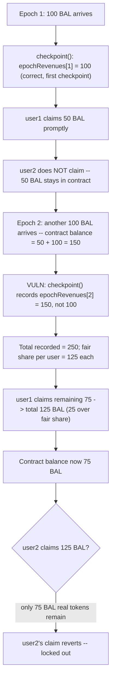
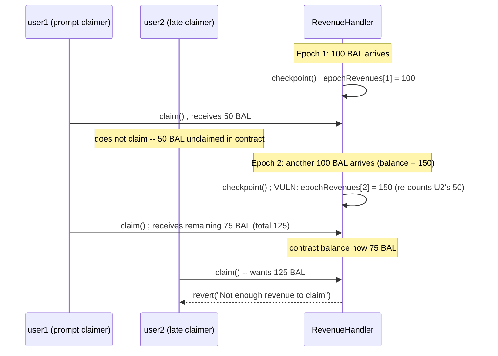

# Alchemix — `RevenueHandler.checkpoint` counts unclaimed rewards as new rewards

> **Vulnerability classes:** vuln/logic/reward-calculation · vuln/accounting/double-counting · vuln/insolvency/late-claimer-lockout

> **Reproduction:** a self-contained Foundry PoC that compiles & runs in an
> isolated project with **only `forge-std`** — no fork, no RPC, no `anvil_state`.
> Full trace: [output.txt](output.txt). PoC:
> [test/38176-revenuehandlercheckpoint-counts-unclaimed-rewards-as-new-rew_exp.sol](test/38176-revenuehandlercheckpoint-counts-unclaimed-rewards-as-new-rew_exp.sol).

<!-- non-defihacklabs -->
<!-- source-auditvault: https://github.com/Auditware/AuditVault/blob/main/findings/38176-revenuehandlercheckpoint-counts-unclaimed-rewards-as-new-rew.md -->
<!-- date: 2023-11 -->

**AuditVault taxonomy:** `lang/solidity` · `sector/governance` · `sector/lending` · `platform/immunefi` · `has/github` · `has/poc` · `severity/high` · `vuln/logic/reward-calculation` · `novelty/variant` · `misassumption/math-is-safe` · `fix/fix-arithmetic` · genome: `reward-calculation` · `variant` · `direct-drain` · `reward-accounting` · `timestamp-dependence`

---

## Key info

| | |
|---|---|
| **Impact** | **HIGH** — theft of unclaimed yield: prompt claimers over-claim at the expense of late claimers, who can end up permanently locked out once the contract runs out of real tokens |
| **Protocol** | [Alchemix V2 DAO](https://github.com/alchemix-finance/alchemix-v2-dao) — `RevenueHandler.sol` (epoch revenue accounting / claims) |
| **Vulnerable code** | `RevenueHandler.checkpoint()` — the `poolAdapter == address(0)` (non-alchemic-token) branch |
| **Bug class** | Using the contract's raw current balance as "newly arrived revenue" instead of the balance delta since the last checkpoint |
| **Finding** | Immunefi — Alchemix, finding #38176 · reporter **yttriumzz** |
| **Report** | N/A (Immunefi bug bounty; no public report URL provided by the source) |
| **Source** | [AuditVault](https://github.com/Auditware/AuditVault/blob/main/findings/38176-revenuehandlercheckpoint-counts-unclaimed-rewards-as-new-rew.md) |
| **Status** | Bug-bounty finding — caught before exploitation. Reproduced here as a standalone local PoC. |
| **Compiler** | `^0.8.24` (PoC) |

This is a **bug-bounty finding**, not a historical on-chain incident. It
shares its root cause with two companion findings (#38111 and #38174 in this
registry), each reported independently by a different Immunefi researcher.
This reduction models a two-user, unequal-claim-timing scenario — closer to
this finding's own PoC (which uses two users and shows one user's claim
`revert`ing) — rather than the single-holder progression used for the
companion findings, keeping all three write-ups distinct.

---

## TL;DR

1. `RevenueHandler.checkpoint()` runs once per epoch and, for a revenue token
   with no `poolAdapter` set, records `amountReceived = thisBalance` where
   `thisBalance = IERC20(token).balanceOf(address(this))` — the contract's
   **entire current balance**.
2. That balance still contains any revenue recorded in a **previous** epoch
   that a user has not yet claimed. `checkpoint()` has no memory of what was
   already accounted for, so it re-adds the unclaimed balance as if it just
   arrived.
3. Two equal-weight users (50/50 split) share a revenue stream. User1 claims
   promptly after every checkpoint; user2 does not. Because user2's unclaimed
   share gets re-counted, user1 ends up over-claiming relative to their fair
   share.
4. **HARM:** after only 200 BAL was ever transferred in across 2 epochs (100
   BAL/epoch — a fair 100 BAL per user), user1 walks away with 125 BAL while
   user2's equal, on-paper-correct 125 BAL claim **reverts** — only 75 BAL of
   real tokens remain in the contract.

---

## The vulnerable code

`RevenueHandler.sol` (verbatim, from the finding):

```solidity
///// https://github.com/alchemix-finance/alchemix-v2-dao/blob/f1007439ad3a32e412468c4c42f62f676822dc1f/src/RevenueHandler.sol#L245-L264
                uint256 thisBalance = IERC20(token).balanceOf(address(this));

                // If poolAdapter is set, the revenue token is an alchemic-token
                if (tokenConfig.poolAdapter != address(0)) {
                    // Treasury only receives revenue if the token is an alchemic-token
                    treasuryAmt = (thisBalance * treasuryPct) / BPS;
                    IERC20(token).safeTransfer(treasury, treasuryAmt);

                    // Only melt if there is an alchemic-token to melt to
                    amountReceived = _melt(token);

                    // Update amount of alchemic-token revenue received for this epoch
                    epochRevenues[currentEpoch][tokenConfig.debtToken] += amountReceived;
                } else {
                    // If the revenue token doesn't have a poolAdapter, it is not an alchemic-token
                    amountReceived = thisBalance;

                    // Update amount of non-alchemic-token revenue received for this epoch
                    epochRevenues[currentEpoch][token] += amountReceived;
                }
```

In the PoC synthetic, the same interaction is preserved verbatim:

```solidity
uint256 thisBalance = BAL_TOKEN.balanceOf(address(this));

// poolAdapter == address(0): the revenue token is not an alchemic-token
uint256 amountReceived = thisBalance;

// @> VULN: thisBalance is the WHOLE current balance -- it still contains
//          any revenue recorded (but unclaimed) by users who haven't
//          claimed yet, so it gets recorded AGAIN as if freshly-arrived.
epochRevenues[currentEpoch] += amountReceived;
// FIX: amountReceived = thisBalance - lastCheckpointedBalance; lastCheckpointedBalance = thisBalance;
```

---

## Root cause

`checkpoint()` treats the contract's **absolute token balance** as
synonymous with **"revenue received this epoch."** Those are only the same
thing if the contract is drained to zero between every checkpoint — i.e.,
if every user claims every epoch, without exception. The moment any single
user leaves their share unclaimed even once, that leftover balance is
silently folded into the next epoch's "new" revenue, permanently inflating
the sum of everyone's `claimable()` balances beyond what the contract
actually holds.

## Preconditions

- At least one revenue token is configured with `poolAdapter == address(0)`
  (a non-alchemic-token, e.g. a raw BAL/BPT revenue stream).
- `checkpoint()` is called at least twice, with at least one user leaving
  revenue unclaimed between those two calls.
- Users other than the one who left revenue unclaimed continue to claim
  normally — this is what lets them "absorb" the double-counted amount.

## Attack walkthrough

From the PoC (two equal-weight, 50/50-split users):

1. **Epoch 1:** 100 BAL arrives; `checkpoint()` correctly records
   `epochRevenues[1] = 100 BAL` (this is the first-ever checkpoint, so there
   is no prior unclaimed balance to double-count). user1 claims promptly
   (50 BAL, their fair share). user2 does **not** claim — their 50 BAL share
   stays in the contract.
2. **Epoch 2:** another 100 BAL arrives. The contract's balance is now
   50 (user2's unclaimed epoch-1 share) + 100 (new) = 150 BAL.
3. **VULN:** `checkpoint()` records `epochRevenues[2] = 150 BAL` — the whole
   balance, not the 100 BAL that actually arrived this epoch.
4. Total ever recorded across both epochs: 100 + 150 = 250 BAL. Fair share
   per user: 125 BAL each — but only 200 BAL was **ever** transferred in.
5. **HARM:** user1 claims their full 125 BAL (25 BAL more than their true
   100 BAL fair share for 2 epochs). Only 75 BAL of real tokens remain.
   user2's equal 125 BAL claim **reverts** — insufficient balance — locking
   them out entirely, exactly matching the finding's own PoC output
   (`"claimable of user2 is 125000000000000000000, but revert"`).

## Diagrams





## Impact

Only 200 BAL was ever deposited into `RevenueHandler` across 2 epochs — a
fair 100 BAL per user. Due to the double-count, user1 (who happened to claim
promptly) receives 125 BAL — 25% more than their fair share — while user2
(who claimed late, through no fault beyond normal timing) is left with a
claim the contract cannot honor. The excess isn't created from nothing: it
is extracted directly from the pool of tokens that should have gone to
slower claimers, and scales with every epoch that passes without every
single holder claiming.

## Remediation

Per the finding's suggested fix: **record the balance delta, not the raw
balance**, as revenue:

```diff
- amountReceived = thisBalance;
- epochRevenues[currentEpoch][token] += amountReceived;
+ amountReceived = thisBalance - lastCheckpointedBalance[token];
+ lastCheckpointedBalance[token] = thisBalance;
+ epochRevenues[currentEpoch][token] += amountReceived;
```

This ensures `checkpoint()` only ever records genuinely new inflows,
regardless of how many users have left prior revenue unclaimed.

## How to reproduce

```bash
cd ~/RustroverProjects/audits/evm-hack-registry/38176-revenuehandlercheckpoint-counts-unclaimed-rewards-as-new-rew_exp
forge test -vvv
# Fully local — no fork, no RPC, no anvil_state required.
# Expected: all three tests PASS:
#   test_exploit_lateClaimerLosesToDoubleCount        (user1 over-claims, user2 locked out)
#   test_buggyHandler_totalRecordedExceedsRealBalance (books exceed real balance across 2 checkpoints)
#   test_control_promptClaimingByBothUsersIsCorrect   (control: no unclaimed carry-over, accounting is correct)
```

PoC source: [test/38176-revenuehandlercheckpoint-counts-unclaimed-rewards-as-new-rew_exp.sol](test/38176-revenuehandlercheckpoint-counts-unclaimed-rewards-as-new-rew_exp.sol)
— the verbatim double-count accounting line, a reduced two-user `RevenueHandler`
model, and a control test isolating "unclaimed carry-over" as the trigger.

> Note: `advanceEpoch()` is test scaffolding standing in for the real
> `block.timestamp >= currentEpoch + WEEK` once-per-epoch guard, since the
> browser Playground's synthetic runs cheatcode-free (no `vm.warp`). This
> affects only the epoch-gating mechanism; the vulnerable accounting line
> itself is untouched and verbatim. This finding shares its root cause with
> companion findings #38111 and #38174 in this registry (reported
> independently by different researchers) — kept as distinct findings here,
> matching how Immunefi/AuditVault records them.

---

*Reference: finding **#38176** by **yttriumzz** (Immunefi) on [Alchemix V2 DAO](https://github.com/alchemix-finance/alchemix-v2-dao/blob/f1007439ad3a32e412468c4c42f62f676822dc1f/src/RevenueHandler.sol) · curated by [AuditVault](https://github.com/Auditware/AuditVault/blob/main/findings/38176-revenuehandlercheckpoint-counts-unclaimed-rewards-as-new-rew.md)*
