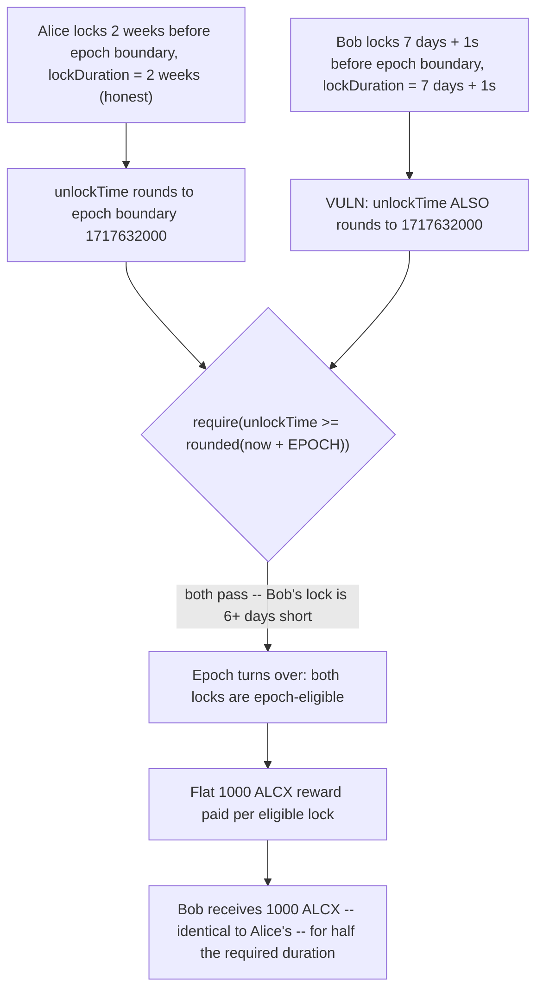
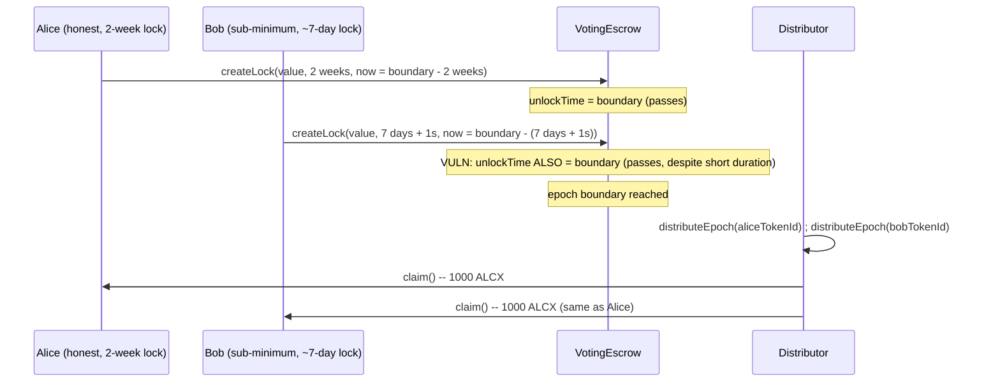

# Alchemix — BPT can be locked for only 1 week, resulting in unfair ALCX reward distribution

> **Vulnerability classes:** vuln/logic/off-by-rounding · vuln/access-control/bypassable-invariant-check · vuln/economic/reward-dilution

> **Reproduction:** a self-contained Foundry PoC that compiles & runs in an
> isolated project with **only `forge-std`** — no fork, no RPC, no `anvil_state`.
> Full trace: [output.txt](output.txt). PoC:
> [test/38178-bpt-can-be-locked-for-only-1-week-resulting-in-unfair-alcx-r_exp.sol](test/38178-bpt-can-be-locked-for-only-1-week-resulting-in-unfair-alcx-r_exp.sol).

<!-- non-defihacklabs -->
<!-- source-auditvault: https://github.com/Auditware/AuditVault/blob/main/findings/38178-bpt-can-be-locked-for-only-1-week-resulting-in-unfair-alcx-r.md -->
<!-- date: 2023-11 -->

**AuditVault taxonomy:** `lang/solidity` · `sector/dex` · `sector/governance` · `platform/immunefi` · `has/github` · `has/poc` · `severity/high` · `impact/loss-of-funds/reward-theft` · genome: `wrong-condition` · `reward-theft` · `reward-accounting` · `timestamp-dependence`

---

## Key info

| | |
|---|---|
| **Impact** | **HIGH** — theft of unclaimed yield: users can lock BPT for roughly half the required 2-week minimum yet still receive a full epoch's reward, diluting the reward pool for compliant, full-duration lockers |
| **Protocol** | [Alchemix V2 DAO](https://github.com/alchemix-finance/alchemix-v2-dao) — `VotingEscrow.sol` (`_createLock`) |
| **Vulnerable code** | `VotingEscrow._createLock`'s minimum-lock-duration `require`, which compares two independently-rounded absolute timestamps instead of checking the duration directly |
| **Bug class** | Off-by-rounding: a boundary check computed from `((timestamp + X) / WEEK) * WEEK` on both sides, which loses precision differently depending on how close `timestamp` is to a `WEEK` boundary |
| **Finding** | Immunefi — Alchemix, finding #38178 · reporter **marchev** |
| **Report** | N/A (Immunefi bug bounty; no public report URL provided by the source) |
| **Source** | [AuditVault](https://github.com/Auditware/AuditVault/blob/main/findings/38178-bpt-can-be-locked-for-only-1-week-resulting-in-unfair-alcx-r.md) |
| **Status** | Bug-bounty finding — caught before exploitation. Reproduced here as a standalone local PoC. |
| **Compiler** | `^0.8.24` (PoC) |

This is a **bug-bounty finding**, not a historical on-chain incident. The
browser Playground's synthetic `Exploit` runs cheatcode-free (no `vm.warp`),
so `block.timestamp` cannot literally differ between two calls within one
`run()`. To demonstrate the same check evaluated at two different real block
times — as the finding's own two lock-creation transactions are, days apart —
`_createLock` here takes an explicit `nowTs` parameter standing in for
`block.timestamp`; this is the **only** deviation from the source, and the
check's arithmetic itself is byte-for-byte identical with that substitution.

---

## TL;DR

1. `VotingEscrow._createLock` is supposed to enforce a minimum lock period of
   1 epoch (2 weeks): `require(unlockTime >= (((block.timestamp + EPOCH) / WEEK) * WEEK), ...)`.
2. Both `unlockTime` and the required minimum round **down** to a `WEEK`
   boundary.
3. As `block.timestamp` approaches the next epoch boundary from below, the
   right-hand side (the required minimum) stops advancing — it's already
   rounded to the same upcoming boundary — while the actual `lockDuration`
   needed to satisfy the left-hand side keeps shrinking.
4. A lock created just 7 days + 1 second before the boundary, with a
   `lockDuration` of only 7 days + 1 second, passes the check — half the
   intended 2-week minimum.
5. **HARM:** reward eligibility for an epoch depends only on whether a lock
   exists and passed this check, not on its actual duration — so the
   sub-minimum lock earns the exact same flat epoch reward as an honest,
   full-duration lock.

---

## The vulnerable code

`VotingEscrow.sol` (verbatim, from the finding):

```sol
function _createLock(
    uint256 _value,
    uint256 _lockDuration,
    bool _maxLockEnabled,
    address _to
) internal returns (uint256) {
    // ...
    uint256 unlockTime = /** ... */ ((block.timestamp + _lockDuration) / WEEK) * WEEK;

    // ...
    require(unlockTime >= (((block.timestamp + EPOCH) / WEEK) * WEEK), "Voting lock must be 1 epoch");

    // ...
}
```

In the PoC synthetic, the identical arithmetic is preserved with
`block.timestamp` substituted for an explicit `nowTs` parameter (see the
`.sol` file header for why):

```solidity
uint256 unlockTime = ((nowTs + _lockDuration) / WEEK) * WEEK;

// @> VULN: both sides round down to a WEEK boundary. As nowTs
//          approaches the next epoch boundary, the RHS stops
//          advancing while the actual _lockDuration needed to
//          satisfy the check keeps shrinking.
require(unlockTime >= (((nowTs + EPOCH) / WEEK) * WEEK), "Voting lock must be 1 epoch");
// FIX: require(_lockDuration >= EPOCH, "Voting lock must be 1 epoch");
```

---

## Root cause

The check compares two **rounded absolute timestamps** instead of comparing
the **duration** directly. `unlockTime` rounds `nowTs + lockDuration` down to
the nearest week; the required minimum rounds `nowTs + EPOCH` down to the
nearest week. Both roundings discard up to 6 days, 23 hours, 59 minutes, 59
seconds of "slack" — but they discard **different absolute amounts** for the
two different additions once `nowTs` sits close enough to a week boundary.
The net effect: as `nowTs` approaches the boundary, the slack absorbed by the
left-hand side grows while the right-hand side's required boundary stops
moving, so far less than a full `EPOCH` of real duration is needed to clear
it.

## Preconditions

- A user creates a lock within roughly 1 week of an upcoming epoch boundary
  (readily achievable — this is not a rare timing coincidence, since some
  window like this exists near every single epoch boundary).
- No other validation in the system independently checks `_lockDuration`
  against `EPOCH`.

## Attack walkthrough

From the finding's own example (preserved exactly in the PoC):

1. Next epoch starts at `1717632000`.
2. Alice honestly locks for the full `2 weeks` at `block.timestamp` =
   `1717632000 - 2 weeks` = `1716422400`. `unlockTime` resolves to
   `1717632000` — the check passes as intended.
3. Bob locks for only `7 days + 1 second` at `block.timestamp` =
   `1717632000 - (7 days + 1 second)` = `1717027199`. `unlockTime` **also**
   resolves to `1717632000` — the exact same boundary as Alice's — so the
   check passes for Bob too, despite his `lockDuration` being less than half
   the intended `EPOCH` minimum.
4. **HARM:** both locks are "epoch-eligible" once the epoch turns over and
   receive the identical flat epoch reward (1000 ALCX in the PoC). Bob
   receives exactly as much as Alice despite complying with barely half the
   duration requirement Alice actually honored.

## Diagrams





## Impact

Any lock created within a roughly 1-week window before an epoch boundary can
qualify for a full epoch's reward while committing for as little as half the
intended lock-up. Since the reward pool per epoch is fixed, every
sub-minimum lock siphons reward share away from lockers who honored the true
2-week commitment — a direct, repeatable, permissionless form of yield
theft available to any user with no special privileges, near every single
epoch boundary.

## Remediation

Per the finding's implied fix: check the **duration** directly, not two
independently-rounded absolute timestamps:

```diff
- require(unlockTime >= (((block.timestamp + EPOCH) / WEEK) * WEEK), "Voting lock must be 1 epoch");
+ require(_lockDuration >= EPOCH, "Voting lock must be 1 epoch");
```

This removes the rounding asymmetry entirely — the comparison no longer
depends on how close `block.timestamp` is to a week boundary.

## How to reproduce

```bash
cd ~/RustroverProjects/audits/evm-hack-registry/38178-bpt-can-be-locked-for-only-1-week-resulting-in-unfair-alcx-r_exp
forge test -vvv
# Fully local — no fork, no RPC, no anvil_state required.
# Expected: all three tests PASS:
#   test_exploit_shortLockEarnsFullReward       (Bob's sub-minimum lock earns the same reward as Alice's)
#   test_checkPasses_forSubMinimumDuration      (isolates the exact boundary-rounding bypass)
#   test_control_shortLockFarFromBoundaryReverts (control: a short lock far from any boundary correctly reverts)
```

PoC source: [test/38178-bpt-can-be-locked-for-only-1-week-resulting-in-unfair-alcx-r_exp.sol](test/38178-bpt-can-be-locked-for-only-1-week-resulting-in-unfair-alcx-r_exp.sol)
— the verbatim (`nowTs`-substituted) minimum-duration check, a reduced
`VotingEscrow`/flat-reward `Distributor` model, and a control test isolating
the boundary-proximity precondition.

> Note: `block.timestamp` is substituted with an explicit `nowTs` parameter
> in `_createLock` solely because the browser Playground's cheatcode-free
> synthetic cannot warp time between two calls within one transaction (see
> file header). The check's own arithmetic — the actual vulnerability — is
> untouched and verbatim. Reward accounting (value/voting-power tracking) is
> reduced to a flat per-epoch amount per eligible lock; this does not affect
> the demonstrated harm, since the bug is about lock **eligibility**, not
> the reward formula itself.

---

*Reference: finding **#38178** by **marchev** (Immunefi) on [Alchemix V2 DAO](https://github.com/alchemix-finance/alchemix-v2-dao/blob/f1007439ad3a32e412468c4c42f62f676822dc1f/src/VotingEscrow.sol) · curated by [AuditVault](https://github.com/Auditware/AuditVault/blob/main/findings/38178-bpt-can-be-locked-for-only-1-week-resulting-in-unfair-alcx-r.md)*
