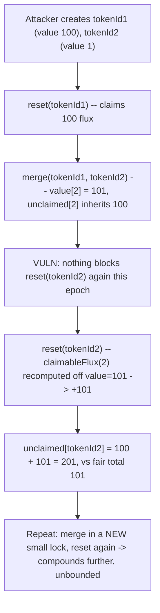
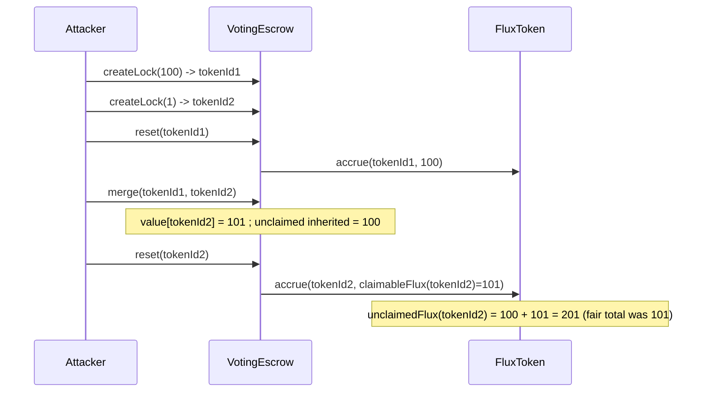

# Alchemix — malicious user can mint unlimited FLUX tokens

> **Vulnerability classes:** vuln/logic/missing-epoch-guard · vuln/accounting/double-counting · vuln/economic/unbounded-mint

> **Reproduction:** a self-contained Foundry PoC that compiles & runs in an
> isolated project with **only `forge-std`** — no fork, no RPC, no `anvil_state`.
> Full trace: [output.txt](output.txt). PoC:
> [test/38179-malicious-user-can-mint-unlimited-flux-tokens-immunefi-alche_exp.sol](test/38179-malicious-user-can-mint-unlimited-flux-tokens-immunefi-alche_exp.sol).

<!-- non-defihacklabs -->
<!-- source-auditvault: https://github.com/Auditware/AuditVault/blob/main/findings/38179-malicious-user-can-mint-unlimited-flux-tokens-immunefi-alche.md -->
<!-- date: 2023-11 -->

**AuditVault taxonomy:** `lang/solidity` · `platform/immunefi` · `has/github` · `has/poc` · `severity/high` · `sector/farm` · `sector/governance` · `sector/token` · genome: `proposal-manipulation` · `direct-drain` · `integer-bounds` · `reward-accounting`

---

## Key info

| | |
|---|---|
| **Impact** | **HIGH** — direct theft of user funds / governance manipulation / theft of unclaimed yield: a user can mint an unbounded amount of FLUX by repeating a reset -> merge -> reset sequence, with no upper bound |
| **Protocol** | [Alchemix V2 DAO](https://github.com/alchemix-finance/alchemix-v2-dao) — `VotingEscrow.sol` (`merge`, `claimableFlux`) + `Voter.sol` (`reset`) |
| **Vulnerable code** | `VotingEscrow.merge(tokenId1, tokenId2)` — folds an already-reset tokenId's locked value into another without blocking that recipient's next `reset()` |
| **Bug class** | Missing per-epoch "already claimed" guard combined with a claim function (`reset`) that recomputes its reward base fresh from CURRENT (mutable) state every call |
| **Finding** | Immunefi — Alchemix, finding #38179 · reporter **MahdiKarimi** |
| **Report** | N/A (Immunefi bug bounty; no public report URL provided by the source) |
| **Source** | [AuditVault](https://github.com/Auditware/AuditVault/blob/main/findings/38179-malicious-user-can-mint-unlimited-flux-tokens-immunefi-alche.md) |
| **Status** | Bug-bounty finding — caught before exploitation. Reproduced here as a standalone local PoC. |
| **Compiler** | `^0.8.24` (PoC) |

This is a **bug-bounty finding**, not a historical on-chain incident.

---

## TL;DR

1. Users earn FLUX proportional to their veALCX's **current** locked value.
   Calling `Voter.reset(tokenId)` adds `claimableFlux(tokenId)` to the
   token's unclaimed FLUX balance — and nothing prevents `reset()` from being
   called more than once for the same `tokenId`.
2. `VotingEscrow.merge(id1, id2)` folds `id1`'s locked value (and its
   already-claimed unclaimed FLUX) into `id2`, then burns `id1`.
3. Nothing marks `id2` as "already reset this epoch" as a result of the
   value it just absorbed from `id1`.
4. A user can therefore: `reset(id1)` (claim `id1`'s flux) → `merge(id1, id2)`
   (fold `id1`'s value into `id2`) → `reset(id2)` **again** (re-derive flux
   off `id2`'s now-inflated value, re-counting `id1`'s already-claimed
   share).
5. **HARM:** repeating this — merge in a fresh small lock, reset again — lets
   a user mint FLUX without bound, diluting FLUX's value for every holder.

---

## The vulnerable code

`Voter.sol` and `VotingEscrow.sol` (verbatim references, from the finding):

```
https://github.com/alchemix-finance/alchemix-v2-dao/blob/f1007439ad3a32e412468c4c42f62f676822dc1f/src/Voter.sol#L183-L192
https://github.com/alchemix-finance/alchemix-v2-dao/blob/f1007439ad3a32e412468c4c42f62f676822dc1f/src/VotingEscrow.sol#L618-L651
```

> The merge function ensures users didn't vote in the same epoch that they
> want to merge the token to prevent double calculation of claimable flux by
> checking `voted[]` mapping, however, users can call reset to receive
> claimable flux (it's added to unclaimed flux), since reset function sets
> voted to false and only updates `lastVoted` (which doesn't affect merging)
> user can merge the token with another token and receive the claimable
> amount again.

In the PoC synthetic, the same interaction is preserved:

```solidity
function merge(uint256 tokenId1, uint256 tokenId2) external {
    require(owner[tokenId1] == msg.sender && owner[tokenId2] == msg.sender, "not owner");

    // @> VULN: tokenId1's locked value is folded into tokenId2 BEFORE
    //          tokenId2's flux is claimed again. Nothing marks tokenId2
    //          as "already reset this epoch" from tokenId1's merged-in
    //          value, so a subsequent reset(tokenId2) recomputes
    //          claimableFlux(tokenId2) off the INFLATED value and
    //          double-counts flux tokenId1 already claimed.
    value[tokenId2] += value[tokenId1];
    FLUX.transferUnclaimed(tokenId1, tokenId2);
    value[tokenId1] = 0;
    owner[tokenId1] = address(0);
    // FIX: block reset() on tokenId2 in the SAME epoch that value was
    //      merged into it from an already-reset tokenId1, or snapshot
    //      claimableFlux at merge time and permanently exclude the
    //      merged-in value from tokenId2's future claimableFlux base.
}
```

---

## Root cause

Two independently-reasonable design choices interact badly:

1. `reset()` recomputes its reward (`claimableFlux`) **fresh, from current
   state**, every time it's called — with no memory of what portion of the
   current locked value has already had its flux claimed.
2. `merge()` only guards against double-counting from **voting** (checking
   `voted[]`), because that was the double-count vector the developers had
   in mind. It never considered that `reset()` itself — which explicitly
   *clears* `voted[]` as a side effect — provides a clean way to bypass that
   very guard: reset first (so `voted[]` is false), merge second (guard
   passes), reset again (claim the merged-in value's flux a second time).

## Preconditions

- The user owns at least two veALCX positions (trivial and permissionless to
  create).
- No cooldown or rate limit exists between `reset()` calls on different
  tokenIds, or between a `merge()` and a subsequent `reset()`.

## Attack walkthrough

From the PoC (matching the finding's own PoC formula exactly):

1. The attacker creates two locks: `tokenId1` (value 100) and `tokenId2`
   (value 1). `claimableFlux(tokenId1) = 100`, `claimableFlux(tokenId2) = 1`
   — a fair total of 101 for this epoch's locked value.
2. `reset(tokenId1)`: claims 100 flux into `tokenId1`'s unclaimed balance.
3. `merge(tokenId1, tokenId2)`: `tokenId2`'s value becomes 101 (1 + 100);
   `tokenId2` inherits `tokenId1`'s already-claimed 100 unclaimed flux.
   `tokenId1` is burned.
4. **HARM:** `reset(tokenId2)` **again**: `claimableFlux(tokenId2)` is
   recomputed off the inflated value (101) and added a second time.
   `tokenId2`'s final unclaimed flux is `100 (inherited) + 101 (re-derived) = 201`
   — exactly `2 * token1Flux + token2Flux`, matching the finding's own
   assertion. The attacker can repeat this indefinitely (merge in a fresh
   small lock, reset again) with no upper bound.

## Diagrams





## Impact

FLUX is used as a boostable, tradeable reward token. Minting it beyond the
fair supply for the veALCX system's actual locked value: (a) lets the
attacker direct disproportionate emission via boosted voting power, a form
of yield theft from other participants, and (b) dilutes FLUX's market value
for every holder, since supply grows independent of genuine locked value.
Because the sequence (reset → merge → reset) is unbounded and repeatable
with fresh small locks, there is no natural ceiling on how much FLUX a
single attacker can mint.

## Remediation

Per the finding's implied fix, either:

1. **Block `reset()` on the recipient** for the remainder of the epoch
   whenever a `merge()` brings in value from an already-reset tokenId, or
2. **Snapshot `claimableFlux` at merge time** and permanently exclude the
   merged-in value from the recipient's future `claimableFlux` base (only
   the recipient's own pre-merge value should ever be double-counted-safe
   going forward), or
3. Track a per-tokenId "flux already claimed this epoch, including
   inherited claims" flag that `merge()` propagates and `reset()` respects.

## How to reproduce

```bash
cd ~/RustroverProjects/audits/evm-hack-registry/38179-malicious-user-can-mint-unlimited-flux-tokens-immunefi-alche_exp
forge test -vvv
# Fully local — no fork, no RPC, no anvil_state required.
# Expected: all three tests PASS:
#   test_exploit_resetMergeResetDoubleCountsFlux      (201 minted vs fair 101)
#   test_exploit_repeatingTheSequenceCompoundsFurther (a second round compounds to 303)
#   test_control_singleResetPerTokenIsCorrect         (control: one reset each, no merge, is fair)
```

PoC source: [test/38179-malicious-user-can-mint-unlimited-flux-tokens-immunefi-alche_exp.sol](test/38179-malicious-user-can-mint-unlimited-flux-tokens-immunefi-alche_exp.sol)
— the verbatim merge-without-reset-guard interaction, reduced `VotingEscrow`/
`FluxToken` mocks, and a control test isolating the merge-then-reset-again
sequence as the trigger.

> Note: this reduction models the double-count as an internal
> `unclaimedFlux` ledger over-mint (matching the finding's own PoC assertion
> style), rather than minting a tradeable ERC20 FLUX balance directly to an
> address — the harm (unbounded credit inflation relative to real locked
> value) is identical either way, and the reduction keeps the demonstration
> focused on the exact accounting bug.

---

*Reference: finding **#38179** by **MahdiKarimi** (Immunefi) on [Alchemix V2 DAO](https://github.com/alchemix-finance/alchemix-v2-dao/blob/f1007439ad3a32e412468c4c42f62f676822dc1f/src/VotingEscrow.sol) · curated by [AuditVault](https://github.com/Auditware/AuditVault/blob/main/findings/38179-malicious-user-can-mint-unlimited-flux-tokens-immunefi-alche.md)*
