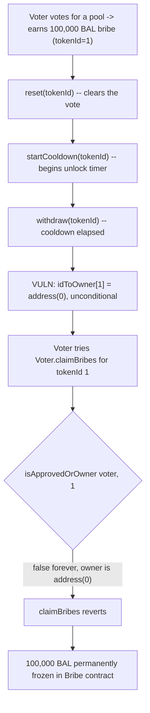
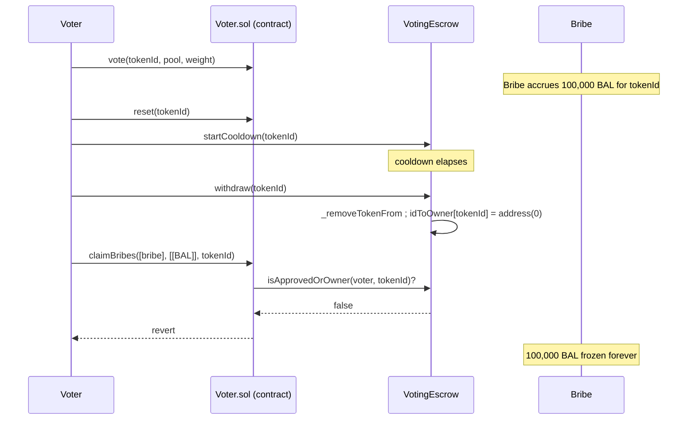

# Alchemix — voters who withdraw veALCX tokens risk losing gained bribes

> **Vulnerability classes:** vuln/access-control/ownership-check-after-burn · vuln/logic/missing-forced-claim · vuln/dos/frozen-funds

> **Reproduction:** a self-contained Foundry PoC that compiles & runs in an
> isolated project with **only `forge-std`** — no fork, no RPC, no `anvil_state`.
> Full trace: [output.txt](output.txt). PoC:
> [test/38181-voters-who-withdraw-velacx-tokens-risk-losing-gained-bribes_exp.sol](test/38181-voters-who-withdraw-velacx-tokens-risk-losing-gained-bribes_exp.sol).

<!-- non-defihacklabs -->
<!-- source-auditvault: https://github.com/Auditware/AuditVault/blob/main/findings/38181-voters-who-withdraw-velacx-tokens-risk-losing-gained-bribes.md -->
<!-- date: 2023-11 -->

**AuditVault taxonomy:** `lang/solidity` · `sector/governance` · `platform/immunefi` · `has/github` · `has/poc` · `severity/high` · genome: `frozen-funds` · `variant` · `reward-theft` · `account-ownership` · `dos-resistance`

---

## Key info

| | |
|---|---|
| **Impact** | **HIGH** — permanent freezing of unclaimed yield: voters who follow the standard `reset -> startCooldown -> withdraw` sequence without first claiming outstanding bribes lose those bribes forever |
| **Protocol** | [Alchemix V2 DAO](https://github.com/alchemix-finance/alchemix-v2-dao) — `Voter.sol` (bribe claims) + `VotingEscrow.sol` (veALCX lock/withdraw) |
| **Vulnerable code** | `VotingEscrow.withdraw(uint256 _tokenId)`, reached via the documented 3-step exit sequence — burns the token via `_removeTokenFrom` with no check for outstanding bribes |
| **Bug class** | Ownership-gated claim function (`claimBribes`) whose gate becomes permanently unsatisfiable after an unrelated state transition (burn) elsewhere in the normal exit flow |
| **Finding** | Immunefi — Alchemix, finding #38181 · reporter **xBentley** |
| **Report** | N/A (Immunefi bug bounty; no public report URL provided by the source) |
| **Source** | [AuditVault](https://github.com/Auditware/AuditVault/blob/main/findings/38181-voters-who-withdraw-velacx-tokens-risk-losing-gained-bribes.md) |
| **Status** | Bug-bounty finding — caught before exploitation. Reproduced here as a standalone local PoC. |
| **Compiler** | `^0.8.24` (PoC) |

This is a **bug-bounty finding**, not a historical on-chain incident. It
shares its root cause with a companion finding, [#38175](../38175-loss-of-unclaimed-bribes-after-burning-vealcx-token-immunefi_exp/38175-loss-of-unclaimed-bribes-after-burning-vealcx-token-immunefi_exp.md),
reported independently by a different Immunefi researcher; this reduction
walks the **full documented exit sequence** (`reset` → `startCooldown` →
`withdraw`) that this finding's own PoC exercises, rather than a bare
`withdraw()` call, keeping the two write-ups and PoCs distinct.

---

## TL;DR

1. To close out a veALCX position, the documented sequence is: (i)
   `Voter.reset(tokenId)` if the position has voted, (ii)
   `VotingEscrow.startCooldown(tokenId)`, (iii) wait for cooldown, (iv)
   `VotingEscrow.withdraw(tokenId)`.
2. `withdraw()` burns the tokenId via `_removeTokenFrom`, setting
   `idToOwner[_tokenId] = address(0)`.
3. `Voter.claimBribes()` requires
   `IVotingEscrow(veALCX).isApprovedOrOwner(msg.sender, _tokenId)` — which can
   never be true again once the token is burned.
4. **HARM:** a voter who follows the exact documented exit sequence, but
   forgets (or is never told) to claim outstanding bribes first, permanently
   loses those bribes with no recovery path.

---

## The vulnerable code

`VotingEscrow.sol` — `_removeTokenFrom`, called unconditionally from
`withdraw()` (verbatim, from the finding):

```solidity
/**
 * @notice Remove a token from a given address
 * @dev Throws if `_from` is not the current owner.
 */
function _removeTokenFrom(address _from, uint256 _tokenId) internal {
    // Throws if `_from` is not the current owner
    require(idToOwner[_tokenId] == _from);
    // Change the owner
    idToOwner[_tokenId] = address(0);
    // Update owner token index tracking
    _removeTokenFromOwnerList(_from, _tokenId);
    // Change count tracking
    ownerToTokenCount[_from] -= 1;
}
```

`Voter.sol` — the gate this burn permanently breaks (verbatim, from the
finding):

```solidity
/// @inheritdoc IVoter
function claimBribes(address[] memory _bribes, address[][] memory _tokens, uint256 _tokenId) external {
    require(IVotingEscrow(veALCX).isApprovedOrOwner(msg.sender, _tokenId));

    for (uint256 i = 0; i < _bribes.length; i++) {
        IBribe(_bribes[i]).getRewardForOwner(_tokenId, _tokens[i]);
    }
}
```

In the PoC synthetic, the same interaction is preserved as:

```solidity
// @> VULN: the token is burned unconditionally at the end of the
//          standard reset -> startCooldown -> withdraw sequence, with
//          no check for outstanding bribe rewards earned via voting.
//          Once idToOwner[tokenId] becomes address(0), Voter's
//          isApprovedOrOwner-gated claimBribes can never pass again.
idToOwner[tokenId] = address(0);
// FIX: require all outstanding bribes are claimed (or force-claim
//      them) as part of this withdrawal sequence, before the burn.
```

---

## Root cause

The 4-step exit sequence documented for veALCX (`reset` → `startCooldown` →
wait → `withdraw`) says nothing about bribes, because bribe accounting lives
entirely in `Voter`/`Bribe` contracts, orthogonal to `VotingEscrow`'s lock
state machine. `withdraw()`'s burn is unconditional; `claimBribes()`'s only
authorization is "current owner of `_tokenId`." Once the burn executes, that
authorization can never be satisfied again for this `tokenId` by anyone —
including the original voter, who has no way to prove entitlement after
losing ownership.

## Preconditions

- The voter has cast at least one vote that earned an active third-party
  bribe, and has not yet claimed it.
- The voter follows the standard, documented exit sequence:
  `reset()` → `startCooldown()` → (wait) → `withdraw()`.
- The voter does not separately call `Voter.claimBribes()` for every bribe
  contract they have exposure to, strictly before `withdraw()`.

## Attack walkthrough

From the PoC:

1. The voter's veALCX position (`tokenId = 1`) has an active vote and a
   100,000 BAL bribe earned this epoch, held in a `Bribe` contract.
   `bribe.earned(1) == 100_000e18` and the voter still owns the token.
2. The voter runs the documented exit sequence: `reset(1)` clears the vote,
   `startCooldown(1)` begins the unlock timer, then `withdraw(1)` is called.
3. `withdraw()` sets `idToOwner[1] = address(0)` — the voter is no longer the
   token's owner, permanently.
4. **HARM:** the voter calls `Bribe.getRewardForOwner(1, voter)` (the
   reduction of `Voter.claimBribes`'s ownership-gated path). It reverts. The
   100,000 BAL remains stuck in the `Bribe` contract forever — nobody can
   ever again satisfy the ownership check for `tokenId = 1`. A control test
   confirms claiming the bribe **before** running the exit sequence works
   perfectly, isolating the bug to ordering, not to the bribe mechanism
   itself.

## Diagrams





## Impact

The 100,000 BAL bribe is neither stolen nor recoverable by the protocol — it
is simply **frozen forever** in the `Bribe` contract. Because the exit
sequence that triggers this loss is the exact, documented, "correct" way to
close a position, this is not an edge case a careless user stumbles into —
it's the default path unless a voter separately remembers to claim every
active bribe first. There is no recovery short of a contract upgrade or
emergency bribe-contract migration.

## Remediation

Per the finding's suggested mitigations, any of the following close the gap:

1. **Block withdrawal while bribes are unclaimed** — `withdraw()` checks (via
   the relevant `Bribe`/`Voter` state) that no outstanding bribe exists for
   `_tokenId` before burning.
2. **Force-claim bribes as part of the exit sequence** — mirror the existing
   ALCX/FLUX claim calls in `withdraw()` with a bribe claim across every
   bribe contract the token has voted for, before the burn.
3. Restructure `claimBribes`'s authorization so a bribe earned by a since-
   burned `tokenId` remains claimable by its last known owner (weaker
   mitigation).

## How to reproduce

```bash
cd ~/RustroverProjects/audits/evm-hack-registry/38181-voters-who-withdraw-velacx-tokens-risk-losing-gained-bribes_exp
forge test -vvv
# Fully local — no fork, no RPC, no anvil_state required.
# Expected: both tests PASS:
#   test_exploit_bribesFrozenAfterWithdrawSequence       (100k BAL frozen after the 3-step exit)
#   test_control_claimBeforeWithdrawSequenceSucceeds     (control: claim-then-exit is safe)
```

PoC source: [test/38181-voters-who-withdraw-velacx-tokens-risk-losing-gained-bribes_exp.sol](test/38181-voters-who-withdraw-velacx-tokens-risk-losing-gained-bribes_exp.sol)
— the verbatim burn-without-bribe-claim interaction reached via the full
`reset` → `startCooldown` → `withdraw` sequence, reduced `VotingEscrow`/
`Bribe` mocks, and a control test isolating claim-order as the root cause.

> Note: this finding and [#38175](../38175-loss-of-unclaimed-bribes-after-burning-vealcx-token-immunefi_exp/38175-loss-of-unclaimed-bribes-after-burning-vealcx-token-immunefi_exp.md)
> share the same underlying defect (burn-before-bribe-claim in `VotingEscrow`),
> reported independently by two different Immunefi researchers. They are kept
> as distinct findings here — matching how Immunefi/AuditVault records
> them — with this reduction specifically walking the documented multi-step
> exit sequence rather than a bare `withdraw()` call.

---

*Reference: finding **#38181** by **xBentley** (Immunefi) on [Alchemix V2 DAO](https://github.com/alchemix-finance/alchemix-v2-dao/blob/f1007439ad3a32e412468c4c42f62f676822dc1f/src/VotingEscrow.sol) · curated by [AuditVault](https://github.com/Auditware/AuditVault/blob/main/findings/38181-voters-who-withdraw-velacx-tokens-risk-losing-gained-bribes.md)*
