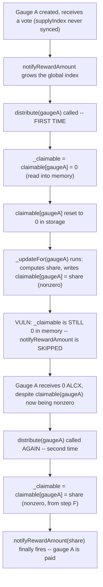
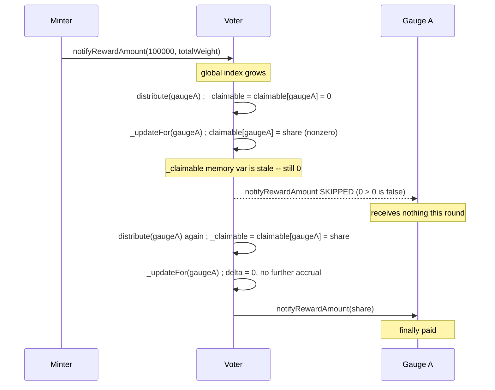

# Alchemix — newly created gauge may miss out on its rewards

> **Vulnerability classes:** vuln/logic/stale-memory-variable · vuln/timing/read-before-write · vuln/liveness/delayed-reward

> **Reproduction:** a self-contained Foundry PoC that compiles & runs in an
> isolated project with **only `forge-std`** — no fork, no RPC, no `anvil_state`.
> Full trace: [output.txt](output.txt). PoC:
> [test/38182-newly-created-gauge-may-missed-out-on-its-rewards-immunefi-a_exp.sol](test/38182-newly-created-gauge-may-missed-out-on-its-rewards-immunefi-a_exp.sol).

<!-- non-defihacklabs -->
<!-- source-auditvault: https://github.com/Auditware/AuditVault/blob/main/findings/38182-newly-created-gauge-may-missed-out-on-its-rewards-immunefi-a.md -->
<!-- date: 2023-11 -->

**AuditVault taxonomy:** `lang/solidity` · `platform/immunefi` · `has/github` · `has/poc` · `severity/high` · `sector/governance` · genome: `reward-calculation` · `reward-theft` · `reward-accounting` · `timestamp-dependence`

---

## Key info

| | |
|---|---|
| **Impact** | **HIGH** — contract fails to deliver promised returns (no value is lost, but delivery is delayed/skipped): a newly-created gauge's first `distribute()` call pays out nothing, even though its reward was correctly computed |
| **Protocol** | [Alchemix V2 DAO](https://github.com/alchemix-finance/alchemix-v2-dao) — `Voter.sol` (`_distribute`, `_updateFor`) |
| **Vulnerable code** | `Voter._distribute(address _gauge)` — reads `claimable[_gauge]` into a memory variable BEFORE `_updateFor` computes and writes this epoch's new amount |
| **Bug class** | Stale memory variable: a value cached in memory before a state-mutating call that updates the same storage slot the memory variable was sourced from |
| **Finding** | Immunefi — Alchemix, finding #38182 · reporter **Lin511** |
| **Report** | N/A (Immunefi bug bounty; no public report URL provided by the source) |
| **Source** | [AuditVault](https://github.com/Auditware/AuditVault/blob/main/findings/38182-newly-created-gauge-may-missed-out-on-its-rewards-immunefi-a.md) |
| **Status** | Bug-bounty finding — caught before exploitation. Reproduced here as a standalone local PoC. |
| **Compiler** | `^0.8.24` (PoC) |

This is a **bug-bounty finding**, not a historical on-chain incident.

---

## TL;DR

1. `Voter._distribute(gauge)` starts by reading `_claimable = claimable[gauge]`
   into memory, then resets `claimable[gauge]` to 0, THEN calls
   `_updateFor(gauge)` — the function that actually computes this epoch's
   newly-accrued reward share and writes it into `claimable[gauge]`.
2. For a **brand-new gauge** whose `supplyIndex` has never been synced,
   `_updateFor`'s first-ever call for that gauge is exactly what computes and
   writes its first nonzero `claimable[gauge]` value.
3. But `_claimable` was already captured as `0` **before** that write
   happened — so the freshly-computed nonzero amount is never passed to
   `notifyRewardAmount()` on this call.
4. **HARM:** the gauge's storage now correctly shows a nonzero claimable
   balance, but nothing was actually paid out. Only a **second**
   `distribute()` call — which reads the already-updated storage value
   before `_updateFor` resets it — actually delivers the reward.

---

## The vulnerable code

`Voter.sol` (verbatim, from the finding):

```solidity
function _distribute(address _gauge) internal {
    // Distribute once after epoch has ended
    require(
        block.timestamp >= IMinter(minter).activePeriod() + IMinter(minter).DURATION(),
        "can only distribute after period end"
    );

    uint256 _claimable = claimable[_gauge];

    // Reset claimable amount
    claimable[_gauge] = 0;

    _updateFor(_gauge);

    if (_claimable > 0) {
        IBaseGauge(_gauge).notifyRewardAmount(_claimable);
    }

    ...
}
```

```solidity
function _updateFor(address _gauge) internal {
    require(isGauge[_gauge], "invalid gauge");

    address _pool = poolForGauge[_gauge];
    uint256 _supplied = weights[_pool];
    if (_supplied > 0) {
        uint256 _supplyIndex = supplyIndex[_gauge];
        uint256 _index = index; // get global index0 for accumulated distro
        supplyIndex[_gauge] = _index; // update _gauge current position to global position
        uint256 _delta = _index - _supplyIndex; // see if there is any difference that need to be accrued
        if (_delta > 0) {
            uint256 _share = (uint256(_supplied) * _delta) / 1e18; // add accrued difference for each supplied token
@>          claimable[_gauge] += _share;
        }
    } else {
        supplyIndex[_gauge] = index;
    }
}
```

In the PoC synthetic, both functions are preserved verbatim (`_updateFor` is
byte-for-byte identical to the finding's quoted source):

```solidity
function _distribute(address _gauge) internal {
    uint256 _claimable = claimable[_gauge];

    // Reset claimable amount
    claimable[_gauge] = 0;

    _updateFor(_gauge);

    // @> VULN: `_claimable` was read from storage BEFORE _updateFor()
    //          just wrote this epoch's newly-computed amount into
    //          claimable[_gauge]. For a gauge whose FIRST-EVER sync
    //          happens inside this very _updateFor() call, `_claimable`
    //          is still 0 here even though claimable[_gauge] is now
    //          nonzero -- the gauge receives NOTHING this round.
    if (_claimable > 0) {
        Gauge(_gauge).notifyRewardAmount(_claimable);
    }
    // FIX: read `_claimable = claimable[_gauge]` AFTER _updateFor(_gauge)
    //      runs, not before.
}
```

---

## Root cause

`_distribute` was written assuming `claimable[_gauge]` is always already
up-to-date by the time it reads it — true for a gauge that has been synced
by a **prior** `_updateFor` call (e.g. from a previous epoch's distribute, or
another code path that calls `_updateFor` independently). For a gauge on its
**very first** distribution, no such prior sync exists, so `_updateFor`
itself must perform the first sync — and it does so **after** `_distribute`
already captured the (necessarily stale, still-zero) claimable value into
memory.

## Preconditions

- A gauge is newly created and has never had `_updateFor` called for it
  before (directly or via a previous `distribute()`).
- The gauge received a nonzero vote weight and the global reward index grew
  (via `notifyRewardAmount`) before its first `distribute()` call.

## Attack walkthrough

From the PoC:

1. Gauge A is created and receives a vote for its pool. Its `supplyIndex` has
   never synced — still `0`.
2. The minter calls `notifyRewardAmount(100_000 ether, ...)`, growing the
   global distribution `index`.
3. **VULN:** `distribute(gaugeA)` is called. `_distribute` reads
   `_claimable = claimable[gaugeA] = 0` into memory, resets storage to `0`,
   then calls `_updateFor(gaugeA)` — which computes gauge A's actual nonzero
   share and writes it to `claimable[gaugeA]`. Since `_claimable` was already
   `0` before that write, `notifyRewardAmount` is skipped entirely.
4. **HARM:** gauge A's pool receives **0 ALCX** from this call, even though
   `claimable(gaugeA)` in storage is now correctly nonzero. Only a
   **second** `distribute(gaugeA)` call — with no new rewards notified in
   between — actually pays out, because this time `_claimable` reads the
   already-updated storage value before `_updateFor` resets it.

## Diagrams





## Impact

No value is destroyed or stolen — but a gauge's rewards can be silently
delayed by an entire distribution cycle, and if `distribute()` for that gauge
is only ever called once (a realistic scenario for a low-activity gauge, or
one created near the end of its protocol's active lifetime), the reward is
**never** delivered at all. This breaks the reward-distribution guarantee
the protocol advertises and can leave newly-onboarded pools' liquidity
providers under-rewarded relative to established gauges.

## Remediation

Per the finding's implied fix, move the `_claimable` read to **after**
`_updateFor` runs:

```diff
  function _distribute(address _gauge) internal {
-     uint256 _claimable = claimable[_gauge];
-     claimable[_gauge] = 0;
      _updateFor(_gauge);
+     uint256 _claimable = claimable[_gauge];
+     claimable[_gauge] = 0;

      if (_claimable > 0) {
          IBaseGauge(_gauge).notifyRewardAmount(_claimable);
      }
  }
```

This ensures `_claimable` always reflects the fully up-to-date value,
including any share `_updateFor` just wrote as part of this very call.

## How to reproduce

```bash
cd ~/RustroverProjects/audits/evm-hack-registry/38182-newly-created-gauge-may-missed-out-on-its-rewards-immunefi-a_exp
forge test -vvv
# Fully local — no fork, no RPC, no anvil_state required.
# Expected: all three tests PASS:
#   test_exploit_firstDistributeMissesReward                (first distribute pays 0, second pays out)
#   test_buggyVoter_firstSyncAndFirstPayoutAreDifferentCalls (isolates the exact stale-read interaction)
#   test_control_externallyPreSyncedGaugePaysOutOnFirstDistribute (control: pre-synced gauge pays on first call)
```

PoC source: [test/38182-newly-created-gauge-may-missed-out-on-its-rewards-immunefi-a_exp.sol](test/38182-newly-created-gauge-may-missed-out-on-its-rewards-immunefi-a_exp.sol)
— the verbatim `_distribute`/`_updateFor` interaction, a reduced `Voter`/
`Gauge` model, and a control test isolating "first sync happens inside the
same call as the first payout attempt" as the trigger.

---

*Reference: finding **#38182** by **Lin511** (Immunefi) on [Alchemix V2 DAO](https://github.com/alchemix-finance/alchemix-v2-dao/blob/f1007439ad3a32e412468c4c42f62f676822dc1f/src/Voter.sol) · curated by [AuditVault](https://github.com/Auditware/AuditVault/blob/main/findings/38182-newly-created-gauge-may-missed-out-on-its-rewards-immunefi-a.md)*
