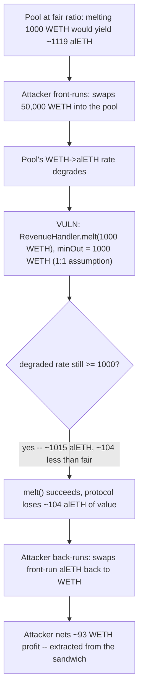
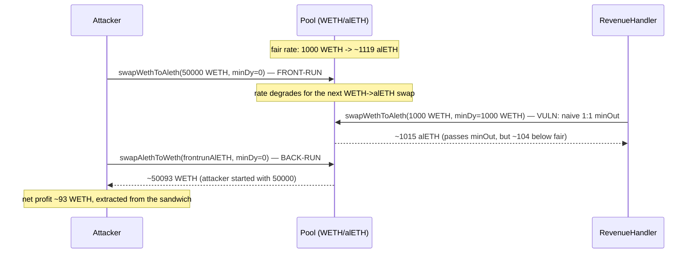

# Alchemix — slippage protection is inaccurate (`RevenueHandler._melt`)

> **Vulnerability classes:** vuln/oracle/naive-slippage-check · vuln/mev/sandwich-attack · vuln/economic/price-manipulation

> **Reproduction:** a self-contained Foundry PoC that compiles & runs in an
> isolated project with **only `forge-std`** — no fork, no RPC, no `anvil_state`.
> Full trace: [output.txt](output.txt). PoC:
> [test/38184-slippage-protection-is-inaccurate-immunefi-alchemix-git_exp.sol](test/38184-slippage-protection-is-inaccurate-immunefi-alchemix-git_exp.sol).

<!-- non-defihacklabs -->
<!-- source-auditvault: https://github.com/Auditware/AuditVault/blob/main/findings/38184-slippage-protection-is-inaccurate-immunefi-alchemix-git.md -->
<!-- date: 2023-11 -->

**AuditVault taxonomy:** `lang/solidity` · `sector/governance` · `sector/lending` · `platform/immunefi` · `has/github` · `has/poc` · `severity/high` · `impact/data-corruption/price-manipulation` · `impact/mev/sandwich` · `trigger/price-manipulation` · `trigger/sandwich-attack` · genome: `precision-loss` · `data-corruption/price-manipulation` · `sandwich` · `fot-slippage` · `frontrun-exposure` · `oracle-manipulation-resistance`

---

## Key info

| | |
|---|---|
| **Impact** | **HIGH** — protocol insolvency risk: `RevenueHandler._melt()`'s slippage protection is a naive 1:1 assumption, not a fair-price check, letting an attacker sandwich the swap and extract value that should accrue to alETH/alUSD holders |
| **Protocol** | [Alchemix V2 DAO](https://github.com/alchemix-finance/alchemix-v2-dao) — `RevenueHandler.sol` (`_melt`) |
| **Vulnerable code** | `RevenueHandler._melt(revenueToken)` — passes the swap's own input amount as its `minimumAmountOut` |
| **Bug class** | Naive/self-referential slippage protection: `minOut == amountIn` instead of a bound derived from an external fair-price reference |
| **Finding** | Immunefi — Alchemix, finding #38184 · reporter **jasonxiale** (also referenced as [Sherlock 2024-04-alchemix-judging #5](https://github.com/sherlock-audit/2024-04-alchemix-judging/issues/5)) |
| **Report** | N/A (Immunefi bug bounty; cross-referenced by the reporter to a Sherlock contest issue) |
| **Source** | [AuditVault](https://github.com/Auditware/AuditVault/blob/main/findings/38184-slippage-protection-is-inaccurate-immunefi-alchemix-git.md) |
| **Status** | Bug-bounty finding — caught before exploitation. Reproduced here as a standalone local PoC. |
| **Compiler** | `^0.8.24` (PoC) |

This is a **bug-bounty finding**, not a historical on-chain incident. The
finding references a live Curve WETH/alETH pool and a Curve `get_dy` quote;
the PoC reduces this to a minimal constant-product (`x*y=k`) mock pool that
reproduces the same qualitative behavior (alETH trades at a natural
discount, so a healthy WETH→alETH swap nets more alETH than WETH in) and the
same sandwich mechanism, without requiring a fork or the real Curve math.

---

## TL;DR

1. `RevenueHandler._melt(revenueToken)` swaps `revenueTokenBalance` of a
   revenue token (e.g. WETH) for its paired alAsset (e.g. alETH) through a
   pool adapter.
2. It passes `revenueTokenBalance` as **both** the swap's input amount
   **and** its `minimumAmountOut` — i.e., it assumes the two assets always
   trade at exactly 1:1.
3. In reality, alETH trades at a discount to WETH (the finding notes
   roughly a 30:27 ratio), so a healthy, unmanipulated pool naturally returns
   **more** alETH than WETH put in — the "protection" therefore has a large
   amount of unused slack.
4. **HARM:** an attacker can sandwich the melt — swap WETH→alETH first
   (pushing the rate down for the upcoming melt), let the melt execute at
   the degraded rate (which still clears the trivial `amountOut >= amountIn`
   threshold), then swap the alETH back to WETH — pocketing the difference
   that should have gone to the protocol.

---

## The vulnerable code

`RevenueHandler.sol` (verbatim, from the finding):

```solidity
275     function _melt(address revenueToken) internal returns (uint256) {
276         RevenueTokenConfig storage tokenConfig = revenueTokenConfigs[revenueToken];
277         address poolAdapter = tokenConfig.poolAdapter;
278         uint256 revenueTokenBalance = IERC20(revenueToken).balanceOf(address(this));
279         if (revenueTokenBalance == 0) {
280             return 0;
281         }
282         IERC20(revenueToken).safeTransfer(poolAdapter, revenueTokenBalance);
283         /*
284             minimumAmountOut == inputAmount
285             Here we are making the assumption that the price of the alAsset will always be at or below the price of the revenue token.
286             This is currently a safe assumption since this imbalance has always held true for alUSD and alETH since their inceptions.
287         */
288         return
289             IPoolAdapter(poolAdapter).melt(
290                 revenueToken,
291                 tokenConfig.debtToken,
292                 revenueTokenBalance,
293                 revenueTokenBalance <<<--- Here IERC20(revenueToken).balanceOf(address(this)) is used as slippage protection.
294             );
295     }
```

In the PoC synthetic, the same interaction is preserved verbatim:

```solidity
/*
    minimumAmountOut == inputAmount
    Here we are making the assumption that the price of the alAsset will always be at or below the price of the revenue token.
    This is currently a safe assumption since this imbalance has always held true for alUSD and alETH since their inceptions.
*/
// @> VULN: revenueTokenBalance is used as BOTH the amount in AND the
//          minimumAmountOut -- assuming a 1:1 WETH:alETH rate. A
//          manipulated pool can return an amount just barely above
//          this trivial threshold, far below the pool's UN-
//          manipulated (fair) rate, with the difference captured by
//          whoever manipulated the price.
return POOL_ADAPTER.swapWethToAleth(revenueTokenBalance, revenueTokenBalance);
// FIX: derive minimumAmountOut from an external fair-price oracle
//      (e.g. Chainlink WETH/alETH or a TWAP) with a bounded slippage
//      tolerance, not from the naive assumption that the swap rate
//      is always >= 1:1.
```

---

## Root cause

The comment in the source code is explicit about the assumption being made:
"the price of the alAsset will always be at or below the price of the
revenue token." That assumption may hold **on average**, but it says nothing
about what happens **within a single transaction's price impact window**.
`minimumAmountOut == inputAmount` only protects against the swap returning
*less* value than went in — it does nothing to protect against the swap
returning *meaningfully less than the pool's actual fair rate*, which is
exactly the gap a sandwich attacker can extract.

## Preconditions

- `_melt()` is called (as part of the regular `checkpoint()` flow) with a
  nonzero `revenueTokenBalance`.
- The underlying pool has enough depth for an attacker to move the price
  materially with a single swap, while `_melt()`'s trade still clears the
  trivial `amountOut >= amountIn` bar.
- No other component enforces a real fair-price bound on this swap.

## Attack walkthrough

From the PoC (a constant-product WETH/alETH pool starting at a 1,000,000 :
1,120,000 reserve ratio, matching the finding's observation that alETH
trades at a discount to WETH):

1. **Baseline:** melting 1,000 WETH into an *unmanipulated* pool would
   return roughly 1,119 alETH — comfortably more than the naive 1:1 minimum.
2. **Front-run:** the attacker swaps 50,000 WETH into the pool first,
   pushing the alETH price up (the pool now returns less alETH per WETH than
   before).
3. **VULN:** `RevenueHandler.melt()` executes its 1,000 WETH swap at the now
   -degraded rate. The naive `minimumAmountOut == 1,000 WETH` check still
   passes — the melt receives roughly **1,015 alETH**, about **104 alETH
   less** than the fair, unmanipulated rate would have paid.
4. **Back-run:** the attacker swaps the alETH bought during the front-run
   back to WETH — at an even further-inflated price, since `RevenueHandler`'s
   own melt pushed the rate the same direction.
5. **HARM:** the attacker nets roughly **93 WETH** more than they started
   with — extracted directly from the value that should have gone to
   `RevenueHandler` (and ultimately alETH/veALCX holders) via the melt.

## Diagrams





## Impact

Every `_melt()` call is exposed to this sandwich whenever the pool has
enough depth for an attacker to move the price within the trivial 1:1
tolerance band. Because `checkpoint()` (and therefore `_melt()`) runs
regularly and predictably, an attacker can repeat this extraction on an
ongoing basis, systematically diverting value away from alETH/alUSD holders
and toward themselves — a real, structural risk to the protocol's stated
"insolvency" concern, not a one-off edge case.

## Remediation

Per the finding's implied fix: derive `minimumAmountOut` from a real
fair-price reference (a TWAP or an external oracle), with a bounded slippage
tolerance — not from the assumption that the swap rate is always at least
1:1:

```diff
- IPoolAdapter(poolAdapter).melt(
-     revenueToken,
-     tokenConfig.debtToken,
-     revenueTokenBalance,
-     revenueTokenBalance // minimumAmountOut == inputAmount (naive 1:1 assumption)
- );
+ uint256 fairMinOut = _fairPriceMinOut(revenueToken, tokenConfig.debtToken, revenueTokenBalance); // e.g. TWAP-derived, with a bounded slippage tolerance
+ IPoolAdapter(poolAdapter).melt(
+     revenueToken,
+     tokenConfig.debtToken,
+     revenueTokenBalance,
+     fairMinOut
+ );
```

## How to reproduce

```bash
cd ~/RustroverProjects/audits/evm-hack-registry/38184-slippage-protection-is-inaccurate-immunefi-alchemix-git_exp
forge test -vvv
# Fully local — no fork, no RPC, no anvil_state required.
# Expected: all three tests PASS:
#   test_exploit_sandwichProfitsAtRevenueHandlerExpense (full sandwich: attacker nets ~93 WETH)
#   test_buggyMelt_degradedRateStillPassesNaiveCheck    (isolates the degraded-rate-still-passes mechanism)
#   test_control_noFrontrunMeltsAtFairRate              (control: no front-run -> melt gets the fair rate)
```

PoC source: [test/38184-slippage-protection-is-inaccurate-immunefi-alchemix-git_exp.sol](test/38184-slippage-protection-is-inaccurate-immunefi-alchemix-git_exp.sol)
— the verbatim self-referential `minimumAmountOut` call, a reduced
constant-product `Pool` + `RevenueHandler` model, and a control test
isolating the front-run as the trigger for the shortfall.

> Note: the finding references a real Curve WETH/alETH pool and its
> `get_dy` quote function; this reduction uses a minimal constant-product
> (`x*y=k`, no fee) mock pool instead, which reproduces the same
> qualitative price dynamics (alETH trades at a discount, healthy swaps
> yield more alETH than WETH in, and large one-sided swaps move the price)
> without requiring the real Curve StableSwap math or a mainnet fork. The
> vulnerable interaction — passing the input amount as its own
> `minimumAmountOut` — is untouched and verbatim.

---

*Reference: finding **#38184** by **jasonxiale** (Immunefi) on [Alchemix V2 DAO](https://github.com/alchemix-finance/alchemix-v2-dao/blob/f1007439ad3a32e412468c4c42f62f676822dc1f/src/RevenueHandler.sol) · cross-referenced to [Sherlock 2024-04-alchemix-judging #5](https://github.com/sherlock-audit/2024-04-alchemix-judging/issues/5) · curated by [AuditVault](https://github.com/Auditware/AuditVault/blob/main/findings/38184-slippage-protection-is-inaccurate-immunefi-alchemix-git.md)*
