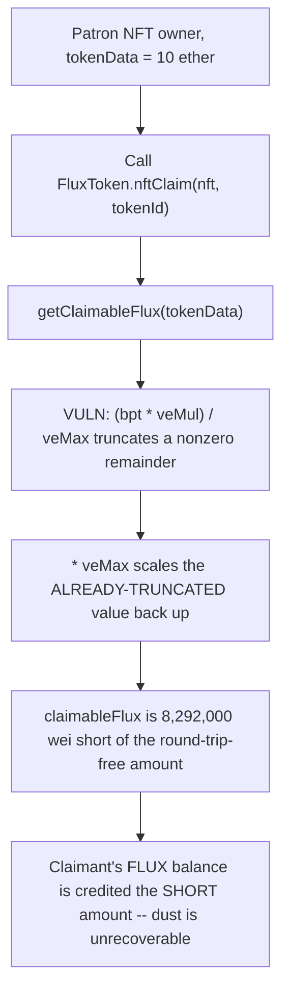
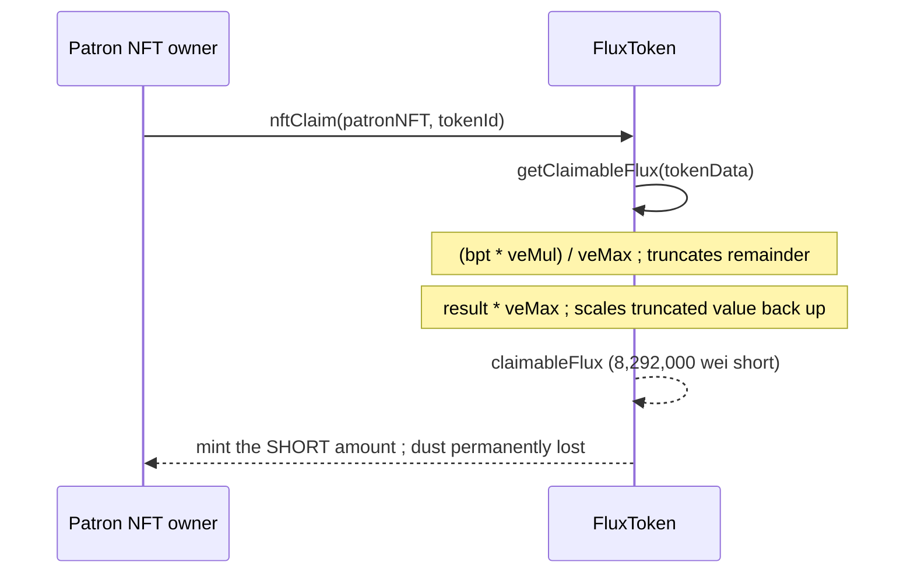

# Alchemix — Precision loss causes minor loss of FLUX when claiming with NFTs

> **Vulnerability classes:** vuln/arithmetic/precision-loss · vuln/reward-theft (dust) · vuln/integer-bounds

> **Reproduction:** a self-contained Foundry PoC that compiles & runs in an
> isolated project with **only `forge-std`** — no fork, no RPC, no `anvil_state`.
> Full trace: [output.txt](output.txt). PoC:
> [test/38185-precision-loss-causes-minor-loss-of-flux-when-claiming-with_exp.sol](test/38185-precision-loss-causes-minor-loss-of-flux-when-claiming-with_exp.sol).

<!-- non-defihacklabs -->
<!-- source-auditvault: https://github.com/Auditware/AuditVault/blob/main/findings/38185-precision-loss-causes-minor-loss-of-flux-when-claiming-with.md -->
<!-- date: 2023-11 -->

---

## Key info

| | |
|---|---|
| **Impact** | **HIGH** (per AuditVault taxonomy) — "contract fails to deliver promised returns, but doesn't lose value"; a real but small (dust) per-claim FLUX shortfall |
| **Protocol** | [Alchemix](https://alchemix.fi) — `alchemix-v2-dao` (`FluxToken`) |
| **Vulnerable code** | `FluxToken.getClaimableFlux()` — redundant `/ veMax` then `* veMax` round-trip |
| **Bug class** | Precision loss from a mathematically-redundant integer-division round-trip |
| **Finding** | Immunefi — Alchemix DAO · #38185 · reporter **marchev** |
| **Report** | [alchemix-finance/alchemix-v2-dao — FluxToken.sol#L224](https://github.com/alchemix-finance/alchemix-v2-dao/blob/f1007439ad3a32e412468c4c42f62f676822dc1f/src/FluxToken.sol#L224) |
| **Source** | [AuditVault](https://github.com/Auditware/AuditVault/blob/main/findings/38185-precision-loss-causes-minor-loss-of-flux-when-claiming-with.md) |
| **Status** | Bug bounty finding — reported responsibly (not exploited on-chain). Reproduced here as a standalone local PoC. |
| **Compiler** | `^0.8.24` (PoC); real contract `^0.8.15` |

This is a **bug-bounty finding**, not a historical on-chain incident. The PoC keeps
`FluxToken.getClaimableFlux()`'s `claimableFlux` assignment **verbatim** (from the
audited commit `f1007439ad3a32e412468c4c42f62f676822dc1f`) and reduces `VotingEscrow`
and the patron NFT to the minimal state the formula reads. `calculateBPT` in this
reduction already applies the `/ BPS` division — that omission is a **separate,
independently-reported bug** (AuditVault #38191) and is fixed here so it doesn't mask
this finding's own (much smaller) precision-loss defect.

---

## TL;DR

1. `getClaimableFlux` computes `claimableFlux = (((bpt * veMul) / veMax) *
   veMax * (fluxPerVe + BPS)) / BPS / fluxMul;`.
2. The `/ veMax` immediately followed by `* veMax` is a **no-op in real-number
   arithmetic** — but Solidity integer division truncates, so this round-trip
   silently discards the remainder of `(bpt * veMul) % veMax` before scaling
   back up.
3. **Harm:** every single claim loses this remainder as **unrecoverable dust**
   — the claimant permanently receives strictly less FLUX than the
   mathematically-equivalent, round-trip-free formula would produce.

---

## The vulnerable code

Verbatim, `FluxToken.sol#L224` (audited commit):

```solidity
// Amount of flux earned in 1 yr from _amount assuming it was deposited for maxtime
claimableFlux = (((bpt * veMul) / veMax) * veMax * (fluxPerVe + BPS)) / BPS / fluxMul;
```

The `/ veMax` then `* veMax` pair is mathematically redundant in real-number
arithmetic (`x / y * y == x` only holds for exact multiples). In Solidity's
truncating integer division, `(bpt * veMul) / veMax` first discards the
remainder of `(bpt * veMul) % veMax`, and then `* veMax` scales the
already-truncated value back up — the discarded remainder is gone for good.

## Root cause

The formula computes an intermediate value (`bpt * veMul`), divides it by
`veMax`, then immediately re-multiplies by the same `veMax` before continuing
the rest of the computation. Because this division/multiplication pair has no
effect other than truncating a remainder, it should simply be removed — the
fix is `claimableFlux = (bpt * veMul * (fluxPerVe + BPS)) / BPS / fluxMul;`,
which is mathematically identical except it doesn't discard the remainder.

## Preconditions

- A patron (or Alchemech) NFT the caller owns, valued via `tokenData`.
- `bpt * veMul` is not an exact multiple of `veMax` (true for almost all real
  `tokenData` values — see the control test below for the one case where the
  bug is a genuine no-op).

## Attack walkthrough

From [output.txt](output.txt):

1. A patron NFT holder owns an NFT with `tokenData = 10 ether` (matching the
   original PoC's input amount).
2. The holder calls `FluxToken.nftClaim(patronNFT, tokenId)`, which calls
   `getClaimableFlux(tokenData)`.
3. The redundant `/ veMax * veMax` round-trip truncates the remainder of
   `(bpt * veMul) % veMax` before the rest of the formula runs.
4. **HARM:** the claimant receives `29999999991708000` FLUX, exactly
   `8,292,000` wei **less** than the `30000000000000000` the round-trip-free
   formula would have produced — a small but real, unrecoverable dust loss on
   this single claim, repeated on every claim in the system.

## Diagrams





## Remediation

Remove the redundant division/multiplication round-trip:

```diff
- claimableFlux = (((bpt * veMul) / veMax) * veMax * (fluxPerVe + BPS)) / BPS / fluxMul;
+ claimableFlux = (bpt * veMul * (fluxPerVe + BPS)) / BPS / fluxMul;
```

## How to reproduce

```bash
cd ~/RustroverProjects/audits/evm-hack-registry/38185-precision-loss-causes-minor-loss-of-flux-when-claiming-with_exp
forge test -vvv
# Fully local — no fork, no RPC, no anvil_state required.
# Expected: all 3 tests PASS:
#   test_exploit_claimant_loses_dust_flux                    (full attack: exact 8,292,000 wei dust loss)
#   test_buggyFormula_loses_precision_vs_roundtripFree_formula (isolates: buggy < round-trip-free)
#   test_control_noRemainder_noLoss                          (control: when bpt*veMul is an exact multiple of veMax, no loss occurs)
```

PoC source: [test/38185-precision-loss-causes-minor-loss-of-flux-when-claiming-with_exp.sol](test/38185-precision-loss-causes-minor-loss-of-flux-when-claiming-with_exp.sol)
— the verbatim vulnerable `claimableFlux` formula, a reduced `veALCX`/patron-NFT,
the single-claim demonstration, and a control test isolating exactly when the
round-trip does (and does not) lose precision.

> Note: `VotingEscrow`'s constants (`MULTIPLIER`, `MAXTIME`, `fluxPerVeALCX`,
> `fluxMultiplier`) are fixed values matching the real deployment defaults, and
> `calculateBPT` here already applies the `/ BPS` division that is missing in
> the *separately-reported* AuditVault #38191 — kept fixed here so it doesn't
> mask this finding's own precision-loss defect. The vulnerable redundant
> round-trip and its dust-loss consequence are verbatim and faithful.

---

## Sources

- **AuditVault finding**: [38185-precision-loss-causes-minor-loss-of-flux-when-claiming-with.md](https://github.com/Auditware/AuditVault/blob/main/findings/38185-precision-loss-causes-minor-loss-of-flux-when-claiming-with.md)
- **Report target**: [alchemix-finance/alchemix-v2-dao — FluxToken.sol](https://github.com/alchemix-finance/alchemix-v2-dao/blob/main/src/FluxToken.sol)
- **Reduced-source provenance**: `alchemix-finance/alchemix-v2-dao@f1007439ad3a32e412468c4c42f62f676822dc1f`, `src/FluxToken.sol` (cloned to `/tmp/classC-src/alchemix-v2-dao` for this reduction)

**Taxonomy** (from AuditVault frontmatter): `lang/solidity` · `platform/immunefi` · `severity/high` · `sector/governance` · `genome/precision-loss` · `genome/variant` · `genome/reward-theft` · `genome/integer-bounds`

---

*Reference: finding **#38185** by **marchev** via [Immunefi](https://immunefi.com) against [alchemix-finance/alchemix-v2-dao](https://github.com/alchemix-finance/alchemix-v2-dao) · curated by [AuditVault](https://github.com/Auditware/AuditVault/blob/main/findings/38185-precision-loss-causes-minor-loss-of-flux-when-claiming-with.md)*
