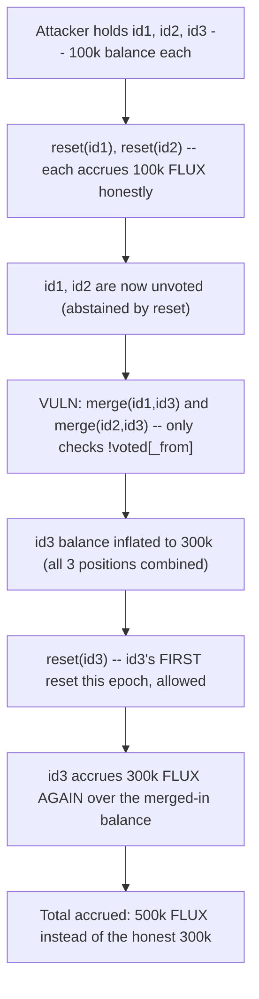
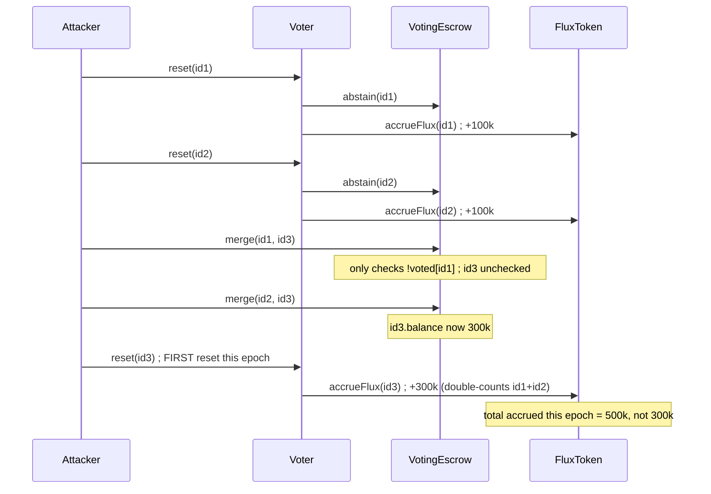

# Alchemix — Attacker can gain infinite FLUX by repeating this attack!

> **Vulnerability classes:** vuln/reward-calculation · vuln/reward-theft · vuln/timestamp-dependence

> **Reproduction:** a self-contained Foundry PoC that compiles & runs in an
> isolated project with **only `forge-std`** — no fork, no RPC, no `anvil_state`.
> Full trace: [output.txt](output.txt). PoC:
> [test/38186-attacker-can-gain-infinitive-flux-by-repeating-this-attack-i_exp.sol](test/38186-attacker-can-gain-infinitive-flux-by-repeating-this-attack-i_exp.sol).

<!-- non-defihacklabs -->
<!-- source-auditvault: https://github.com/Auditware/AuditVault/blob/main/findings/38186-attacker-can-gain-infinitive-flux-by-repeating-this-attack-i.md -->
<!-- date: 2023-11 -->

---

## Key info

| | |
|---|---|
| **Impact** | **HIGH** — unauthorized/repeatable minting of FLUX by double-counting merged veALCX balances within a single epoch, repeatable every epoch |
| **Protocol** | [Alchemix](https://alchemix.fi) — `alchemix-v2-dao` (`VotingEscrow`, `Voter`, `FluxToken`) |
| **Vulnerable code** | `VotingEscrow.merge(uint256 _from, uint256 _to)` — guard only checks `voted[_from]` |
| **Bug class** | Missing counterpart precondition check (only source-side guarded, not destination-side) |
| **Finding** | Immunefi — Alchemix DAO · #38186 · reporter **Minato7namikazi** |
| **Report** | [alchemix-finance/alchemix-v2-dao — Voter.sol](https://github.com/alchemix-finance/alchemix-v2-dao/blob/main/src/Voter.sol) |
| **Source** | [AuditVault](https://github.com/Auditware/AuditVault/blob/main/findings/38186-attacker-can-gain-infinitive-flux-by-repeating-this-attack-i.md) |
| **Status** | Bug bounty finding — reported responsibly (not exploited on-chain). Reproduced here as a standalone local PoC. |
| **Compiler** | `^0.8.24` (PoC); real contract `^0.8.15` |

This is a **bug-bounty finding**, not a historical on-chain incident. The PoC keeps
`VotingEscrow.merge()`'s guard **verbatim** (from the audited commit
`f1007439ad3a32e412468c4c42f62f676822dc1f`) and `Voter.reset()`'s
onlyNewEpoch + abstain + accrueFlux shape verbatim, reducing `VotingEscrow`'s
balance model to fixed per-token amounts (the real contract derives balance
from locked amount + time-decay — irrelevant to a bug about `merge()`
combining balances mid-epoch).

---

## TL;DR

1. `Voter.reset(tokenId)` is capped to **once per epoch per tokenId** by
   `onlyNewEpoch`. It calls `veALCX.abstain(tokenId)` (sets `voted = false`)
   and then accrues FLUX proportional to the token's **current** balance.
2. `VotingEscrow.merge(_from, _to)` only requires `!voted[_from]` — it
   **never checks `voted[_to]`**.
3. An attacker resets 2 of 3 equal-balance positions (each legitimately
   accrues once), then merges **both** into the 3rd position — allowed
   because merge only checks the source tokens, which are now unvoted.
4. **Harm:** the 3rd position's balance is now 3x larger, and it **hasn't
   been reset yet this epoch** — so its first (allowed) reset accrues FLUX
   over the inflated, merged-in balance, double-counting id1 and id2's
   balances a second time within the same epoch. Repeatable every epoch.

---

## The vulnerable code

Verbatim, `VotingEscrow.sol#L618-L619` (audited commit):

```solidity
function merge(uint256 _from, uint256 _to) external {
    require(!voted[_from], "voting in progress for token");
    require(_from != _to, "must be different tokens");
    // ... rest of merge (lock/cooldown/end-time checks, balance transfer) ...
}
```

And `Voter.sol#L183-L192` / `#L105-L109` (the `reset()`/`onlyNewEpoch` flow that
makes the merge exploitable):

```solidity
modifier onlyNewEpoch(uint256 _tokenId) {
    require((block.timestamp / DURATION) * DURATION > lastVoted[_tokenId], "TOKEN_ALREADY_VOTED_THIS_EPOCH");
    _;
}

function reset(uint256 _tokenId) public onlyNewEpoch(_tokenId) {
    // ...
    lastVoted[_tokenId] = block.timestamp;
    _reset(_tokenId);
    IVotingEscrow(veALCX).abstain(_tokenId);      // sets voted[_tokenId] = false
    IFluxToken(FLUX).accrueFlux(_tokenId);        // accrues FLUX for CURRENT balance
}
```

`merge()`'s only precondition on voting state is `!voted[_from]` — there is no
equivalent check on `_to`.

## Root cause

The protocol assumes each veALCX position accrues FLUX **at most once per
epoch**, enforced by `onlyNewEpoch` on `reset()`/`vote()` per `tokenId`. That
per-token cap is sound in isolation — but `merge()` lets an attacker **move
balance between token IDs mid-epoch**, and its only guard (`!voted[_from]`)
checks the token that's *losing* balance, not the token that's *gaining* it.
By resetting two positions first (satisfying `!voted[_from]` for both) and
merging them into a third, not-yet-reset position, the attacker inflates that
third position's balance *before* its own first reset of the epoch — so the
per-token "once per epoch" cap no longer corresponds to "once per unit of
balance per epoch." The merged-in balance gets a second accrual.

## Preconditions

- The attacker controls 3 (or more) veALCX positions with nonzero balance.
- None of the positions have voted/reset yet this epoch (the normal starting
  state of any epoch).

## Attack walkthrough

From [output.txt](output.txt), mirroring the finding's own 3-lock scenario:

1. An attacker holds 3 veALCX positions (id1, id2, id3), each with 100,000
   units of balance.
2. `reset(id1)` and `reset(id2)` each run for the first time this epoch —
   each legitimately accrues 100,000 units of FLUX and sets `voted = false`
   for its own token.
3. `merge(id1, id3)` and `merge(id2, id3)` both succeed: `!voted[id1]` and
   `!voted[id2]` are satisfied (both just abstained), and `id3`'s own state
   is never checked. `id3`'s balance grows to 300,000 (all three positions
   combined).
4. `reset(id3)` runs for the **first time this epoch** (allowed —
   `onlyNewEpoch` only tracks `id3`'s own `lastVoted`) and accrues FLUX
   proportional to its **new, inflated** 300,000-unit balance.
5. **HARM:** total FLUX accrued this epoch is `500,000` units — `100,000`
   each from id1/id2's honest resets, **plus `300,000` again** from id3's
   reset over the same merged-in balances — instead of the honest `300,000`
   a single reset per original position should produce. The excess
   (`200,000`, exactly `id1 + id2`'s balance) is pure double-counting, and
   the sequence is repeatable every epoch.

## Diagrams





## Remediation

Require the destination token also be unvoted before allowing a merge:

```diff
 function merge(uint256 _from, uint256 _to) external {
     require(!voted[_from], "voting in progress for token");
+    require(!voted[_to], "voting in progress for token");
     require(_from != _to, "must be different tokens");
     // ...
 }
```

## How to reproduce

```bash
cd ~/RustroverProjects/audits/evm-hack-registry/38186-attacker-can-gain-infinitive-flux-by-repeating-this-attack-i_exp
forge test -vvv
# Fully local — no fork, no RPC, no anvil_state required.
# Expected: all 3 tests PASS:
#   test_exploit_mergeThenReset_doubleCountsFlux   (full attack: 500k FLUX claimed instead of 300k)
#   test_buggyMerge_ignoresToTokenVotedState        (isolates: merge succeeds into a voted-in-progress token)
#   test_control_fixedMerge_blocksMergeIntoVotedToken (control: the fix reverts the merge)
```

PoC source: [test/38186-attacker-can-gain-infinitive-flux-by-repeating-this-attack-i_exp.sol](test/38186-attacker-can-gain-infinitive-flux-by-repeating-this-attack-i_exp.sol)
— the verbatim vulnerable `merge()` guard and `reset()`/`onlyNewEpoch` flow, a
reduced fixed-balance veALCX, the 3-position double-accrual demonstration, and
a control test with the fix applied.

> Note: `VotingEscrow`'s balance model here is a fixed per-token amount set
> directly in setup (the real contract derives balance from locked amount +
> linear time-decay, and `claimableFlux` applies a fixed `fluxPerVeALCX`
> ratio) — both are orthogonal to this bug, which is entirely about `merge()`
> moving balance between token IDs mid-epoch while its per-token
> once-per-epoch reset cap doesn't account for balance transfers. The
> vulnerable missing `!voted[_to]` check and its double-accrual consequence
> are verbatim and faithful. The Playground's `run()` uses no time-warp
> cheatcode — the whole sequence executes within a single epoch/transaction,
> exactly as the finding describes ("didn't use reset in the new epoch yet").

---

## Sources

- **AuditVault finding**: [38186-attacker-can-gain-infinitive-flux-by-repeating-this-attack-i.md](https://github.com/Auditware/AuditVault/blob/main/findings/38186-attacker-can-gain-infinitive-flux-by-repeating-this-attack-i.md)
- **Report target**: [alchemix-finance/alchemix-v2-dao — Voter.sol](https://github.com/alchemix-finance/alchemix-v2-dao/blob/main/src/Voter.sol)
- **Reduced-source provenance**: `alchemix-finance/alchemix-v2-dao@f1007439ad3a32e412468c4c42f62f676822dc1f`, `src/VotingEscrow.sol` + `src/Voter.sol` + `src/FluxToken.sol` (cloned to `/tmp/classC-src/alchemix-v2-dao` for this reduction)

**Taxonomy** (from AuditVault frontmatter): `lang/solidity` · `platform/immunefi` · `severity/high` · `sector/governance` · `sector/stable` · `genome/reward-calculation` · `genome/reward-theft` · `genome/timestamp-dependence`

---

*Reference: finding **#38186** by **Minato7namikazi** via [Immunefi](https://immunefi.com) against [alchemix-finance/alchemix-v2-dao](https://github.com/alchemix-finance/alchemix-v2-dao) · curated by [AuditVault](https://github.com/Auditware/AuditVault/blob/main/findings/38186-attacker-can-gain-infinitive-flux-by-repeating-this-attack-i.md)*
