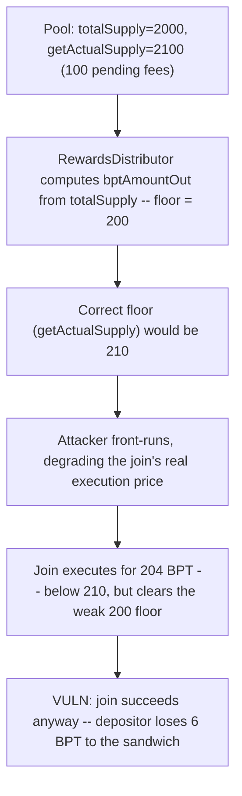
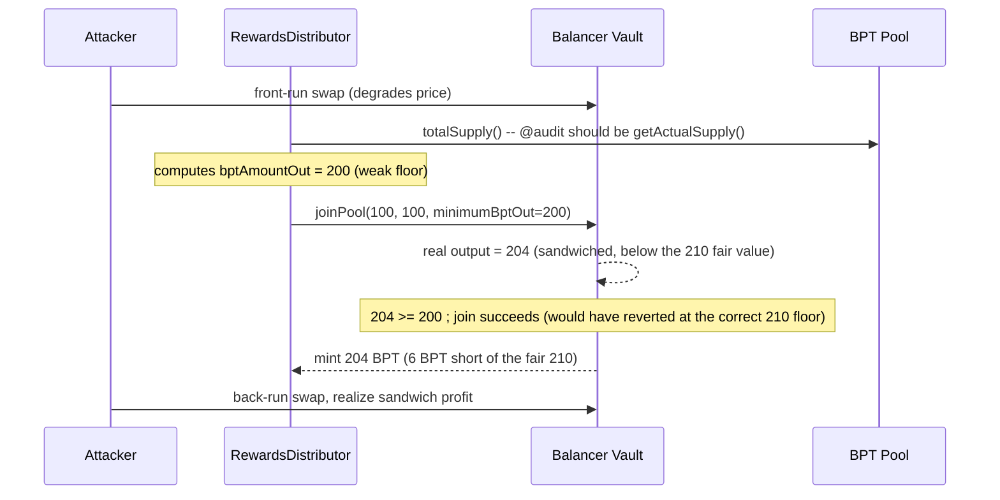

# Alchemix — `getActualSupply` should be used instead of `totalSupply` for Balancer pools

> **Vulnerability classes:** vuln/wrong-condition · vuln/sandwich · vuln/fot-slippage · vuln/frontrun-exposure

> **Reproduction:** a self-contained Foundry PoC that compiles & runs in an
> isolated project with **only `forge-std`** — no fork, no RPC, no `anvil_state`.
> Full trace: [output.txt](output.txt). PoC:
> [test/38187-getactualsupply-should-be-used-instead-of-totalsupply-for-ba_exp.sol](test/38187-getactualsupply-should-be-used-instead-of-totalsupply-for-ba_exp.sol).

<!-- non-defihacklabs -->
<!-- source-auditvault: https://github.com/Auditware/AuditVault/blob/main/findings/38187-getactualsupply-should-be-used-instead-of-totalsupply-for-ba.md -->
<!-- date: 2023-11 -->

---

## Key info

| | |
|---|---|
| **Impact** | **HIGH** — theft of unclaimed yield: a weak slippage floor lets a sandwiched Balancer join through, silently costing the depositor BPT |
| **Protocol** | [Alchemix](https://alchemix.fi) — `alchemix-v2-dao` (`RewardsDistributor`, Balancer WeightedPool integration) |
| **Vulnerable code** | `RewardsDistributor._depositIntoBalancerPool` — uses `totalSupply()` instead of `getActualSupply()` |
| **Bug class** | Wrong slippage-protection base value (excludes accrued-but-unminted protocol fees) |
| **Finding** | Immunefi — Alchemix DAO · #38187 · reporter **0xAnmol** |
| **Report** | [alchemix-finance/alchemix-v2-dao — RewardsDistributor.sol#L410-L416](https://github.com/alchemix-finance/alchemix-v2-dao/blob/f1007439ad3a32e412468c4c42f62f676822dc1f/src/RewardsDistributor.sol#L410-L416) |
| **Source** | [AuditVault](https://github.com/Auditware/AuditVault/blob/main/findings/38187-getactualsupply-should-be-used-instead-of-totalsupply-for-ba.md) |
| **Status** | Bug bounty finding — reported responsibly (not exploited on-chain). Reproduced here as a standalone local PoC. |
| **Compiler** | `^0.8.24` (PoC); real contract `^0.8.15` |

This is a **bug-bounty finding**, not a historical on-chain incident. The PoC keeps
`_depositIntoBalancerPool`'s vulnerable `balancerPool.totalSupply()` call **verbatim
in effect** (from the audited commit `f1007439ad3a32e412468c4c42f62f676822dc1f`,
`RewardsDistributor.sol#L410-L416`) and reduces Balancer's WeightedPool join math
(a full invariant-ratio calculation) to a proportional model that preserves the
exact property the finding is about: `totalSupply()` excludes accrued-but-unminted
protocol fees, `getActualSupply()` includes them, and using the smaller value
produces a weaker slippage floor.

---

## TL;DR

1. `_depositIntoBalancerPool` computes the join's `bptAmountOut` (the
   minimum-output / slippage-protection floor) from
   `IERC20(balancerPool).totalSupply()`.
2. Real Balancer pools accrue protocol fees that are **owed but not yet
   minted** — `totalSupply()` excludes them, `getActualSupply()` includes
   them.
3. Because `totalSupply()` **understates** the pool's true supply, the
   computed floor is smaller (weaker) than the correct one.
4. **Harm:** a sandwich attack that degrades the join's real execution price
   can still clear this weak floor, letting the join execute with **less
   BPT than the depositor is fairly owed** — where the correct
   (`getActualSupply()`-based) floor would have reverted the same
   execution, protecting the depositor.

---

## The vulnerable code

Verbatim, `RewardsDistributor.sol#L399-L416` (audited commit):

```solidity
function _depositIntoBalancerPool(
    uint256 _wethAmount,
    uint256 _alcxAmount,
    uint256[] memory _normalizedWeights
) internal {
    (, uint256[] memory balances, ) = balancerVault.getPoolTokens(balancerPoolId);

    uint256[] memory amountsIn = new uint256[](2);
    amountsIn[0] = _wethAmount;
    amountsIn[1] = _alcxAmount;

    uint256 bptAmountOut = WeightedMath._calcBptOutGivenExactTokensIn(
        balances,
        _normalizedWeights,
        amountsIn,
        IERC20(address(balancerPool)).totalSupply(), //@audit should use getActualSupply
        balancerPool.getSwapFeePercentage()
    );
    // ... bptAmountOut is passed as the join's minimumBPT / slippage floor ...
}
```

Balancer's own docs recommend `getActualSupply()` for exactly this purpose
(see [valuing BPT](https://docs.balancer.fi/concepts/advanced/valuing-bpt/valuing-bpt.html#getting-bpt-supply)):
`totalSupply()` on a `WeightedPool` excludes protocol fees that have accrued
but not yet been minted to the fee collector, so it always underreports the
pool's true supply.

## Root cause

Balancer's real join math (`WeightedMath._calcBptOutGivenExactTokensIn`)
always uses the pool's **true, current** state regardless of what the caller
believes the supply to be — the caller's `bptAmountOut` argument is purely a
**minimum-output guard** (if the real computed output falls below it, the
join reverts). By computing that guard from the *understated* `totalSupply()`
instead of the correct `getActualSupply()`, `_depositIntoBalancerPool` sets a
floor that is smaller than it should be — silently permitting joins that
execute at a worse price than a properly-protected deposit would tolerate.
This is precisely the scenario slippage protection exists to prevent:
a sandwich attack degrading the join's execution price just enough to clear
the weak floor but not the correct one.

## Preconditions

- The Balancer pool has accrued protocol fees not yet minted (`pendingProtocolFee
  > 0`) — the normal steady state of any actively-traded Balancer pool with
  non-zero protocol fees.
- An attacker can front-run the deposit transaction (standard MEV/sandwich
  capability — no special privilege required).

## Attack walkthrough

From [output.txt](output.txt):

1. The pool holds 1000 WETH / 1000 ALCX reserves, `totalSupply() = 2000`
   BPT, and `getActualSupply() = 2100` BPT (100 units of pending, unminted
   protocol fees).
2. `RewardsDistributor` is about to deposit 100 WETH + 100 ALCX. The
   **correct** floor (using `getActualSupply()`) would be `210` BPT; the
   **vulnerable** floor (using `totalSupply()`) is only `200` BPT.
3. An attacker front-runs the deposit, degrading its real execution price.
4. The join executes for `204` BPT — below the correct `210` BPT floor, but
   above the weak `200` BPT floor computed by the buggy code, so **it
   succeeds anyway**.
5. **HARM:** the depositor receives `204` BPT instead of the `210` fairly
   owed — a `6` BPT loss to the sandwich that the correct floor would have
   caught and reverted.

## Diagrams





## Remediation

Use `getActualSupply()` instead of `totalSupply()` when computing the join's
slippage floor:

```diff
 uint256 bptAmountOut = WeightedMath._calcBptOutGivenExactTokensIn(
     balances,
     _normalizedWeights,
     amountsIn,
-    IERC20(address(balancerPool)).totalSupply(),
+    IBalancerPool(address(balancerPool)).getActualSupply(),
     balancerPool.getSwapFeePercentage()
 );
```

## How to reproduce

```bash
cd ~/RustroverProjects/audits/evm-hack-registry/38187-getactualsupply-should-be-used-instead-of-totalsupply-for-ba_exp
forge test -vvv
# Fully local — no fork, no RPC, no anvil_state required.
# Expected: all 3 tests PASS:
#   test_exploit_weakFloorLetsSandwichedJoinThrough  (full attack: 204 BPT received vs 210 fairly owed)
#   test_buggyMinimum_isSmallerThanCorrectMinimum     (isolates: totalSupply-based floor < getActualSupply-based floor)
#   test_control_fixedMinimum_revertsTheSandwichedJoin (control: the fix reverts the identical sandwiched join)
```

PoC source: [test/38187-getactualsupply-should-be-used-instead-of-totalsupply-for-ba_exp.sol](test/38187-getactualsupply-should-be-used-instead-of-totalsupply-for-ba_exp.sol)
— the verbatim-in-effect vulnerable `totalSupply()` usage, a reduced
Balancer pool/vault preserving the `totalSupply()` vs `getActualSupply()`
distinction, the sandwich demonstration, and a control test with the fix
applied.

> Note: Balancer's real `WeightedMath._calcBptOutGivenExactTokensIn` is a full
> invariant-ratio calculation over pool weights and swap fees; this reduction
> replaces it with a proportional model (`(amountsIn) * supply / poolValue`)
> that preserves the exact property this finding is about — using a smaller
> supply value produces a smaller (weaker) output/floor. The sandwich's price
> degradation is modeled as a fixed ~2.5% haircut on the real, honest
> computation rather than full constant-product/weighted-invariant math. The
> vulnerable `totalSupply()`-vs-`getActualSupply()` choice and its
> weak-floor consequence are verbatim and faithful.

---

## Sources

- **AuditVault finding**: [38187-getactualsupply-should-be-used-instead-of-totalsupply-for-ba.md](https://github.com/Auditware/AuditVault/blob/main/findings/38187-getactualsupply-should-be-used-instead-of-totalsupply-for-ba.md)
- **Report target**: [alchemix-finance/alchemix-v2-dao — RewardsDistributor.sol](https://github.com/alchemix-finance/alchemix-v2-dao/blob/main/src/RewardsDistributor.sol)
- **Reduced-source provenance**: `alchemix-finance/alchemix-v2-dao@f1007439ad3a32e412468c4c42f62f676822dc1f`, `src/RewardsDistributor.sol` (cloned to `/tmp/classC-src/alchemix-v2-dao` for this reduction)
- **Referenced external docs**: [Balancer — valuing BPT](https://docs.balancer.fi/concepts/advanced/valuing-bpt/valuing-bpt.html#getting-bpt-supply), [balancer-v2-monorepo WeightedPool.sol#L332](https://github.com/balancer/balancer-v2-monorepo/blob/ac63d64018c6331248c7d77b9f317a06cced0243/pkg/pool-weighted/contracts/WeightedPool.sol#L332)

**Taxonomy** (from AuditVault frontmatter): `lang/solidity` · `platform/immunefi` · `severity/high` · `sector/dex` · `sector/governance` · `genome/wrong-condition` · `genome/sandwich` · `genome/fot-slippage` · `genome/frontrun-exposure`

---

*Reference: finding **#38187** by **0xAnmol** via [Immunefi](https://immunefi.com) against [alchemix-finance/alchemix-v2-dao](https://github.com/alchemix-finance/alchemix-v2-dao) · curated by [AuditVault](https://github.com/Auditware/AuditVault/blob/main/findings/38187-getactualsupply-should-be-used-instead-of-totalsupply-for-ba.md)*
