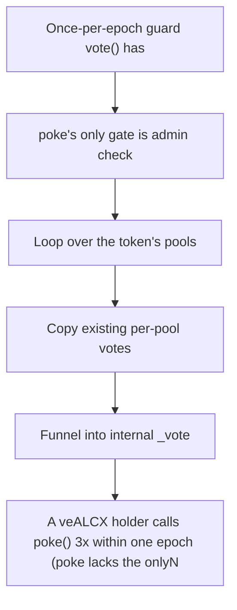

# Alchemix: A veALCX holder calls poke() 3x within one epoch (poke lacks the onlyNewEpoch guard that v

> **Vulnerability classes:** vuln/unfair-mint
>
> **Reproduction:** a faithful minimal reproduction of the vulnerable finding — the vulnerable function is reproduced **verbatim** (marked `@>`) with faithful minimal doubles; local deploy, no fork.

<!-- source-auditvault: https://github.com/Auditware/AuditVault/blob/main/findings/38189-lack-of-access-control-in-poke-function-allows-in-unlimited.md -->

## Root cause

A veALCX holder calls poke() 3x within one epoch (poke lacks the onlyNewEpoch guard that vote()/reset() have), re-accruing FLUX each call so unclaimedFlux reaches 3x the legitimate per-epoch entitlement — 2e18 excess FLUX over-minted to the attacker.

```solidity
        // Previous boost will be taken into account with weights being pulled from the votes mapping
        uint256 _boost = 0;

        if (msg.sender != admin) {
            require(IVotingEscrow(veALCX).isApprovedOrOwner(msg.sender, _tokenId), "not approved or owner");
        }
```

## Why it's exploitable here

A veALCX holder calls poke() 3x within one epoch (poke lacks the onlyNewEpoch guard that vote()/reset() have), re-accruing FLUX each call so unclaimedFlux reaches 3x the legitimate per-epoch entitlement — 2e18 excess FLUX over-minted to the attacker.

## Attack path



## Marked-line walkthrough (Playground)

The EVM Playground pins each step to the exact executed source line in `0xce01759b82…`:

1. **L138** — Once-per-epoch guard vote() has: `vote()` enforces one action per epoch via this `lastVoted` check — the exact guard `poke()` is missing, which is the whole bug.
2. **L155** — poke's only gate is admin check: Root cause: `poke()`'s sole check is `msg.sender != admin`, with no per-epoch guard, so any holder can re-poke repeatedly within one epoch.
3. **L163** — Loop over the token's pools: poke iterates the token's pools to rebuild its current vote weights before re-casting them.
4. **L164** — Copy existing per-pool votes: Each pool's prior weight is read from `votes[_tokenId]`, so poke replays the same vote and re-triggers FLUX accrual every call.
5. **L170** — Funnel into internal _vote: poke calls `_vote`, the shared routine that accrues FLUX — with no epoch check, each poke re-runs it and re-accrues.
6. **L176** — Stamp lastVoted timestamp: `_vote` updates `lastVoted`, but because poke never reads it, this stamp never stops the repeated accrual.
7. **L185** — Epoch length is two weeks: `DURATION` defines the 2-week epoch that the missing guard was meant to bound FLUX accrual to.

## PoC

Registry (Foundry, local deploy — verbatim vulnerable source + harm-asserting test + negative control):

```bash
cd 38189-lack-of-access-control-in-poke-function-allows-in-unlimited_exp
forge test -vvv
```

The browser Playground replays the same synthetic opcode-for-opcode and measures the harm: **A veALCX holder calls poke() 3x within one epoch (poke lacks the onlyNewEpoch guard that vote()/reset() have), re-accruing FLUX each call so**. Both gates are green (registry `forge test` PASS + Playground `_verify-poc` **VERDICT: PASS**).
