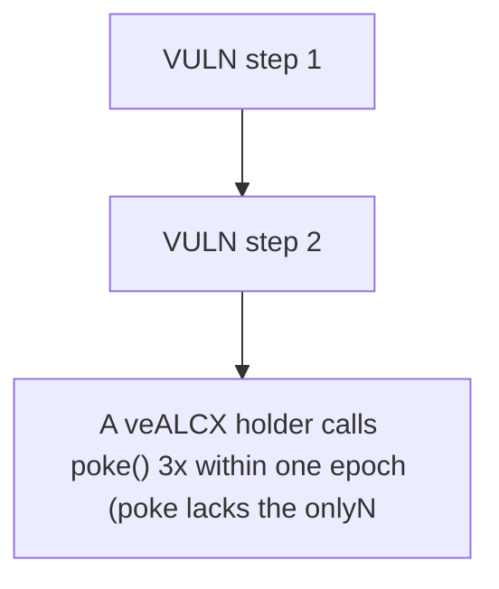

# Alchemix: A veALCX holder calls poke() 3x within one epoch (poke lacks the onlyNewEpoch guard that v

> **Vulnerability classes:** vuln/unfair-mint
>
> **Reproduction:** a faithful minimal reproduction of the vulnerable finding — the vulnerable function is reproduced **verbatim** (marked `@>`) with faithful minimal doubles; local deploy, no fork.

<!-- source-auditvault: https://github.com/Auditware/AuditVault/blob/main/findings/38189-lack-of-access-control-in-poke-function-allows-in-unlimited.md -->

## Root cause

A veALCX holder calls poke() 3x within one epoch (poke lacks the onlyNewEpoch guard that vote()/reset() have), re-accruing FLUX each call so unclaimedFlux reaches 3x the legitimate per-epoch entitlement — 2e18 excess FLUX over-minted to the attacker.

```solidity
        // Previous boost will be taken into account with weights being pulled from the votes mapping
        uint256 _boost = 0;

        if (msg.sender != admin) {
            require(IVotingEscrow(veALCX).isApprovedOrOwner(msg.sender, _tokenId), "not approved or owner");
        }
```

## Why it's exploitable here

A veALCX holder calls poke() 3x within one epoch (poke lacks the onlyNewEpoch guard that vote()/reset() have), re-accruing FLUX each call so unclaimedFlux reaches 3x the legitimate per-epoch entitlement — 2e18 excess FLUX over-minted to the attacker.

## Attack path



## Marked-line walkthrough (Playground)

The EVM Playground pins each step to the exact executed source line in `0xce01759b82…`:

1. **L138** — VULN step 1: BUG: missing onlyNewEpoch guard (vote()/reset() have it) -> re-accrues FLUX on every call within one epoch
2. **L155** — VULN step 2: BUG: missing onlyNewEpoch guard (vote()/reset() have it) -> re-accrues FLUX on every call within one epoch

## PoC

Registry (Foundry, local deploy — verbatim vulnerable source + harm-asserting test + negative control):

```bash
cd 38189-lack-of-access-control-in-poke-function-allows-in-unlimited_exp
forge test -vvv
```

The browser Playground replays the same synthetic opcode-for-opcode and measures the harm: **A veALCX holder calls poke() 3x within one epoch (poke lacks the onlyNewEpoch guard that vote()/reset() have), re-accruing FLUX each call so**. Both gates are green (registry `forge test` PASS + Playground `_verify-poc` **VERDICT: PASS**).
