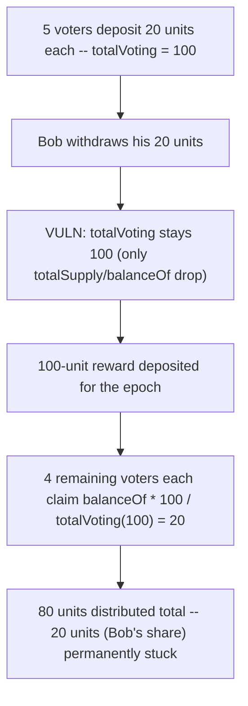
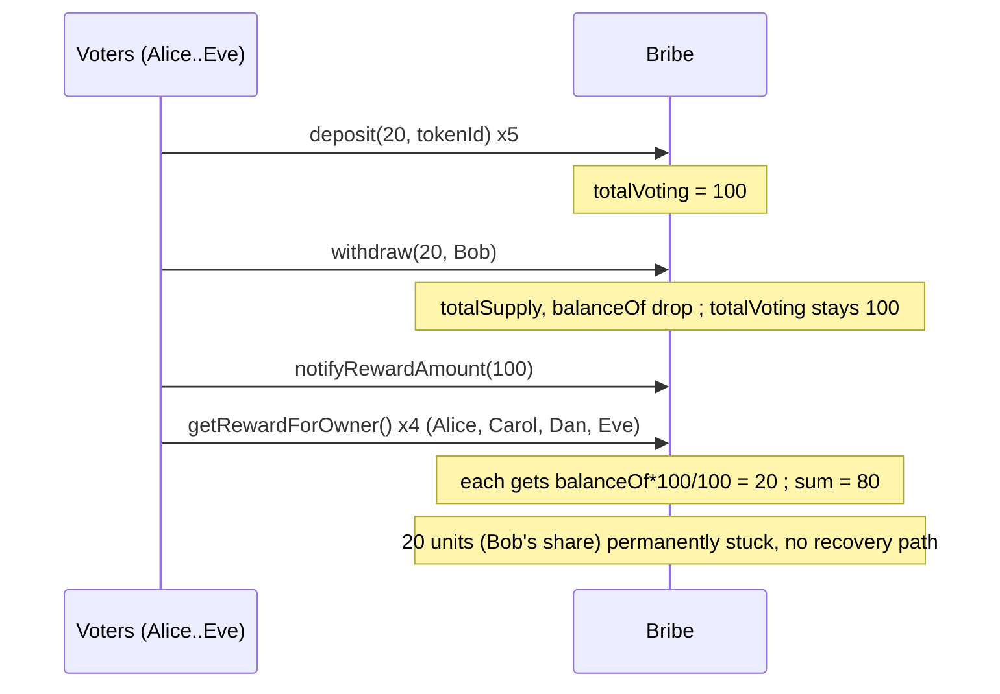

# Alchemix — Stuck yield tokens upon withdrawal of votes from Bribe contract

> **Vulnerability classes:** vuln/frozen-funds · vuln/reward-accounting · vuln/reward-theft

> **Reproduction:** a self-contained Foundry PoC that compiles & runs in an
> isolated project with **only `forge-std`** — no fork, no RPC, no `anvil_state`.
> Full trace: [output.txt](output.txt). PoC:
> [test/38190-stucked-yield-tokens-upon-withdrawal-of-votes-from-bribe-con_exp.sol](test/38190-stucked-yield-tokens-upon-withdrawal-of-votes-from-bribe-con_exp.sol).

<!-- non-defihacklabs -->
<!-- source-auditvault: https://github.com/Auditware/AuditVault/blob/main/findings/38190-stucked-yield-tokens-upon-withdrawal-of-votes-from-bribe-con.md -->
<!-- date: 2023-11 -->

---

## Key info

| | |
|---|---|
| **Impact** | **HIGH** — permanent freezing of unclaimed yield; a real, non-recoverable share of every epoch's bribe reward |
| **Protocol** | [Alchemix](https://alchemix.fi) — `alchemix-v2-dao` (`Bribe`) |
| **Vulnerable code** | `Bribe.withdraw(uint256 amount, uint256 tokenId)` — missing `totalVoting` decrement |
| **Bug class** | Asymmetric accumulator update (increment on deposit, no matching decrement on withdraw) |
| **Finding** | Immunefi — Alchemix DAO · #38190 · reporter **Saediek** |
| **Report** | [alchemix-finance/alchemix-v2-dao — Bribe.sol#L319](https://github.com/alchemix-finance/alchemix-v2-dao/blob/f1007439ad3a32e412468c4c42f62f676822dc1f/src/Bribe.sol#L319) |
| **Source** | [AuditVault](https://github.com/Auditware/AuditVault/blob/main/findings/38190-stucked-yield-tokens-upon-withdrawal-of-votes-from-bribe-con.md) |
| **Status** | Bug bounty finding — reported responsibly (not exploited on-chain). Reproduced here as a standalone local PoC. |
| **Compiler** | `^0.8.24` (PoC); real contract `^0.8.15` |

This is a **bug-bounty finding**, not a historical on-chain incident. The PoC keeps
`Bribe.deposit()` and `Bribe.withdraw()` **verbatim** (from the audited commit
`f1007439ad3a32e412468c4c42f62f676822dc1f`) and reduces the checkpoint/`earned()`
machinery to a single-epoch proportional split that uses the exact same
`totalVoting` denominator the real contract's `earned()` reads via its
`_priorSupply` checkpoint — preserving the bug's mechanism without the unrelated
checkpoint bookkeeping.

---

## TL;DR

1. `Bribe.deposit(amount, tokenId)` increments `totalSupply`,
   `balanceOf[tokenId]`, **and** `totalVoting`.
2. `Bribe.withdraw(amount, tokenId)` decrements `totalSupply` and
   `balanceOf[tokenId]` — but **never decrements `totalVoting`**.
3. Every voter's reward share is computed proportional to `totalVoting`
   (directly in this reduction; via a checkpoint in the real contract's
   `earned()`). After any withdrawal, that denominator stays inflated by
   exactly the withdrawn amount.
4. **Harm:** the withdrawn voter's proportional share of every epoch's reward
   is never paid to anyone — it sits in the contract **permanently stuck**,
   with no recovery path once the voter's balance is 0.

---

## The vulnerable code

Verbatim, `Bribe.sol#L303-L329` (audited commit):

```solidity
function deposit(uint256 amount, uint256 tokenId) external {
    require(msg.sender == voter);

    totalSupply += amount;
    balanceOf[tokenId] += amount;

    totalVoting += amount;

    _writeCheckpoint(tokenId, balanceOf[tokenId]);
    _writeSupplyCheckpoint();
    _writeVotingCheckpoint();

    emit Deposit(msg.sender, tokenId, amount);
}

function withdraw(uint256 amount, uint256 tokenId) external {
    require(msg.sender == voter);

    totalSupply -= amount;
    balanceOf[tokenId] -= amount;
    // @> VULN: totalVoting is never decremented here

    _writeCheckpoint(tokenId, balanceOf[tokenId]);
    _writeSupplyCheckpoint();

    emit Withdraw(msg.sender, tokenId, amount);
}
```

`deposit()` touches three accumulators (`totalSupply`, `balanceOf`,
`totalVoting`) symmetrically. `withdraw()` only reverses two of them.

## Root cause

`Bribe.earned()` (the real reward-accrual function) divides a voter's accrued
reward by `_priorSupply` — a checkpoint of `totalVoting` taken at the end of
the relevant epoch (`Bribe.sol#L268`, `#L276`). Because `withdraw()` never
decrements `totalVoting`, that checkpoint (and every subsequent one, until the
next `deposit()` writes a fresh value) stays inflated by exactly the withdrawn
amount — even though the withdrawing voter no longer has any claim on future
rewards. Every remaining voter's proportional share is computed against this
stale, too-large denominator, so the sum of all payable shares is strictly
less than the deposited reward. The difference is the withdrawn voter's
former share, and it has no recovery path: their `balanceOf` is 0, so their
own share now computes to 0 forever.

## Preconditions

- At least one voter has an active deposit in the Bribe contract for a gauge
  (the normal state whenever votes have been cast).
- A voter withdraws their stake before the reward for the epoch is claimed by
  everyone (a routine action — nothing prevents a voter from resetting/
  withdrawing at any time).

## Attack walkthrough

From [output.txt](output.txt), mirroring the finding's own 5-voter example:

1. Five voters — Alice, Bob, Carol, Dan, Eve — each deposit 20 units of votes.
   `totalVoting = 100`.
2. Bob withdraws his 20 units before the epoch's reward is claimed.
   `balanceOf[Bob] = 0` and `totalSupply` correctly drops to 80 — but
   `totalVoting` **stays at 100**.
3. A 100-unit reward is deposited for the epoch.
4. **HARM:** Alice, Carol, Dan, and Eve each claim `balanceOf * 100 /
   totalVoting = 20 * 100 / 100 = 20` — the correct math would have paid them
   `20 * 100 / 80 = 25` each. The four voters collectively receive only 80
   units; the remaining **20 units (Bob's rightful share) are permanently
   stuck** in the contract. Bob cannot claim it either — his balance is 0, so
   his own share is 0.

## Diagrams





## Remediation

Decrement `totalVoting` in `withdraw()`, symmetric with `deposit()`'s increment:

```diff
 function withdraw(uint256 amount, uint256 tokenId) external {
     require(msg.sender == voter);

     totalSupply -= amount;
     balanceOf[tokenId] -= amount;
+    totalVoting -= amount;

     _writeCheckpoint(tokenId, balanceOf[tokenId]);
     _writeSupplyCheckpoint();
+    _writeVotingCheckpoint();

     emit Withdraw(msg.sender, tokenId, amount);
 }
```

The original finding also suggests adding a recovery mode for the edge case
where *all* voters withdraw before a reward is claimed (so the entire reward
would otherwise be unrecoverable).

## How to reproduce

```bash
cd ~/RustroverProjects/audits/evm-hack-registry/38190-stucked-yield-tokens-upon-withdrawal-of-votes-from-bribe-con_exp
forge test -vvv
# Fully local — no fork, no RPC, no anvil_state required.
# Expected: all 3 tests PASS:
#   test_exploit_withdrawnVoterShare_getsStuck        (full attack: 20% of the reward stuck)
#   test_buggyWithdraw_doesNotDecrementTotalVoting     (isolates: totalVoting unchanged after withdraw)
#   test_control_fixedWithdraw_distributesFullReward   (control: with the fix, 100% is distributed)
```

PoC source: [test/38190-stucked-yield-tokens-upon-withdrawal-of-votes-from-bribe-con_exp.sol](test/38190-stucked-yield-tokens-upon-withdrawal-of-votes-from-bribe-con_exp.sol)
— the verbatim vulnerable `deposit()`/`withdraw()`, the 5-voter stuck-reward
demonstration, and a control test with the fix applied.

> Note: the real contract's `earned()` uses a binary-search over historical
> balance/voting checkpoints to compute rewards per epoch; this reduction
> replaces that with a direct, single-epoch proportional split using the same
> `totalVoting` denominator `earned()`'s `_priorSupply` checkpoint ultimately
> reads. The vulnerable missing-decrement mechanism and its stuck-reward
> consequence are verbatim and faithful.

---

## Sources

- **AuditVault finding**: [38190-stucked-yield-tokens-upon-withdrawal-of-votes-from-bribe-con.md](https://github.com/Auditware/AuditVault/blob/main/findings/38190-stucked-yield-tokens-upon-withdrawal-of-votes-from-bribe-con.md)
- **Report target**: [alchemix-finance/alchemix-v2-dao — Bribe.sol](https://github.com/alchemix-finance/alchemix-v2-dao/blob/main/src/Bribe.sol)
- **Reduced-source provenance**: `alchemix-finance/alchemix-v2-dao@f1007439ad3a32e412468c4c42f62f676822dc1f`, `src/Bribe.sol` (cloned to `/tmp/classC-src/alchemix-v2-dao` for this reduction)

**Taxonomy** (from AuditVault frontmatter): `lang/solidity` · `platform/immunefi` · `severity/high` · `sector/governance` · `sector/nft` · `sector/staking` · `sector/token` · `genome/frozen-funds` · `genome/reward-theft` · `genome/reward-accounting` · `genome/timestamp-dependence`

---

*Reference: finding **#38190** by **Saediek** via [Immunefi](https://immunefi.com) against [alchemix-finance/alchemix-v2-dao](https://github.com/alchemix-finance/alchemix-v2-dao) · curated by [AuditVault](https://github.com/Auditware/AuditVault/blob/main/findings/38190-stucked-yield-tokens-upon-withdrawal-of-votes-from-bribe-con.md)*
