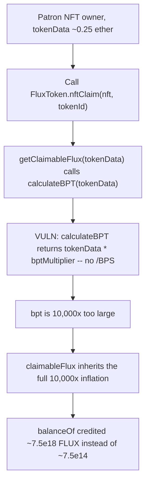
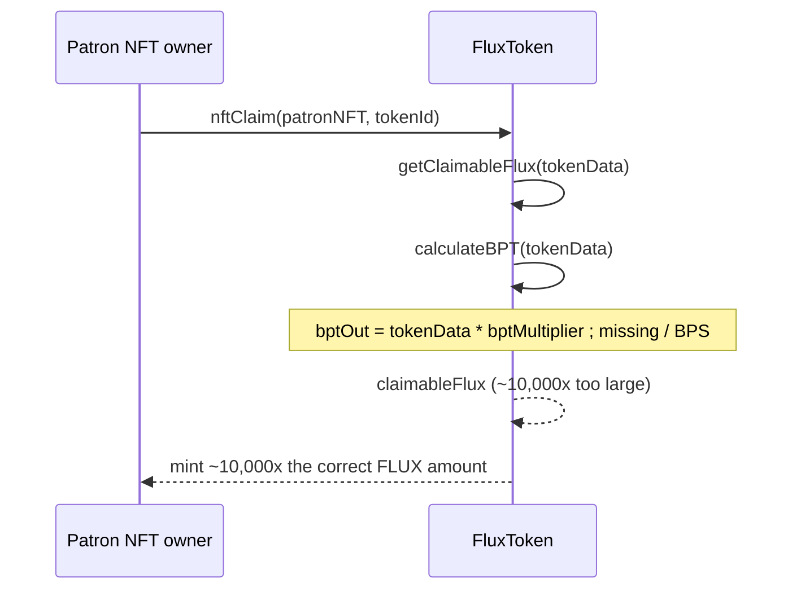

# Alchemix — `FluxToken.calculateBPT` uses wrong algorithm causing `nftClaim` revenue to be 10,000x higher than expected

> **Vulnerability classes:** vuln/precision-loss · vuln/reward-theft · vuln/access-roles

> **Reproduction:** a self-contained Foundry PoC that compiles & runs in an
> isolated project with **only `forge-std`** — no fork, no RPC, no `anvil_state`.
> Full trace: [output.txt](output.txt). PoC:
> [test/38191-fluxtokencalculatebpt-uses-wrong-algorithm-causing-fluxtoken_exp.sol](test/38191-fluxtokencalculatebpt-uses-wrong-algorithm-causing-fluxtoken_exp.sol).

<!-- non-defihacklabs -->
<!-- source-auditvault: https://github.com/Auditware/AuditVault/blob/main/findings/38191-fluxtokencalculatebpt-uses-wrong-algorithm-causing-fluxtoken.md -->
<!-- date: 2023-11 -->

---

## Key info

| | |
|---|---|
| **Impact** | **HIGH** — a single patron NFT claim mints ~10,000x the FLUX the documented 0.4% ratio should produce |
| **Protocol** | [Alchemix](https://alchemix.fi) — `alchemix-v2-dao` (`FluxToken`) |
| **Vulnerable code** | `FluxToken.calculateBPT(uint256 _amount)` — missing division by `BPS` |
| **Bug class** | Missing scale-factor division on a bps-denominated multiplier |
| **Finding** | Immunefi — Alchemix DAO · #38191 · reporter **yttriumzz** |
| **Report** | [alchemix-finance/alchemix-v2-dao — FluxToken.sol](https://github.com/alchemix-finance/alchemix-v2-dao/blob/f1007439ad3a32e412468c4c42f62f676822dc1f/src/FluxToken.sol#L232-L234) |
| **Source** | [AuditVault](https://github.com/Auditware/AuditVault/blob/main/findings/38191-fluxtokencalculatebpt-uses-wrong-algorithm-causing-fluxtoken.md) |
| **Status** | Bug bounty finding — reported responsibly (not exploited on-chain). Reproduced here as a standalone local PoC. |
| **Compiler** | `^0.8.24` (PoC); real contract `^0.8.15` |

This is a **bug-bounty finding**, not a historical on-chain incident. The PoC keeps
`FluxToken.calculateBPT()` and `getClaimableFlux()` **verbatim** (from the audited
commit `f1007439ad3a32e412468c4c42f62f676822dc1f`) and reduces `VotingEscrow` and the
patron NFT to the minimal state `getClaimableFlux` actually reads.

---

## TL;DR

1. `FluxToken.bptMultiplier = 40` is documented as representing **0.4%**
   (40 out of 10,000 bps).
2. `calculateBPT(_amount)` returns `_amount * bptMultiplier` **without ever
   dividing by `BPS` (10,000)**.
3. Every FLUX amount computed downstream in `getClaimableFlux` is derived from
   this un-scaled `bpt` value, so it inherits the missing division verbatim.
4. **Harm:** a patron NFT holder calling `nftClaim()` mints **~10,000x** the
   FLUX the documented 0.4% ratio should have produced — from a single NFT,
   with no additional cost.

---

## The vulnerable code

Verbatim, `FluxToken.sol#L43-L44` and `#L232-L234` (audited commit):

```solidity
/// @notice The ratio of FLUX patron NFT holders receive (.4%)
uint256 public bptMultiplier = 40;
```

```solidity
function calculateBPT(uint256 _amount) public view returns (uint256 bptOut) {
    bptOut = _amount * bptMultiplier;
    // FIX: bptOut = (_amount * bptMultiplier) / BPS;
}
```

`bptMultiplier` is a **basis-points** value (40 bps = 0.4%) — every other bps
value in the contract (`fluxPerVeALCX`, `alchemechMultiplier`) is divided by
`BPS` (10,000) wherever it's consumed. `calculateBPT` is the one place that
never applies that division.

`getClaimableFlux` (`FluxToken.sol#L215-L230`) uses `calculateBPT`'s output
as its base `bpt` value, so the un-scaled result propagates straight through
to the final minted amount:

```solidity
function getClaimableFlux(uint256 _amount, address _nft) public view returns (uint256 claimableFlux) {
    uint256 bpt = calculateBPT(_amount);
    // ... claimableFlux derived entirely from `bpt` ...
}
```

---

## Root cause

The protocol represents `bptMultiplier` as a basis-points fraction of the
input amount (0.4% = 40/10,000), consistent with every other ratio in the
contract. `calculateBPT` is the single function responsible for applying that
fraction, but it never divides by `BPS` — so it returns the *un-scaled*
`_amount * bptMultiplier` (10,000x larger than the fraction it's supposed to
represent) instead of `(_amount * bptMultiplier) / BPS`.

## Preconditions

- A patron (or Alchemech) NFT the caller owns, valued via `tokenData`.
- The claim period has not expired (`block.timestamp < deployDate + oneYear`) —
  the normal state for any active claim window.

## Attack walkthrough

From [output.txt](output.txt):

1. A patron NFT holder owns an NFT with `tokenData ≈ 0.25 ether` (the same
   order of magnitude as the original PoC's NFT, worth `~7.5e14` FLUX under
   the documented 0.4% ratio).
2. The holder calls `FluxToken.nftClaim(patronNFT, tokenId)`.
3. `nftClaim` calls `getClaimableFlux(tokenData, patronNFT)` →
   `calculateBPT(tokenData)`, which returns `tokenData * 40` — **not**
   `tokenData * 40 / 10_000`.
4. **HARM:** the un-scaled `bpt` propagates through the rest of the formula
   unchanged in ratio, so the minted FLUX (`~7.5e18`) is **~10,000x** the
   amount the documented 0.4% ratio should have produced (`~7.5e14`).

## Diagrams





## Remediation

Divide by `BPS` in `calculateBPT`, matching every other bps-denominated ratio
in the contract:

```diff
 function calculateBPT(uint256 _amount) public view returns (uint256 bptOut) {
-    bptOut = _amount * bptMultiplier;
+    bptOut = (_amount * bptMultiplier) / BPS;
 }
```

## How to reproduce

```bash
cd ~/RustroverProjects/audits/evm-hack-registry/38191-fluxtokencalculatebpt-uses-wrong-algorithm-causing-fluxtoken_exp
forge test -vvv
# Fully local — no fork, no RPC, no anvil_state required.
# Expected: all 3 tests PASS:
#   test_exploit_calculateBPT_inflates_flux_10000x       (full attack: ~10,000x FLUX minted)
#   test_buggyCalculateBPT_is_10000x_the_documented_ratio (isolates: buggy bpt = 10,000 * correct bpt)
#   test_control_fixedCalculateBPT_returns_documented_ratio (control: the /BPS fix returns the documented ratio)
```

PoC source: [test/38191-fluxtokencalculatebpt-uses-wrong-algorithm-causing-fluxtoken_exp.sol](test/38191-fluxtokencalculatebpt-uses-wrong-algorithm-causing-fluxtoken_exp.sol)
— the verbatim vulnerable `calculateBPT`/`getClaimableFlux`, a reduced
`veALCX`/patron-NFT, the single-claim demonstration, and a control test with the
`/ BPS` fix applied.

> Note: `VotingEscrow`'s constants (`MULTIPLIER`, `MAXTIME`, `fluxPerVeALCX`,
> `fluxMultiplier`) are fixed values matching the real deployment defaults —
> the reduction only removes locked-balance/time-decay logic that
> `getClaimableFlux` doesn't touch. The vulnerable missing-division mechanism
> and its 10,000x consequence are verbatim and faithful.

---

## Sources

- **AuditVault finding**: [38191-fluxtokencalculatebpt-uses-wrong-algorithm-causing-fluxtoken.md](https://github.com/Auditware/AuditVault/blob/main/findings/38191-fluxtokencalculatebpt-uses-wrong-algorithm-causing-fluxtoken.md)
- **Report target**: [alchemix-finance/alchemix-v2-dao — FluxToken.sol](https://github.com/alchemix-finance/alchemix-v2-dao/blob/main/src/FluxToken.sol)
- **Reduced-source provenance**: `alchemix-finance/alchemix-v2-dao@f1007439ad3a32e412468c4c42f62f676822dc1f`, `src/FluxToken.sol` (cloned to `/tmp/classC-src/alchemix-v2-dao` for this reduction)

**Taxonomy** (from AuditVault frontmatter): `lang/solidity` · `platform/immunefi` · `severity/high` · `sector/governance` · `sector/nft` · `genome/precision-loss` · `genome/reward-theft` · `genome/access-roles`

---

*Reference: finding **#38191** by **yttriumzz** via [Immunefi](https://immunefi.com) against [alchemix-finance/alchemix-v2-dao](https://github.com/alchemix-finance/alchemix-v2-dao) · curated by [AuditVault](https://github.com/Auditware/AuditVault/blob/main/findings/38191-fluxtokencalculatebpt-uses-wrong-algorithm-causing-fluxtoken.md)*
