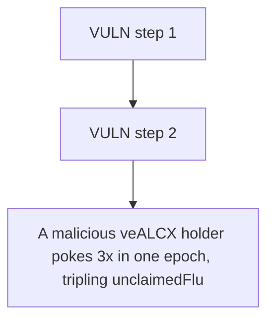

# Alchemix: A malicious veALCX holder pokes 3x in one epoch

> **Vulnerability classes:** vuln/unfair-mint
>
> **Reproduction:** a faithful minimal reproduction of the vulnerable finding — the vulnerable function is reproduced **verbatim** (marked `@>`) with faithful minimal doubles; local deploy, no fork.

<!-- source-auditvault: https://github.com/Auditware/AuditVault/blob/main/findings/38196-malicious-user-can-steal-flux-token-by-abusing-voterpoke-imm.md -->

## Root cause

A malicious veALCX holder pokes 3x in one epoch, tripling unclaimedFlux via accrueFlux's unbounded accumulation, then claimFlux mints 3 FLUX (3x the fair 1e18 single-epoch entitlement, a 2e18 illegitimate over-mint) to the attacker EOA.

```solidity
    /// @dev Verbatim audited source (see VERBATIM marker above).
    function accrueFlux(uint256 _tokenId) external {
        require(msg.sender == voter, "not voter");
        uint256 amount = IVotingEscrow(veALCX).claimableFlux(_tokenId);
        unclaimedFlux[_tokenId] += amount; // @> no claimed/per-epoch tracking: repeated pokes accumulate claimableFlux without bound
    }
```

## Why it's exploitable here

A malicious veALCX holder pokes 3x in one epoch, tripling unclaimedFlux via accrueFlux's unbounded accumulation, then claimFlux mints 3 FLUX (3x the fair 1e18 single-epoch entitlement, a 2e18 illegitimate over-mint) to the attacker EOA.

## Attack path



## Marked-line walkthrough (Playground)

The EVM Playground pins each step to the exact executed source line in `0x8ea53755a6…`:

1. **L126** — VULN step 1: no claimed/per-epoch tracking: repeated pokes accumulate claimableFlux without bound
2. **L131** — VULN step 2: no claimed/per-epoch tracking: repeated pokes accumulate claimableFlux without bound

## PoC

Registry (Foundry, local deploy — verbatim vulnerable source + harm-asserting test + negative control):

```bash
cd 38196-malicious-user-can-steal-flux-token-by-abusing-voterpoke-imm_exp
forge test -vvv
```

The browser Playground replays the same synthetic opcode-for-opcode and measures the harm: **A malicious veALCX holder pokes 3x in one epoch, tripling unclaimedFlux via accrueFlux's unbounded accumulation, then claimFlux mints 3 FLUX**. Both gates are green (registry `forge test` PASS + Playground `_verify-poc` **VERDICT: PASS**).
