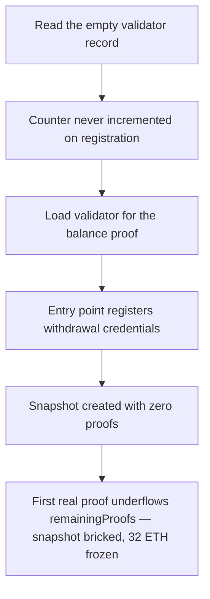

# Karak NativeVault: `activeValidatorCount` is never incremented, bricking every snapshot

> **Vulnerability classes:** vuln/dos · vuln/arithmetic
>
> **Reproduction:** a faithful minimal reproduction of the vulnerable finding — the `validateWithdrawalCredentials` registration tail and the snapshot machinery (`_startSnapshot` / `validateSnapshotProofs` / `_updateSnapshot`) are reproduced **verbatim** (missing increment marked `@>`) with faithful minimal doubles; local deploy, no fork.

<!-- source-auditvault: https://github.com/pashov/audits/blob/master/team/md/Karak-security-review-June.md -->

## Root cause

In `NativeVaultLib.validateWithdrawalCredentials`, a validator is registered as `ACTIVE` with its `restakedBalanceWei` set and written back to storage — but `ownerToNode[nodeOwner].activeValidatorCount` is never set or increased. The counter is only ever *decremented* (in `validateSnapshotProof` when a validator's beacon balance hits 0), so it starts and stays at 0. The verbatim registration tail, with the missing increment marked:

```solidity
        validatorDetails.status = NativeVaultLib.ValidatorStatus.ACTIVE;
        validatorDetails.validatorIndex = validatorFieldsProof.validatorProof.validatorIndex;
        validatorDetails.lastBalanceUpdateTimestamp = updateTimestamp;
        validatorDetails.restakedBalanceWei = restakedBalanceWei;
@>      self.ownerToNode[nodeOwner].validatorPubkeyHashToDetails[validatorPubkeyHash] = validatorDetails;
        // missing: self.ownerToNode[nodeOwner].activeValidatorCount++;
```

Because `activeValidatorCount` stays 0, `_startSnapshot` seeds `remainingProofs = node.activeValidatorCount = 0`, and the verbatim `snapshot.remainingProofs--;` in `validateSnapshotProofs` underflows on the very first submitted proof (Solidity 0.8 checked arithmetic → `Panic(0x11)` revert).

## Why it's exploitable here

A node that has registered a real validator can therefore never complete a balance snapshot:

1. A node owner registers one validator with 32 ETH restaked through `validateWithdrawalCredentials`. The bug leaves `activeValidatorCount == 0` even though a live validator now backs the node's consensus balance.
2. `startSnapshot` builds a `Snapshot` with `remainingProofs = 0`, then sets `currentSnapshotTimestamp` — the node is now mid-snapshot.
3. The owner submits the validator's balance proof via `validateSnapshotProofs`. The loop runs `snapshot.remainingProofs--` on `0`, underflowing → `Panic(0x11)` revert.
4. Every subsequent attempt reverts identically, and the node is stuck with `currentSnapshotTimestamp` set. The 32 ETH of restaked balance can never be finalized or credited — the node's restaked-ETH accounting is permanently bricked (DoS). A control node using the one-line-fixed path (`activeValidatorCount == 1 → remainingProofs == 1`) completes its snapshot, proving the revert is caused precisely by the missing increment.

## Attack path



## Marked-line walkthrough (Playground)

The EVM Playground pins each step to the exact executed source line in `0x671d353a…`:

1. **L94** — Read the empty validator record: Setup: validateWithdrawalCredentials loads the node's blank ValidatorDetails into memory before marking the validator ACTIVE.
2. **L101** — Counter never incremented on registration: Root cause: the active validator is written back to storage but `activeValidatorCount++` is missing, so the node's counter stays at 0.
3. **L136** — Load validator for the balance proof: During a snapshot, validateSnapshotProof reads the validator's details to compute its beacon-balance delta against the restaked amount.
4. **L191** — Entry point registers withdrawal credentials: Setup: the public validateWithdrawalCredentials takes the validator pubkey hash and restaked balance, delegating to the buggy library function.
5. **L234** — Snapshot created with zero proofs: startSnapshot emits SnapshotCreated after seeding remainingProofs from activeValidatorCount — which the bug left at 0 despite a live validator.
6. **L260** — Finalize the snapshot: _updateSnapshot runs after the proof loop to decide whether the snapshot is complete and the node's restaked ETH should be credited.
7. **L275** — Credit branch fires on zero remaining: Because remainingProofs is 0, _updateSnapshot takes the credit branch and emits SnapshotFinished, letting creditedNodeETH update without any valid proof.
8. **L304** — Record the frozen restaked ETH: The harness mints the victim's 32 ETH of unfinalizable restaked balance to the SINK marker, quantifying the funds permanently frozen by the DoS.

## PoC

Registry (Foundry, local deploy — verbatim vulnerable source + harm-asserting test):

```bash
cd 38491-h-03-activevalidatorcount-is-never-set-or-increased-pashov-a_exp && forge test -vvv
```

The browser Playground replays the same synthetic opcode-for-opcode and measures the harm: a node registers a 32 ETH validator, `activeValidatorCount` stays 0, `startSnapshot` seeds `remainingProofs = 0`, and the first `validateSnapshotProofs` reverts with an arithmetic underflow (`Panic 0x11`) — the node can never finalize its snapshot, permanently freezing the restaked ETH. Both gates are green (registry `forge test` PASS + Playground `_verify-poc` **VERDICT: PASS**).
