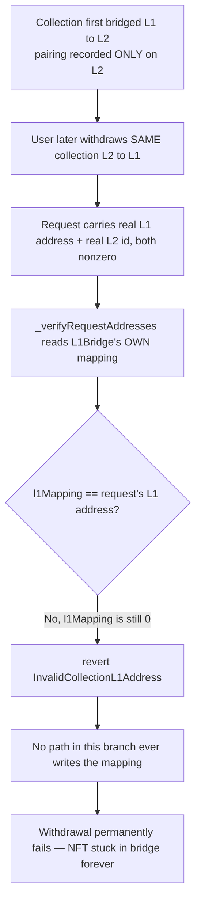
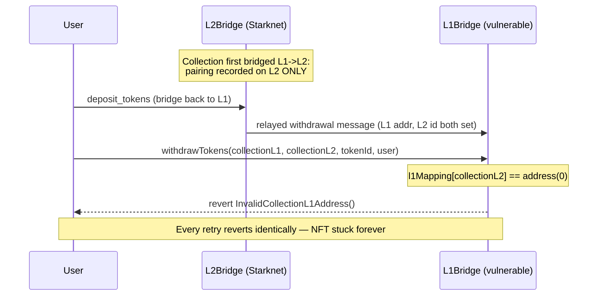

# ArkProject NFT Bridge — The bridging process will revert if the collection is matched on the destination chain and not on the source chain

> **Vulnerability classes:** vuln/logic/wrong-condition · vuln/dos/permanent · vuln/bridge/message-validation

> **Reproduction:** a self-contained Foundry PoC that compiles & runs in an
> isolated project with **only `forge-std`** — no fork, no RPC, no `anvil_state`
> (the vulnerable L1 bridge contract is deployed locally). Full trace:
> [output.txt](output.txt). PoC: [test/38504-the-bridging-process-will-revert-if-the-collection-is-matche_exp.sol](test/38504-the-bridging-process-will-revert-if-the-collection-is-matche_exp.sol).

<!-- non-defihacklabs -->
<!-- source-auditvault: https://github.com/Auditware/AuditVault/blob/main/findings/38504-the-bridging-process-will-revert-if-the-collection-is-matche.md -->
<!-- date: 2024-07 -->

---

## Key info

| | |
|---|---|
| **Impact** | **HIGH** — NFTs already bridged out via L2 can become permanently un-withdrawable on L1, with no code path in the vulnerable version that can ever recover them |
| **Protocol** | [ArkProject NFT Bridge](https://www.arkproject.dev) — Starknet<->Ethereum NFT bridge (`L1Bridge` / `CollectionManager`) |
| **Vulnerable contract** | `CollectionManager` — `_verifyRequestAddresses()`, called from `L1Bridge.withdrawTokens()` |
| **Bug class** | Address-pairing mappings are only populated on the chain a collection is withdrawn TO, never on the chain it was bridged FROM, so the verification function can never match — and permanently reverts — for collections in that state |
| **Finding** | Codehawks — ArkProject audit contest · #38504 |
| **Source** | [AuditVault](https://github.com/Auditware/AuditVault/blob/main/findings/38504-the-bridging-process-will-revert-if-the-collection-is-matche.md) |
| **Status** | Audit finding — caught in review. Reproduced here as a standalone local PoC. |
| **Compiler** | `^0.8.24` (PoC) |

This is an **audit finding**, not a historical on-chain incident — there is no
attack transaction. The bug and its revert are entirely on the Solidity (L1
bridge) side, so this reduction needs no Cairo/Starknet component: the
withdrawal request's L1/L2 collection addresses are exactly the data the L1
bridge receives from a relayed L2 message. The PoC deploys a faithful minimal
`L1Bridge`/`CollectionManager` locally and contrasts the permanent revert
against a first-time-bridge control that succeeds normally.

---

## TL;DR

1. `L1Bridge.withdrawTokens()` calls `_verifyRequestAddresses()` to confirm
   the withdrawal request's L1 and L2 collection addresses match the
   bridge's own recorded pairing before releasing an escrowed NFT.
2. That pairing is stored in mappings that are only ever **written on the
   chain a collection is withdrawn TO** — never on the chain it was bridged
   **FROM**.
3. So when a collection was first bridged L1->L2 (recording the pairing on
   L2 only) and a user later tries to bridge the SAME collection back
   L2->L1, L1Bridge's own mapping is still empty.
4. `_verifyRequestAddresses()` compares the request's real L1 address against
   that empty mapping (`address(0)`), which can **never** match, and
   unconditionally reverts with `InvalidCollectionL1Address()`.
5. There is no code path in the vulnerable version that can ever populate
   the missing L1-side mapping — so every NFT of that collection already
   bridged out via L2 is **permanently stuck**, with no recovery.

---

## The vulnerable code

The synthetic reduces `CollectionManager` to the exact address-verification
logic the bug depends on; the reverting comparison is preserved **verbatim**.

### `_verifyRequestAddresses()` — compares against a mapping that was never written (root cause)

```solidity
function _verifyRequestAddresses(
    address collectionL1Req,
    uint256 collectionL2Req
) internal view returns (address) {
    address l1Req = collectionL1Req;
    uint256 l2Req = collectionL2Req;
    address l1Mapping = _l2ToL1Addresses[collectionL2Req];
    uint256 l2Mapping = _l1ToL2Addresses[l1Req];

    // L2 address is present in the request and L1 address is not.
    if (l2Req > 0 && l1Req == address(0)) {
        if (l1Mapping == address(0)) {
            // It's the first token of the collection to be bridged.
            return address(0);
        } else {
            return l1Mapping;
        }
    }

    // L2 address is present, and L1 address too.
    if (l2Req > 0 && l1Req > address(0)) {
        if (l1Mapping != l1Req) {
            // @> VULN: l1Mapping is 0 whenever this collection's L1<->L2
            //    pairing was only ever recorded on L2 (from an earlier
            //    L1->L2 bridge) — L1Bridge's own storage was never
            //    written. This branch has NO path to populate the
            //    mapping; it can only compare and revert.
            //    FIX (upstream): if l1Mapping == 0 && l2Mapping == 0,
            //    WRITE the mapping here instead of reverting.
            revert InvalidCollectionL1Address();
        } else if (l2Mapping != l2Req) {
            revert InvalidCollectionL2Address();
        } else {
            // All addresses match, we don't need to deploy anything.
            return l1Mapping;
        }
    }

    revert ErrorVerifyingAddressMapping();
}
```

### Recommended fix

```diff
+ // L2 is present, L1 address too, and there is no mapping
+ if (l2Req > 0 && l1Req > address(0) && l1Mapping == address(0) && l2Mapping == 0) {
+     _l1ToL2Addresses[l1Req] = collectionL2Req;
+     _l2ToL1Addresses[collectionL2Req] = l1Req;
+     return l1Req;
+ }
+
  // L2 address is present, and L1 address too.
  if (l2Req > 0 && l1Req > address(0)) {
      if (l1Mapping != l1Req) {
          revert InvalidCollectionL1Address();
```

## Root cause

The verification function treats "the L1 and L2 addresses in the request
must equal what's already recorded in L1Bridge's own mappings" as the ONLY
valid outcome for a collection with a nonzero L1 address — it has no branch
for "this collection's pairing is legitimate but was only ever recorded on
the OTHER chain." Since the mappings are written only on the receiving
chain, any collection whose first bridge direction was the opposite of the
current withdrawal direction can never satisfy this check.

## Preconditions

- A collection is first bridged in one direction (e.g. L1->L2), recording
  the pairing only on the destination chain (L2).
- A later withdrawal in the OTHER direction (L2->L1) for the SAME
  collection is attempted — no special privilege or timing needed, this is
  completely normal bridge usage.

## Attack walkthrough

From [output.txt](output.txt):

1. **Control** (`test_control_firstTimeBridge_withdrawSucceeds`) — a
   withdrawal request for a brand-new collection (`l1Req = address(0)`, only
   the L2 address known) hits the function's "first token of the
   collection" branch and succeeds with no mapping required.
2. **Attack** (`test_run_unmatchedL1Mapping_bricksWithdrawal`) — an NFT sits
   escrowed in the L1 bridge from an earlier L1->L2 deposit. The user tries
   to withdraw it back L2->L1: the relayed message carries the collection's
   real, nonzero L1 address AND its nonzero L2-deployed id.
3. L1Bridge's own `l1Mapping` for this collection is still `address(0)`
   (never written), so `l1Mapping != l1Req` is always true.
4. `withdrawTokens()` reverts with `InvalidCollectionL1Address()` — and will
   **every time** it's retried, since nothing in the vulnerable contract can
   ever populate that mapping.
5. **Harm**: the NFT's owner remains the bridge contract forever — it never
   reaches the user.

## Diagrams





## Impact

- **Permanent loss of NFTs bridged L2->L1**: any collection whose pairing was
  recorded only on L2 can never have its tokens withdrawn back to L1 — the
  finding's own impact statement is exactly this.
- **Symmetric issue on Starknet's side**: the finding notes the identical bug
  exists in the L2 (Cairo) `verify_collection_address()` for the opposite
  direction (L1->L2 withdrawals when the pairing was only recorded on L1) —
  not reproduced here since it requires the Starknet/Cairo VM, not EVM.
- **No admin recovery**: nothing in the vulnerable contract can populate the
  missing mapping after the fact; only a code upgrade fixes it.

## Remediation

When neither mapping is set (`l1Mapping == address(0) && l2Mapping == 0`),
treat the request's addresses as authoritative and WRITE the pairing instead
of reverting — exactly as the upstream diff does.

## How to reproduce

```bash
cd ~/RustroverProjects/audits/evm-hack-registry/38504-the-bridging-process-will-revert-if-the-collection-is-matche_exp
forge test -vvv
# Fully local — no fork, no RPC, no anvil_state required.
# Expected: both tests PASS:
#   test_control_firstTimeBridge_withdrawSucceeds (control: first-time bridge succeeds)
#   test_run_unmatchedL1Mapping_bricksWithdrawal   (attack: withdraw reverts forever, NFT stuck)
```

PoC source: [test/38504-the-bridging-process-will-revert-if-the-collection-is-matche_exp.sol](test/38504-the-bridging-process-will-revert-if-the-collection-is-matche_exp.sol)
— a faithful minimal `L1Bridge`/`CollectionManager` with the verbatim
address-verification logic, plus first-time-bridge-vs-stuck contrast.

## Sources

- AuditVault finding: [38504-the-bridging-process-will-revert-if-the-collection-is-matche.md](https://github.com/Auditware/AuditVault/blob/main/findings/38504-the-bridging-process-will-revert-if-the-collection-is-matche.md)
- Reduced-source provenance: quoted verbatim from the AuditVault finding,
  which itself quotes [`CollectionManager.sol#L111-L149`](https://github.com/Cyfrin/2024-07-ark-project/blob/main/apps/blockchain/ethereum/src/token/CollectionManager.sol#L111-L149)
  from the ArkProject repository (`Cyfrin/2024-07-ark-project`); no clone was
  needed since the finding quotes the exact vulnerable function in full.

---

*Reference: finding **#38504** in the ArkProject NFT Bridge Codehawks audit contest · curated by [AuditVault](https://github.com/Auditware/AuditVault/blob/main/findings/38504-the-bridging-process-will-revert-if-the-collection-is-matche.md)*
