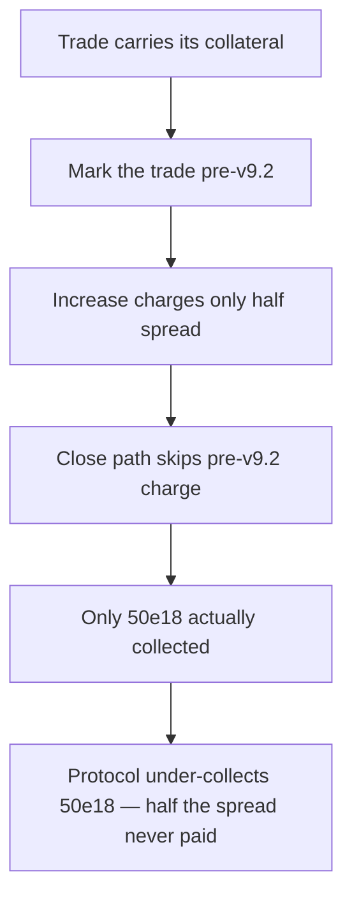

# Gains Network gTrade: pre-v9.2 trades escape half their spread and price-impact charges

> **Vulnerability classes:** vuln/fee-theft · vuln/logic · vuln/accounting
>
> **Reproduction:** a faithful minimal reproduction of the finding — the increase-side `prepareCallbackValues` price-impact call and the close-side `getTradeClosingPriceImpact` early return are reproduced **verbatim** (the vulnerable line marked `@>`) with faithful minimal doubles; local deploy, no fork.

<!-- source-auditvault: https://github.com/pashov/audits/blob/master/team/md/GainsNetwork-security-July2.md -->

## Root cause

The protocol splits the spread + price-impact charge in half between the position-size *increase* and the *close*. But the increase path charges half **unconditionally**, while the close path charges **zero** for any trade opened before v9.2 — so a pre-v9.2 trade that increases and then closes pays only 50% of what it owes. The vulnerable increase-side call, reproduced verbatim:

```solidity
    function prepareCallbackValues(
        ITradingStorage.Trade memory _existingTrade,
        ITradingStorage.Trade memory _partialTrade,
        ITradingCallbacks.AggregatorAnswer memory _answer
    ) internal view returns (IUpdatePositionSizeUtils.IncreasePositionSizeValues memory values) {
        ...
        // 3. Calculate price impact values
        (, values.priceAfterImpact) = _getMultiCollatDiamond().getTradePriceImpact(
@>          TradingCommonUtils.getMarketExecutionPrice(_answer.price, _answer.spreadP, _existingTrade.long, true), // @audit charge half of spread and price impact regardless of trade opened before or after v9.2
            _existingTrade.pairIndex,
            _existingTrade.long,
            _getMultiCollatDiamond().getUsdNormalizedValue(
                _existingTrade.collateralIndex,
                values.positionSizeCollateralDelta
            ),
            false,
            true,
            0
        );
        ...
    }
```

The `true` in `getMarketExecutionPrice(..., /*useHalfSpread*/ true)` halves the charge on every increase. Meanwhile `getTradeClosingPriceImpact` returns the raw market price (zero charge) whenever `maxLiqSpreadP == 0`, the flag that marks a pre-v9.2 trade — so the "other half" that a post-v9.2 trade pays on close is never collected from a pre-v9.2 trade.

## Why it's exploitable here

Following the finding with concrete numbers (1,000 DAI collateral, 10x leverage → 10,000 DAI notional, 1% combined spread + price impact, price $1,000 at `P_10`):

1. A trade opened before v9.2 has `maxLiqSpreadP == 0`.
2. The trader **increases** the position. `getMarketExecutionPrice(..., true)` applies half the 1% → execution price `1005e10`, and the real charge pulled is `10000e18 * 5e10 / 1000e10 = 50e18` (50 DAI).
3. The trader **closes**. `getTradeClosingPriceImpact` hits the `maxLiqSpreadP == 0` early return and charges `0`.
4. Total paid: 50 DAI. The correct full charge for a pre-v9.2 trade is `100e18` (100 DAI). The protocol under-collects **50 DAI — 50%** of the spread + price impact it was owed. An identical **post-v9.2** trade's close *does* collect that other 50 DAI, proving the shortfall is real and version-specific.

## Attack path



## Marked-line walkthrough (Playground)

The EVM Playground pins each step to the exact executed source line in `0xce01759b…`:

1. **L57** — Trade carries its collateral: Setup: the Trade struct's collateralAmount field holds the position margin; with leverage it sets the notional the spread and price impact are charged on.
2. **L203** — Mark the trade pre-v9.2: Setup: setLiquidationParams sets maxLiqSpreadP = 0 for this position, the exact flag the code treats as 'trade opened before v9.2'.
3. **L252** — Increase charges only half spread: Root cause: prepareCallbackValues passes useHalfSpread=true unconditionally, so an increase charges only 50% spread+price-impact, even for a pre-v9.2 trade.
4. **L272** — Close path skips pre-v9.2 charge: getTradeClosingPriceImpact runs on close and, when maxLiqSpreadP == 0, returns the raw market price, so a pre-v9.2 trade pays zero closing spread.
5. **L303** — Only 50e18 actually collected: increasePositionSize converts the half-spread execution price into the real charge of 50e18, half of the 100e18 the position truly owes.
6. **L332** — Uncollected half recorded at sink: An identical post-v9.2 trade's close collects the other 50e18; the pre-v9.2 trade escapes it, so that 50e18 shortfall is minted to the sink as harm.
7. **L347** — Market price fixed at $1000: Setup: MARKET_PRICE = 1000e10 pins the $1000 execution price (P_10 precision) used for the increase and the close throughout the run.

## PoC

Registry (Foundry, local deploy — verbatim vulnerable source + harm-asserting test):

```bash
cd 40188-h-01-inconsistent-spread-and-price-impact-charges-pashov-aud_exp && forge test -vvv
```

The browser Playground replays the same synthetic opcode-for-opcode and measures the harm: **a pre-v9.2 trade increases paying only 50e18, closes paying 0, and the 50e18 the protocol fails to collect (the other half a post-v9.2 trade would pay) is recorded at the sink**. Both gates are green (registry `forge test` PASS + Playground `_verify-poc` **VERDICT: PASS**).
