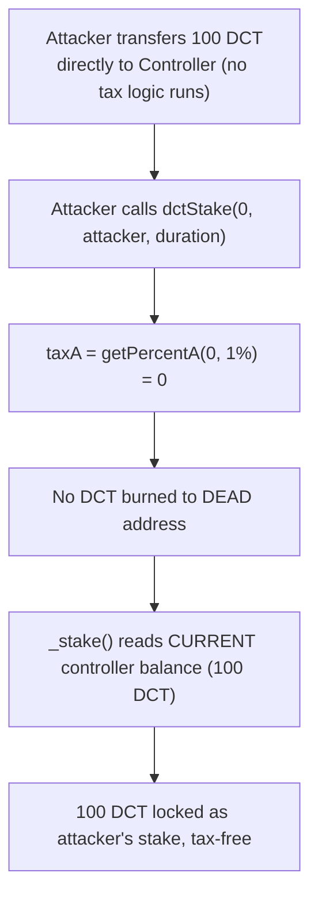
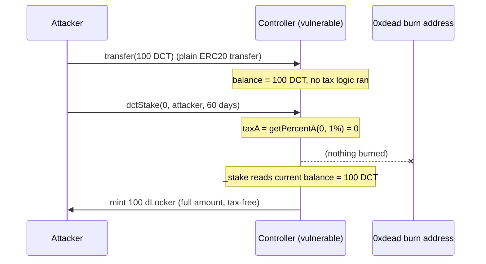

# Goat Tech — A user calling Controller::dctStake can bypass tax by first transferring the tokens to be staked

> **Vulnerability classes:** vuln/logic/missing-check · vuln/accounting/tax-bypass · vuln/economic/incentive-misalignment

> **Reproduction:** a self-contained Foundry PoC that compiles & runs in an
> isolated project with **only `forge-std`** — no fork, no RPC, no `anvil_state`
> (the vulnerable staking contract is deployed locally). Full trace:
> [output.txt](output.txt). PoC: [test/40665-a-user-calling-controllerdctstake-can-bypass-tax-by-first-tr_exp.sol](test/40665-a-user-calling-controllerdctstake-can-bypass-tax-by-first-tr_exp.sol).

<!-- non-defihacklabs -->
<!-- source-auditvault: https://github.com/Auditware/AuditVault/blob/main/findings/40665-a-user-calling-controllerdctstake-can-bypass-tax-by-first-tr.md -->
<!-- date: 2024-03 -->

---

## Key info

| | |
|---|---|
| **Impact** | **HIGH** — any staker can dodge the protocol's 1% DCT staking tax entirely, defeating the deflationary burn mechanism the tax is designed to enforce |
| **Protocol** | [Goat Tech](https://cdn.cantina.xyz/reports/cantina_competition_goat_mar2024.pdf) — staking (`Controller.dctStake`) |
| **Vulnerable contract** | `Controller` — `dctStake()` (computes tax from the caller-supplied `amount_`) + `_stake()` (locks the contract's CURRENT DCT balance, not `amount_` minus tax) |
| **Bug class** | Tax is computed from a caller-supplied parameter instead of the actual balance change the call causes, letting a pre-funded balance be staked for free |
| **Finding** | Cantina — Goat Tech competition, March 2024 · #40665 |
| **Report** | [cdn.cantina.xyz/reports/cantina_competition_goat_mar2024.pdf](https://cdn.cantina.xyz/reports/cantina_competition_goat_mar2024.pdf) |
| **Source** | [AuditVault](https://github.com/Auditware/AuditVault/blob/main/findings/40665-a-user-calling-controllerdctstake-can-bypass-tax-by-first-tr.md) |
| **Status** | Audit finding — caught in review. Reproduced here as a standalone local PoC. |
| **Compiler** | `^0.8.24` (PoC) |

This is an **audit finding**, not a historical on-chain incident — there is no
attack transaction. The PoC deploys a faithful minimal `Controller` locally
and contrasts the tax bypass against an honest stake that correctly pays the
1% tax.

---

## TL;DR

1. When a user stakes DCT via `Controller.dctStake(amount_, receiver_,
   lockDuration_)`, a 1% tax is calculated from `amount_` and burned to
   `address(0xdead)`.
2. But the amount actually locked as the user's stake is read from the
   controller's **current DCT token balance** — not from `amount_` minus the
   tax that was just burned.
3. A user can therefore: (1) transfer DCT tokens **directly** to the
   `Controller` contract (a plain ERC20 transfer, no tax logic involved at
   all), then (2) call `dctStake(0, receiver_, lockDuration_)`.
4. With `amount_ = 0`, the tax calculation is `0` — nothing is burned — while
   `_stake()` still reads the contract's full current balance (the
   pre-funded amount) and locks 100% of it.
5. The result: the user stakes their full balance while paying **zero** of
   the intended 1% tax, at the direct expense of the protocol's deflationary
   burn mechanism.

---

## The vulnerable code

The synthetic reduces `Controller` to the exact tax + staking logic the bug
depends on; the mismatched tax basis is preserved **verbatim** in spirit.

### `dctStake()` — tax computed from the caller-supplied `amount_` (root cause)

```solidity
function dctStake(uint256 amount_, address receiver_, uint256 lockDuration_) external {
    if (amount_ > 0) {
        dct.transferFrom(msg.sender, address(this), amount_);
    }

    // @> VULN Controller.sol#L430: tax is computed from the CALLER-SUPPLIED
    //    amount_, not from the controller's actual DCT balance. A caller
    //    who pre-funds the controller directly and passes amount_ = 0
    //    pays ZERO tax while _stake() below still locks the full
    //    pre-funded balance.
    //    FIX: compute taxA from the controller's actual balance change
    //    (or require amount_ == the balance delta caused by this call).
    uint256 taxA = _getPercentA(amount_, DCT_TAX_PERCENT);
    if (taxA > 0) {
        dct.transfer(DEAD, taxA);
    }

    _stake(receiver_, lockDuration_);
}
```

### `_stake()` — locks the contract's *current* balance, not `amount_ - taxA`

```solidity
function _stake(address receiver_, uint256 lockDuration_) internal {
    uint256 value = dct.balanceOf(address(this));
    dLocker.mint(receiver_, value);
}
```

### Recommended fix

```diff
- uint256 taxA = _getPercentA(amount_, DCT_TAX_PERCENT);
+ // derive the tax from the balance delta this call actually caused,
+ // instead of trusting the caller-supplied amount_
+ uint256 taxA = _getPercentA(actualBalanceDeltaCausedByThisCall, DCT_TAX_PERCENT);
```

The upstream recommendation is equivalent: ensure the value passed into
`_stake()` matches the `amount_` originally supplied to `dctStake()` (net of
tax), so a pre-funded balance can never be staked through the zero-amount
path tax-free.

## Root cause

`dctStake()` treats the caller-supplied `amount_` parameter as the ground
truth for how much is being staked (and therefore how much tax to burn), but
`_stake()` independently re-derives "how much to lock" from the contract's
**current balance** — a value the caller can inflate ahead of time through
any ordinary ERC20 transfer that never touches the tax logic at all. The two
functions disagree about what "the amount being staked" means, and the
attacker exploits exactly that disagreement.

## Preconditions

- The DCT token is a standard, freely transferable ERC20 — anyone can send it
  to the `Controller` contract directly.
- No special privilege or timing is required; the two calls (direct transfer,
  then `dctStake(0, ...)`) can even be bundled in a single attacker-controlled
  transaction to avoid front-running/sandwiching.

## Attack walkthrough

From [output.txt](output.txt):

1. **Control** (`test_control_honestStake_paysTax`) — an honest caller
   invokes `dctStake(100 ether, ...)` directly. 1 DCT (1%) is burned to
   `address(0xdead)`; only 99 DCT is locked as the stake.
2. **Attack** (`test_run_bypassesTax`) — the attacker sends 100 DCT directly
   to the `Controller` contract (a plain `transfer`, not `dctStake`), then
   calls `dctStake(0, attacker, 60 days)`.
3. Since `amount_ = 0`, the tax calculation (`_getPercentA(0, 100)`) is `0` —
   nothing is burned.
4. `_stake()` reads the controller's current DCT balance (the full 100 DCT
   the attacker pre-funded) and mints **100 DCT** worth of `dLocker` to the
   attacker.
5. **Harm**: the attacker locks the full 100 DCT tax-free, versus the 99 DCT
   an honest staker would receive for the identical 100 DCT outlay — a
   complete 1% tax evasion.

## Diagrams





## Impact

- **Direct protocol harm**: every staker can dodge the 1% tax entirely,
  meaning the intended deflationary burn on staked DCT never happens for any
  staker who bothers to split the transfer and the stake call.
- **Economic misalignment**: the tax exists as a policy lever (e.g., to
  discourage churn or fund a burn mechanism); this bug makes that policy
  unenforceable, and any capital that flows through staking permanently
  bypasses it.
- **Trivially repeatable**: no special access, timing, or capital is needed —
  any staker (or MEV searcher acting on their behalf) can apply this on every
  stake.

## Remediation

Derive the tax from the contract's actual balance change caused by the
`dctStake()` call (e.g., snapshot the balance before and after
`transferFrom`, and tax that delta), or require `amount_` to exactly equal
the balance delta the call produces, so a pre-funded balance passed through
`amount_ = 0` can never dodge the tax.

## How to reproduce

```bash
cd ~/RustroverProjects/audits/evm-hack-registry/40665-a-user-calling-controllerdctstake-can-bypass-tax-by-first-tr_exp
forge test -vvv
# Fully local — no fork, no RPC, no anvil_state required.
# Expected: both tests PASS:
#   test_control_honestStake_paysTax (control: honest stake burns 1% tax)
#   test_run_bypassesTax             (attack: 100 DCT locked, 0 DCT burned)
```

PoC source: [test/40665-a-user-calling-controllerdctstake-can-bypass-tax-by-first-tr_exp.sol](test/40665-a-user-calling-controllerdctstake-can-bypass-tax-by-first-tr_exp.sol)
— a faithful minimal `Controller` with the verbatim tax/stake mismatch, plus
honest-vs-bypass contrast.

## Sources

- AuditVault finding: [40665-a-user-calling-controllerdctstake-can-bypass-tax-by-first-tr.md](https://github.com/Auditware/AuditVault/blob/main/findings/40665-a-user-calling-controllerdctstake-can-bypass-tax-by-first-tr.md)
- Original report: [Cantina — Goat Tech competition, March 2024](https://cdn.cantina.xyz/reports/cantina_competition_goat_mar2024.pdf)
- Reduced-source provenance: quoted verbatim from the AuditVault finding (the
  finding itself quotes the exact vulnerable lines and PoC; no external clone
  was needed for this reduction — Goat Tech's own repository is not
  publicly linked from the Cantina PDF).

---

*Reference: finding **#40665** in the [Cantina Goat Tech competition report, March 2024](https://cdn.cantina.xyz/reports/cantina_competition_goat_mar2024.pdf) · curated by [AuditVault](https://github.com/Auditware/AuditVault/blob/main/findings/40665-a-user-calling-controllerdctstake-can-bypass-tax-by-first-tr.md)*
