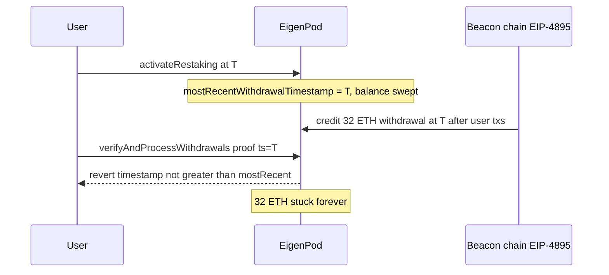

# EigenLayer — Beacon chain withdrawals at lastWithdrawalTimestamp are lost

> **Vulnerability classes:** frozen-funds · locked-funds · timestamp-dependence

> **Reproduction:** self-contained Foundry PoC with only `forge-std` — no fork.
> [output.txt](output.txt) · [test/40684-…sol](test/40684-beacon-chain-withdrawals-that-occur-at-lastwithdrawaltimesta.sol).

<!-- non-defihacklabs -->
<!-- source-auditvault: https://github.com/Auditware/AuditVault/blob/main/findings/40684-beacon-chain-withdrawals-that-occur-at-lastwithdrawaltimesta.md -->
<!-- date: 2024-03 -->

**AuditVault taxonomy:** `lang/solidity` · `platform/cantina` · `severity/high` · `sector/restaking` · `sector/staking` · genome: `frozen-funds` · `locked-funds` · `timestamp-dependence`

---

## Key info

| | |
|---|---|
| **Impact** | **HIGH** — 32 ETH beacon withdrawal permanently stuck when restaking is activated in the same block |
| **Protocol** | EigenLayer — `EigenPod.proofIsForValidTimestamp` / `activateRestaking` |
| **Vulnerable code** | `timestamp > mostRecentWithdrawalTimestamp` (should be `>=`) |
| **Bug class** | Off-by-one timestamp guard / EIP-4895 ordering |
| **Finding** | Cantina — EigenLayer, Mar 2024 · #40684 · reporter **hash** |
| **Report** | [cantina_competition_eigenlayer_mar2024.pdf](https://cdn.cantina.xyz/reports/cantina_competition_eigenlayer_mar2024.pdf) |
| **Source** | [AuditVault](https://github.com/Auditware/AuditVault/blob/main/findings/40684-beacon-chain-withdrawals-that-occur-at-lastwithdrawaltimesta.md) |
| **Fix** | Use `>= mostRecentWithdrawalTimestamp` |
| **Compiler** | `^0.8.24` (PoC) |

---

## TL;DR

1. `activateRestaking` sets `mostRecentWithdrawalTimestamp = block.timestamp` and sweeps pod ETH.
2. Beacon-chain withdrawals for that timestamp execute **after** user txs (EIP-4895).
3. `verifyAndProcessWithdrawals` requires `timestamp > mostRecentWithdrawalTimestamp`.
4. A proof for the same timestamp is rejected — the ETH can never be claimed.

## Diagrams

## Impact

Beacon withdrawals that share a block/timestamp with `activateRestaking` (or any `_processWithdrawalBeforeRestaking`) are unrecoverable under the strict `>` guard.

## Sources

- [AuditVault #40684](https://github.com/Auditware/AuditVault/blob/main/findings/40684-beacon-chain-withdrawals-that-occur-at-lastwithdrawaltimesta.md)
- [Cantina EigenLayer Mar 2024](https://cdn.cantina.xyz/reports/cantina_competition_eigenlayer_mar2024.pdf)
- Reduced from `EigenPod.sol` (`proofIsForValidTimestamp`, `_processWithdrawalBeforeRestaking`) as quoted in the finding; fixed form appears in Layr-Labs/eigenlayer-contracts@v0.2.3-mainnet-m2 with `>=`
