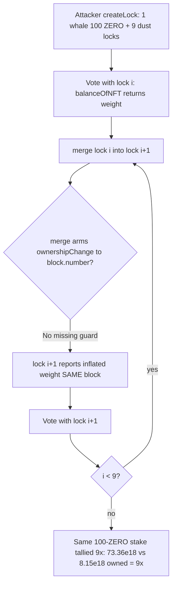
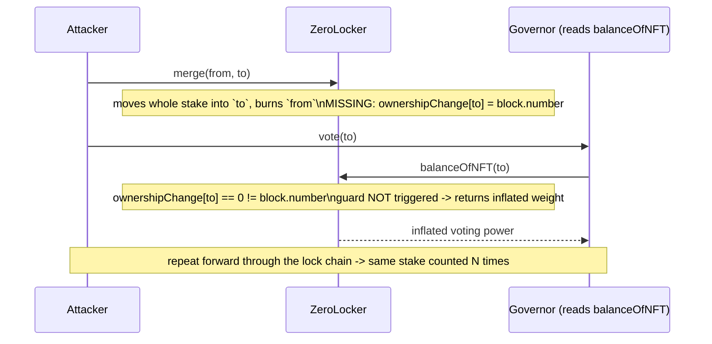

# ZeroLend — `ZeroLocker.merge()` lets a staker inflate veNFT voting power ~9×

> **Vulnerability classes:** vuln/governance/proposal-manipulation · vuln/logic/missing-check · vuln/logic/timestamp-dependence

> **Reproduction:** a self-contained Foundry PoC that compiles & runs in an
> isolated project at [this folder](.) with **only `forge-std`** — no fork, no
> RPC, no `anvil_state` (the vulnerable veNFT is deployed locally). Full trace:
> [output.txt](output.txt). PoC: [test/40818-a-malicious-user-can-inflate-his-voting-power-via-merge-cant_exp.sol](test/40818-a-malicious-user-can-inflate-his-voting-power-via-merge-cant_exp.sol).

<!-- non-defihacklabs -->
<!-- source-auditvault: https://github.com/Auditware/AuditVault/blob/main/findings/40818-a-malicious-user-can-inflate-his-voting-power-via-merge-cant.md -->
<!-- date: 2024-01 -->

---

## Key info

| | |
|---|---|
| **Impact** | **HIGH** — a single staker manufactures ~9× their fair governance voting weight, enough to pass/veto proposals with a fraction of the stake honest voters must lock |
| **Protocol** | [ZeroLend](https://zerolend.xyz) — veNFT governance (Solidly/Curve-style `ZeroLocker` voting-escrow), deploys on Linea / zkSync Era |
| **Vulnerable contract** | `ZeroLocker` — `merge()` + `balanceOfNFT()` |
| **Bug class** | `merge()` moves a lock's whole stake into the destination NFT but never arms `balanceOfNFT`'s same-block flash-vote guard (`ownershipChange[_to] = block.number`), so the inflated NFT can be voted with in the same block |
| **Finding** | Cantina competition — ZeroLend, Jan 2024 · #40818 · reporter **elhaj** |
| **Report** | [cantina_competition_zerolend_jan2024.pdf](https://cdn.cantina.xyz/reports/cantina_competition_zerolend_jan2024.pdf) |
| **Source** | [AuditVault](https://github.com/Auditware/AuditVault/blob/main/findings/40818-a-malicious-user-can-inflate-his-voting-power-via-merge-cant.md) |
| **Status** | Audit finding — caught in review (not exploited on-chain). Reproduced here as a standalone local PoC. |
| **Compiler** | `^0.8.19` (PoC) |

This is an **audit finding**, not a historical on-chain incident — so there is no
attack transaction. The PoC deploys a faithful minimal `ZeroLocker` locally and
demonstrates the inflation with concrete numbers.

---

## TL;DR

1. `ZeroLocker` is a Solidly/Curve-style **voting-escrow veNFT**: locking `ZERO`
   mints an NFT whose voting power (`balanceOfNFT`) decays linearly over the lock.
2. To stop *flash-vote* attacks, `balanceOfNFT` refuses to report weight in the
   same block ownership changed: `if (ownershipChange[_tokenId] == block.number) return 0;`.
   This guard is armed by `_transferFrom` on every ownership move.
3. `merge(_from, _to)` **also** moves voting power — it shoves `_from`'s entire
   stake into `_to` and burns `_from` — but it **never** sets
   `ownershipChange[_to] = block.number`. The guard stays disarmed for `_to`.
4. So a staker can, in a single block: vote with a lock, `merge` its stake
   forward into the next lock, vote again with that (now inflated) lock, merge
   forward again… counting **the same stake N times**.
5. In the PoC one 100-`ZERO` whale lock chained through 9 locks is tallied as
   **73.36e18** voting weight versus the **8.15e18** actually owned — a **9.00×
   inflation**. Governance outcomes can be captured with a fraction of honest stake.

---

## The vulnerable code

`ZeroLocker` is reduced to the exact accounting the bug depends on (the veNFT
`Point{bias,slope}` checkpoint history that drives `balanceOfNFT`), with
`merge` / `balanceOfNFT` preserved **verbatim** from the audited contract.

### `merge()` — moves the stake but forgets to arm the guard

```solidity
function merge(uint256 _from, uint256 _to) external {
    require(_from != _to);
    require(_isApprovedOrOwner(msg.sender, _from));
    require(_isApprovedOrOwner(msg.sender, _to));

    LockedBalance memory _locked0 = locked[_from];
    LockedBalance memory _locked1 = locked[_to];
    uint256 value0 = uint256(int256(_locked0.amount));
    uint256 end = _locked0.end >= _locked1.end ? _locked0.end : _locked1.end;

    locked[_from] = LockedBalance(0, 0);
    _checkpoint(_from, _locked0, LockedBalance(0, 0));
    _burn(_from);
    _depositFor(_to, value0, end, _locked1, DepositType.MERGE_TYPE);
    // BUG: no `ownershipChange[_to] = block.number;`  <-- the missing guard
}
```

### `balanceOfNFT()` — the guard that `merge` fails to arm

```solidity
function balanceOfNFT(uint256 _tokenId) external view returns (uint256) {
    if (ownershipChange[_tokenId] == block.number) return 0; // flash-vote guard
    return _balanceOfNFT(_tokenId, block.timestamp);
}
```

`_transferFrom` sets `ownershipChange[_to] = block.number` on a normal NFT move,
so a transferred NFT reads `0` weight in-block. `merge` moves *more* value than a
transfer (the whole stake) yet skips that write.

---

## Root cause

`merge()` is a **stake-moving** operation that was not treated as an
ownership/weight change for the purpose of the same-block guard. The guard's
invariant — *"an NFT whose weight moved this block cannot vote this block"* — is
enforced only in `_transferFrom`, not in `merge`. Because `merge` is
attacker-callable on the attacker's own NFTs, the guard is trivially bypassed by
merging instead of transferring.

## Preconditions

- The attacker owns (or creates) ≥2 locks — one funded "whale" lock and one or
  more low-value "carrier" locks. Anyone can `createLock`, so this is permissionless.
- Governance reads voting weight via `balanceOfNFT` (as ZeroLend's voter does).
- No time or capital advantage is required beyond the one real stake; the dust
  locks cost ~nothing.

## Attack walkthrough

Concrete run from [output.txt](output.txt) (`_checkpoint`/`balanceOfNFT` math is
exact; the registry test skips 3 weeks so decay is realistic):

1. Attacker locks **100 ZERO** in NFT #1 (the reused stake) and 100 wei in nine
   more NFTs (#2..#10). Dust locks carry ~0 weight — they are only vote slots.
2. **Honest tally** across the attacker's locks = **8,150,684,138,760,870,806**
   (~8.15e18) — essentially just the whale lock.
3. **Attack:** for `i = 1..9`, read NFT #i's weight (a real proposal vote would),
   then `merge(#i, #i+1)`. Each merge shoves the accumulated whale stake into the
   next NFT, which — because `ownershipChange` was never armed — immediately
   reports the inflated weight in the same block.
4. **Malicious tally** = **73,356,157,248,847,837,254** (~73.36e18).
5. `inflation multiple x1e2: 900` → **9.00×**. `assertGt(inflated, real * 3)` holds.

The Playground reproduction (fully local synthetic, no cheatcodes) mints the
manufactured **excess** weight (`inflated - honest`) to the attacker as a `veVOTE`
marker so the governance-capture harm shows as a concrete number.

## Diagrams





## Remediation

Treat `merge` (and any stake-moving path) as an ownership change for the guard —
arm `ownershipChange[_to]` inside `merge`:

```solidity
_depositFor(_to, value0, end, _locked1, DepositType.MERGE_TYPE);
ownershipChange[_to] = block.number; // <-- add this
```

Note the finding's own remediation text writes `ownershipChange[_to] = block.timestamp`,
but the guard compares against **`block.number`** — the timestamp value does not
satisfy the guard and leaves the exploit working. The effective fix is
`block.number`.

## How to reproduce

```bash
cd ~/RustroverProjects/audits/evm-hack-registry/40818-a-malicious-user-can-inflate-his-voting-power-via-merge-cant_exp
forge test --match-test test_votingPowerInflationViaMerge -vvv
# Fully local — no fork, no RPC, no anvil_state required.
# Expected: [PASS] with logs:
#   inflated voting power: 73356157248847837254
#   real voting power    :  8150684138760870806
#   inflation multiple x1e2: 900   (= 9.00x)
```

PoC source: [test/40818-a-malicious-user-can-inflate-his-voting-power-via-merge-cant_exp.sol](test/40818-a-malicious-user-can-inflate-his-voting-power-via-merge-cant_exp.sol)
— a faithful minimal `ZeroLocker` (Solidly/Curve veNFT checkpoint math) with
`merge`/`balanceOfNFT` verbatim, plus the honest-vs-inflated tally.

---

*Reference: finding **#40818** by **elhaj** in the [Cantina ZeroLend competition (Jan 2024)](https://cdn.cantina.xyz/reports/cantina_competition_zerolend_jan2024.pdf) · curated by [AuditVault](https://github.com/Auditware/AuditVault/blob/main/findings/40818-a-malicious-user-can-inflate-his-voting-power-via-merge-cant.md)*
