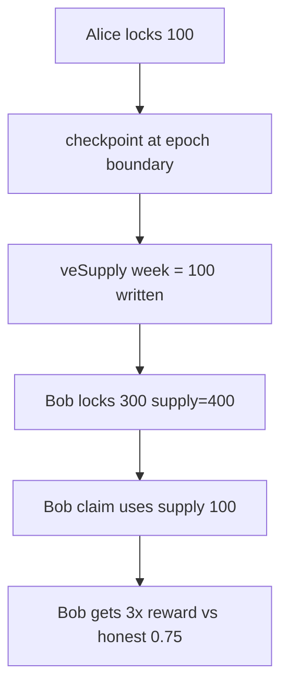

# ZeroLend — Incorrect reward distribution when t == roundedTimestamp

> **Vulnerability classes:** reward-calculation · reward-theft · reward-accounting

> **Reproduction:** self-contained Foundry PoC with only `forge-std` — no fork.
> [output.txt](output.txt) · [test/40820-…sol](test/40820-incorrect-reward-distribution-when-t-roundedtimestamp-in-fee.sol).

<!-- non-defihacklabs -->
<!-- source-auditvault: https://github.com/Auditware/AuditVault/blob/main/findings/40820-incorrect-reward-distribution-when-t-roundedtimestamp-in-fee.md -->
<!-- date: 2024-01 -->

**AuditVault taxonomy:** `lang/solidity` · `platform/cantina` · `severity/high` · `sector/token` · genome: `reward-calculation` · `variant` · `reward-theft` · `reward-accounting`

---

## Key info

| | |
|---|---|
| **Impact** | **HIGH** — late lockers overpaid (e.g. 3 instead of 0.75 of epoch rewards) via stale `veSupply` |
| **Protocol** | ZeroLend — `FeeDistributor._checkpointTotalSupply` |
| **Vulnerable code** | `if (t > roundedTimestamp) break;` (should be `>=`) |
| **Bug class** | Epoch-boundary off-by-one in week supply checkpoint |
| **Finding** | Cantina — ZeroLend, Jan 2024 · #40820 · reporter **0xarno** |
| **Report** | [cantina_competition_zerolend_jan2024.pdf](https://cdn.cantina.xyz/reports/cantina_competition_zerolend_jan2024.pdf) |
| **Source** | [AuditVault](https://github.com/Auditware/AuditVault/blob/main/findings/40820-incorrect-reward-distribution-when-t-roundedtimestamp-in-fee.md) |
| **Fix** | Break on `t >= roundedTimestamp` (do not write incomplete week) |
| **Compiler** | `^0.8.24` (PoC) |

---

## TL;DR

1. At an exact epoch boundary, `t == roundedTimestamp`.
2. The loop uses `>` so it still writes `veSupply[t]` from the current locker point.
3. Bob locks more after the checkpoint — real supply rises, week supply stays stale.
4. `claim = totalReward * balance / veSupply` overpays Bob 4x the honest share.

## Diagrams

## Impact

Week-bound total-supply invariance breaks; reward accounting skews toward users who lock after a boundary checkpoint.

## Sources

- [AuditVault #40820](https://github.com/Auditware/AuditVault/blob/main/findings/40820-incorrect-reward-distribution-when-t-roundedtimestamp-in-fee.md)
- [Cantina ZeroLend Jan 2024](https://cdn.cantina.xyz/reports/cantina_competition_zerolend_jan2024.pdf)
- Curve-style `FeeDistributor` reduction; sibling Class A #40818 merge inflation already shipped
