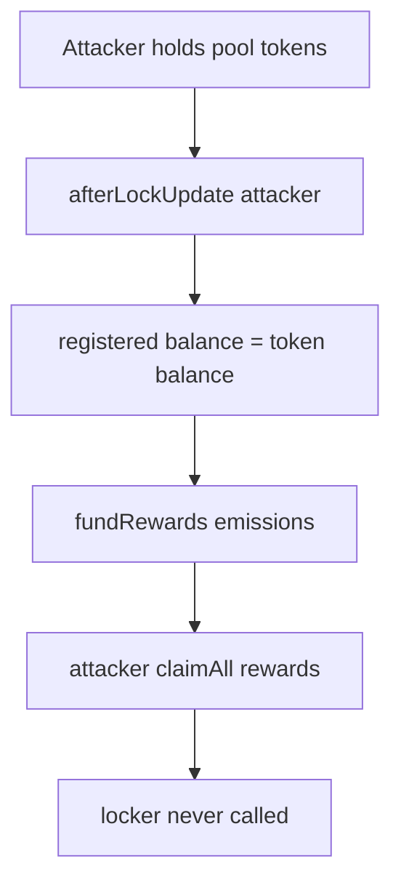

# ZeroLend — Missing access control in afterLockUpdate

> **Vulnerability classes:** access-roles · reward-theft · reward-accounting

> **Reproduction:** self-contained Foundry PoC with only `forge-std` — no fork.
> [output.txt](output.txt) · [test/40821-…sol](test/40821-missing-accesscontrol-in-afterlockupdate-cantina-none-zerole.sol).

<!-- non-defihacklabs -->
<!-- source-auditvault: https://github.com/Auditware/AuditVault/blob/main/findings/40821-missing-accesscontrol-in-afterlockupdate-cantina-none-zerole.md -->
<!-- date: 2024-01 -->

**AuditVault taxonomy:** `lang/solidity` · `platform/cantina` · `severity/high` · `sector/lending` · genome: `reward-calculation` · `variant` · `reward-theft` · `access-roles` · `reward-accounting`

---

## Key info

| | |
|---|---|
| **Impact** | **HIGH** — non-lockers register reward weight and drain emissions |
| **Protocol** | ZeroLend — `ZLRewardsController.afterLockUpdate` |
| **Vulnerable code** | `afterLockUpdate` external with no `onlyZeroLocker` |
| **Bug class** | Missing access control on balance registration |
| **Finding** | Cantina — ZeroLend, Jan 2024 · #40821 · reporter **Sujith Somraaj** |
| **Report** | [cantina_competition_zerolend_jan2024.pdf](https://cdn.cantina.xyz/reports/cantina_competition_zerolend_jan2024.pdf) |
| **Source** | [AuditVault](https://github.com/Auditware/AuditVault/blob/main/findings/40821-missing-accesscontrol-in-afterlockupdate-cantina-none-zerole.md) |
| **Fix** | `onlyZeroLocker` modifier |
| **Compiler** | `^0.8.24` (PoC) |

---

## TL;DR

1. `afterLockUpdate` is intended to be called only by `ZeroLocker` after lock changes.
2. It is `external` with no caller restriction.
3. Anyone holding pool tokens can self-register a reward weight.
4. Emissions accrue and are claimed without ever locking.

## Diagrams

## Impact

Reward emissions meant for locked stake (or authorized balance hooks) can be drained by unauthorized self-registration — matching the competition harness that registered users via a naked `afterLockUpdate` call.

## Sources

- [AuditVault #40821](https://github.com/Auditware/AuditVault/blob/main/findings/40821-missing-accesscontrol-in-afterlockupdate-cantina-none-zerole.md)
- [Cantina ZeroLend Jan 2024](https://cdn.cantina.xyz/reports/cantina_competition_zerolend_jan2024.pdf)
- Finding quotes `ZLRewardsController.sol#L588-L590`
