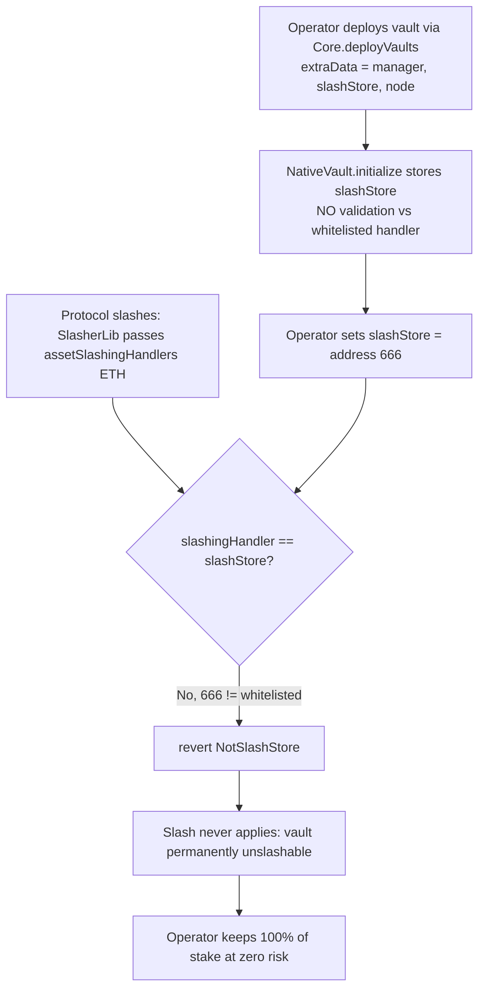
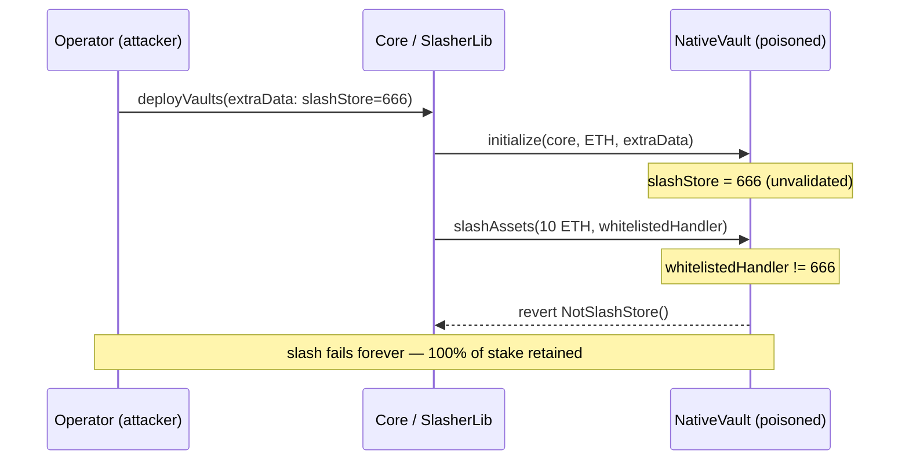

# Karak — [H-02] An operator can create a `NativeVault` that is silently unslashable

> **Vulnerability classes:** vuln/access-control/missing-validation · vuln/logic/missing-check · vuln/dos/permanent

> **Reproduction:** a self-contained Foundry PoC that compiles & runs in an
> isolated project with **only `forge-std`** — no fork, no RPC, no `anvil_state`
> (the vulnerable restaking contracts are deployed locally). Full trace:
> [output.txt](output.txt). PoC: [test/41066-h-02-the-operator-can-create-a-nativevault-that-can-be-silen_exp.sol](test/41066-h-02-the-operator-can-create-a-nativevault-that-can-be-silen_exp.sol).

<!-- non-defihacklabs -->
<!-- source-auditvault: https://github.com/Auditware/AuditVault/blob/main/findings/41066-h-02-the-operator-can-create-a-nativevault-that-can-be-silen.md -->
<!-- date: 2024-07 -->

---

## Key info

| | |
|---|---|
| **Impact** | **HIGH** — a misbehaving operator can make their own vault permanently unslashable, keeping 100% of stake at zero risk; slashing (the protocol's core accountability mechanism) is defeated |
| **Protocol** | [Karak](https://karak.network) — restaking (`Core` / `NativeVault` / `SlasherLib`) |
| **Vulnerable contract** | `NativeVault` — `initialize()` (stores operator `slashStore` unvalidated) + `slashAssets()` (reverts unless whitelisted handler == that `slashStore`) |
| **Bug class** | Operator-controlled `extraData.slashStore` is stored with no validation against the protocol's whitelisted slashing handler; the mismatch makes every real slash revert |
| **Finding** | Code4rena — 2024-07 Karak · #41066 |
| **Report** | [code4rena.com/reports/2024-07-karak](https://code4rena.com/reports/2024-07-karak) |
| **Source** | [AuditVault](https://github.com/Auditware/AuditVault/blob/main/findings/41066-h-02-the-operator-can-create-a-nativevault-that-can-be-silen.md) |
| **Status** | Audit finding — caught in review (not exploited on-chain). Reproduced here as a standalone local PoC. |
| **Compiler** | `^0.8.24` (PoC) |

This is an **audit finding**, not a historical on-chain incident — there is no
attack transaction. The PoC deploys a faithful minimal `Core`/`NativeVault`
locally and demonstrates the defeated slash with a control vault for contrast.

---

## TL;DR

1. In Karak, an operator deploys a `NativeVault` via `Core.deployVaults()`,
   passing `extraData = (manager, slashStore, nodeImplementation)`.
2. `NativeVault.initialize()` stores that `slashStore` **verbatim, with no
   validation** against the protocol's whitelisted slashing handler for the asset.
3. When the protocol slashes, `SlasherLib` calls `slashAssets()` with the
   **whitelisted** handler (`assetSlashingHandlers[asset]`). `slashAssets()`
   reverts unless that handler equals the operator's `slashStore`:
   `if (slashingHandler != self.slashStore) revert NotSlashStore();`.
4. So an operator who sets `slashStore` to *any* other address makes every real
   slash revert — the vault is **permanently unslashable**.
5. A malicious operator can therefore misbehave (get earmarked for slashing) and
   keep 100% of their stake. The PoC's honest control vault slashes 100→90 ETH;
   the poisoned vault stays at 100 ETH.

---

## The vulnerable code

`NativeVault` is reduced to the exact accounting the bug depends on; the missing
validation and the reverting check are preserved **verbatim**.

### `initialize()` — stores the operator's `slashStore` with no validation (root cause)

```solidity
function initialize(address _core, address _asset, bytes memory extraData) external {
    ...
    // @> operator-supplied slashStore is stored verbatim — never checked against the
    //    protocol's whitelisted slashing handler for `asset`.
    (address manager, address slashStore,) = abi.decode(extraData, (address, address, address));
    _state().slashStore = slashStore;
    _state().manager = manager;
}
```

### `slashAssets()` — reverts unless the whitelisted handler == that `slashStore`

```solidity
function slashAssets(uint256 totalAssetsToSlash, address slashingHandler) external onlyOwner returns (uint256) {
    State storage self = _state();
    if (slashingHandler != self.slashStore) revert NotSlashStore(); // @> NativeVault.sol:L308
    ...
}
```

### `SlasherLib` passes the whitelisted handler (so the mismatch is guaranteed)

```solidity
NativeVault(vaults[i]).slashAssets(
    earmarkedStakes[i], assetSlashingHandlers[NativeVault(vaults[i]).asset()]
);
```

---

## Root cause

A **missing input-validation check**: `deployVaults()` → `initialize()` never
verifies the operator-chosen `slashStore` against `assetSlashingHandlers[asset]`.
The `slashAssets()` guard then compares the *protocol's* handler against that
*operator's* value, so any mismatch — trivially arranged by the operator — turns
the guard into a permanent DoS of slashing for that vault.

## Preconditions

- An operator can call `deployVaults()` with arbitrary `extraData` (permissionless
  for operators — the intended entrypoint).
- The protocol slashes via the whitelisted `assetSlashingHandlers[asset]` (its
  normal, correct behavior).
- No timing or capital advantage needed; the operator simply picks a bad
  `slashStore` at creation.

## Attack walkthrough

From [output.txt](output.txt), two vaults contrasted:

1. **Honest control** — vault created with `slashStore == whitelisted handler`.
   Protocol slashes 10 ETH → `totalAssets` drops **100 → 90**. Slashing works.
2. **Attack** — operator creates a vault with `slashStore = address(666)`.
3. Protocol attempts the same 10 ETH slash; `slashAssets()` sees
   `whitelistedHandler != slashStore` and **reverts with `NotSlashStore()`**.
4. The misbehaving operator's stake is **untouched: `totalAssets == 100 ETH`** —
   it can never be penalized. The PoC asserts both the revert and the retained
   stake; the Playground mints the 100 ETH of shielded stake as a `SHIELD` marker.

## Diagrams





## Remediation

Validate the operator-supplied `slashStore` against the protocol's whitelisted
handler at vault creation (or derive it from the whitelist rather than accepting
it from `extraData`):

```solidity
// in initialize()/deployVaults(), after decoding extraData:
require(slashStore == core.assetSlashingHandlers(asset), "invalid slashStore");
```

The Karak team's noted mitigation is to register a verified `slashingHandler` for
ETH on `Core` and verify the operator uses the correct `slashStore`.

## How to reproduce

```bash
cd ~/RustroverProjects/audits/evm-hack-registry/41066-h-02-the-operator-can-create-a-nativevault-that-can-be-silen_exp
forge test -vvv
# Fully local — no fork, no RPC, no anvil_state required.
# Expected: both tests PASS:
#   test_honestVault_isSlashable  (control: honest vault slashes 100 -> 90)
#   test_createUnslashableVault   (attack: slash reverts; operator keeps 100 ETH)
```

PoC source: [test/41066-h-02-the-operator-can-create-a-nativevault-that-can-be-silen_exp.sol](test/41066-h-02-the-operator-can-create-a-nativevault-that-can-be-silen_exp.sol)
— a faithful minimal `Core`/`NativeVault` with the unvalidated `initialize` and
the verbatim `slashAssets` check, plus honest-vs-poisoned contrast.

---

*Reference: finding **#41066** in the [Code4rena 2024-07 Karak audit](https://code4rena.com/reports/2024-07-karak) · curated by [AuditVault](https://github.com/Auditware/AuditVault/blob/main/findings/41066-h-02-the-operator-can-create-a-nativevault-that-can-be-silen.md)*
