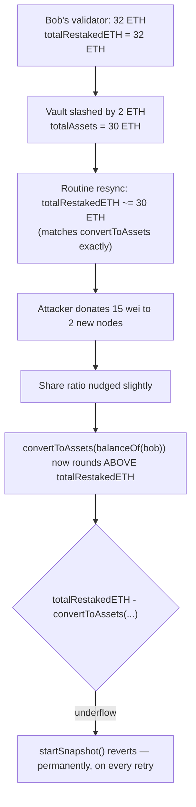
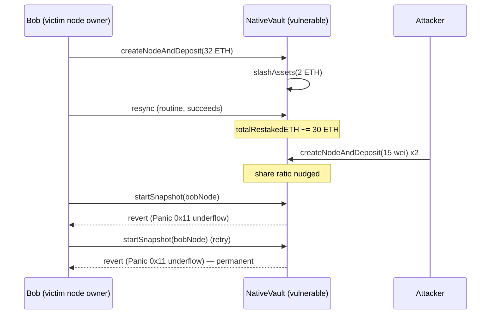

# Karak — [H-03] A DoS on snapshots due to a rounding error in calculations

> **Vulnerability classes:** vuln/arithmetic/underflow · vuln/dos/permanent · vuln/rounding/share-price

> **Reproduction:** a self-contained Foundry PoC that compiles & runs in an
> isolated project with **only `forge-std`** — no fork, no RPC, no `anvil_state`
> (the vulnerable restaking vault is deployed locally). Full trace:
> [output.txt](output.txt). PoC: [test/41067-h-03-a-dos-on-snapshots-due-to-a-rounding-error-in-calculati_exp.sol](test/41067-h-03-a-dos-on-snapshots-due-to-a-rounding-error-in-calculati_exp.sol).

<!-- non-defihacklabs -->
<!-- source-auditvault: https://github.com/Auditware/AuditVault/blob/main/findings/41067-h-03-a-dos-on-snapshots-due-to-a-rounding-error-in-calculati.md -->
<!-- date: 2024-07 -->

---

## Key info

| | |
|---|---|
| **Impact** | **HIGH** — any node owner's `startSnapshot()` can be permanently bricked by a cheap dust donation from an attacker, blocking withdrawals that depend on a successful snapshot |
| **Protocol** | [Karak](https://karak.network) — restaking (`NativeVault`) |
| **Vulnerable contract** | `NativeVault` — `_transferToSlashStore()` (called by `startSnapshot()`) |
| **Bug class** | Unchecked subtraction between a cached value and a freshly-rounded ERC4626 conversion that can round upward past it |
| **Finding** | Code4rena — 2024-07 Karak · #41067 |
| **Report** | [code4rena.com/reports/2024-07-karak](https://code4rena.com/reports/2024-07-karak) |
| **Source** | [AuditVault](https://github.com/Auditware/AuditVault/blob/main/findings/41067-h-03-a-dos-on-snapshots-due-to-a-rounding-error-in-calculati.md) |
| **Status** | Audit finding — confirmed by Karak, mitigated (guard added), mitigation confirmed. Reproduced here as a standalone local PoC. |
| **Compiler** | `^0.8.24` (PoC) |

This is an **audit finding**, not a historical on-chain incident — there is no
attack transaction. The PoC deploys a faithful minimal ERC4626-style
`NativeVault` locally and reproduces the exact numbers from KupiaSec's own
coded PoC (32 ETH validator, 2 ETH slash, two 15-wei dust donations), with a
control test showing snapshots keep succeeding when no dust donation occurs.

---

## TL;DR

1. `NativeVault.startSnapshot()` calls `_transferToSlashStore()`, which
   computes `slashedAssets = node.totalRestakedETH -
   convertToAssets(balanceOf(nodeOwner))`.
2. `NativeVault` is an ERC4626-style vault using the standard
   `(totalAssets + 1) / (totalSupply + 1)` rounding for share/asset
   conversion.
3. `node.totalRestakedETH` is a cached value, last set by an earlier
   successful snapshot. Because rounding can shift slightly whenever OTHER
   depositors change the share ratio, a later `convertToAssets(...)` call
   can round to a value **strictly greater** than that cached
   `totalRestakedETH`.
4. When that happens, the subtraction **underflows and reverts**.
5. An attacker can trigger this cheaply: create a couple of brand-new nodes
   and send them a few wei each — just enough to nudge the vault's share
   ratio and flip the inequality on a victim's next snapshot. Once bricked,
   the victim's snapshot **can never succeed again**, since nothing but a
   successful snapshot can resync `totalRestakedETH` — and the underflow
   prevents exactly that.

---

## The vulnerable code

The synthetic reduces `NativeVault` to the exact ERC4626 accounting and
snapshot logic the bug depends on; the underflowing subtraction is preserved
**verbatim**.

### `_transferToSlashStore()` — the underflowing subtraction (root cause)

```solidity
function startSnapshot(address nodeAddr) external {
    Node storage node = nodes[nodeAddr];

    // @> VULN NativeVault.sol#L430: convertToAssets(balanceOf(nodeOwner))
    //    can exceed node.totalRestakedETH due to ERC4626 rounding once
    //    OTHER depositors change the share ratio after this node's
    //    totalRestakedETH was last set — the subtraction underflows and
    //    reverts, permanently, until resynced (which itself requires a
    //    successful snapshot: a deadlock).
    //    FIX: guard with `if (node.totalRestakedETH > convertToAssets(...))`.
    uint256 slashedAssets = node.totalRestakedETH - convertToAssets(balanceOf[node.owner]);

    node.totalRestakedETH -= slashedAssets;
}
```

### The ERC4626 exchange rate that produces the rounding drift

```solidity
function convertToAssets(uint256 shares) public view returns (uint256) {
    return (shares * (totalAssets + 1)) / (totalSupply + 1);
}
```

### Recommended fix

```diff
-       uint256 slashedAssets = node.totalRestakedETH - convertToAssets(balanceOf(nodeOwner));
+       uint256 slashedAssets;
+       if (node.totalRestakedETH > convertToAssets(balanceOf(nodeOwner))) {
+           slashedAssets = node.totalRestakedETH - convertToAssets(balanceOf(nodeOwner));
+       }
```

## Root cause

`node.totalRestakedETH` is a point-in-time cache of `convertToAssets(balanceOf(nodeOwner))`
from the last successful snapshot. ERC4626-style conversions round using
integer division, and as OTHER users deposit or their shares change the
global `totalAssets`/`totalSupply` ratio, the SAME node's `balanceOf`
converts to a slightly different asset amount than it did before — and can
round **upward**. The code assumes `totalRestakedETH` is always the ceiling
(the "starting point" that only shrinks via slashing), but nothing enforces
that assumption once rounding is involved.

## Preconditions

- Any attacker can create a new vault node and send it a small amount of
  wei — no special privilege needed.
- A victim node whose `totalRestakedETH` is close to its current
  `convertToAssets(balanceOf(...))` value (which happens naturally right
  after any snapshot) is more susceptible, but the exact numbers below
  (KupiaSec's own coded PoC) show it doesn't take much drift at all.

## Attack walkthrough

From [output.txt](output.txt), reproducing KupiaSec's exact coded PoC numbers:

1. **Control** (`test_control_noDustDonation_snapshotsAlwaysSucceed`) —
   without any dust donation, Bob's snapshot succeeds repeatedly after a
   slash, with no underflow.
2. **Attack** (`test_run_dustDonation_bricksSnapshotPermanently`):
   - Bob's validator holds 32 ETH (`totalAssets = totalSupply = 32e18`).
   - The vault is slashed by 2 ETH (`totalAssets = 30e18`); a routine
     resync sets Bob's `totalRestakedETH` to `convertToAssets(balanceOf(bob))`
     — no bug triggered yet.
   - The attacker creates two brand-new nodes and donates 15 wei to each.
     Each donation mints new shares at the current ratio, nudging
     `totalAssets`/`totalSupply` just enough that Bob's shares now convert
     to a value **above** his cached `totalRestakedETH`.
   - Bob's next `startSnapshot()` call **reverts with an arithmetic
     underflow** — and reverts again identically on retry.
3. **Harm**: Bob's snapshot is permanently DoS'd. Since nothing but a
   successful snapshot can resync `totalRestakedETH`, and the underflow
   prevents exactly that snapshot from succeeding, this is a permanent
   deadlock — matching the judge's assessment that this can block
   withdrawals that depend on a successful snapshot.

## Diagrams





## Impact

- **Permanent denial of service on `startSnapshot()`** for the targeted
  node — every future call reverts identically, since nothing else can
  resync `totalRestakedETH`.
- **Blocks dependent flows**: the Code4rena judge raised severity to High
  specifically because withdrawal finalization depends on a successful
  snapshot — bricking the snapshot can brick withdrawals too.
- **Cheap to trigger**: the attacker's cost here is 30 wei total (two 15-wei
  donations) plus gas for two node creations — a negligible cost to
  permanently grief any node whose accounting sits close to the rounding
  boundary.

## Remediation

Guard the subtraction: only compute `slashedAssets` when
`node.totalRestakedETH > convertToAssets(balanceOf(nodeOwner))`; otherwise
treat it as zero. This is exactly Karak's shipped mitigation.

## How to reproduce

```bash
cd ~/RustroverProjects/audits/evm-hack-registry/41067-h-03-a-dos-on-snapshots-due-to-a-rounding-error-in-calculati_exp
forge test -vvv
# Fully local — no fork, no RPC, no anvil_state required.
# Expected: both tests PASS:
#   test_control_noDustDonation_snapshotsAlwaysSucceed (control: snapshots keep succeeding)
#   test_run_dustDonation_bricksSnapshotPermanently     (attack: underflow, permanent revert on retry)
```

PoC source: [test/41067-h-03-a-dos-on-snapshots-due-to-a-rounding-error-in-calculati_exp.sol](test/41067-h-03-a-dos-on-snapshots-due-to-a-rounding-error-in-calculati_exp.sol)
— a faithful minimal ERC4626-style `NativeVault` with the verbatim
underflowing subtraction, plus no-attack-vs-dust-attack contrast.

## Sources

- AuditVault finding: [41067-h-03-a-dos-on-snapshots-due-to-a-rounding-error-in-calculati.md](https://github.com/Auditware/AuditVault/blob/main/findings/41067-h-03-a-dos-on-snapshots-due-to-a-rounding-error-in-calculati.md)
- Original report: [Code4rena — 2024-07 Karak](https://code4rena.com/reports/2024-07-karak), finding #41067 (KupiaSec)
- Reduced-source provenance: quoted verbatim from the AuditVault finding,
  which itself quotes [`NativeVault.sol#L425-L446`](https://github.com/code-423n4/2024-07-karak/blob/main/src/NativeVault.sol#L425-L446)
  from `code-423n4/2024-07-karak`, plus KupiaSec's fully coded PoC with
  concrete numbers reproduced exactly here; no clone was needed since the
  finding's comment thread quotes the exact vulnerable function and a
  complete, numerically concrete attack sequence.

---

*Reference: finding **#41067** in the [Code4rena 2024-07 Karak audit](https://code4rena.com/reports/2024-07-karak) · curated by [AuditVault](https://github.com/Auditware/AuditVault/blob/main/findings/41067-h-03-a-dos-on-snapshots-due-to-a-rounding-error-in-calculati.md)*
