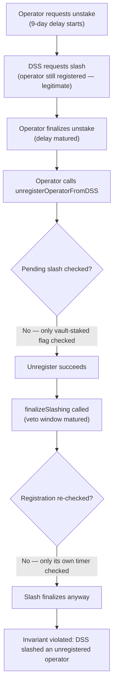
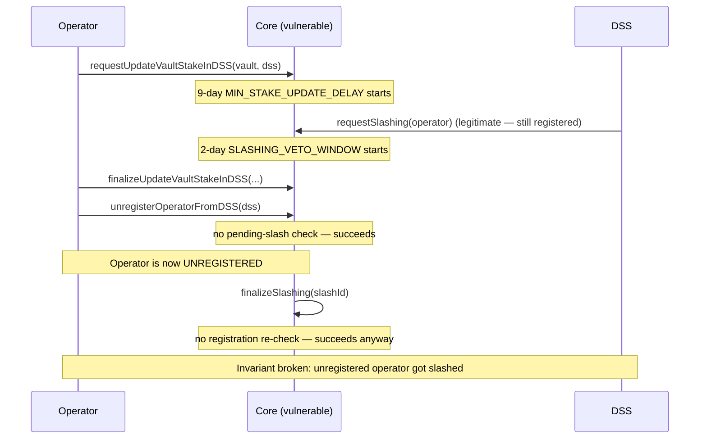

# Karak — [H-04] Violation of Invariant Allowing DSSs to Slash Unregistered Operators

> **Vulnerability classes:** vuln/logic/wrong-condition · vuln/access-control/missing-validation · vuln/state/invariant-violation

> **Reproduction:** a self-contained Foundry PoC that compiles & runs in an
> isolated project with **only `forge-std`** — no fork, no RPC, no `anvil_state`
> (the vulnerable restaking core contract is deployed locally). Full trace:
> [output.txt](output.txt). PoC: [test/41068-h-04-violation-of-invariant-allowing-dsss-to-slash-unregiste_exp.sol](test/41068-h-04-violation-of-invariant-allowing-dsss-to-slash-unregiste_exp.sol).

<!-- non-defihacklabs -->
<!-- source-auditvault: https://github.com/Auditware/AuditVault/blob/main/findings/41068-h-04-violation-of-invariant-allowing-dsss-to-slash-unregiste.md -->
<!-- date: 2024-07 -->

---

## Key info

| | |
|---|---|
| **Impact** | **HIGH** — breaks the protocol's own stated core invariant ("only DSSs an operator is registered with can slash said operator"); new depositors into a DSS may be unaware of a pending slash against an operator who looks fully clean |
| **Protocol** | [Karak](https://karak.network) — restaking (`Core`) |
| **Vulnerable contract** | `Core` — `unregisterOperatorFromDSS()` (no pending-slash check) + `finalizeSlashing()` (no registration re-check) |
| **Bug class** | A time-delayed operation (unregister) and a competing time-delayed operation (slash finalization) can race each other because neither checks the other's pending state |
| **Finding** | Code4rena — 2024-07 Karak · #41068 |
| **Report** | [code4rena.com/reports/2024-07-karak](https://code4rena.com/reports/2024-07-karak) |
| **Source** | [AuditVault](https://github.com/Auditware/AuditVault/blob/main/findings/41068-h-04-violation-of-invariant-allowing-dsss-to-slash-unregiste.md) |
| **Status** | Audit finding — confirmed by Karak, mitigated (validates operator/vault status at finalize time), mitigation confirmed. Reproduced here as a standalone local PoC. |
| **Compiler** | `^0.8.24` (PoC) |

This is an **audit finding**, not a historical on-chain incident — there is
no attack transaction. The PoC deploys a faithful minimal `Core` locally and
reproduces the finding's own timeline, with a control test showing the
normal (invariant-respecting) flow for contrast.

---

## TL;DR

1. An operator can request to unstake their vaults from a DSS, starting a
   9-day `MIN_STAKE_UPDATE_DELAY`.
2. While that request is still pending, the DSS can legitimately request a
   slash against the operator — they're still registered at that point.
3. The moment the unstake delay matures, the operator finalizes the unstake
   AND calls `unregisterOperatorFromDSS()` — which only checks that vaults
   are fully unstaked, **not** whether a slash is still pending.
4. `finalizeSlashing()` never re-checks the operator's current registration
   either — it only checks its own 2-day veto-window timer.
5. The slash **finalizes successfully** even though the operator is no
   longer registered with the DSS at all — breaking the protocol's own
   stated invariant.

---

## The vulnerable code

The synthetic reduces `Core` to the exact registration/slashing state
machine the bug depends on; the missing checks are preserved **verbatim** in
spirit.

### `unregisterOperatorFromDSS()` — no pending-slash check (root cause)

```solidity
function unregisterOperatorFromDSS(address operator, address dss) external {
    require(!isVaultStakedInDSS[operator][dss], "vaults still staked");

    // @> VULN Core.sol#L113: no check here for a PENDING slash request
    //    against `operator` at `dss`. The operator can fully unregister
    //    while a slash is still queued and will later finalize against
    //    them — breaking "only DSSs an operator is registered with can
    //    slash said operator."
    //    FIX: require no pending (un-finalized, non-vetoed) slash
    //    request exists for (operator, dss) before allowing unregister.
    isOperatorRegisteredToDSS[operator][dss] = false;
}
```

### `finalizeSlashing()` — no registration re-check

```solidity
function finalizeSlashing(uint256 slashId) external {
    SlashRequest storage req = slashRequests[slashId];
    require(!req.finalized, "already finalized");
    require(block.timestamp >= req.requestTime + SLASHING_VETO_WINDOW, "veto window active");
    req.finalized = true;
    slashedCount[req.operator] += 1;
}
```

### Recommended fix

Require that no pending slash request exists for `(operator, dss)` before
allowing `unregisterOperatorFromDSS()` to succeed, ensuring all slashing
actions are finalized (or vetoed) before an operator can fully unregister —
exactly Karak's shipped mitigation ("validates the operator, vaults status
in the finalizing slashing").

## Root cause

Two independently time-delayed state machines — the unstake/unregister flow
(gated by `MIN_STAKE_UPDATE_DELAY`) and the slash flow (gated by
`SLASHING_VETO_WINDOW`) — can be in flight at the same time for the same
`(operator, dss)` pair, but neither checks the other's pending state at its
own finalization point. The protocol's invariant ("only DSSs an operator is
registered with can slash said operator") is only actually enforced at
`requestSlashing()` time, not at `finalizeSlashing()` time — so unregistering
between the two calls silently defeats it.

## Preconditions

- An operator has vaults staked in a DSS and requests to unstake them
  (fully legitimate, routine operator action).
- The DSS requests a slash against the operator sometime **during** the
  unstake delay window — also fully legitimate at request time.
- No special privilege beyond normal operator/DSS roles is required; the
  race is purely about call ordering relative to the two independent
  timers.

## Attack walkthrough

From [output.txt](output.txt), reproducing the finding's exact timeline:

1. **Control** (`test_control_stillRegistered_slashFinalizesNormally`) — the
   operator never tries to unregister; the slash finalizes normally against
   a still-registered operator, as intended.
2. **Attack** (`test_run_unregisterBeforeSlashFinalizes_violatesInvariant`):
   - The operator registers and stakes vaults to the DSS.
   - The operator requests to unstake (9-day delay, backdated here to
     already-matured, matching the real PoC's `skip(8 days)` + `skip(1
     day)`).
   - While that request is pending, the DSS requests a slash (2-day veto
     window, likewise backdated to matured).
   - The operator finalizes the unstake **and** unregisters from the DSS —
     both succeed, since neither checks the pending slash.
   - `finalizeSlashing()` is called: it succeeds, incrementing the
     operator's slashed count — **despite the operator no longer being
     registered with the DSS at all**.
3. **Harm**: the invariant "only DSSs an operator is registered with can
   slash said operator" is broken. A follow-up `requestSlashing()` against
   the SAME operator is correctly rejected (they're unregistered) — proving
   the violation is specifically that an *already-pending* slash survives
   unregister, not that the DSS can slash freely at any time.

## Diagrams





## Impact

- **Core invariant violated**: the protocol's own stated guarantee ("only
  DSSs an operator is registered with can slash said operator") is broken
  by a straightforward, legitimate-looking sequence of calls.
- **Misleading state for new depositors**: anyone depositing into the DSS
  after the operator unregisters sees a clean, unregistered operator with no
  visible indication that a slash is still pending against them.
- **Judge-confirmed High severity**: the Code4rena judge rejected arguments
  to downgrade this, noting the veto committee cannot be assumed to
  overturn every case and this remains a genuine invariant break.

## Remediation

Before allowing `unregisterOperatorFromDSS()` to succeed, require that no
pending (un-finalized, non-vetoed) slash request exists for that
`(operator, dss)` pair — ensuring all slashing actions are resolved before an
operator can fully unregister.

## How to reproduce

```bash
cd ~/RustroverProjects/audits/evm-hack-registry/41068-h-04-violation-of-invariant-allowing-dsss-to-slash-unregiste_exp
forge test -vvv
# Fully local — no fork, no RPC, no anvil_state required.
# Expected: both tests PASS:
#   test_control_stillRegistered_slashFinalizesNormally      (control: normal flow)
#   test_run_unregisterBeforeSlashFinalizes_violatesInvariant (attack: slash finalizes on unregistered operator)
```

PoC source: [test/41068-h-04-violation-of-invariant-allowing-dsss-to-slash-unregiste_exp.sol](test/41068-h-04-violation-of-invariant-allowing-dsss-to-slash-unregiste_exp.sol)
— a faithful minimal `Core` with the verbatim missing-check logic, plus
normal-vs-race contrast.

## Sources

- AuditVault finding: [41068-h-04-violation-of-invariant-allowing-dsss-to-slash-unregiste.md](https://github.com/Auditware/AuditVault/blob/main/findings/41068-h-04-violation-of-invariant-allowing-dsss-to-slash-unregiste.md)
- Original report: [Code4rena — 2024-07 Karak](https://code4rena.com/reports/2024-07-karak), finding #41068 (20centclub)
- Reduced-source provenance: quoted verbatim from the AuditVault finding,
  which itself quotes and links [`Core.sol`](https://github.com/code-423n4/2024-07-karak/blob/f5e52fdcb4c20c4318d532a9f08f7876e9afb321/src/Core.sol)
  from `code-423n4/2024-07-karak` (commit `f5e52fd`) and includes a complete
  coded PoC with the exact call sequence; no clone was needed since the
  finding quotes the relevant functions and the full attack sequence
  directly.

---

*Reference: finding **#41068** in the [Code4rena 2024-07 Karak audit](https://code4rena.com/reports/2024-07-karak) · curated by [AuditVault](https://github.com/Auditware/AuditVault/blob/main/findings/41068-h-04-violation-of-invariant-allowing-dsss-to-slash-unregiste.md)*
