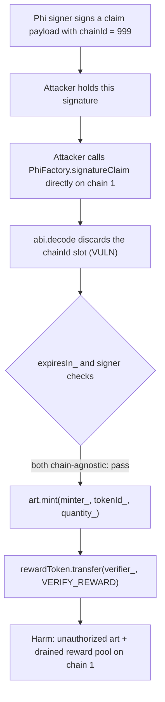
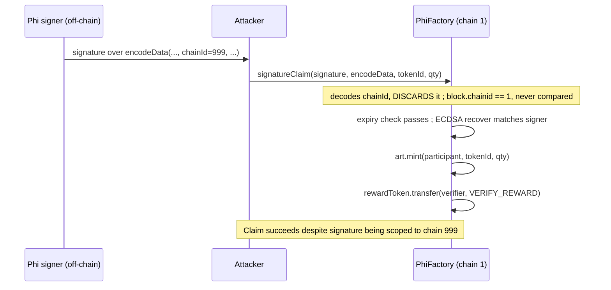

# Phi — signature replay in `signatureClaim` ignores chain id

> **Vulnerability classes:** vuln/access-control/missing-chain-binding · vuln/signature/replay-across-chains · vuln/logic/discarded-validation-field

> **Reproduction:** a self-contained Foundry PoC that compiles & runs in an
> isolated project with **only `forge-std`** — no fork, no RPC, no `anvil_state`.
> Full trace: [output.txt](output.txt). PoC:
> [test/41087-h-01-signature-replay-in-signatureclaim-results-in-unauthori_exp.sol](test/41087-h-01-signature-replay-in-signatureclaim-results-in-unauthori_exp.sol).

<!-- non-defihacklabs -->
<!-- source-auditvault: https://github.com/Auditware/AuditVault/blob/main/findings/41087-h-01-signature-replay-in-signatureclaim-results-in-unauthori.md -->
<!-- date: 2024-08 -->

**AuditVault taxonomy:** `lang/solidity` · `sector/nft` · `platform/code4rena` · `has/github` · `has/poc` · `severity/high` · `impact/loss-of-funds/direct-drain` · genome: `signature-replay` · `direct-drain` · `permit-fork-replay` · `timestamp-dependence`

---

## Key info

| | |
|---|---|
| **Impact** | **HIGH** — a signature obtained from the Phi signer for one chain can be replayed on any other chain, minting art rewards and draining protocol-funded verify bounties that were never authorized on the replaying chain |
| **Protocol** | [Phi](https://code4rena.com/reports/2024-08-phi) — `PhiFactory.signatureClaim` |
| **Vulnerable code** | `PhiFactory.signatureClaim(signature_, encodeData_, mintArgs_)` — decodes and discards the signed chain id |
| **Bug class** | Missing binding: the signed payload encodes a chain id, but the value is never checked against `block.chainid` |
| **Finding** | Code4rena — Phi, 2024-08 · #41087 (H-01) · reporter **McToady** |
| **Report** | [2024-08-phi](https://code4rena.com/reports/2024-08-phi) |
| **Source** | [AuditVault](https://github.com/Auditware/AuditVault/blob/main/findings/41087-h-01-signature-replay-in-signatureclaim-results-in-unauthori.md) |
| **Status** | Audit finding — caught in review (not exploited on-chain). Reproduced here as a standalone local PoC. |
| **Compiler** | `^0.8.24` (PoC) |

This is an **audit finding**, not a historical on-chain incident. The real
`PhiFactory` is a much larger contract; the PoC keeps the vulnerable
`signatureClaim` body — including the exact `abi.decode` tuple that discards the
chain id — verbatim, with minimal mocks for the art receipt token and the
protocol's ETH-denominated reward pool.

---

## TL;DR

1. `PhiFactory.signatureClaim` unpacks its signed `encodeData_` into
   `(expiresIn_, minter_, ref_, verifier_, artId_, <chainId>, data_)` — the sixth
   tuple slot is bound to nothing; it is decoded and immediately discarded.
2. The correct claim path (`PhiNFT1155` → `Claimable.signatureClaim`) re-packs
   `encodeData_`, substituting the real `block.chainid` before forwarding to the
   factory — but `PhiFactory.signatureClaim` is a **public** function, callable
   directly, which skips that substitution entirely.
3. A signature obtained from the Phi signer for **any** chain therefore
   authorizes a claim on **every** chain, since the value is never compared
   against `block.chainid`.
4. HARM in the PoC: a signature explicitly signed for chain id `999` (this
   synthetic runs on chain `1`) is replayed directly against the factory. The
   claim succeeds: the participant receives the art token, and the protocol's
   ETH-denominated reward pool pays the verifier bounty — for a claim that was
   never valid on this chain.

---

## The vulnerable code

Faithful reduction (`PhiFactory.signatureClaim`, verbatim decode):

```solidity
(uint256 expiresIn_, address minter_, address ref_, address verifier_, uint256 artId_,, bytes32 data_) =
    abi.decode(encodeData_, (uint256, address, address, address, uint256, uint256, bytes32));
// @> VULN: the decoded chainId (6th tuple slot, between artId_ and data_) is thrown
// away -- never checked against block.chainid.
// FIX: require(chainId_ == block.chainid, "wrong chain");

if (expiresIn_ <= block.timestamp) revert("SignatureExpired");
if (_recoverSigner(keccak256(encodeData_), signature_) != phiSignerAddress) revert("AddressNotSigned");
```

Notice the blank identifier between `artId_` and `data_` in the tuple pattern —
Solidity happily decodes that slot and discards it. Nothing downstream ever
reads it.

---

## Root cause

The signed payload's schema *includes* a chain id — the signer clearly intended
signatures to be chain-scoped. But `signatureClaim`'s decode statement never
binds that value to a variable, so there is nothing left to check against
`block.chainid`. The only place that *does* re-derive and substitute the chain
id is `Claimable.signatureClaim` (reached via `PhiNFT1155`) — but that
substitution happens on the *caller's* side before forwarding, and
`PhiFactory.signatureClaim` never enforces that callers go through it.

## Preconditions

- An attacker holds (or can obtain) a signature produced by the Phi signer for
  **any** chain — for example, by legitimately claiming a cheap `artId` on a
  chain where it is easy to reach, and reusing the resulting signature.
- The corresponding `artId` has not already been claimed on the target chain.
- `expiresIn_` has not elapsed (a wide window in practice).

## Attack walkthrough

From [output.txt](output.txt):

1. The Phi signer signs a claim payload whose embedded chain id is `999`.
2. An attacker calls `PhiFactory.signatureClaim` **directly** on chain `1`
   (`block.chainid == 1 != 999`), passing that exact signature and payload.
3. `signatureClaim` decodes the payload, discards the chain id slot, verifies
   expiry and the ECDSA recovery (both chain-agnostic checks) — both pass.
4. The art token is minted to the participant, and the protocol's reward pool
   pays the verify bounty.
5. **HARM:** the claim fully succeeded despite the signature never being valid
   for chain `1`. The participant holds the art token; the reward pool is out
   the full bounty.

## Diagrams





## Remediation

Per the report, mirror the same substitution `Claimable::signatureClaim`
already performs — repack (or directly validate) the signed chain id against
`block.chainid` inside `PhiFactory.signatureClaim` itself, so the check cannot
be bypassed by calling the factory directly:

```solidity
(uint256 expiresIn_, address minter_, address ref_, address verifier_, uint256 artId_, uint256 chainId_, bytes32 data_) =
    abi.decode(encodeData_, (uint256, address, address, address, uint256, uint256, bytes32));
require(chainId_ == block.chainid, "wrong chain");
```

## How to reproduce

```bash
cd ~/RustroverProjects/audits/evm-hack-registry/41087-h-01-signature-replay-in-signatureclaim-results-in-unauthori_exp
forge test -vvv
# Fully local -- no fork, no RPC, no anvil_state required.
# Expected: all three tests PASS:
#   test_exploit                         (self-contained Exploit: cross-chain signature replay)
#   test_signatureReplayAcrossChains     (EOA rebuild with a real ECDSA signature via vm.sign)
#   test_correctChainIdStillWorks        (control: a correctly-bound signature also works)
```

PoC source: [test/41087-h-01-signature-replay-in-signatureclaim-results-in-unauthori_exp.sol](test/41087-h-01-signature-replay-in-signatureclaim-results-in-unauthori_exp.sol)
— the verbatim vulnerable decode inside a faithful `signatureClaim` reduction,
plus the cross-chain replay demonstration and a control test.

> Note: the ECDSA signature used by the self-contained `Exploit` contract is
> **precomputed offline** (no cheatcodes in that file — it must run cheatcode-free
> in the Playground); the standalone rebuild test generates a fresh signature via
> `vm.sign` to demonstrate the same mechanism end-to-end. `MockArt1155` and
> `MockRewardToken` are minimal stand-ins for the real ERC1155 art contract and
> the protocol's ETH-denominated reward accounting — simplified because they do
> not affect the bug. The blamed decode line and the missing chain-id check are
> faithful to the finding.

---

*Reference: finding **#41087 (H-01)** by **McToady** in the [Code4rena Phi review (Aug 2024)](https://code4rena.com/reports/2024-08-phi) · curated by [AuditVault](https://github.com/Auditware/AuditVault/blob/main/findings/41087-h-01-signature-replay-in-signatureclaim-results-in-unauthori.md)*
