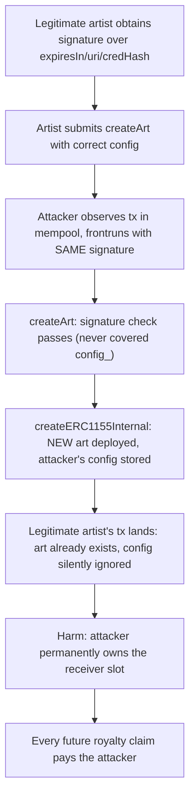
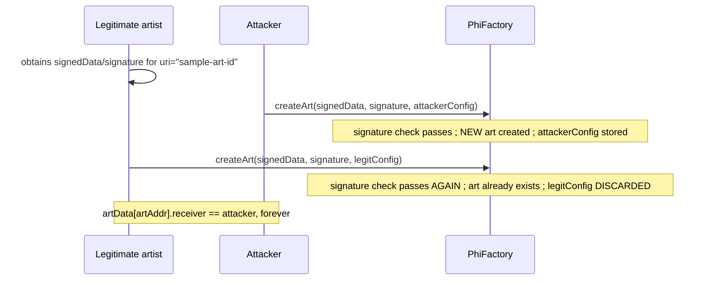

# Phi — signature replay in `createArt` allows impersonating the artist

> **Vulnerability classes:** vuln/signature/unbound-parameters · vuln/access-control/frontrunning · vuln/logic/silent-duplicate-success

> **Reproduction:** a self-contained Foundry PoC that compiles & runs in an
> isolated project with **only `forge-std`** — no fork, no RPC, no `anvil_state`.
> Full trace: [output.txt](output.txt). PoC:
> [test/41088-h-02-signature-replay-in-createart-allows-to-impersonate-art_exp.sol](test/41088-h-02-signature-replay-in-createart-allows-to-impersonate-art_exp.sol).

<!-- non-defihacklabs -->
<!-- source-auditvault: https://github.com/Auditware/AuditVault/blob/main/findings/41088-h-02-signature-replay-in-createart-allows-to-impersonate-art.md -->
<!-- date: 2024-08 -->

**AuditVault taxonomy:** `lang/solidity` · `sector/nft` · `sector/nft-marketplace` · `platform/code4rena` · `has/github` · `has/poc` · `severity/high` · `impact/loss-of-funds/direct-drain` · `impact/mev/frontrun` · genome: `signature-replay` · `direct-drain` · `frontrun` · `frontrun-exposure` · `permit-fork-replay` · `reentrancy-guard` · `royalty-edge-cases` · `timestamp-dependence`

---

## Key info

| | |
|---|---|
| **Impact** | **HIGH** — anyone can frontrun a legitimate `createArt` transaction, reusing its signature with their own configuration, permanently capturing the artist/royalty-receiver slot and stealing all future royalties |
| **Protocol** | [Phi](https://code4rena.com/reports/2024-08-phi) — `PhiFactory.createArt` |
| **Vulnerable code** | `PhiFactory.createArt(signedData_, signature_, config_)` and `createERC1155Internal` |
| **Bug class** | Missing binding: the signature covers the art metadata but never the `CreateConfig` (artist/receiver/royaltyBPS), nor the caller |
| **Finding** | Code4rena — Phi, 2024-08 · #41088 (H-02) · reporter **petarP1998** |
| **Report** | [2024-08-phi](https://code4rena.com/reports/2024-08-phi) |
| **Source** | [AuditVault](https://github.com/Auditware/AuditVault/blob/main/findings/41088-h-02-signature-replay-in-createart-allows-to-impersonate-art.md) |
| **Status** | Audit finding — caught in review (not exploited on-chain). Reproduced here as a standalone local PoC. |
| **Compiler** | `^0.8.24` (PoC) |

This is an **audit finding**, not a historical on-chain incident. The PoC keeps
the vulnerable `createArt`/`createERC1155Internal` bodies verbatim, with a
minimal ETH-denominated royalty pool standing in for the real per-claim
royalty mechanics.

---

## TL;DR

1. `PhiFactory.createArt(signedData_, signature_, config_)` verifies a
   signature over `(expiresIn_, uri_, credHash_)` only — the `CreateConfig`
   (`artist`/`receiver`/`royaltyBPS`) is **never** part of the signed payload,
   and the caller is never bound either.
2. `createERC1155Internal` deploys the art contract and stores `config_` **only
   the first time** a given `uri_` is seen — and returns successfully (no
   revert) whether it just created a new contract or one already existed.
3. An attacker who observes a legitimate `createArt` transaction in the
   mempool can **frontrun** it, resubmitting the exact same
   `signedData_`/`signature_` with their **own** `config_` (naming themselves
   `receiver`).
4. The legitimate transaction then lands — it does not revert, but its
   `config_` is silently discarded because the art contract already exists.
5. HARM in the PoC: the attacker's frontrun config permanently wins the
   artist/receiver slot; every future royalty claim on that art pays the
   attacker, not the legitimate artist's chosen receiver.

---

## The vulnerable code

Faithful reduction (`PhiFactory.createArt` + `createERC1155Internal`):

```solidity
function createArt(bytes calldata signedData_, bytes calldata signature_, CreateConfig memory config_)
    external
    returns (address artAddr)
{
    (uint256 expiresIn_, string memory uri_, bytes32 credHash_) = abi.decode(signedData_, (uint256, string, bytes32));

    if (expiresIn_ <= block.timestamp) revert("SignatureExpired");
    if (_recoverSigner(keccak256(signedData_), signature_) != phiSignerAddress) revert("AddressNotSigned");

    // @> VULN: the signed payload covers only (expiresIn_, uri_, credHash_) -- it never
    // binds config_ (artist/receiver/royaltyBPS), nor does it bind the caller.
    return createERC1155Internal(uri_, config_);
}

function createERC1155Internal(string memory uri_, CreateConfig memory config_) internal returns (address artAddr) {
    bytes32 key = keccak256(bytes(uri_));
    artAddr = artByUriHash[key];
    if (artAddr == address(0)) {
        artAddr = address(new MockPhiNFT1155());
        artByUriHash[key] = artAddr;
        artData[artAddr] = config_;
    }
    // @> VULN2: succeeds either way (new OR already-existing) -- a frontrunning
    // resubmission with a DIFFERENT config_ silently wins the permanent slot.
}
```

---

## Root cause

`createArt` authenticates the *content* being created (the URI and a
credential hash) but never authenticates *who owns it* or *who is allowed to
submit it*. Since `createERC1155Internal` treats "art already exists for this
URI" as a harmless no-op rather than a conflict, whichever transaction with
this signature lands **first** — legitimate or not — permanently wins the
config slot, and every later resubmission "succeeds" while doing nothing.

## Preconditions

- A legitimate `createArt` transaction (signature + config) is visible in the
  mempool before it is mined.
- The attacker can submit their own transaction with higher priority (gas) to
  land first.

## Attack walkthrough

From [output.txt](output.txt):

1. The legitimate artist obtains a valid signature over
   `(expiresIn, "sample-art-id", credHash)` and prepares their `CreateConfig`
   (with `receiver = legitReceiver`).
2. Before their transaction lands, the attacker submits `createArt` with the
   **same** `signedData_`/`signature_`, but with `config_.receiver = attacker`.
3. The attacker's transaction lands first: the signature check passes (it
   never covered `config_`), and the art contract is created with the
   attacker as `receiver`.
4. The legitimate artist's transaction lands afterward, with the **correct**
   config — it does not revert, but the art contract already exists, so their
   config is silently discarded.
5. **HARM:** `artData[artAddr].receiver == attacker`, permanently. Every
   future royalty claim on this art pays the attacker instead of the
   legitimate artist's chosen receiver.

## Diagrams





## Remediation

Per the sponsor's own proposed fix, bind the config to the signed payload and
to a specific caller/nonce, e.g.:

```solidity
struct SignatureData {
    uint256 expiresIn;
    uint256 nonce;
    address creator;
    address executor;
    string uri;
    bytes credData;
}

function _validateArtCreationSignature(bytes memory signedData_, bytes calldata signature_) private view {
    SignatureData memory data = abi.decode(signedData_, (SignatureData));
    if (_recoverSigner(keccak256(signedData_), signature_) != phiSignerAddress) revert AddressNotSigned();
    if (data.expiresIn <= block.timestamp) revert SignatureExpired();
    if (data.creator != address(0) && data.creator != _msgSender()) revert InvalidCreator();
    if (data.executor != address(0) && data.executor != _msgSender()) revert InvalidExecutor();
    if (data.nonce != nonces[_msgSender()]) revert InvalidNonce();
}
```

## How to reproduce

```bash
cd ~/RustroverProjects/audits/evm-hack-registry/41088-h-02-signature-replay-in-createart-allows-to-impersonate-art_exp
forge test -vvv
# Fully local -- no fork, no RPC, no anvil_state required.
# Expected: all three tests PASS:
#   test_exploit                     (self-contained Exploit: frontrun captures royalties)
#   test_frontrunStealsArtistSlot    (EOA rebuild with a real ECDSA signature via vm.sign)
#   test_legitimateCreateWorks       (control: absent a frontrun, legit config is stored)
```

PoC source: [test/41088-h-02-signature-replay-in-createart-allows-to-impersonate-art_exp.sol](test/41088-h-02-signature-replay-in-createart-allows-to-impersonate-art_exp.sol)
— the verbatim vulnerable `createArt`/`createERC1155Internal` reduction, the
frontrun demonstration, and a control test.

> Note: `MockPhiNFT1155` is a placeholder for the real deployed art contract —
> only its address/existence matters for this bug. The ETH-denominated
> royalty pool stands in for the real per-claim royalty distribution
> mechanics, simplified because it does not affect the bug. The blamed lines
> and the "succeeds either way" behavior of `createERC1155Internal` are
> faithful to the finding.

---

*Reference: finding **#41088 (H-02)** by **petarP1998** in the [Code4rena Phi review (Aug 2024)](https://code4rena.com/reports/2024-08-phi) · curated by [AuditVault](https://github.com/Auditware/AuditVault/blob/main/findings/41088-h-02-signature-replay-in-createart-allows-to-impersonate-art.md)*
