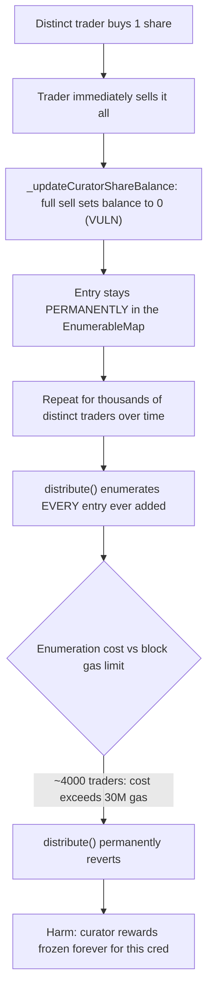
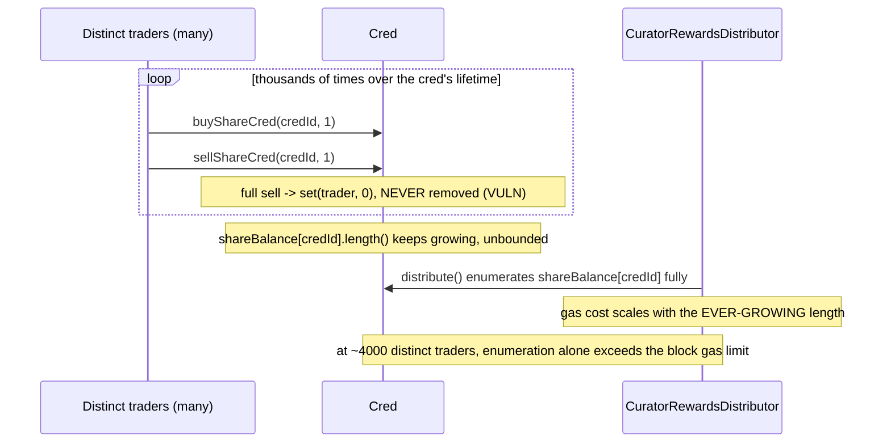

# Phi — `shareBalance` bloating eventually blocks curator rewards distribution

> **Vulnerability classes:** vuln/dos/unbounded-growth · vuln/gas/enumeration-cost · vuln/logic/missing-cleanup

> **Reproduction:** a self-contained Foundry PoC that compiles & runs in an
> isolated project with **only `forge-std`** — no fork, no RPC, no `anvil_state`.
> Run with `forge test` (the folder's `foundry.toml` sets `isolate = true` for
> consensus-accurate gas metering — see below). Full trace: [output.txt](output.txt).
> PoC: [test/41089-h-03-sharebalance-bloating-eventually-blocks-curator-rewards_exp.sol](test/41089-h-03-sharebalance-bloating-eventually-blocks-curator-rewards_exp.sol).

<!-- non-defihacklabs -->
<!-- source-auditvault: https://github.com/Auditware/AuditVault/blob/main/findings/41089-h-03-sharebalance-bloating-eventually-blocks-curator-rewards.md -->
<!-- date: 2024-08 -->

**AuditVault taxonomy:** `lang/solidity` · `platform/code4rena` · `has/github` · `has/poc` · `severity/high` · `sector/dex` · `sector/launchpad` · `sector/options` · genome: `unbounded-loop` · `permanent` · `dos-resistance` · `timestamp-dependence`

---

## Key info

| | |
|---|---|
| **Impact** | **HIGH** — a cred's curator rewards become **permanently undistributable** once enough distinct addresses have ever traded its shares (~4000, per the finding), because the reward-distribution loop enumerates every entry ever added and eventually exceeds the block gas limit |
| **Protocol** | [Phi](https://code4rena.com/reports/2024-08-phi) — `Cred` / `CuratorRewardsDistributor` |
| **Vulnerable code** | `Cred._updateCuratorShareBalance` — a full sell sets the balance to 0 instead of removing the entry |
| **Bug class** | Unbounded storage growth feeding an unbounded enumeration loop (DoS via gas-limit exhaustion) |
| **Finding** | Code4rena — Phi, 2024-08 · #41089 (H-03) · reporter **rare_one** |
| **Report** | [2024-08-phi](https://code4rena.com/reports/2024-08-phi) |
| **Source** | [AuditVault](https://github.com/Auditware/AuditVault/blob/main/findings/41089-h-03-sharebalance-bloating-eventually-blocks-curator-rewards.md) |
| **Status** | Audit finding — caught in review (not exploited on-chain). Reproduced here as a standalone local PoC. |
| **Compiler** | `^0.8.24` (PoC) |

This is an **audit finding**, not a historical on-chain incident. The real bug
needs roughly 4000 distinct traders to hit a 30M-gas block limit — far too
many opcodes to trace in-browser — so this PoC **samples** a much smaller
trader count, measures the enumeration loop's *real* marginal gas cost per
orphaned entry, and extrapolates to the finding's own ~4000-trader figure to
prove the DoS threshold is real. This is exactly the technique the finding's
own PoC uses ("couldn't run all 4000 in one call, measured gas instead").

---

## TL;DR

1. `Cred` tracks each cred's curator share balances in an `EnumerableMap`
   (`shareBalance[credId]`). Buying adds/increases an entry; selling
   decreases it.
2. When a curator **fully sells** (balance would reach 0),
   `_updateCuratorShareBalance` calls `shareBalance[credId].set(sender, 0)` —
   **not** `.remove(sender)`. The entry (and its storage) stays in the map
   forever, at a permanent zero balance.
3. `CuratorRewardsDistributor.distribute()` enumerates **every entry ever
   added** to the map — including these permanent zero-balance orphans — in a
   loop bounded by the map's length.
4. Once enough distinct addresses have ever traded a cred's shares (~4000 per
   the finding), this enumeration alone exceeds the block gas limit.
   `distribute()` becomes **permanently uncallable** — the cred's curator
   rewards are frozen forever, even for currently-active shareholders.
5. HARM in the PoC: after seeding 61 orphaned entries and measuring
   `distribute()`'s real per-entry gas cost, extrapolating to 4000 traders
   yields a cost that exceeds the 30,000,000 block gas limit.

---

## The vulnerable code

Faithful reduction (`Cred._updateCuratorShareBalance`):

```solidity
function _updateCuratorShareBalance(uint256 credId_, address sender_, uint256 amount_, bool isBuy) internal {
    (, uint256 currentNum) = shareBalance[credId_].tryGet(sender_);

    if (isBuy) {
        // ... (unchanged) ...
        shareBalance[credId_].set(sender_, currentNum + amount_);
    } else {
        if ((currentNum - amount_) == 0) {
            _credIdExistsPerAddress[sender_][credId_] = false;
        }
        // @> VULN: on a full sell the balance is SET to 0 instead of REMOVED from the
        // EnumerableMap -- the entry (and the storage slots behind it) stays forever.
        // FIX: shareBalance[credId_].remove(sender_); (only) when currentNum - amount_ == 0.
        shareBalance[credId_].set(sender_, currentNum - amount_);
    }
}
```

And the enumeration that eventually exceeds the block gas limit
(`CuratorRewardsDistributor.distribute`):

```solidity
uint256 stopIndex = cred.shareBalanceLength(credId_);
for (uint256 i = 0; i < stopIndex; ++i) {
    // @> VULN: enumerates EVERY entry ever added, including permanent zero-balance
    // ones -- this is the loop that eventually exceeds the block gas limit.
    (address key, uint256 shareAmount) = cred.shareBalanceAt(credId_, i);
    ...
}
```

---

## Root cause

The `EnumerableMap` abstraction is well-suited for a bounded, actively-held
set of curators — but `_updateCuratorShareBalance` never removes an entry once
added, only ever zeroes its value. Since a cred's popularity is measured in
*distinct addresses that have ever traded it*, not *currently active
holders*, the map's length grows monotonically with trading activity,
independent of the actual number of current shareholders. The enumeration
loop's gas cost scales with that ever-growing length, not with anything
bounded.

## Preconditions

- The cred has been actively traded long enough that a large number of
  distinct addresses have each bought and fully sold their position at least
  once (this is normal, expected usage — or can be cheaply griefed via
  lightweight proxy contracts/EIP-7702, per the finding's own note).

## Attack walkthrough (sample + extrapolate)

From [output.txt](output.txt):

1. 60 distinct trader addresses each buy 1 share and immediately sell it all,
   each leaving a permanent zero-balance orphan behind — seeded as **separate
   top-level calls** (mirroring separate transactions on mainnet, so each
   trader's storage starts genuinely cold, exactly like the real world).
2. One more trader does the same **inside** the measured call, bringing the
   orphan count to 61.
3. `distribute()` is called once, and its real gas cost enumerating all 61
   orphans is measured directly via `gasleft()` deltas.
4. The measured per-entry cost is extrapolated to the finding's own ~4000
   trader figure.
5. **HARM:** the extrapolated cost exceeds the current 30,000,000 block gas
   limit — at real-world scale, `distribute()` can never complete in a single
   block and permanently reverts, freezing this cred's curator rewards for
   every remaining holder, indefinitely.

## Diagrams





## Remediation

Per the report, remove zero-balance entries from the map instead of setting
them to zero:

```diff
    } else {
        if ((currentNum - amount_) == 0) {
            _credIdExistsPerAddress[sender_][credId_] = false;
+           shareBalance[credId_].remove(sender_);
        }
+       else
            shareBalance[credId_].set(sender_, currentNum - amount_);
    }
```

## How to reproduce

```bash
cd ~/RustroverProjects/audits/evm-hack-registry/41089-h-03-sharebalance-bloating-eventually-blocks-curator-rewards_exp
forge test -vvv
# Fully local -- no fork, no RPC, no anvil_state required.
# foundry.toml sets isolate = true so each top-level call gets consensus-accurate
# (cold) storage-access gas metering -- exactly what the finding's own PoC
# achieves with `--isolate` ("to disable slot re-read discounts").
# Expected: both tests PASS:
#   test_exploit                    (sample + extrapolate: exceeds the block gas limit)
#   test_gasGrowsWithOrphanCount    (control: gas cost measurably grows with orphan count)
```

PoC source: [test/41089-h-03-sharebalance-bloating-eventually-blocks-curator-rewards_exp.sol](test/41089-h-03-sharebalance-bloating-eventually-blocks-curator-rewards_exp.sol)
— the verbatim vulnerable `EnumerableMap` misuse, the sample-and-extrapolate
measurement, and a control test showing gas cost grows with orphan count.

> Note: `EnumerableMapMini` is a minimal re-implementation of OpenZeppelin's
> `EnumerableMap.AddressToUintMap` (set/tryGet/length/at) sufficient to
> reproduce the bug — simplified because the exact internal representation
> does not affect the bug. `CuratorRewardsDistributor` additionally accrues a
> per-curator claimable balance (a realistic pull-based reward pattern,
> consistent with Phi's own `PhiRewards.withdraw()` mechanism referenced by
> the sibling finding #41087) so the measured gas reflects genuine per-curator
> write work, not just the bare enumeration reads. The blamed line (`set`
> instead of `remove` on a full sell) and the unbounded enumeration loop are
> faithful to the finding.

---

*Reference: finding **#41089 (H-03)** by **rare_one** in the [Code4rena Phi review (Aug 2024)](https://code4rena.com/reports/2024-08-phi) · curated by [AuditVault](https://github.com/Auditware/AuditVault/blob/main/findings/41089-h-03-sharebalance-bloating-eventually-blocks-curator-rewards.md)*
