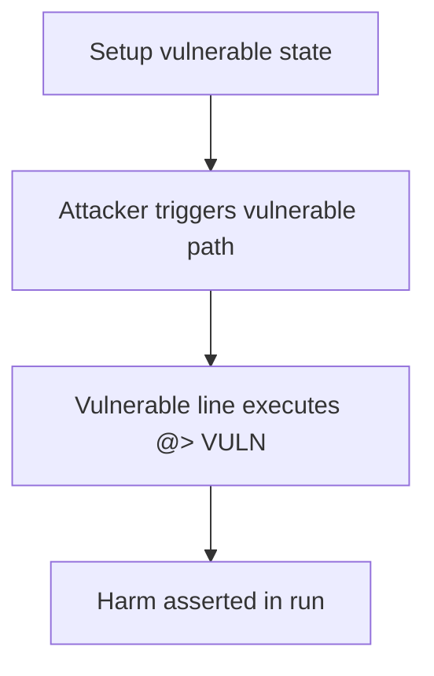

# Phi — Forced endTime extension in updateArtSettings allows attacker to mint

> **Vulnerability classes:** vuln/timing/forced-window-reopen · vuln/nft/unauthorized-mint

> **Reproduction:** a self-contained Foundry PoC that compiles & runs in an
> isolated project with **only `forge-std`** — no fork, no RPC, no `anvil_state`.
> Full trace: [output.txt](output.txt). PoC:
> [test/41090-h-04-forced-endtime-extension-in-updateartsettings-allows-at_exp.sol](test/41090-h-04-forced-endtime-extension-in-updateartsettings-allows-at_exp.sol).

<!-- non-defihacklabs -->
<!-- source-auditvault: https://github.com/Auditware/AuditVault/blob/main/findings/41090-h-04-forced-endtime-extension-in-updateartsettings-allows-at.md -->
<!-- date: 2024-08 -->

**AuditVault taxonomy:** `lang/solidity` · `sector/nft` · `platform/code4rena` · `severity/high` · genome: `timestamp-dependence` · `backrun` · `missing-owner-check`

---

## Key info

| | |
|---|---|
| **Impact** | **HIGH** — After a mint event ends, updateArtSettings forces endTime_ >= now, reopening minting so an attacker can snipe residual maxSupply and dilute holders |
| **Protocol** | Phi |
| **Finding** | Code4rena — Phi, 2024-08 · #41090 |
| **Report** | [2024-08-phi](https://code4rena.com/reports/2024-08-phi) |
| **Source** | [AuditVault](https://github.com/Auditware/AuditVault/blob/main/findings/41090-h-04-forced-endtime-extension-in-updateartsettings-allows-at.md) |
| **Status** | Audit finding — reproduced as a standalone local synthetic PoC. |
| **Compiler** | `^0.8.24` (PoC) |

---

## TL;DR

After a mint event ends, updateArtSettings forces endTime_ >= now, reopening minting so an attacker can snipe residual maxSupply and dilute holders

See the vulnerable line marked `// @> VULN` in `test/41090-h-04-forced-endtime-extension-in-updateartsettings-allows-at.sol` and the
end-to-end `Exploit.run()` that asserts the harm.

---

## Diagrams

---

## Impact

After a mint event ends, updateArtSettings forces endTime_ >= now, reopening minting so an attacker can snipe residual maxSupply and dilute holders

---

## Sources

- [AuditVault finding](https://github.com/Auditware/AuditVault/blob/main/findings/41090-h-04-forced-endtime-extension-in-updateartsettings-allows-at.md)
- [Code4rena report](https://code4rena.com/reports/2024-08-phi)
- Reduced source: synthetic reconstruction of the blamed functions from the contest repo (see finding for verbatim snippets).
