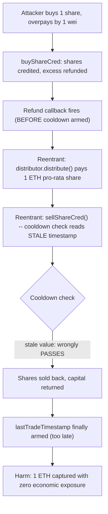
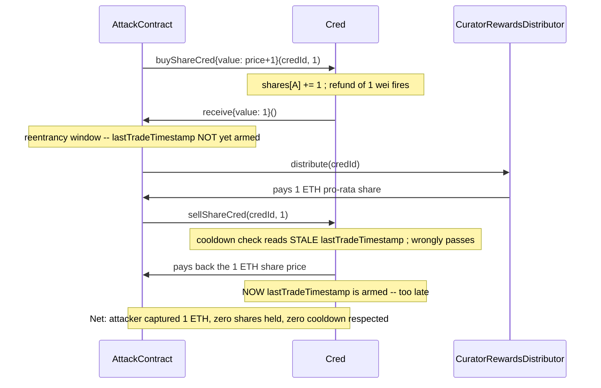

# Phi — reentrancy bypasses the cooldown, enabling flash-loan-style reward extraction

> **Vulnerability classes:** vuln/reentrancy/single-function · vuln/access-control/stale-state-read · vuln/economic/flash-loan-reward-extraction

> **Reproduction:** a self-contained Foundry PoC that compiles & runs in an
> isolated project with **only `forge-std`** — no fork, no RPC, no `anvil_state`.
> Full trace: [output.txt](output.txt). PoC:
> [test/41092-h-06-reentrancy-vulnerability-allows-bypass-of-cooldown-lead_exp.sol](test/41092-h-06-reentrancy-vulnerability-allows-bypass-of-cooldown-lead_exp.sol).

<!-- non-defihacklabs -->
<!-- source-auditvault: https://github.com/Auditware/AuditVault/blob/main/findings/41092-h-06-reentrancy-vulnerability-allows-bypass-of-cooldown-lead.md -->
<!-- date: 2024-08 -->

**AuditVault taxonomy:** `lang/solidity` · `sector/lending` · `sector/staking` · `platform/code4rena` · `has/github` · `has/poc` · `severity/high` · `vuln/reentrancy/single-function` · `trigger/flash-loan` · `precondition/flash-loan-available` · genome: `single-function` · `flash-loan` · `known-pattern` · `reward-theft` · `flashloan-callback-auth` · `reentrancy-guard` · `reward-accounting` · `timestamp-dependence`

---

## Key info

| | |
|---|---|
| **Impact** | **HIGH** — a reentrant buyer can capture a full pro-rata reward share while holding shares for zero economic time, bypassing the 10-minute cooldown specifically designed to prevent this |
| **Protocol** | [Phi](https://code4rena.com/reports/2024-08-phi) — `Cred.buyShareCred` / `CuratorRewardsDistributor.distribute` |
| **Vulnerable code** | `Cred.buyShareCred` — the excess-payment refund fires before `lastTradeTimestamp` is armed |
| **Bug class** | Reentrancy via ETH refund callback, ordering bug (checks-effects-interactions violation) |
| **Finding** | Code4rena — Phi, 2024-08 · #41092 (H-06) · reporter **rscodes** |
| **Report** | [2024-08-phi](https://code4rena.com/reports/2024-08-phi) |
| **Source** | [AuditVault](https://github.com/Auditware/AuditVault/blob/main/findings/41092-h-06-reentrancy-vulnerability-allows-bypass-of-cooldown-lead.md) |
| **Status** | Audit finding — caught in review (not exploited on-chain). Reproduced here as a standalone local PoC. |
| **Compiler** | `^0.8.24` (PoC) |

This is an **audit finding**, not a historical on-chain incident. The PoC keeps
`buyShareCred`/`sellShareCred`'s exact ordering bug verbatim, with a minimal
pro-rata `CuratorRewardsDistributor` standing in for the real reward math.

---

## TL;DR

1. `Cred.buyShareCred` refunds any **excess** ETH payment via a raw call to
   `msg.sender` — and only **after** that call returns does it arm
   `lastTradeTimestamp`, the state a 10-minute cooldown gate reads before
   allowing a sell.
2. A malicious contract buyer deliberately **overpays by 1 wei** to trigger
   that refund, then **reenters** from inside the refund callback: it calls
   `distribute()` (locking in a pro-rata reward share while still holding the
   freshly-bought shares) and then `sellShareCred()` — all before
   `lastTradeTimestamp` has been armed for this trade.
3. The cooldown check inside the reentrant `sellShareCred()` reads the
   **stale** (pre-trade) timestamp, so it wrongly passes.
4. HARM in the PoC: an attacker buying into a 10-ETH reward pool at a 10%
   stake captures a full 1 ETH pro-rata reward and sells their position back
   — all in one transaction, with **zero** economic exposure and without ever
   being at risk for the cooldown window every honest trader must respect.

---

## The vulnerable code

Faithful reduction (`Cred.buyShareCred`):

```solidity
function buyShareCred(uint256 credId_, uint256 amount_) external payable {
    uint256 price = amount_ * PRICE_PER_SHARE;
    require(msg.value >= price, "insufficient payment");

    shares[credId_][msg.sender] += amount_;
    totalSupply[credId_] += amount_;

    uint256 excessPayment = msg.value - price;
    if (excessPayment > 0) {
        (bool ok,) = msg.sender.call{ value: excessPayment }("");
        require(ok, "refund failed");
    }
    // @> VULN: lastTradeTimestamp is armed AFTER the refund callback above -- a
    // reentrant sellShareCred() triggered from that callback reads the STALE
    // (pre-trade) timestamp and bypasses the cooldown entirely.
    // FIX: move this line to BEFORE the `excessPayment` refund call.
    lastTradeTimestamp[credId_][msg.sender] = block.timestamp;
}
```

And the cooldown gate the reentrant call bypasses (`Cred.sellShareCred`):

```solidity
function sellShareCred(uint256 credId_, uint256 amount_) external {
    require(block.timestamp >= lastTradeTimestamp[credId_][msg.sender] + COOLDOWN, "cooldown active");
    ...
}
```

---

## Root cause

This is a textbook checks-effects-interactions violation: the *effect* that
matters for security (arming the cooldown) is placed **after** an external
interaction (the ETH refund). During that interaction, an attacker-controlled
contract regains control with the *old* state still in place — exactly the
condition the cooldown exists to prevent.

## Preconditions

- The attacker can deploy a contract (to receive the refund callback and
  reenter).
- The attacker overpays `buyShareCred` by any amount greater than zero to
  trigger the refund.
- A reward pool has already accrued value for the cred being traded.

## Attack walkthrough

From [output.txt](output.txt):

1. An honest curator has legitimately staked 90% of a cred's shares. A 10-ETH
   reward pool accrues.
2. The attacker's contract buys 1 share (10% of supply after buying),
   deliberately overpaying by 1 wei.
3. `buyShareCred` refunds the 1 wei — **before** arming the cooldown for this
   trade.
4. During that refund callback, the attacker reenters: `distribute()` pays out
   a full 10% pro-rata share (1 ETH) while the attacker still holds the
   shares, then `sellShareCred()` sells everything back. The cooldown check
   reads the stale (pre-trade) timestamp and wrongly passes.
5. **HARM:** the attacker's contract nets exactly 1 ETH — captured with zero
   economic exposure, in a single transaction, without ever respecting the
   10-minute cooldown. A control test confirms a genuinely separate
   (non-reentrant) buy-then-sell attempt is still correctly blocked by the
   cooldown — isolating reentrancy, not "any same-block trade", as the actual
   defect.

## Diagrams





## Remediation

Per the report, arm the cooldown timestamp **before** issuing the refund:

```diff
    shares[credId_][msg.sender] += amount_;
    totalSupply[credId_] += amount_;

+   lastTradeTimestamp[credId_][msg.sender] = block.timestamp;

    uint256 excessPayment = msg.value - price;
    if (excessPayment > 0) {
        (bool ok,) = msg.sender.call{ value: excessPayment }("");
        require(ok, "refund failed");
    }
-   lastTradeTimestamp[credId_][msg.sender] = block.timestamp;
```

## How to reproduce

```bash
cd ~/RustroverProjects/audits/evm-hack-registry/41092-h-06-reentrancy-vulnerability-allows-bypass-of-cooldown-lead_exp
forge test -vvv
# Fully local -- no fork, no RPC, no anvil_state required.
# Expected: all three tests PASS:
#   test_exploit                        (self-contained Exploit: reentrancy bypasses cooldown)
#   test_flashLoanBypassesCooldown      (standalone rebuild of the finding's own AttackContract)
#   test_nonReentrantSellStillBlocked   (control: a plain same-block sell is still blocked)
```

PoC source: [test/41092-h-06-reentrancy-vulnerability-allows-bypass-of-cooldown-lead_exp.sol](test/41092-h-06-reentrancy-vulnerability-allows-bypass-of-cooldown-lead_exp.sol)
— the verbatim vulnerable `buyShareCred` reduction, the reentrancy
demonstration, and a control test.

> Note: `CuratorRewardsDistributor` here pays a pro-rata share of a deposited
> pool based on CURRENT shares held, simplified from the real accumulator
> mechanics because the exact reward formula does not affect this bug. The
> blamed ordering (refund before cooldown arming) is faithful to the finding.

---

*Reference: finding **#41092 (H-06)** by **rscodes** in the [Code4rena Phi review (Aug 2024)](https://code4rena.com/reports/2024-08-phi) · curated by [AuditVault](https://github.com/Auditware/AuditVault/blob/main/findings/41092-h-06-reentrancy-vulnerability-allows-bypass-of-cooldown-lead.md)*
