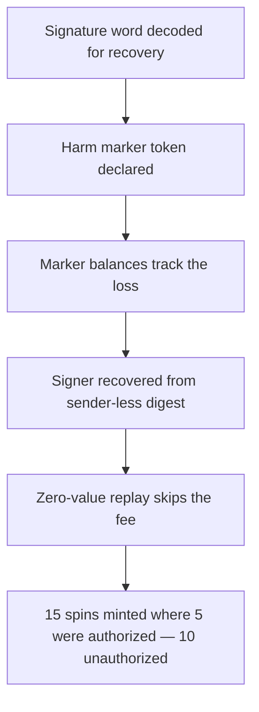

# Sofamon: `commitToMint` signatures can be replayed using different addresses

> **Vulnerability classes:** vuln/signature-replay · vuln/theft
>
> **Reproduction:** a faithful minimal reproduction of the vulnerable finding — the signer-authorization digest inside `commitToMint` is reproduced **verbatim** (marked `@>`) with faithful minimal doubles; local deploy, no fork.

<!-- source-auditvault: https://github.com/pashov/audits/blob/master/team/md/Sofamon-security-review-August.md -->

## Root cause

In `commitToMint`, the digest the `signer` authorizes is built from `_collectionId`, `spins`, `nonce`, `msg.value`, and `minter` — but **not** `msg.sender`. The only per-caller binding is `nonce = userNonce[msg.sender]`, which is `0` for any fresh account, so a single signer-approved signature is accepted by the `approved == signer` check from any number of different callers that each still sit at nonce 0. The vulnerable function, reproduced verbatim:

```solidity
/// @param _collectionId The Id of the collection you wish to roll for
/// @param spins The amount of spins you wish to roll
/// @param signature A signature commit to the price, nonce, and minter from the authority address
///
/// @return ticketNonce The nonce to use to claim your mint
function commitToMint(uint256 _collectionId, uint256 spins, address minter, bytes memory signature) public payable returns (uint256 ticketNonce) {
    if (msg.sender != commitController) {
        uint256 nonce = userNonce[msg.sender];
@>      bytes32 hash = keccak256(abi.encodePacked(_collectionId, spins, nonce, msg.value, minter));
        bytes32 signedHash = hash.toEthSignedMessageHash();
        address approved = ECDSA.recover(signedHash, signature);

        if (approved != signer) {
            revert NotApproved();
        }
    }

    if (msg.value != 0) {
        payable(protocolFeeTo).transfer(msg.value);
    }

    ticketNonce = rng.rng();

    NonceData memory data = NonceData({ owner: minter, collectionId: uint128(_collectionId), spins: uint128(spins) });

    uint256 _userNonce = userNonce[msg.sender];
    userNonce[msg.sender] = _userNonce + 1;

    dataOf[ticketNonce] = data;

    emit MintCommited(msg.sender, minter, spins, msg.value, _userNonce + 1, ticketNonce);
}
```

Because the digest omits `msg.sender`, the exact same signature bytes recover to the same `signer` no matter who submits them — it is a replayable, not single-use, authorization.

## Why it's exploitable here

Following the finding: the signer intends to authorize **one** commit and signs `(collectionId=1, spins=5, nonce=0, value=0, minter=ATTACKER)`.

1. The attacker consumes the authorization once from a fresh account `a` (nonce 0). The `approved == signer` check passes and a valid ticket crediting `ATTACKER` with 5 spins is minted.
2. The attacker reads the signature bytes and replays the **identical** bytes from a second fresh account `b` (nonce 0). The digest never referenced `a`, so `b` passes the same signer check.
3. The attacker replays once more from a third fresh account `c` (nonce 0) — again accepted.
4. Three valid tickets exist, each crediting `ATTACKER` with 5 spins: **15 spins granted where the signer authorized only 5**. The 10 extra spins are an unbounded mint allocation the signer never granted, and each replay costs only gas (`msg.value == 0`).

## Attack path



## Marked-line walkthrough (Playground)

The EVM Playground pins each step to the exact executed source line in `0xce01759b…`:

1. **L51** — Signature word decoded for recovery: The recover helper loads the signature's r/s/v words straight from calldata so ecrecover can derive whoever signed the digest.
2. **L61** — Harm marker token declared: Setup: a minimal ERC20 double named 'Sofamon Unauthorized Spins' exists only to record the magnitude of the unauthorized mint allocation.
3. **L65** — Marker balances track the loss: Setup: the marker's balanceOf mapping will later hold the 10 unauthorized spins at a sink address, quantifying the harm from the replay.
4. **L137** — Signer recovered from sender-less digest: Root cause: recover checks the signature against a digest that omits msg.sender, so one signer-approved signature validates from any fresh nonce-0 account.
5. **L144** — Zero-value replay skips the fee: With msg.value == 0 the fee-forwarding branch is skipped, so each replayed commit costs the attacker nothing but gas.
6. **L150** — Ticket minted crediting the attacker: A fresh NonceData is built crediting minter (the attacker) with the full spins, so every replayed call produces another valid mint ticket.
7. **L165** — Fresh account relays the same bytes: Each throwaway Relayer.fire forwards the identical signature to commitToMint as a distinct msg.sender still sitting at nonce 0.
8. **L174** — One signature, fifteen spins granted: The driver consumes the authorization once then replays it twice more; 15 spins are minted where the signer authorized only 5 — 10 unauthorized.

## PoC

Registry (Foundry, local deploy — verbatim vulnerable source + harm-asserting test):

```bash
cd 41365-h-01-signatures-can-be-replayed-using-different-addresses-pa_exp && forge test -vvv
```

The browser Playground replays the same synthetic opcode-for-opcode and measures the harm: **one signer-authorized signature replayed from three fresh nonce-0 accounts mints 15 spins where only 5 were authorized — 10 unauthorized**. Both gates are green (registry `forge test` PASS + Playground `_verify-poc` **VERDICT: PASS**).
