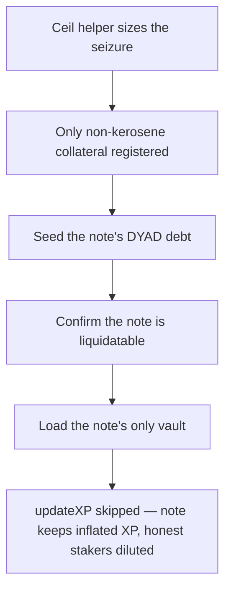

# DYAD: `updateXP` can be omitted during liquidation

> **Vulnerability classes:** vuln/logic · vuln/accounting
>
> **Reproduction:** a faithful minimal reproduction of the vulnerable finding — `VaultManagerV5.liquidate` is reproduced **verbatim** (marked `@>`) with faithful minimal doubles (real ERC20/collateral accounting and the verbatim audited `DyadXPv2` math); local deploy, no fork.

<!-- source-auditvault: https://github.com/pashov/audits/blob/master/team/md/Dyad-security-review.md -->

## Root cause

`VaultManagerV5.liquidate` calls `dyad.burn(id, msg.sender, amount)`, which changes the note's debt. A note's `DyadXPv2` XP accrues with a debt bonus that grows with `dyadMinted`, so the XP snapshot must be resynced with `dyadXP.updateXP(id)` whenever the debt changes. But `updateXP` is only called inside the collateral loop, guarded by `if (address(vault) == KEROSENE_VAULT)`. Kerosene lives in a separate bounded vault set, so the general `vaults[id]` set iterated here holds only non-kerosene collateral (wETH, etc.); the branch never matches, `updateXP` is skipped, and `noteData[id].dyadMinted` keeps the pre-liquidation (higher) debt. The vulnerable code, reproduced verbatim:

```solidity
    function liquidate(uint256 id, uint256 to, uint256 amount)
        external
        isValidDNft(id)
        isValidDNft(to)
        returns (address[] memory, uint256[] memory)
    {
        uint256 cr = collatRatio(id);
        if (cr >= MIN_COLLAT_RATIO) revert CrTooHigh();
        uint256 debt = dyad.mintedDyad(id);
        dyad.burn(id, msg.sender, amount); // changes `debt` and `cr`

        lastDeposit[to] = block.number; // `move` acts like a deposit

        uint256 numberOfVaults = vaults[id].length();
        address[] memory vaultAddresses = new address[](numberOfVaults);
        uint256[] memory vaultAmounts = new uint256[](numberOfVaults);

        uint256 totalValue = getTotalValue(id);
        if (totalValue == 0) return (vaultAddresses, vaultAmounts);

        for (uint256 i = 0; i < numberOfVaults; i++) {
            Vault vault = Vault(vaults[id].at(i));
            vaultAddresses[i] = address(vault);
            if (vaultLicenser.isLicensed(address(vault))) {
                uint256 depositAmount = vault.id2asset(id);
                if (depositAmount == 0) continue;
                uint256 value = vault.getUsdValue(id);
                uint256 asset;
                if (cr < LIQUIDATION_REWARD + 1e18 && debt != amount) {
                    uint256 cappedCr = cr < 1e18 ? 1e18 : cr;
                    uint256 liquidationEquityShare = (cappedCr - 1e18).mulWadDown(LIQUIDATION_REWARD);
                    uint256 liquidationAssetShare = (liquidationEquityShare + 1e18).divWadDown(cappedCr);
                    uint256 allAsset = depositAmount.mulWadUp(liquidationAssetShare);
                    asset = allAsset.mulWadDown(amount).divWadDown(debt);
                } else {
                    uint256 share = value.divWadDown(totalValue);
                    uint256 amountShare = share.mulWadUp(amount);
                    uint256 reward_rate = amount.divWadDown(debt).mulWadDown(LIQUIDATION_REWARD);
                    uint256 valueToMove = amountShare + amountShare.mulWadUp(reward_rate);
                    uint256 cappedValue = valueToMove > value ? value : valueToMove;
                    asset = cappedValue * (10 ** (vault.oracle().decimals() + vault.asset().decimals()))
                        / vault.assetPrice() / 1e18;
                }
                vaultAmounts[i] = asset;

                vault.move(id, to, asset);
@>              if (address(vault) == KEROSENE_VAULT) { // updateXP runs ONLY here; a non-kerosene seizure leaves noteData[id].dyadMinted stale after dyad.burn changed the debt
                    dyadXP.updateXP(id);
                    dyadXP.updateXP(to);
                }
            }
        }

        emit Liquidate(id, msg.sender, to, amount);

        return (vaultAddresses, vaultAmounts);
    }
```

## Why it's exploitable here

Following the finding's scenario with a note holding 1000e18 kerosene (the XP driver), 1 wETH ($2000) collateral, and 1600e18 DYAD debt:

1. Collateral ratio is `2000e18 / 1600e18 = 1.25e18`, below the 150% `MIN_COLLAT_RATIO`, so the note is liquidatable.
2. A liquidator burns 800e18 of debt (`dyad.burn`) and the loop seizes the wETH collateral via `vault.move`.
3. Because the seized vault is wETH, not `KEROSENE_VAULT`, `updateXP(id)` is skipped. On-chain `dyad.mintedDyad(id)` is now the correct 800e18, but `DyadXPv2`'s stored `dyadMinted` stays the stale 1600e18.
4. XP accrues with `bonus = deposited + deposited * dyadMinted / (dyadMinted + deposited)`. The stale note computes its bonus on 1600e18 (`~1615e18`) instead of the true 800e18 (`~1444e18`) — roughly 12% more XP every second, forever.
5. That excess XP — XP the note should never have earned — dilutes every honest staker's share of kerosene rewards. The PoC quantifies it against an identical, correctly-resynced reference note and marks the over-accrual at a sink.

## Attack path



## Marked-line walkthrough (Playground)

The EVM Playground pins each step to the exact executed source line in `0xd3760b84…`:

1. **L66** — Ceil helper sizes the seizure: Setup: the mulWadUp ceil helper backs the liquidation math that sizes how much wETH collateral gets moved out of the note.
2. **L117** — Only non-kerosene collateral registered: Setup: adding the wETH vault stores it as the sole entry in vaults[id], a non-kerosene set the KEROSENE_VAULT branch never matches.
3. **L443** — Seed the note's DYAD debt: Setup: debt bookkeeping routed through the manager seeds the note's minted DYAD, the value that drives its XP debt-bonus.
4. **L460** — Confirm the note is liquidatable: collatRatio reads the note's minted DYAD debt; with debt 1600e18 against $2000 collateral the ratio is 1.25e18, under the 150% minimum.
5. **L487** — Load the note's only vault: The liquidate loop loads the note's only collateral vault, the non-kerosene wETH vault, after dyad.burn already halved the debt.
6. **L503** — Compute the seized wETH amount: The branch computes the reward rate and the amount of wETH to move from the liquidated note to the liquidator.
7. **L512** — updateXP gated to kerosene branch: Root cause: updateXP runs only when the seized vault is KEROSENE_VAULT, so this wETH seizure skips it and leaves noteData[id].dyadMinted stale.
8. **L521** — Liquidation returns without XP resync: liquidate returns after burning half the debt without resyncing XP, so the note keeps accruing XP on the stale 1600e18 debt bonus forever.

## PoC

Registry (Foundry, local deploy — verbatim vulnerable source + harm-asserting test):

```bash
cd 41690-h-03-updatexp-can-be-omitted-during-liquidation-pashov-audit_exp && forge test -vvv
```

The browser Playground replays the same synthetic opcode-for-opcode and measures the harm: after a partial liquidation seizes wETH collateral, `dyad.mintedDyad(id)` drops to 800e18 while `DyadXPv2`'s snapshot stays at 1600e18, so the liquidated note over-accrues XP versus an identical correctly-resynced note — the excess minted to the sink as the quantified integrity loss. Both gates are green (registry `forge test` PASS + Playground `_verify-poc` **VERDICT: PASS**).
