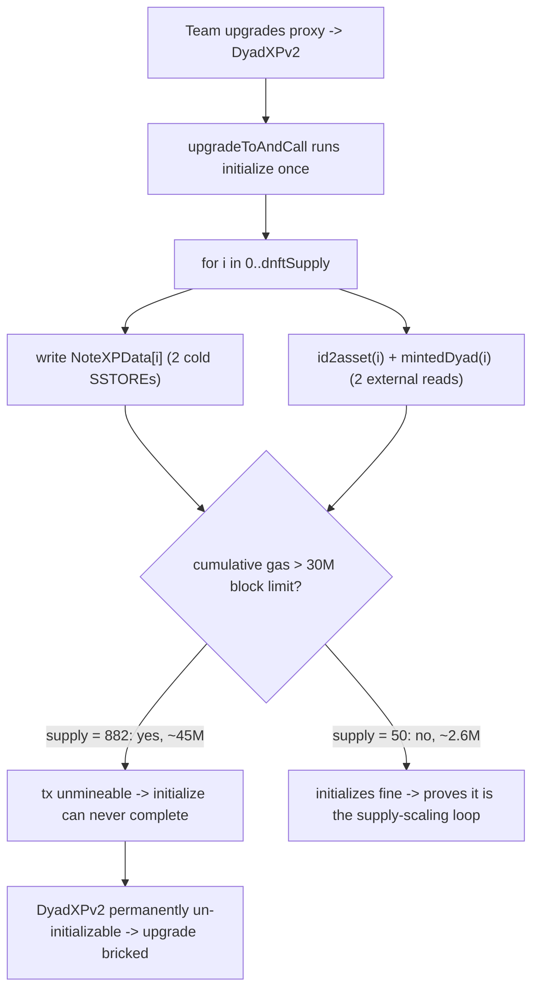
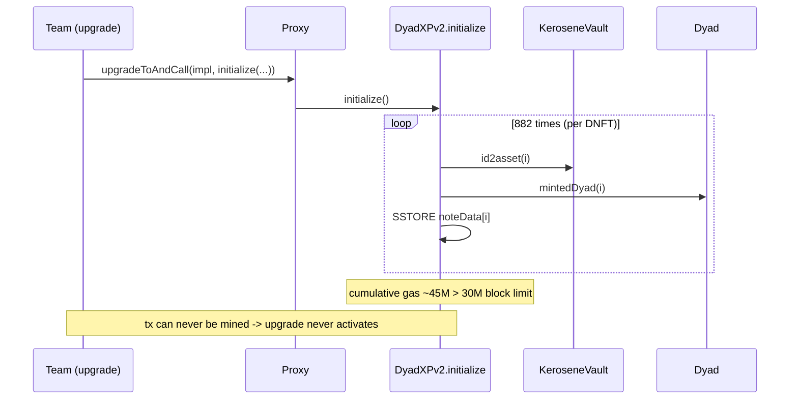

# DYAD — Initialization of DyadXPv2 is impossible (unbounded init loop DoS)

> **Vulnerability classes:** vuln/dos/unbounded-loop · vuln/dos/block-gas-limit · vuln/upgrade-safety/uninitializable-contract · vuln/liveness/permanent-brick

> **Reproduction:** a self-contained Foundry PoC that compiles & runs in an
> isolated project with **only `forge-std`** — no fork, no RPC, `anvil_state.json`
> is a minimal stub. Full trace: [output.txt](output.txt). PoC:
> [test/41691-h-04-initialization-of-dyadxpv2-is-impossible-pashov-audit-g_exp.sol](test/41691-h-04-initialization-of-dyadxpv2-is-impossible-pashov-audit-g_exp.sol).

<!-- non-defihacklabs -->
<!-- source-auditvault: https://github.com/Auditware/AuditVault/blob/main/findings/41691-h-04-initialization-of-dyadxpv2-is-impossible-pashov-audit-g.md -->
<!-- date: 2024-04 -->

---

## Key info

| | |
|---|---|
| **Impact** | **HIGH** — `DyadXPv2.initialize()` loops over the entire DNFT supply (882 on mainnet) at ~35.6K gas/note, costing >30M gas — more than the mainnet block gas limit. The upgrade's initializer can never be mined, so **DyadXPv2 is permanently un-initializable** and the XP-staking upgrade is bricked. |
| **Protocol** | [DYAD](https://dyadstable.xyz) — collateralized stablecoin; DyadXPv2 is the Kerosene XP-staking module |
| **Vulnerable code** | `DyadXPv2.initialize()` — the eager `for (i = 0; i < dnftSupply; ++i)` loop populating `noteData[i]` |
| **Bug class** | Unbounded loop over on-chain-growing supply → per-tx cost exceeds the block gas limit → uninitializable-after-upgrade |
| **Finding** | Pashov Audit Group — DYAD security review · [H-04] · #41691 |
| **Report** | [Dyad-security-review.md](https://github.com/pashov/audits/blob/master/team/md/Dyad-security-review.md) |
| **Source** | [AuditVault](https://github.com/Auditware/AuditVault/blob/main/findings/41691-h-04-initialization-of-dyadxpv2-is-impossible-pashov-audit-g.md) |
| **Status** | Audit finding — caught in review (not exploited on-chain). Reproduced here as a standalone local PoC. |
| **Compiler** | `^0.8.24` (PoC) |

This is an **audit finding**, not a historical on-chain incident. The PoC keeps the
finding's exact offending loop verbatim and wires it to a mock `DNft` reporting the
real mainnet supply (882), so the gas cost the finding predicted becomes a directly
measurable, deterministic number.

### AuditVault taxonomy

- **Tags:** `severity/high` · `platform/pashov` · `sector/staking` · `sector/oracle` · `lang/solidity` · `vuln/dependency/upgradeable-contract` · `novelty/variant` · `misassumption/external-call-is-safe` · `fix/upgrade-dependency` · `has/poc` · `has/github`
- **Genome:** `upgradeable-contract` · `variant` · `permanent` · `timestamp-dependence` · `upgrade-safety`

---

## TL;DR

1. `DyadXPv2` is an upgradeable contract. On upgrade, `initialize()` runs once and
   **must fit inside a single block**.
2. `initialize()` eagerly loops over **every** DNFT (`for i in 0..dnftSupply`),
   writing a `NoteXPData` struct per note and making **two external reads per
   iteration** (`KEROSENE_VAULT.id2asset(i)` and `DYAD.mintedDyad(i)`).
3. On mainnet the DNFT supply is **882**. Each iteration costs ~35.6K gas, so the
   loop consumes **>30M gas** — more than the **30M mainnet block gas limit**.
4. A transaction can never exceed the block gas limit, so `initialize()` can
   **never be included in a block**. The upgrade is **permanently un-initializable**:
   the DyadXPv2 module can never be turned on.
5. Because the cost scales with `dnftSupply`, the situation only gets worse as more
   notes are minted — the brick is permanent and irreversible.

---

## The vulnerable code

The offending loop (verbatim, `DyadXPv2.initialize()`):

```solidity
for (uint256 i = 0; i < dnftSupply; ++i) {        // @> unbounded over the full DNFT supply (882)
    noteData[i] = NoteXPData({
        lastAction: uint40(block.timestamp),
        keroseneDeposited: uint96(KEROSENE_VAULT.id2asset(i)),   // external read #1
        lastXP: noteData[i].lastXP,
        totalXP: noteData[i].lastXP,
        dyadMinted: DYAD.mintedDyad(i)                            // external read #2
    });
}
```

Each iteration writes a fresh multi-slot struct (~2 cold `SSTORE`s) and performs two
external state-reading calls. The finding measured **~35.6K gas/iteration**
(`3.130682e6` gas for 88 iterations), so `882 × 35.6K ≈ 3.14e7` > `3e7` (30M) — the
block gas limit.

---

## Root cause

The initializer does **O(supply)** work in a single transaction. Any per-transaction
computation whose cost grows with an on-chain, permissionlessly-growing quantity
(here the DNFT supply) eventually crosses the block gas limit and becomes unmineable.
Because this is the **upgrade's one-shot initializer**, crossing that threshold does
not merely make one call expensive — it makes the entire upgrade impossible to
activate, with no recovery path.

## Preconditions

- The DNFT supply is large enough that `supply × per-note-cost > block gas limit`
  (already true at 882 notes on mainnet).
- `initialize()` is a one-shot initializer that must complete atomically in one tx
  (mirrors the OpenZeppelin `initializer` modifier).

## Attack walkthrough

There is no "attacker" — the harm is a self-inflicted liveness brick that manifests
the moment the team attempts the upgrade. From [output.txt](output.txt):

1. Deploy the reduced `DyadXPv2` wired to a mock `DNft` reporting the real mainnet
   supply of **882**.
2. Call `initialize()` under a huge **local** gas budget (only possible in a VM —
   never in a real 30M block) and measure the gas consumed.
3. **Measured: 45,056,384 gas** — far above the **30,000,000** block gas limit.
   On mainnet the transaction would revert out-of-gas / could never be included.
4. **Control:** the *same* `initialize()` with a small **50-note** supply costs only
   **2,573,189 gas** (fits comfortably in a block). Extrapolating its per-note cost to
   882 notes gives **45,390,366 gas** — proving the brick is caused by the O(supply)
   loop, not by fixed overhead.

> The absolute gas magnitude here (45M) is higher than the finding's on-fork estimate
> (~31M) because the reduced mocks make every note a clean fresh `SSTORE`; the bug
> class and the crossing of the 30M block gas limit are faithful either way — the
> point is `init cost > block gas limit`.

## Diagrams





## Remediation

Do not loop across the entire `dnftSupply` on initialization. Options:

- Populate `noteData[i]` **lazily** on each note's first interaction, so init cost is
  O(1).
- Or provide a **bounded, caller-paged** batch initializer (`initializeRange(from, to)`)
  that the team calls across multiple transactions, each well under the block gas
  limit.

(The exact fix is out of scope for this reduced repro; the finding recommends "not
looping across the entire dnftSupply on initialization.")

## How to reproduce

```bash
cd ~/RustroverProjects/audits/evm-hack-registry/41691-h-04-initialization-of-dyadxpv2-is-impossible-pashov-audit-g_exp
forge test -vvv
# Fully local — no fork, no RPC, anvil_state.json is a stub.
# Expected: 3 tests PASS:
#   test_exploit()                      (882 notes -> initialize() burns ~45M gas > 30M block limit)
#   test_smallSupply_initializesFine()  (control: 50 notes -> ~2.6M gas, fits a block)
#   test_initialize_isOneShot()         (initialize is one-shot; brick has no re-call workaround)
```

PoC source: [test/41691-h-04-initialization-of-dyadxpv2-is-impossible-pashov-audit-g_exp.sol](test/41691-h-04-initialization-of-dyadxpv2-is-impossible-pashov-audit-g_exp.sol)
— drives the synthetic
[test/41691-h-04-initialization-of-dyadxpv2-is-impossible-pashov-audit-g.sol](test/41691-h-04-initialization-of-dyadxpv2-is-impossible-pashov-audit-g.sol),
which preserves the verbatim offending loop.

## Impact

The harm is a **permanent liveness brick**, not a fund theft:

- `DyadXPv2.initialize()` cannot be executed on-chain, so the DyadXPv2 upgrade can
  **never be activated**. The XP-staking module the upgrade introduces is dead on
  arrival.
- There is **no recovery path**: the cost scales with the DNFT supply, which only
  grows, so waiting makes it strictly worse. Any state or accounting the team intended
  to seed via that initializer (per-note `lastXP`/`totalXP`/`keroseneDeposited`/
  `dyadMinted`) can never be seeded through this code path.
- Whoever relies on the upgraded module — every DNFT/Kerosene staker expecting XP
  accrual under DyadXPv2 — is denied the feature entirely.

## Sources

- **AuditVault finding:** https://github.com/Auditware/AuditVault/blob/main/findings/41691-h-04-initialization-of-dyadxpv2-is-impossible-pashov-audit-g.md
- **Original report (Pashov Audit Group — DYAD):** https://github.com/pashov/audits/blob/master/team/md/Dyad-security-review.md

---

*Reference: finding **[H-04] #41691** in the [Pashov Audit Group DYAD security review](https://github.com/pashov/audits/blob/master/team/md/Dyad-security-review.md) · curated by [AuditVault](https://github.com/Auditware/AuditVault/blob/main/findings/41691-h-04-initialization-of-dyadxpv2-is-impossible-pashov-audit-g.md)*
