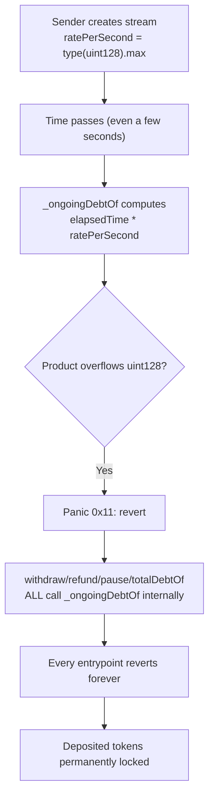
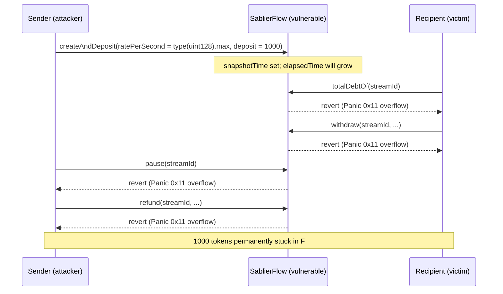

# Sablier Flow — Sender can brick a stream by forcing an overflow in the debt calculation

> **Vulnerability classes:** vuln/arithmetic/overflow · vuln/dos/permanent · vuln/logic/missing-check

> **Reproduction:** a self-contained Foundry PoC that compiles & runs in an
> isolated project with **only `forge-std`** — no fork, no RPC, no `anvil_state`
> (the vulnerable stream-accounting contract is deployed locally). Full trace:
> [output.txt](output.txt). PoC: [test/42010-sender-can-brick-stream-by-forcing-overflow-in-debt-calculat_exp.sol](test/42010-sender-can-brick-stream-by-forcing-overflow-in-debt-calculat_exp.sol).

<!-- non-defihacklabs -->
<!-- source-auditvault: https://github.com/Auditware/AuditVault/blob/main/findings/42010-sender-can-brick-stream-by-forcing-overflow-in-debt-calculat.md -->
<!-- date: 2024-10 -->

---

## Key info

| | |
|---|---|
| **Impact** | **HIGH** — a stream's sender can permanently brick it, locking every unwithdrawn token forever, either maliciously (to spite a recipient) or by accident (misconfiguring `ratePerSecond`) |
| **Protocol** | [Sablier](https://sablier.com) — token vesting/streaming (`SablierFlow`) |
| **Vulnerable contract** | `SablierFlow` — `_ongoingDebtOf()` internal function, called by `withdraw()`, `refund()`, `pause()`, and `totalDebtOf()` |
| **Bug class** | Unchecked `uint128 * uint128` multiplication with a fully sender-controlled operand (`ratePerSecond`); Solidity 0.8's checked arithmetic reverts once the product overflows, and every debt-dependent entrypoint depends on this one calculation |
| **Finding** | Cantina — Sablier, October 2024 · #42010 |
| **Report** | [cdn.cantina.xyz/reports/cantina_sablier_october2024.pdf](https://cdn.cantina.xyz/reports/cantina_sablier_october2024.pdf) |
| **Source** | [AuditVault](https://github.com/Auditware/AuditVault/blob/main/findings/42010-sender-can-brick-stream-by-forcing-overflow-in-debt-calculat.md) |
| **Status** | Audit finding — caught in review (fixed in PR 296, confirmed by Cantina Managed). Reproduced here as a standalone local PoC. |
| **Compiler** | `^0.8.24` (PoC) |

This is an **audit finding**, not a historical on-chain incident — there is no
attack transaction. The PoC deploys a faithful minimal `SablierFlow`-style
streaming contract locally and demonstrates the permanent brick with a passing
control test for contrast.

---

## TL;DR

1. Sablier Flow streams tokens continuously based on a per-second rate,
   `ratePerSecond`, chosen entirely by the stream's **sender** at creation (or
   via `adjustRatePerSecond`).
2. To figure out how much is owed, `_ongoingDebtOf()` computes
   `scaledOngoingDebt = elapsedTime * ratePerSecond` — both are `uint128`.
3. Solidity 0.8 reverts on overflow. If `ratePerSecond` is large enough,
   **any** nonzero `elapsedTime` overflows this multiplication.
4. `withdraw()`, `refund()`, `pause()`, and `totalDebtOf()` **all** call
   `_ongoingDebtOf()` internally — so once the overflow condition is reached,
   every one of them reverts, forever.
5. Nobody — sender or recipient — can withdraw, refund, or even pause the
   stream again. Every previously-streamed, unwithdrawn token is permanently
   stuck in the contract.

---

## The vulnerable code

The synthetic reduces `SablierFlow` to the exact debt-accounting logic the bug
depends on; the overflowing multiplication is preserved **verbatim**.

### `_ongoingDebtOf()` — the overflowing multiplication (root cause)

```solidity
function _ongoingDebtOf(uint256 streamId) internal view returns (uint128) {
    Stream storage s = streams[streamId];
    if (s.paused) return 0;

    uint128 elapsedTime = uint128(block.timestamp) - uint128(s.snapshotTime);
    if (elapsedTime == 0) return 0;

    // @> VULN: uint128 * uint128 with sender-fully-controlled ratePerSecond;
    //    a large enough rate makes ANY nonzero elapsedTime overflow and revert.
    //    FIX: use uint256 for scaledOngoingDebt and every value derived from it
    //    until the final comparison against balance, only downcasting there.
    uint128 scaledOngoingDebt = elapsedTime * s.ratePerSecond;

    return scaledOngoingDebt;
}
```

### Every debt-dependent entrypoint calls the bricked function

```solidity
function totalDebtOf(uint256 streamId) public view returns (uint128) {
    Stream storage s = streams[streamId];
    return s.balance > 0 ? _ongoingDebtOf(streamId) : 0;
}

function withdraw(uint256 streamId, address to, uint128 amount) external returns (uint128) {
    uint128 debt = _ongoingDebtOf(streamId); // reverts once bricked
    ...
}

function refund(uint256 streamId, uint128 amount) external {
    uint128 debt = _ongoingDebtOf(streamId); // reverts once bricked
    ...
}

function pause(uint256 streamId) external {
    _ongoingDebtOf(streamId); // reverts once bricked — pause() can't even save the stream
    s.paused = true;
}
```

### Recommended fix

```diff
- uint128 scaledOngoingDebt = elapsedTime * ratePerSecond;
+ uint256 scaledOngoingDebt = uint256(elapsedTime) * uint256(ratePerSecond);
```

Carry the `uint256` type through every downstream calculation and only
downcast to `uint128` at the point where the value is finally compared
against the token balance.

## Root cause

`ratePerSecond` is a **sender-controlled** parameter with no upper bound
enforced relative to `elapsedTime`. The debt calculation assumes the product
of "seconds elapsed" and "rate per second" always fits in a `uint128`, but
nothing in the contract enforces that assumption — the sender can set an
extreme rate at creation, and Solidity 0.8's checked arithmetic will revert
the very first time anyone tries to read or act on the stream's debt after
even a few seconds pass.

## Preconditions

- Attacker (or the sender, accidentally) controls `ratePerSecond` at stream
  creation — no special privilege beyond being the stream's sender is needed.
- No specific recipient action is required; the brick happens purely from
  time passing after creation.

## Attack walkthrough

From [output.txt](output.txt):

1. **Control** (`test_control_normalRate_debtCalculationWorks`) — a stream
   created with a sane `ratePerSecond` (100) works normally: `totalDebtOf()`
   returns the expected debt and `withdraw()` succeeds.
2. **Attack** (`test_run_overflowBricksStreamPermanently`) — the sender
   creates a stream depositing 1000 (mock) USDC with `ratePerSecond` set to
   `type(uint128).max`, and 12 seconds already elapsed since the stream's last
   snapshot (mirroring the real PoC's `vm.warp(block.timestamp + 12)`).
3. The very first read of the stream's debt overflows: `elapsedTime(12) *
   ratePerSecond(2^128-1)` vastly exceeds `uint128`'s range and reverts with a
   `Panic(0x11)`.
4. `totalDebtOf()`, `withdraw()`, `pause()`, and `refund()` are all shown
   reverting — none of them can ever succeed again.
5. The full 1000 (mock) USDC deposit remains locked in the contract forever;
   neither the sender nor the recipient can move it through any entrypoint.

## Diagrams





## Impact

- **Permanent denial of service**: every function that depends on
  `_ongoingDebtOf()` — `withdraw()`, `refund()`, `pause()`, `totalDebtOf()` —
  reverts forever once the overflow condition is reached.
- **Permanent loss of funds**: the recipient's owed but unwithdrawn stream
  balance, and the sender's deposited balance, are both locked in the
  contract with no recovery path.
- **Exploitable maliciously or accidentally**: a sender angry with a
  recipient can deliberately set an extreme `ratePerSecond` to lock funds
  that are rightfully the recipient's; the same state can also be reached by
  an honest sender fat-fingering the rate.

## Remediation

Use `uint256` for `scaledOngoingDebt` (and every value derived from it) and
only downcast to `uint128` at the final comparison against the token balance,
so a sender-controlled rate can never overflow the debt calculation itself.

## How to reproduce

```bash
cd ~/RustroverProjects/audits/evm-hack-registry/42010-sender-can-brick-stream-by-forcing-overflow-in-debt-calculat_exp
forge test -vvv
# Fully local — no fork, no RPC, no anvil_state required.
# Expected: both tests PASS:
#   test_control_normalRate_debtCalculationWorks (control: sane rate works normally)
#   test_run_overflowBricksStreamPermanently     (attack: all 4 entrypoints revert; deposit stuck)
```

PoC source: [test/42010-sender-can-brick-stream-by-forcing-overflow-in-debt-calculat_exp.sol](test/42010-sender-can-brick-stream-by-forcing-overflow-in-debt-calculat_exp.sol)
— a faithful minimal `SablierFlow`-style stream with the verbatim overflowing
debt calculation, plus honest-vs-bricked contrast.

## Sources

- AuditVault finding: [42010-sender-can-brick-stream-by-forcing-overflow-in-debt-calculat.md](https://github.com/Auditware/AuditVault/blob/main/findings/42010-sender-can-brick-stream-by-forcing-overflow-in-debt-calculat.md)
- Original report: [Cantina — Sablier, October 2024](https://cdn.cantina.xyz/reports/cantina_sablier_october2024.pdf)
- Reduced-source provenance: quoted verbatim from the AuditVault finding (the
  finding itself quotes the exact vulnerable line and PoC; no external clone
  was needed for this reduction).

---

*Reference: finding **#42010** in the [Cantina Sablier audit, October 2024](https://cdn.cantina.xyz/reports/cantina_sablier_october2024.pdf) · curated by [AuditVault](https://github.com/Auditware/AuditVault/blob/main/findings/42010-sender-can-brick-stream-by-forcing-overflow-in-debt-calculat.md)*
