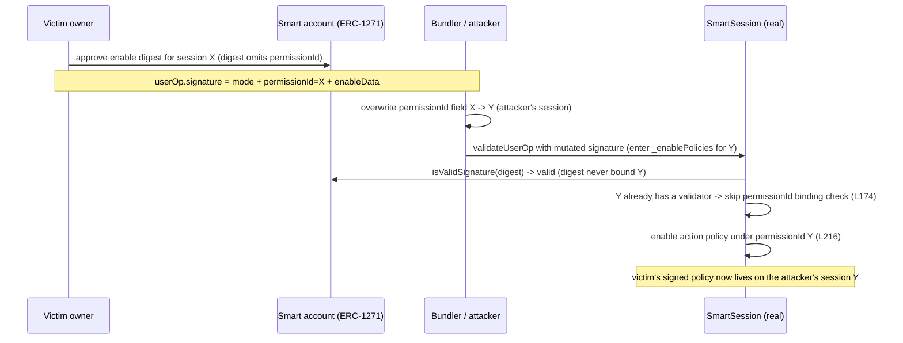

# SmartSession enable-mode can be frontrun to install signed policies under a different permissionId

> **Vulnerability classes:** vuln/logic/missing-check · vuln/signature/insufficient-binding · impact/mev/frontrun
>
> **Reproduction:** the test deploys the real, unmodified SmartSession module (erc7579/smartsessions at the vulnerable commit `7c4dd7f`), a minimal ERC-7579 smart account that verifies the owner's authorization with **real ECDSA / ERC-1271**, and a real session validator and action policy. It signs a genuine enable digest, frontruns it by rewriting the `permissionId` field of `userOp.signature`, and proves the victim's signed action policy is installed under the **attacker's** permissionId. The real fixed source (commit `21af6ae`) rejects the same payload.

<!-- source-auditvault: https://github.com/Auditware/AuditVault/blob/main/findings/42062-enable-mode-can-be-frontrun-to-add-policies-for-a-different.md -->
<!-- date: 2024-09 -->

## Root cause

`SmartSession.validateUserOp` parses `(mode, permissionId, packedSig)` out of `userOp.signature` and, in enable mode, forwards them to `_enablePolicies`. `userOp.signature` is **not** part of the ERC-4337 `userOpHash`, so a bundler or any observer can mutate it freely without invalidating the 4337 signature.

Inside `_enablePolicies` ([`src/selected/SmartSession.sol#L139-L225`](src/selected/SmartSession.sol)):

1. The enable digest is computed by `HashLib.getAndVerifyDigest` over `sessionToEnable` + `account` + `mode` + `nonce`. **It never includes `permissionId`.**
2. The account's ERC-1271 signature is checked against that digest.
3. The check that binds `permissionId` to the signed session is placed *inside* the "new validator" branch:

```solidity
if (!_isISessionValidatorSet(permissionId, account)) {          // L174 - skipped when the attacker's permissionId already exists
    if (permissionId != enableData.sessionToEnable.toPermissionIdMemory()) {  // L183 - the only binding check
        revert InvalidPermissionId(permissionId);
    }
    $sessionValidators.enable({ permissionId: permissionId, ... });
}
$actionPolicies.enable({ permissionId: permissionId, ... });    // L216 - stores the signed policy under the *attacker's* permissionId
```

When the attacker's `permissionId` (session Y) already has a validator installed, the guard at L183 is never reached. The signature is valid (it does not depend on `permissionId`), so the victim's signed policies are installed under whatever `permissionId` the attacker put into `userOp.signature`.

Exploit preconditions from the report, all satisfied by the test: (1) the attacker's `permissionId` is already installed; (2) it shares the same `$signerNonce` as the victim's; (3) both use the same `sessionValidator`.

The fix (commit `21af6ae`) moves the `permissionId == toPermissionIdMemory()` check out of the branch so it runs unconditionally.



## What the test proves

`test/42062-smart-sessions-frontrun.t.sol` runs three cases against the real module:

- **`test_frontrun_steals_signed_policies_onto_attacker_permission`** - the victim signs (real `vm.sign` ECDSA over the real digest) an enable payload that adds a powerful action policy to their own session X. The attacker rewrites only the 32-byte `permissionId` field to session Y using the real `EncodeLib`. After the real enable path runs, `isPermissionEnabled(permissionY, ..., action)` is `true` (the policy was stolen onto Y), the victim's enable signature was consumed under Y (`getNonce(Y)` advanced `0 -> 1`), and the victim's own session X never received the policy.
- **`test_frontrun_requires_a_real_owner_signature`** - a non-owner signature is genuinely rejected with `InvalidEnableSignature`, proving the ERC-1271 boundary is real and not a stub.
- **`test_fix_rejects_the_frontrun`** - the real fixed source (`SmartSessionFixed`, commit `21af6ae`) reverts the identical frontrun with `InvalidPermissionId(Y)`.

Only the account, session validator, action policy, and the hard-coded external Rhinestone registry are minimal ABI-boundary contracts (all genuinely external to the bug). Digest calculation, signature verification, compression/decoding, the nonce increment, the skipped guard, and policy storage are all the unmodified production implementation.

## Reproduce

```bash
_shared/run-poc/run_poc.sh 42062-enable-mode-can-be-frontrun-to-add-policies-for-a-different_exp -vvvvv
```

Expected result: `3 passed`.

## Sources

- [Vulnerable SmartSession `contracts/SmartSession.sol` (`7c4dd7f`)](https://github.com/erc7579/smartsessions/blob/7c4dd7f2afcb22238b91956a3ab7f7742b278b3d/contracts/SmartSession.sol)
- [Fix commit `21af6ae` ("fix finding-26 frontrun adding policies")](https://github.com/erc7579/smartsessions/commit/21af6aee19a831d214ef720c35d15d14b2663f78)
- [AuditVault finding #42062](https://github.com/Auditware/AuditVault/blob/main/findings/42062-enable-mode-can-be-frontrun-to-add-policies-for-a-different.md)
- [Cantina report - Rhinestone SmartSessions (Aug 2024)](https://cdn.cantina.xyz/reports/cantina_rhinestone_smartsessions_core_aug2024.pdf)
