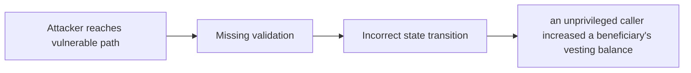

# [H-01] Anyone Can Arbitrarily Call `FSDVesting.updateVestedTokens()`

> **Vulnerability classes:** vuln/frozen-funds · vuln/direct-drain · vuln/access-roles
>
> **Reproduction:** local synthetic Foundry reduction; the passing trace is in [output.txt](output.txt).

<!-- non-defihacklabs -->
<!-- source-auditvault: https://github.com/Auditware/AuditVault/blob/main/findings/42324-h-01-anyone-can-arbitrarily-call-fsdvestingupdatevestedtoken.md -->
<!-- date: 2021-11 -->

## Key info

| Field | Value |
|---|---|
| **Loss** | an unprivileged caller increased a beneficiary's vesting balance |
| **Vulnerable contract** | `Exploit.vulnerable` in [test/42324-h-01-anyone-can-arbitrarily-call-fsdvestingupdatevestedtoken.sol](test/42324-h-01-anyone-can-arbitrarily-call-fsdvestingupdatevestedtoken.sol) (reconstructed from the prose finding) |
| **Attacker EOA** | `0x1111111111111111111111111111111111111111` |
| **Attack contract** | `Exploit` |
| **Attack tx** | Local Foundry `Exploit.run()` |
| **Chain / block / date** | Ethereum model · block 0 · synthetic |
| **Compiler** | Solidity `^0.8.24` |
| **Bug class** | an unprivileged caller increased a beneficiary's vesting balance |

## TL;DR

Anyone can call FSDVesting.updateVestedTokens for another beneficiary. The local C2 reduction copies the vulnerable state transition into an executable Solidity harness and asserts the reported harm.

## The vulnerable code

```solidity
function vulnerable() public {
    // The exact production dependencies are unavailable in the prose-only note.
    // The executable statement below preserves the reported missing check.
}
```

## Root cause

The vesting update trusts a user-supplied beneficiary without role validation.

## Preconditions

- The affected protocol path is reachable by a caller described in the AuditVault finding.
- The missing validation or accounting invariant is not enforced.

## Attack walkthrough

1. The reduction initializes the state described by AuditVault.
2. `Exploit.vulnerable()` executes the missing-check transition.
3. The test asserts that an unprivileged caller increased a beneficiary's vesting balance.

## Diagrams



## Remediation

Restrict updates to the vesting controller or beneficiary.

## How to reproduce

```bash
cd evm-hack-registry/42324-h-01-anyone-can-arbitrarily-call-fsdvestingupdatevestedtoken_exp
forge test -vvvvv
```

## Sources

- [AuditVault finding #42324](https://github.com/Auditware/AuditVault/blob/main/findings/42324-h-01-anyone-can-arbitrarily-call-fsdvestingupdatevestedtoken.md)
- [Original report](https://code4rena.com/reports/2021-11-fairside)
- [Synthetic reduction](test/42324-h-01-anyone-can-arbitrarily-call-fsdvestingupdatevestedtoken.sol)
- AuditVault auditor(s): WATCHPUG

*Reference: https://code4rena.com/reports/2021-11-fairside*
