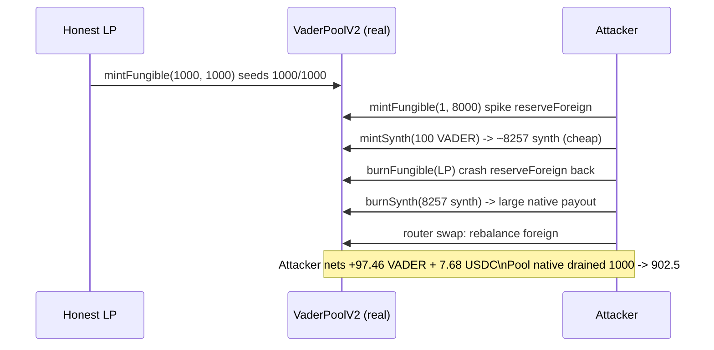

# VaderPoolV2 synth redemption priced off manipulable spot reserves drains the pool

> **Vulnerability classes:** vuln/defi/price-manipulation · vuln/oracle/spot-price · vuln/defi/direct-drain
>
> **Reproduction:** the test deploys the REAL, unmodified audited Vader dex-v2 stack (`VaderPoolV2`, `BasePoolV2`, `SynthFactory`, `Synth`, `LPWrapper`, `LPToken`, `VaderRouterV2`, `VaderMath`) vendored under `src/vader/` and executes the actual mint/redeem + router-swap attack. Only the opaque native/foreign ERC20s are minimal real tokens.

<!-- date: 2021-11 -->

## Root cause

`VaderPoolV2` prices synth **minting** and **redemption** off the pool's instantaneous, manipulable spot reserves via `VaderMath.calculateSwap` — with no manipulation-resistant oracle:

```solidity
// mintSynth
amountSynth = VaderMath.calculateSwap(nativeDeposit, reserveNative, reserveForeign); // @> spot-priced
// burnSynth
amountNative = VaderMath.calculateSwap(synthAmount, reserveForeign, reserveNative);  // @> spot-priced
```

Because the reserves used for pricing can be moved within the same transaction, an attacker can mint synths cheaply while native looks "valuable", then redeem them while native looks "cheap", withdrawing more native than they deposited. The finding's recommended fix is to stop pricing synths off spot reserves (use a manipulation-resistant oracle).

The exact audited source is vendored at [`src/vader/contracts/dex-v2/pool/VaderPoolV2.sol`](src/vader/contracts/dex-v2/pool/VaderPoolV2.sol) (`mintSynth` L126-167, `burnSynth` L169-219).

## Exploit walkthrough (real numbers)

A legitimate LP seeds a balanced **1,000 VADER / 1,000 USDC** pool (its 1,000 VADER is the drain target). The attacker (with 1,000 VADER + 8,000 USDC of working capital):

1. **Manipulate** — deposit lopsided liquidity `mintFungible(1 VADER, 8,000 USDC)`, spiking `reserveForeign` so native looks extremely valuable.
2. **Mint cheap** — `mintSynth(100 VADER)` mints ~8,257 synths against the manipulated reserves.
3. **Unwind** — `burnFungible` the attacker's LP, crashing `reserveForeign` back down (native now "cheap").
4. **Redeem dear** — `burnSynth` the synths for a large native payout at the crashed redemption price.
5. **Rebalance** — buy the foreign shortfall back through the REAL `VaderRouterV2`.

Net result (measured on-chain): the attacker ends **+97.46 VADER and +7.68 USDC richer** — a genuine value extraction in *both* assets — and the pool's native reserve is drained from 1,000 to ~902.5 VADER. The attack is repeatable while profitable.

> Note: a naive single "sell foreign → mint → buy foreign back → burn" swap cycle is NOT profitable against this AMM — `VaderMath.calculateSwap = x·X·Y/(x+X)²` is strictly harsher than constant product, so each manipulation swap is heavily value-taxing. The working attack manipulates reserves via near-conservative LP deposit/withdraw (which sidesteps the swap slippage) and only uses the router to rebalance the residual. The registry test asserts net-positive in BOTH assets to guarantee the profit is real, not an artifact of ignoring the foreign-asset cost.



## Reproduction

```bash
_shared/run-poc/run_poc.sh 42333-h-02-redemption-value-of-synths-can-be-manipulated-to-drain_exp -vvvvv
```

Expected: `1 passed`. The assertions in [`test/42333-h-02-redemption-value-of-synths-can-be-manipulated-to-drain_exp.sol`](test/42333-h-02-redemption-value-of-synths-can-be-manipulated-to-drain_exp.sol) require the attacker's net native > 0 **and** net foreign >= 0 (a true profit), and that the pool's native reserve strictly decreased.

## Sources

- [AuditVault finding #42333](https://github.com/Auditware/AuditVault/blob/main/findings/42333-h-02-redemption-value-of-synths-can-be-manipulated-to-drain.md)
- [code-423n4/2021-11-vader `VaderPoolV2.sol` (commit 607d2b9)](https://github.com/code-423n4/2021-11-vader/blob/607d2b9e253d59c782e921bfc2951184d3f65825/contracts/dex-v2/pool/VaderPoolV2.sol#L126-L167)
