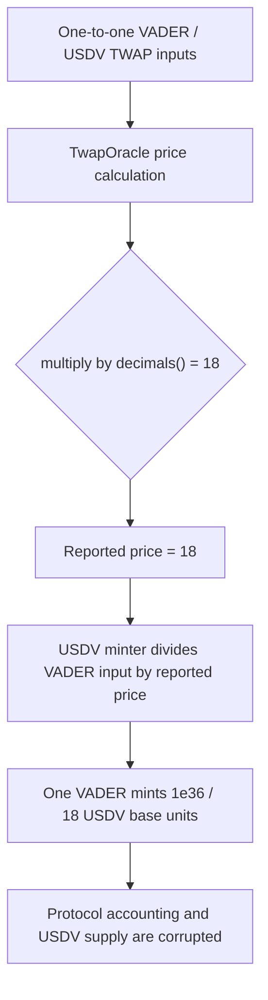

# Vader Protocol — TWAP decimal-count price collapse causes USDV over-minting

> **Vulnerability classes:** vuln/oracle/price-manipulation · vuln/arithmetic/decimal-mismatch · vuln/logic/price-calculation

> **Reproduction:** self-contained Foundry PoC, with no fork, RPC, or cheatcodes. Full trace: [output.txt](output.txt). Driver: [test/42334-h-04-twaporacle-doesnt-calculate-vaderusdv-exchange-rate-cor_exp.sol](test/42334-h-04-twaporacle-doesnt-calculate-vaderusdv-exchange-rate-cor_exp.sol).

<!-- non-defihacklabs -->
<!-- source-auditvault: https://github.com/Auditware/AuditVault/blob/main/findings/42334-h-04-twaporacle-doesnt-calculate-vaderusdv-exchange-rate-cor.md -->
<!-- date: 2021-11 -->

**AuditVault taxonomy:** `lang/solidity` · `sector/oracle` · `platform/code4rena` · `has/github` · `has/poc` · `severity/high` · genome: `manipulable-twap` · `use-multi-oracle` · `data-corruption/price-manipulation` · `oracle-manipulation-resistance`

## Key info

| | |
|---|---|
| **Impact** | **HIGH** — a 1:1 VADER/USDV market is reported as `18` instead of `1e18`, so a mint path that divides by the rate mints USDV at an absurdly favorable price. |
| **Protocol** | [Vader Protocol](https://code4rena.com/reports/2021-11-vader) |
| **Vulnerable code** | `TwapOracle` VADER:USDV exchange-rate calculation |
| **Bug class** | Decimal-scale mismatch / manipulated price calculation |
| **Finding** | Code4rena Vader, 2021-11 · #42334 (H-04) · reporter **TomFrenchBlockchain / WatchPug** |
| **Status** | Audit finding; the TWAP module was removed and redesigned after review. |
| **Compiler** | `^0.8.24` (local reduction) |

## TL;DR

The oracle receives a ratio and has to express it in the quoted token's smallest
units. For an 18-decimal token, that requires multiplying by `10 ** 18`. The
audited code multiplies by `18` instead. In a one-to-one market this returns `18`
rather than `1e18`.

The local reduction connects that malformed value to a USDV mint path that prices
USDV as `vaderIn * 1e18 / vaderPerUSDV`. Depositing one VADER therefore mints
`1e36 / 18` base units of USDV instead of `1e18`. The PoC asserts both the bad
rate and the resulting attacker USDV balance.

## The vulnerable code

The exact blamed expression from `contracts/twap/TwapOracle.sol` is preserved in
the synthetic source:

```solidity
result = ((sumUSD * IERC20Metadata(token).decimals()) / sumNative); // @> VULN
// FIX: result = ((sumUSD * (10 ** IERC20Metadata(token).decimals())) / sumNative);
```

`IERC20Metadata(token).decimals()` returns the count `18`; it is not the scaling
factor `1_000_000_000_000_000_000`. Consequently the returned fixed-point price
is smaller than intended by roughly `1e18 / 18`.

## Root cause

The calculation confuses a metadata value with a numerical unit conversion. The
oracle's consumers expect a price represented in token base units, while the
oracle returns only the number of decimal places. A downstream minter cannot
distinguish the malformed `18` from a legitimate price, so inverse pricing turns
the tiny denominator into a massive issuance amount.

## Preconditions

- The token has 18 decimals (the normal VADER/USDV case).
- A VADER:USDV price produced by the TWAP is used by a mint, redemption, or other
  balance-changing path.
- The consuming path trusts the quoted value without independently validating its
  scale.

## Attack walkthrough

1. The attacker supplies one VADER (`1e18` base units) to the local USDV mint
   path.
2. The oracle evaluates the one-to-one market ratio. The vulnerable line returns
   `18`; the control calculation returns `1e18`.
3. The minter calculates `vaderIn * 1e18 / rate`. With the malformed rate, that is
   `1e36 / 18` USDV base units.
4. `Exploit.run()` requires the malformed price, correct comparison price, and
   final USDV balance. [output.txt](output.txt) shows both Foundry tests pass.

## Diagrams



## Remediation

Scale by the token's unit factor rather than its decimal count:

```solidity
uint256 scalingFactor = 10 ** IERC20Metadata(token).decimals();
result = (sumUSD * scalingFactor) / sumNative;
```

The report notes that Vader removed and redesigned the TWAP module after the
review. Consumers of any oracle should additionally sanity-check decimal domains
and bound price changes before minting or redemption.

## How to reproduce

```bash
cd ~/RustroverProjects/audits/evm-hack-registry/42334-h-04-twaporacle-doesnt-calculate-vaderusdv-exchange-rate-cor_exp
forge test -vvv
```

The run is fully local and executes the same synthetic source that powers the
Playground. The driver reasserts the bad rate, the correct control rate, and the
attacker's oversized USDV mint.

## Sources

- [AuditVault finding #42334](https://github.com/Auditware/AuditVault/blob/main/findings/42334-h-04-twaporacle-doesnt-calculate-vaderusdv-exchange-rate-cor.md)
- [Code4rena Vader report](https://code4rena.com/reports/2021-11-vader)
- [Audited `TwapOracle.sol` at commit `3a43059`](https://github.com/code-423n4/2021-11-vader/blob/3a43059e33d549f03b021d6b417b7eeba66cf62e/contracts/twap/TwapOracle.sol#L156)

*Reference: [Code4rena Vader finding H-04](https://code4rena.com/reports/2021-11-vader) · curated by [AuditVault](https://github.com/Auditware/AuditVault/blob/main/findings/42334-h-04-twaporacle-doesnt-calculate-vaderusdv-exchange-rate-cor.md)*
